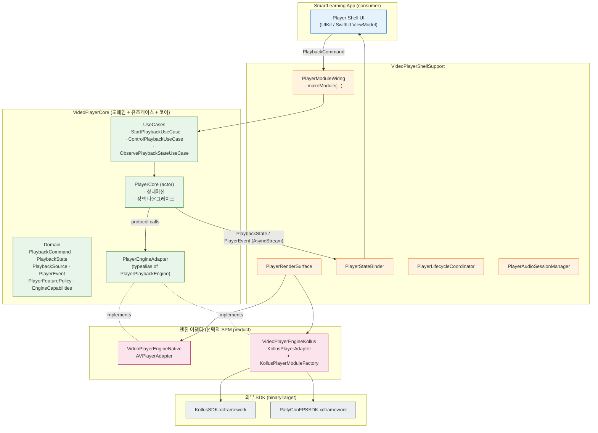
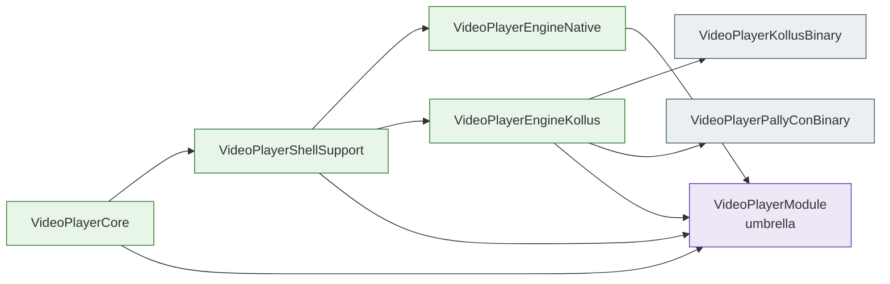
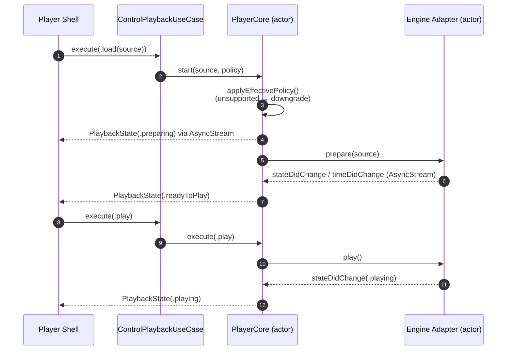
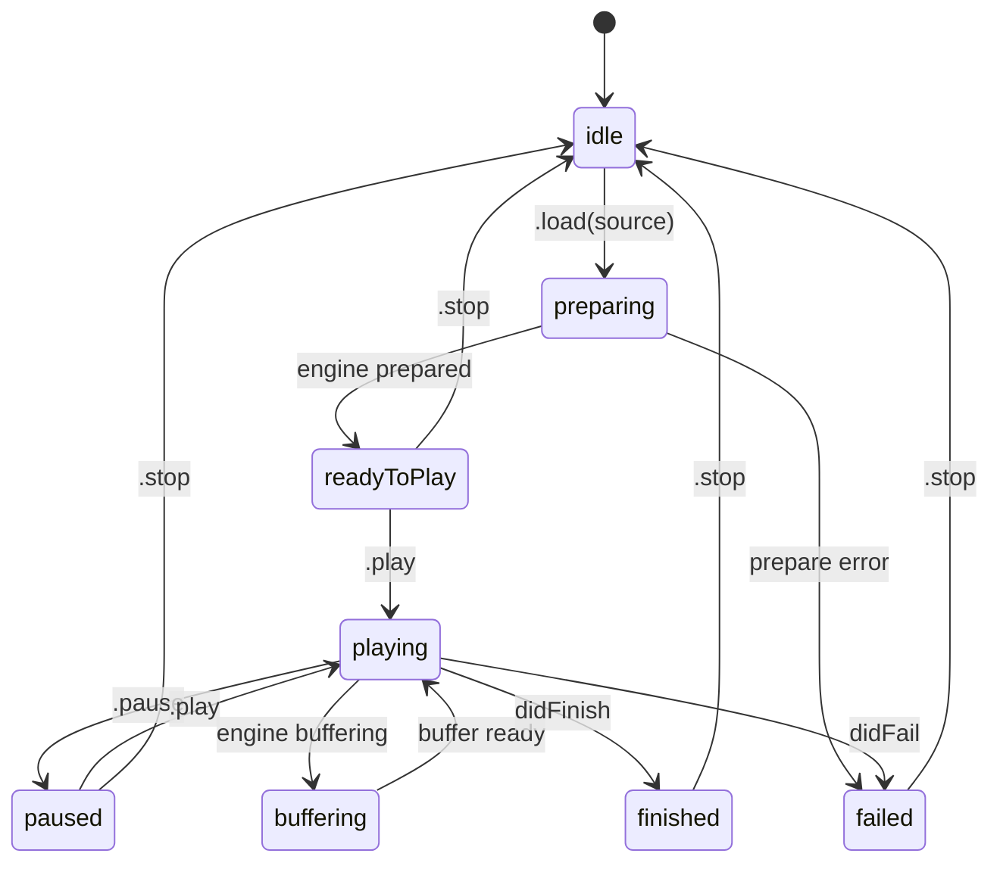
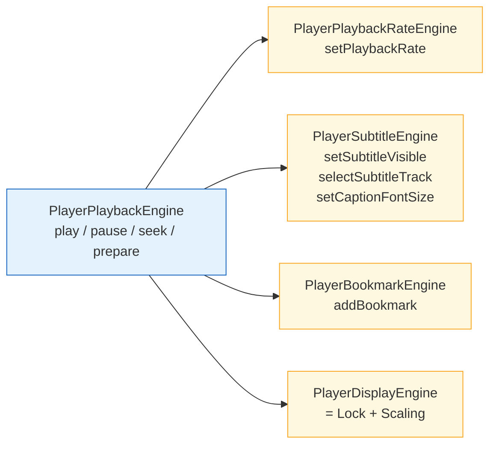
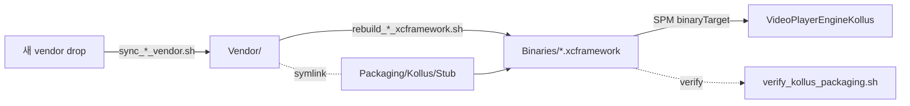

# VideoPlayerModule

`videoplayer-ios-ms`는 SmartLearning iOS 앱이 공유하는 **재생 엔진 추상화 코어 패키지**다.
하나의 도메인/유즈케이스/상태 모델 위에서 `AVPlayer`와 `Kollus`(그 외 vendor SDK)를 자유롭게 교체하면서도,
앱 측 Shell UI는 동일한 인터페이스 하나만 알면 되도록 설계되어 있다.

---

## 목차

- [설계 원리](#설계-원리)
- [아키텍처](#아키텍처)
- [폴더 구조](#폴더-구조)
- [사용 방법](#사용-방법)
- [Kollus SDK 운영 규칙](#kollus-sdk-운영-규칙)
- [테스트](#테스트)

---

## 설계 원리

이 패키지는 다섯 가지 원칙 위에서 만들어졌다.

1. **엔진 교체 가능성 (Engine Replaceability)**
   재생 엔진은 `PlayerPlaybackEngine` actor 프로토콜 뒤에 숨는다.
   Shell, UseCase, `PlayerCore` 어느 쪽도 `AVPlayer`나 `KollusVideoView`를 직접 알지 못한다.
2. **단방향 상태 흐름 (Unidirectional State Flow)**
   명령은 `PlaybackCommand` 하나로 들어오고, 상태는 `PlaybackState` AsyncStream으로만 나간다.
   "엔진이 자기 마음대로 UI를 그리는" 경로는 의도적으로 차단했다.
3. **Capability 기반 기능 게이팅 (Capability Gating)**
   `EngineCapabilities`(OptionSet)와 보조 프로토콜(`PlayerPlaybackRateEngine`, `PlayerSubtitleEngine`, …)을 조합한다.
   Shell이 요청한 기능을 엔진이 지원하지 못하면 `PlayerFeaturePolicy`가 안전한 값으로 자동 downgrade되고, `PolicyDowngradeReason` 이벤트가 발행된다.
4. **Vendor 격리 (Vendor Isolation)**
   Kollus / PallyCon 같은 외부 SDK는 별도 SPM product(`VideoPlayerEngineKollus`)로 분리되어, Kollus가 필요 없는 화면은 해당 바이너리를 링크하지도 않는다.
5. **Swift Concurrency First**
   모든 엔진은 `actor`로 격리되고, 상태/이벤트는 `AsyncStream`으로 흐른다. main thread reentrancy를 차단하고 데이터 레이스를 컴파일 타임에 막는다.

> 한 줄 요약: **"공용 코어가 명령을 받고 상태를 발행한다. 엔진은 그저 plug-in이다."**

---

## 아키텍처

### 1) 레이어 구조



### 2) SPM Product 의존 그래프



소비자는 필요한 만큼만 가져간다.

| 필요한 것 | 연결할 product |
| --- | --- |
| AVPlayer만 | `VideoPlayerCore` + `VideoPlayerShellSupport` + `VideoPlayerEngineNative` |
| Kollus 추가 | 위 + `VideoPlayerEngineKollus` |
| 다 묶어서 한 번에 | `VideoPlayerModule` (umbrella) |

### 3) 명령/상태 시퀀스



### 4) 상태 머신



### 5) Capability 매트릭스

엔진은 `EngineCapabilities` + 보조 프로토콜 채택 여부로 자기가 무엇을 할 수 있는지 표현한다.
`PlayerCore`는 명령을 받을 때마다 이 능력을 검사하고, 없으면 `PlayerError.engineError`를 던지거나 `PlayerFeaturePolicy`를 downgrade한다.



| Capability flag | 의미 |
| --- | --- |
| `.continuesWithoutSurface` | render surface가 detach돼도 백그라운드 재생 가능 |
| `.seamlessSurfaceSwap` | 재생 중 surface 교체 시 끊김 없음 |
| `.nativePiP` | OS 네이티브 Picture-in-Picture 지원 |

`allowsBackgroundPlayback` 정책이 켜져 있는데 엔진이 `.continuesWithoutSurface`가 없으면
→ 자동으로 정책을 끄고 `.policyDowngraded(.missingContinuesWithoutSurface)` 이벤트를 발행한다.

---

## 폴더 구조

```text
videoplayer-ios-ms/
├── Package.swift                       # SPM 매니페스트 (5개 product 정의)
├── README.md
├── CHANGELOG.md
│
├── Sources/
│   ├── VideoPlayerModuleExports/
│   │   └── VideoPlayerModule.swift     # umbrella product
│   │
│   └── VideoPlayerModule/              # 본체 (SPM target들이 path를 공유)
│       ├── Core/                       # ── VideoPlayerCore ──
│       │   ├── Domain/                 #    값타입 도메인 모델 (Sendable)
│       │   │   ├── PlaybackCommand.swift
│       │   │   ├── PlaybackSource.swift
│       │   │   ├── PlaybackState.swift
│       │   │   ├── PlayerCapabilities.swift
│       │   │   ├── PlayerError.swift
│       │   │   ├── PlayerEvent.swift
│       │   │   ├── PlayerFeaturePolicy.swift
│       │   │   ├── PlayerFeatureSet.swift
│       │   │   ├── PlayerIdentity.swift
│       │   │   └── PlayerStateSnapshot.swift
│       │   ├── Internal/
│       │   │   └── PlayerCore.swift    # actor 상태머신
│       │   └── UseCase/                # @MainActor 유즈케이스 (Shell 경계)
│       │       ├── StartPlaybackUseCase.swift
│       │       ├── ControlPlaybackUseCase.swift
│       │       └── ObservePlaybackStateUseCase.swift
│       │
│       ├── Engine/
│       │   ├── PlayerEngineAdapter.swift   # 엔진 추상 프로토콜
│       │   ├── Native/
│       │   │   └── AVPlayerAdapter.swift   # VideoPlayerEngineNative
│       │   └── Kollus/
│       │       ├── KollusPlayerAdapter.swift        # VideoPlayerEngineKollus
│       │       └── KollusPlayerModuleFactory.swift  # 1-line wiring helper
│       │
│       └── ShellSupport/               # ── VideoPlayerShellSupport ──
│           ├── PlayerAudioSessionManager.swift
│           ├── PlayerError+NSError.swift
│           ├── PlayerLifecycleCoordinator.swift
│           ├── PlayerModuleConfiguration.swift
│           ├── PlayerModuleWiring.swift   # 모든 조립의 진입점
│           ├── PlayerRenderBindingEngine.swift
│           ├── PlayerRenderSurface.swift
│           └── PlayerStateBinder.swift
│
├── Tests/
│   └── VideoPlayerModuleTests/
│       └── Support/                    # 가짜 엔진, 가짜 surface 등
│
├── Binaries/                           # SPM binaryTarget 입력 (파생 산출물)
│   ├── KollusSDK.xcframework
│   └── PallyConFPSSDK.xcframework
│
├── Vendor/                             # source-of-truth (직접 수정 금지)
│   ├── KollusSDK/                      # 원본 SDK drop
│   └── PallyConFPSSDK.framework
│
├── Packaging/
│   └── Kollus/Stub/                    # simulator slice 생성용 stub SPM 패키지
│
├── scripts/                            # vendor sync + xcframework rebuild
│   ├── sync_kollus_vendor.sh
│   ├── sync_pallycon_vendor.sh
│   ├── rebuild_kollus_xcframework.sh
│   ├── rebuild_pallycon_xcframework.sh
│   ├── package_kollus_xcframework.sh
│   ├── verify_kollus_packaging.sh
│   └── generate_kollus_k2_stub.py
│
└── docs/
    └── kollus-sdk-packaging.md
```

---

## 사용 방법

### 1) SwiftPM 의존성 추가

`Package.swift` 또는 Xcode의 *Add Package Dependencies…*로 이 레포를 추가한다.

```swift
.package(url: "git@gitlab.com:megastudy-mobile/videoplayer-ios-ms.git", branch: "main"),

// target 의존성
.product(name: "VideoPlayerCore",          package: "videoplayer-ios-ms"),
.product(name: "VideoPlayerShellSupport",  package: "videoplayer-ios-ms"),
.product(name: "VideoPlayerEngineNative",  package: "videoplayer-ios-ms"),
.product(name: "VideoPlayerEngineKollus",  package: "videoplayer-ios-ms"), // 필요 시
```

### 2) 가장 짧은 사용 예 (Native, AVPlayer)

```swift
import VideoPlayerCore
import VideoPlayerShellSupport
import VideoPlayerEngineNative

@MainActor
final class LectureViewModel {
    private var module: PlayerModule?

    func bootstrap() async {
        let engine = AVPlayerAdapter()
        module = await PlayerModuleWiring.makeModule(
            engine: engine,
            engineCapabilities: AVPlayerAdapter.capabilities
        )

        // 상태 구독
        Task { [weak self] in
            guard let stream = await self?.module?.core.stateStream else { return }
            for await state in stream {
                self?.render(state)
            }
        }
    }

    func play(_ url: URL) async throws {
        try await module?.startPlaybackUseCase
            .execute(source: .url(url), policy: .default)
    }

    func pause() async throws {
        try await module?.controlPlaybackUseCase
            .execute(command: .pause)
    }
}
```

### 3) Kollus 엔진 사용

```swift
import VideoPlayerEngineKollus

// 1) 환경(인증 + 운영 옵션 + DRM)을 값타입으로 1회 구성한다.
let environment = KollusEnvironment(
    applicationKey: "<카테노이드 발급 키>",
    applicationBundleID: Bundle.main.bundleIdentifier ?? "",
    applicationExpireDate: expireDate,
    keychainGroup: "group.com.megastudy.shared",
    storagePath: nil,                       // 기본 Documents/ 사용
    cacheSizeMB: 512,
    backgroundDownload: true,
    aiPlaybackRateEnabled: true,
    hardwareDecoderPreferred: true,
    pauseOnForeground: false,
    audioBackgroundPlayPolicy: true,        // → `.continuesWithoutSurface` 자동 OR-in
    drm: KollusDRMConfiguration(
        fpsCertificateURL: certURL,
        fpsDRMURL: drmURL,
        extraParameters: ["uid": userID]
    )
)

// 2) 신규 권장 진입점 — observer / diagnostics를 함께 주입한다.
let factory = KollusPlayerModuleFactory(
    environment: environment,
    observer: drmLMSReporter,               // DRM/LMS 응답을 호스트 로깅으로 forward
    diagnostics: signalProbe                // 23 KollusEngineSignal raw 신호 진단 채널
)

let module = await factory.makeModule()
try await module.startPlaybackUseCase.execute(
    source: .kollus(mediaContentKey: "MCK-..."),
    policy: .default
)

// 3) 다운로드 라이프사이클은 별도 facade(actor).
let downloads = factory.downloads!          // 모든 makeModule()이 공유하는 단일 인스턴스
try await downloads.startDownload(mediaContentKey: "MCK-...")
for await snapshot in downloads.contents {
    // 진행률/완료 등 KollusContentSnapshot 스트림
}
```

`KollusPlayerModuleFactory(environment:observer:diagnostics:)`는 `KollusSessionBootstrapper`(인증 1회) + `KollusDownloadCenter`(다운로드 facade)를 한 번 만들어 모든 `makeModule()` 호출이 공유한다. 기존의 인자 없는 `KollusPlayerModuleFactory()` 진입점은 gate 0.3.0에서 제거되었다.

### 4) Render Surface 부착

```swift
final class PlayerSurfaceView: UIView, PlayerRenderSurface {
    var containerView: UIView { self }
    func engineDidAttach()  { /* AVPlayerLayer 등 부착 */ }
    func engineDidDetach()  { /* cleanup */ }
}
```

엔진 어댑터가 `PlayerRenderBindingEngine`을 채택하면 `PlayerStateBinder`가 surface 부착·교체·해제를 lifecycle에 맞춰 관리한다.

### 5) 명령/이벤트 한눈에 보기

| 영역 | 타입 |
| --- | --- |
| 입력 (Shell → Core) | `PlaybackCommand`: `.load`, `.play`, `.pause`, `.seek`, `.seekWithOrigin`, `.setPlaybackRate`, `.setSkipInterval`, `.setSubtitleVisible`, `.selectSubtitleTrack`, `.setCaptionFontSize`, `.addBookmark`, `.removeBookmark`, `.selectSubtitleFile`, `.setDisplayLocked`, `.setDisplayScaled`, `.toggleDisplayScaling`, `.stop` |
| 출력 (Core → Shell) | `PlaybackState` (AsyncStream, `isLive` / `liveDuration` 포함) · `PlayerEvent`(`.stateDidChange` / `.timeDidChange` / `.bufferingDidChange` / `.didFinish` / `.didFail` / `.policyDowngraded` / `.captionDidUpdate` / `.bookmarksDidLoad` / `.bitrateDidChange` / `.heightDidChange` / `.externalOutputDidChange` / `.naturalSizeDidResolve` / `.framerateDidResolve` / `.deviceLockPolicyChanged` / `.nextEpisodeAvailable`) |
| 정책 | `PlayerFeaturePolicy(allowsBackgroundPlayback, maxPlaybackRate, allowsAutoplay, skipInterval)` |

---

## Phase 2 ~ 7 surface (Kollus 커버리지 1.0.0)

`videoplayer-ios-ms`는 spec 025 (Kollus Module Coverage)에 따라 KollusSDK 1.1.x 표면 91.9 %를 모듈 안으로 들여왔다. 호스트(SmartLearning Shell)는 더 이상 `KollusSDKBinary`를 직접 import하지 않는다.

### 신규 public 타입

| 타입 | 역할 |
| --- | --- |
| `KollusEnvironment` | 인증 + 스토리지 + DRM + 네트워크 + AI 배속/하드웨어 디코더/스킨/포그라운드 정책을 한 값타입으로 묶는 진입점. `validate(now:)`로 만료/경로/캐시 사이즈를 사전 검증. |
| `KollusDRMConfiguration` | FPS cert URL / DRM URL / 동적 DRM 파라미터. |
| `KollusLiveChatProfile` | 라이브 채팅 룸/서버/사용자 정보. |
| `KollusObserver` | DRM 응답·LMS 전송·미전송 LMS 일괄 결과 3종 콜백을 호스트로 forward하는 weak observer 프로토콜. |
| `KollusDiagnosticsSink` | 23 `KollusEngineSignal` raw 신호를 진단 채널로 들여다보는 옵션 프로토콜. domain 이벤트와 분리. |
| `KollusEngineSignal` | KollusPlayerDelegate 23 raw 콜백을 1:1 정규화한 case enum. |
| `KollusContentSnapshot` | `currentContent` / 다운로드 항목을 도메인 값으로 노출(메타 + DRM 상태 + 다운로드 상태). |
| `NextEpisodeInfo` | nextEpisode showTime/callbackURL/params/showsButton 묶음. `PlayerEvent.nextEpisodeAvailable`로 전달. |
| `KollusDownloadCenter` (actor) | KollusStorage 위 다운로드/캐시/DRM/LMS/네트워크 정책 facade. `contents` AsyncStream으로 변화 관찰. |
| `KollusPlayerModuleFactory` | `init(environment:observer:diagnostics:)` 단일 진입점. 모든 `makeModule()`이 단일 `KollusSessionBootstrapper`와 `KollusDownloadCenter`를 공유. |

### 신규 capability 프로토콜 (`PlayerCapabilities`)

| 프로토콜 | 노출 동작 |
| --- | --- |
| `PlayerZoomEngine` | `zoom(_:)` / `setZoomOutDisabled(_:)` / `zoomValue()` / `isZoomedIn` |
| `PlayerScrollEngine` | `scroll(by:)` / `stopScroll()` |
| `PlayerAdaptiveStreamingEngine` | `changeBandwidth(_:)` / `streamInfoList() -> [StreamInfo]` |
| `PlayerPiPCapability` | `startPiP()` / `stopPiP()` / `isPiPActive` (KollusPlayerType.native 한정) |
| `PlayerTitledBookmarkEngine` | `addBookmark(at:title:)` / `removeBookmark(at:)` / `currentBookmarks()` |
| `PlayerExternalSubtitleEngine` | `selectSubtitleFile(_:)` (외부 자막 path) |
| `PlayerDisplayScalingEngine` | `setDisplayScaled(_:)` / `toggleDisplayScaling()` |

`KollusPlayerAdapter`는 위 프로토콜 7종 + `PlayerPlaybackRateEngine` + `PlayerSubtitleEngine`을 모두 채택해 SDK 표면 91.9 % 커버리지(full 84 / partial 7 / none 8 = 99 항목, 게이트 1.0.0 ≥ 90 % 충족)를 단일 어댑터로 노출한다. 자세한 매핑은 `smartlearning-ios-ms/specs/025-kollus-module-coverage/coverage-matrix.md`.

### 26 raw delegate 콜백 wiring

`KollusDelegateBridge` (`@MainActor`)가 `KollusPlayerDelegate` 23 + `KollusPlayerDRMDelegate` 1 + `KollusPlayerLMSDelegate` 1 + `KollusPlayerBookmarkDelegate` 1 = 26 raw 메서드를 `prepareToPlay` 직전에 일괄 부착한 뒤 다음과 같이 분배한다.

- 23 `KollusPlayerDelegate` → `KollusEngineSignal` 23 case → `PlayerEvent` 13 종 + diagnostics-only 8 종
- 2 (DRM 응답 / LMS 전송) → `KollusObserver` 콜백
- 1 (Bookmark) → `PlayerEvent.bookmarksDidLoad([Bookmark])`

각 신호는 `KollusDiagnosticsSink`로도 동시 발행되므로 호스트는 도메인 이벤트는 `PlayerStateBinder`로, 운영 진단은 sink로 분리해 받을 수 있다.

---

## Kollus SDK 운영 규칙

- 이 레포에서 관리하는 **source-of-truth**는 `Vendor/KollusSDK`, `Vendor/PallyConFPSSDK.framework`다.
- `Binaries/*.xcframework`는 **파생 산출물**이다. 직접 수정하지 않는다.
- `Packaging/Kollus/Stub/`은 simulator slice 생성용 로컬 stub 패키지이고,
  `Packaging/Kollus/Stub/Sources/KollusSDK/include/KollusSDK`는 `Vendor/KollusSDK/include/KollusSDK`를 가리키는 shared symlink다.
- 소비자(SmartLearning)는 `KollusSDKBinary` / `PallyConFPSSDK`를 직접 import하지 않고
  `KollusPlayerModuleFactory` 같은 public API만 사용한다.



**재생성 (표준 절차):**

```bash
./scripts/rebuild_kollus_xcframework.sh
./scripts/rebuild_pallycon_xcframework.sh
./scripts/verify_kollus_packaging.sh
```

**새 vendor drop 반영:**

```bash
./scripts/sync_kollus_vendor.sh   /path/to/KollusSDK
./scripts/sync_pallycon_vendor.sh /path/to/PallyConFPSSDK.framework
```

---

## 테스트

```bash
swift test
```

`Tests/VideoPlayerModuleTests`는 가짜 엔진(`Support/`)을 주입해 `PlayerCore`의 상태 전이, 정책 downgrade, capability 미지원 시 에러 매핑을 검증한다. 새 명령/이벤트를 추가하면 동일한 패턴으로 fake engine만 확장하면 된다.

---

## 의도적으로 제외한 범위

- SmartLearning 고등 전용 Player Shell UI
- 앱 composition / bridge 계층 (Coordinator, FactoryDependencyContainer)
- 분석/로깅/리모트컨피그 정책 결정 → Shell이 정책 객체로 주입
