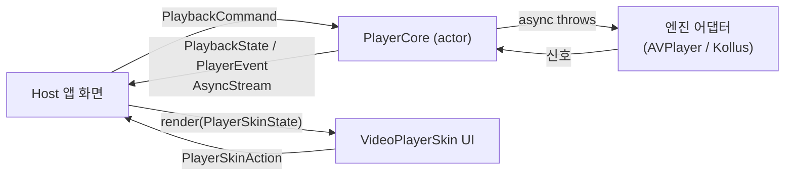
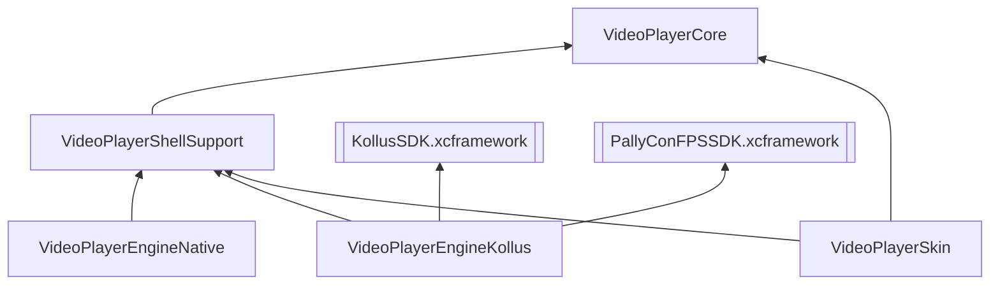

# VideoPlayerModule

`videoplayer-ios-ms`는 영상 재생을 **공통 상태 머신 + 교체 가능한 재생 엔진**으로 다루는 Swift Package입니다.

앱은 `PlaybackSource` / `PlaybackCommand` / `PlaybackState`만 다루고, 실제 재생은 `AVPlayerAdapter`(일반 URL/HLS)나 `KollusPlayerAdapter`(Kollus MCK + DRM + 다운로드)가 맡습니다. 엔진을 바꿔도 앱의 사용 흐름은 바뀌지 않습니다.

> 이 문서는 **이 모듈을 사용하는 개발자**를 위한 가이드입니다.
> 모듈 내부 구조·설계 배경·유지보수 방법은 [docs/HANDOVER/](docs/HANDOVER/README.md) 인수인계 시리즈를 보세요.

## 한눈에 보는 구조



1. 앱이 `PlayerModule`을 만들고 (`PlayerModuleWiring` 또는 `KollusPlayerModuleFactory`)
2. `module.core.start(source:policy:)` / `module.core.execute(command:)`로 명령을 보내고
3. `module.core.stateStream` / `eventStream`을 구독해 화면을 그립니다
4. UI가 필요하면 `VideoPlayerSkin`의 `AssembledPlayerSkin`을 조립해 올립니다

## 설치와 Product 선택

Swift Package Manager로 추가한 뒤, 필요한 product만 import합니다.

| Product | 역할 | 언제 사용하나 |
| --- | --- | --- |
| `VideoPlayerCore` | 도메인 타입, `PlayerCore`, 엔진 계약 | 항상 (다른 product가 끌어옴) |
| `VideoPlayerShellSupport` | `PlayerModuleWiring`, `PlayerRenderSurface`, 생명주기/오디오 helper | 화면과 코어를 연결할 때 |
| `VideoPlayerEngineNative` | `AVPlayerAdapter` | 일반 URL/HLS 재생 |
| `VideoPlayerEngineKollus` | Kollus/PallyCon 엔진, 다운로드 센터, SDK bootstrap | Kollus MCK 재생, DRM, 오프라인 다운로드 |
| `VideoPlayerSkin` | 재사용 플레이어 UI (Blueprint/Block 조립식) | 플레이어 컨트롤 UI가 필요할 때 |



host 앱은 **Kollus SDK를 직접 import하지 않습니다.** 이 패키지의 product만 사용하세요.

## Quickstart 1 — 일반 URL/HLS 재생

```swift
import VideoPlayerCore
import VideoPlayerEngineNative
import VideoPlayerShellSupport

// 1) 모듈 조립
let engine = AVPlayerAdapter()
let module = await PlayerModuleWiring.makeModule(
    engine: engine,
    engineCapabilities: AVPlayerAdapter.capabilities
)

// 2) 상태 구독 (화면 갱신)
Task {
    for await state in module.core.stateStream {
        // state.status: .idle / .preparing / .readyToPlay / .playing / .paused / .buffering / .finished / .failed
        // state.currentTime, state.duration, state.isBuffering
        render(state)
    }
}

// 3) 재생
try await module.core.start(source: .url(videoURL), policy: .default)
try await module.core.execute(command: .play)

// 4) 화면 부착 — PlayerRenderSurface를 구현한 view를 엔진에 bind
await module.engine.bind(renderSurface: myRenderSurfaceView)

// 5) 종료
try await module.core.execute(command: .stop)
await module.engine.unbindRenderSurface()
await module.core.dispose()
```

`PlayerRenderSurface`는 `containerView: UIView` 하나만 필수인 프로토콜입니다. 직접 구현해도 되고, `VideoPlayerSkin`의 `PlayerRenderSurfaceView`를 그대로 써도 됩니다.

## Quickstart 2 — Kollus 재생 (DRM/다운로드)

Kollus는 SDK 초기화 값이 필요하므로 `KollusEnvironment`를 먼저 구성합니다. 앱은 서버/Remote Config에서 받은 값을 넘기기만 하고, 검증과 SDK 주입은 패키지가 합니다.

```swift
import VideoPlayerCore
import VideoPlayerEngineKollus

// 1) 환경 구성 (앱 자격증명 + 옵션)
let environment = KollusEnvironment(
    applicationKey: applicationKey,
    applicationBundleID: bundleID,
    applicationExpireDate: expireDate,
    storagePath: storageURL,          // 다운로드/캐시 디렉터리 (실재해야 함)
    cacheSizeMB: 1024,
    drm: KollusDRMConfiguration(
        fpsCertificateURL: certURL,   // PallyCon FairPlay 인증서
        fpsDRMURL: drmURL
    ),
    observer: observer,               // DRM/LMS 콜백 수신 (선택)
    diagnostics: diagnostics          // 진단 로그 sink (선택)
)
try environment.validate()            // 잘못된 설정을 일찍 잡는다

// 2) 팩토리 생성 — 화면 여러 개가 같은 factory를 공유해야 함 (인증 1회)
let factory = KollusPlayerModuleFactory(environment: environment)

// 3) 모듈 생성 후 사용법은 Quickstart 1과 동일
let module = await factory.makeModule()
try await module.core.start(source: .mediaKey(mediaContentKey), policy: .default)
try await module.core.execute(command: .play)
```

주의: Kollus SDK는 **시뮬레이터를 지원하지 않습니다.** 시뮬레이터 빌드에는 `UnsupportedEnvironmentEngine`을 대신 끼우세요.

```swift
#if targetEnvironment(simulator)
let module = await PlayerModuleWiring.makeModule(
    engine: UnsupportedEnvironmentEngine(message: "Kollus 재생은 실기기에서만 지원됩니다."),
    engineCapabilities: []
)
#else
let module = await factory.makeModule()
#endif
```

### KollusEnvironment 파라미터

필수 값은 `validate()`에서 검증됩니다. `applicationKey`/`applicationBundleID`는 비어 있으면 안 되고, `applicationExpireDate`는 현재 시각보다 미래여야 합니다.

| 파라미터 | 기본값 | 설명 |
| --- | --- | --- |
| `applicationKey` | 없음 | Kollus SDK storage에 주입되는 앱 인증 키 |
| `applicationBundleID` | 없음 | SDK에 전달할 host 앱 bundle identifier |
| `applicationExpireDate` | 없음 | 앱 인증 키 만료 시각 |
| `keychainGroup` | `nil` | SDK storage가 사용할 keychain access group |
| `storagePath` | `nil` | 다운로드/캐시 디렉터리 URL — 실재하는 디렉터리여야 함 |
| `cacheSizeMB` | `nil` | storage 캐시 한도(MB), 1 이상 |
| `backgroundDownload` | `false` | 백그라운드 다운로드 사용 여부 |
| `networkTimeoutSeconds` | `nil` | storage 네트워크 timeout(초) |
| `networkRetry` | `nil` | timeout과 함께 전달되는 retry 횟수 |
| `aiPlaybackRateEnabled` | `false` | player view AI 배속 기능 |
| `hardwareDecoderPreferred` | `true` | hardware decoder 선호 여부 |
| `customSkinJSON` | `nil` | SDK player view custom skin JSON |
| `pauseOnForeground` | `false` | foreground 복귀 시 일시정지 여부 |
| `audioBackgroundPlayPolicy` | `false` | 백그라운드 오디오 재생 — `true`면 capability에 `.continuesWithoutSurface` 추가 |
| `drm` | 빈 설정 | FairPlay 인증서/DRM URL + 추가 파라미터 (아래 표) |
| `observer` | `nil` | storage/download/player 이벤트를 host로 전달 |
| `diagnostics` | `nil` | bootstrap/playback/download 진단 로그 sink |

| `KollusDRMConfiguration` | 설명 |
| --- | --- |
| `fpsCertificateURL` | player view `fpsCertURL`로 전달되는 FairPlay 인증서 URL |
| `fpsDRMURL` | player view `fpsDrmURL`로 전달되는 DRM URL |
| `extraParameters` | JSON 직렬화되어 `extraDrmParam`으로 전달되는 추가 파라미터 |

### 다운로드 / 오프라인 재생

같은 factory의 모듈들은 하나의 `KollusDownloadCenter`를 공유합니다. `factory.downloads`로 접근합니다.

```swift
guard let downloads = factory.downloads else { return }

// 목록 구독 — 진행률/라이선스 상태 실시간 갱신
Task {
    for await contents in downloads.contents {
        updateDownloadList(contents)   // [DownloadedContent]
    }
}

// 완료/실패 이벤트 구독
Task {
    for await event in downloads.events {
        switch event {
        case .completed(let contentID):      showToast("다운로드 완료")
        case .failed(let contentID, let error): showToast(error.localizedDescription)
        case .licenseRenewalProgressed(let current, let total): updateProgress(current, total)
        case .licenseRenewalFailed(let error):  handle(error)
        }
    }
}

// 다운로드 사이클
let contentID = try await downloads.resolve(contentURL: contentURL)
try await downloads.startDownload(contentID: contentID)
// …
try await downloads.renewLicenses(scope: .expiredOnly)   // 라이선스 갱신

// 오프라인 재생 — DownloadedContent.id를 그대로 source로
try await module.core.start(source: .mediaKey(contentID), policy: .default)
```

재생 전에 `DownloadedContent.validateOfflinePlayability()`로 라이선스 만료를 미리 확인할 수 있습니다 (Kollus 어댑터도 prepare 시 자동으로 검사합니다).

## 플레이어 UI — VideoPlayerSkin

플레이어 컨트롤 UI를 직접 만들 필요 없이 `AssembledPlayerSkin`을 조립해 쓸 수 있습니다. Skin은 엔진을 모르며, 두 타입으로만 통신합니다: 상태는 `render(PlayerSkinState)`로 넣고, 사용자 입력은 `onAction(PlayerSkinAction)`으로 받습니다.

```swift
import VideoPlayerSkin

let renderSurfaceView = PlayerRenderSurfaceView()
let skin = AssembledPlayerSkin(blueprint: .default)   // 기본 구성

// 뷰 계층: 아래 → 위 = 영상 → 컨트롤
view.addSubview(renderSurfaceView)
view.addSubview(skin)

// 1회 설정
skin.configure(title: "강의 제목", maxPlaybackRate: 2.0)

// 사용자 입력 → 명령
skin.onAction = { [weak self] action in
    guard let self else { return }
    switch action {
    case .togglePlayPause:      Task { try await self.module.core.execute(command: self.isPlaying ? .pause : .play) }
    case .seekEnded(let time):  Task { try await self.module.core.execute(command: .seek(to: time)) }
    case .rateSelected(let r):  Task { try await self.module.core.execute(command: .setPlaybackRate(r)) }
    case .closeRequested:       self.dismiss(animated: true)
    default: break
    }
}

// 상태 → UI
Task {
    for await state in module.core.stateStream {
        skin.render(PlayerSkinState(playbackState: state, /* rate, layoutMode 등 */))
    }
}
```

버튼 구성을 바꾸려면 Blueprint를 변형합니다. 슬롯 9곳에 Block(UI 조각)을 끼우는 선언적 방식입니다.

```swift
var blueprint = PlayerSkinBlueprint.default
blueprint.blocks[.topCenter, default: []].append { MyCustomBadgeBlock() }
let skin = AssembledPlayerSkin(blueprint: blueprint)
```

엔진이 지원하지 않는 기능의 버튼은 `module.availableFeatures`(`PlayerFeatureAvailability`)를 보고 숨기세요. 자세한 조립 모델은 [HANDOVER 8편](docs/HANDOVER/08-skin.md)에 있습니다.

## 정책과 기능 협상

앱이 허용하는 것(`PlayerFeaturePolicy`)과 엔진이 지원하는 것(`EngineCapabilities`)은 `PlayerCore`가 협상합니다.

```swift
let policy = PlayerFeaturePolicy(
    allowsBackgroundPlayback: true,   // 엔진이 .continuesWithoutSurface를 지원할 때만 유효
    maxPlaybackRate: 2.0,
    allowsAutoplay: true,
    skipInterval: 10,
    nextEpisodeButtonLeadTime: 30
)
try await module.core.start(source: source, policy: policy)
```

협상 결과 정책이 낮춰지면 `eventStream`에 `.policyDowngraded(reason:)` 이벤트가 옵니다. 배속은 `maxPlaybackRate`로 자동 clamp됩니다.

## 생명주기와 오디오 세션

백그라운드 전환·전화 인터럽션 처리는 `PlayerLifecycleCoordinator`로, 오디오 세션은 `PlayerAudioSessionManager`(reference counting)로 처리합니다.

```swift
import VideoPlayerShellSupport

// 화면 등장 시
try PlayerAudioSessionManager.shared.acquire(category: .playback, mode: .moviePlayback)

let coordinator = PlayerLifecycleCoordinator(
    core: module.core,
    policy: policy,
    engineCapabilities: module.engineCapabilities,
    onEvent: { event in /* .policyDowngraded 알림 등 */ }
)
coordinator.start()

// 화면 퇴장 시
coordinator.stop()
try PlayerAudioSessionManager.shared.release()
```

## 에러 처리

모든 엔진 명령은 `async throws`이며, 실패는 벤더 중립 `PlayerError`로 옵니다. 받는 경로가 두 가지라는 점을 기억하세요.

```swift
// ① 명령 경로 — 사용자가 시킨 일이 즉시 실패
do {
    try await module.core.execute(command: .play)
} catch let error as PlayerError {
    switch error {
    case .licenseRenewalRequired:  showRenewButton()       // 갱신하면 복구 가능
    case .licenseExpired:          showExpiredNotice()
    case .networkError:            showRetry()
    case .deviceNotSupported:      showUnsupportedNotice()
    default:                       showToast(error.localizedDescription)
    }
}

// ② 신호 경로 — 재생 중 비동기로 발생한 문제
for await state in module.core.stateStream {
    if case .failed(let error) = state.status {
        showErrorScreen(error)
    }
}
```

## Example 앱

같은 레포의 Tuist 기반 데모 앱이 전체 와이어링(모듈 + Skin + 제스처 + 다운로드 + Observer 로그)을 보여줍니다.

```bash
# 1) Kollus 자격증명 plist 준비 (gitignored)
cp Example/Resources/kollus.local.plist.example Example/Resources/kollus.local.plist
# applicationKey / applicationBundleID / applicationExpireDate / mediaContentKey 입력

# 2) 생성 + 실행
tuist generate
open VideoPlayerExample.xcworkspace   # VideoPlayerExample scheme
```

| 화면 | 보여주는 것 |
| --- | --- |
| Root | URL 입력 + 샘플 HLS + Kollus 데모 진입 |
| Player | 모듈 + Skin + 제스처 풀 와이어링 (따라 만들기 좋은 레퍼런스) |
| Download | `KollusDownloadCenter` 구독 + 다운로드/라이선스 액션 |
| Observer 로그 | DRM/LMS/진단 신호를 시간순 표시 — 실기기 디버깅의 출발점 |

실제 Kollus 재생·DRM·다운로드는 유효한 자격증명과 **실기기**가 필요합니다.

## 테스트와 검증

```bash
swift test                                # 전체 테스트 (Swift Testing, macOS 가능)
swift test --filter PlaybackStateReducerTests
./scripts/verify_kollus_packaging.sh      # Kollus binary packaging 변경 시

# Example 앱 빌드 검증
tuist generate
xcodebuild build -workspace VideoPlayerExample.xcworkspace -scheme VideoPlayerExample \
    -configuration Debug -destination 'platform=iOS Simulator,name=iPhone 15'
```

Kollus 실제 재생/DRM/다운로드는 시뮬레이터로 닫기 어려우므로, 해당 변경은 실기기 검증 결과를 별도로 남깁니다.

## 이 패키지가 하지 않는 일

다음은 host 앱 책임입니다.

- 화면 전환, 강의실 라우팅, navigation 정책
- Remote Config fetch와 rollout 결정
- LMS 진도 전송, 학습 분석, 비즈니스 이벤트 (`KollusObserver` hook으로 전달만 받음)
- 사용자-facing 에러 문구와 표시 방식
- 앱별 feature flag와 A/B 테스트

## 더 읽을 것

| 문서 | 내용 |
| --- | --- |
| [docs/HANDOVER/](docs/HANDOVER/README.md) | **인수인계 시리즈** — 내부 구조, 설계 배경, 플로우, 작업 레시피 (유지보수자 필독) |
| [docs/kollus-sdk-implementation-guide.md](docs/kollus-sdk-implementation-guide.md) | Kollus SDK를 host에 붙이는 방법과 책임 경계 |
| [docs/kollus-ios-sdk-reference.md](docs/kollus-ios-sdk-reference.md) | Kollus 공식 문서 기반 API/옵션 요약 |
| [docs/kollus-sdk-packaging.md](docs/kollus-sdk-packaging.md) | SDK binary packaging / 교체 절차 |
| [docs/example-app-rebuild-plan.md](docs/example-app-rebuild-plan.md) | Example 앱 설계·구현 상태·실기기 QA 체크리스트 |
