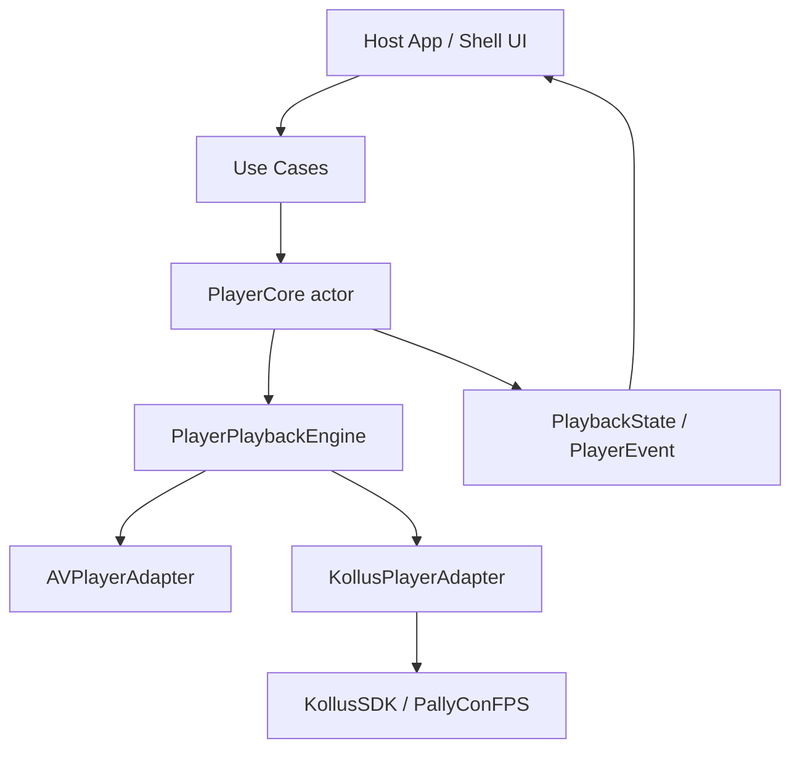
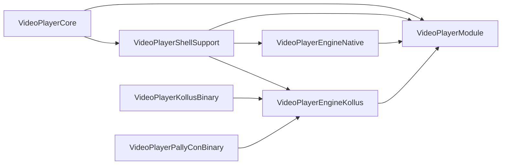
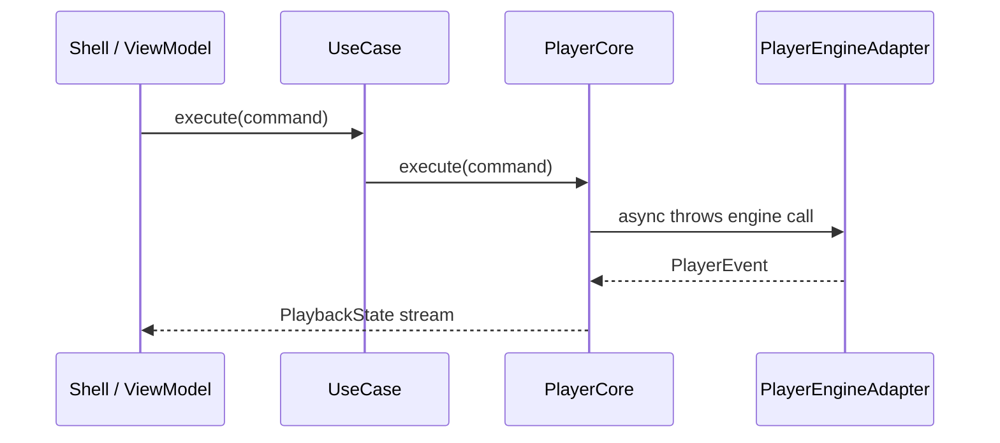

# VideoPlayerModule

`videoplayer-ios-ms`는 영상 재생을 특정 화면이나 특정 SDK에 묶지 않고, **공통 상태 머신 + 교체 가능한 재생 엔진**으로 다루는 Swift Package입니다.

처음에는 `AVPlayer` 하나만 감싸도 충분해 보일 수 있습니다. 하지만 강의 앱의 플레이어는 곧 DRM, 다운로드, 자막, 배속, 북마크, PiP, 백그라운드 재생, 외부 SDK, 앱 생명주기와 얽힙니다. 이 책임이 앱 화면으로 흘러들어가면 화면은 재생 정책과 벤더 SDK 세부 구현을 동시에 알아야 하고, 테스트도 실제 SDK에 끌려갑니다.

이 패키지는 그 문제를 끊기 위해 만들어졌습니다. 앱은 `PlaybackSource`, `PlaybackCommand`, `PlaybackState`만 다루고, 실제 재생은 `AVPlayerAdapter`나 `KollusPlayerAdapter` 같은 엔진이 맡습니다. 엔진을 바꿔도 앱의 사용 흐름은 바뀌지 않는 것이 핵심입니다.

## 설계 철학

- 앱은 재생 의도를 말하고, 엔진은 재생 방법을 안다.
- 모든 엔진 명령은 `async throws`로 실패 가능성을 숨기지 않는다.
- 엔진은 `Actor`로 격리해서 재생 상태 변경 순서를 명확히 한다.
- 지원 기능은 `EngineCapabilities`와 `PlayerFeaturePolicy`로 협상한다.
- Kollus/PallyCon 같은 벤더 SDK는 `VideoPlayerEngineKollus` 경계 안에 둔다.
- SmartLearning 앱의 화면, 라우팅, Remote Config, 분석 코드는 이 패키지로 가져오지 않는다.

Mermaid 다이어그램은 라이트/다크 모드 모두에서 읽히도록 고정 색상 `classDef`를 쓰지 않습니다. 렌더러의 기본 테마에 맡기는 쪽이 가장 안전합니다.

## 전체 구조



흐름은 단순합니다.

1. 앱이나 Shell이 `StartPlaybackUseCase`, `ControlPlaybackUseCase`를 호출합니다.
2. `PlayerCore`가 명령을 받고 현재 정책과 엔진 기능을 확인합니다.
3. `PlayerCore`가 `PlayerPlaybackEngine` 구현체에 실제 명령을 위임합니다.
4. 엔진은 `PlaybackState`와 `PlayerEvent`를 다시 흘려보냅니다.
5. 화면은 상태 스트림만 구독하고, 엔진 내부 구현은 모릅니다.

## 패키지 Product 선택

필요한 만큼만 가져다 쓰도록 product를 나눴습니다.

| Product | 역할 | 언제 사용하나 |
| --- | --- | --- |
| `VideoPlayerCore` | 도메인 타입, 명령, 상태, `PlayerCore`, 엔진 프로토콜 | 엔진 없는 순수 로직 테스트나 공통 계약이 필요할 때 |
| `VideoPlayerShellSupport` | 모듈 wiring, render surface, lifecycle/audio helper | 앱 화면과 플레이어 코어를 연결할 때 |
| `VideoPlayerEngineNative` | `AVPlayerAdapter` | 일반 URL/HLS 재생이 필요할 때 |
| `VideoPlayerEngineKollus` | Kollus/PallyCon 엔진, 다운로드 센터, SDK bootstrap | Kollus MCK 재생, DRM, 오프라인 다운로드가 필요할 때 |
| `VideoPlayerModule` | 위 product를 다시 export하는 umbrella | 앱에서 전체 표면을 한 번에 import하고 싶을 때 |



## 폴더 구조

```text
videoplayer-ios-ms/
├── Package.swift
├── Sources/
│   ├── VideoPlayerModule/
│   │   ├── Core/
│   │   │   ├── Domain/          # PlaybackSource, PlaybackState, PlayerEvent 등
│   │   │   ├── Internal/        # PlayerCore actor
│   │   │   └── UseCase/         # start/control/observe use case
│   │   ├── Engine/
│   │   │   ├── PlayerEngineAdapter.swift
│   │   │   ├── Native/          # AVPlayerAdapter
│   │   │   └── Kollus/          # Kollus adapter, bootstrap, downloads, SDK bridge
│   │   └── ShellSupport/        # wiring, render surface, lifecycle/audio helper
│   └── VideoPlayerModuleExports/
│       └── VideoPlayerModule.swift
├── Tests/
│   └── VideoPlayerModuleTests/
├── Binaries/                    # Kollus/PallyCon XCFramework 위치
├── Vendor/                      # vendor 원본 산출물 보관 영역
├── Packaging/                   # binary target packaging 산출물
├── scripts/                     # packaging/verification script
└── docs/
    ├── kollus-sdk-implementation-guide.md
    ├── kollus-ios-sdk-reference.md
    ├── kollus-sdk-packaging.md
    └── blog/
```

폴더 이름은 레이어를 그대로 드러냅니다. `Core`는 SDK를 모릅니다. `ShellSupport`는 앱 화면과 연결되는 최소한의 접착제만 둡니다. `Engine/Native`와 `Engine/Kollus`는 같은 계약을 구현하지만 서로의 구현을 공유하지 않습니다.

## 핵심 타입을 읽는 순서

처음 보는 사람은 아래 순서로 읽는 것이 가장 빠릅니다.

1. `PlaybackSource`: 어떤 영상을 틀 것인지 표현합니다. 현재는 `.url(URL)`과 `.kollus(mediaContentKey:)`가 있습니다.
2. `PlaybackCommand`: 재생 중 사용자가 내리는 명령입니다.
3. `PlaybackState` / `PlayerEvent`: 화면이 관찰해야 할 출력입니다.
4. `PlayerFeaturePolicy`: 앱이 허용하는 정책입니다. 예를 들어 최대 배속이나 백그라운드 재생 허용 여부가 여기에 있습니다.
5. `EngineCapabilities`: 엔진이 실제로 지원하는 기능입니다.
6. `PlayerCore`: 정책과 엔진 기능을 확인한 뒤 명령을 실행하는 상태 머신입니다.
7. `PlayerPlaybackEngine`: 모든 엔진이 지켜야 하는 최소 계약입니다.

명령 흐름은 다음과 같습니다.



## 사용법

### 1. URL 재생

일반 URL/HLS 재생은 `AVPlayerAdapter`를 사용합니다.

```swift
import Foundation
import VideoPlayerCore
import VideoPlayerEngineNative
import VideoPlayerShellSupport

let engine = AVPlayerAdapter()
let module = await PlayerModuleWiring.makeModule(
    engine: engine,
    engineCapabilities: AVPlayerAdapter.capabilities
)

Task {
    for await state in await module.observePlaybackStateUseCase.stateStream {
        print("player state:", state)
    }
}

try await module.startPlaybackUseCase.execute(
    source: .url(videoURL),
    policy: .default
)

try await module.controlPlaybackUseCase.execute(command: .play)
```

화면에 붙일 때는 `PlayerRenderSurface`를 구현한 view를 만들고, 엔진의 `bind(renderSurface:)`를 호출합니다. 앱 생명주기와 오디오 세션 처리는 `PlayerLifecycleCoordinator`, `PlayerAudioSessionManager`를 통해 Shell 쪽에서 조합합니다.

### 2. Kollus 재생

Kollus는 SDK 초기화 값과 DRM/다운로드 설정이 필요하므로 `KollusEnvironment`를 먼저 구성합니다. 앱은 Remote Config나 서버에서 받은 값을 `KollusEnvironment`로 넘기고, 이 패키지는 그 값을 소비만 합니다.

```swift
import Foundation
import VideoPlayerCore
import VideoPlayerEngineKollus

let environment = KollusEnvironment(
    applicationKey: applicationKey,
    applicationBundleID: bundleID,
    applicationExpireDate: expireDate,
    storagePath: storageURL,
    cacheSizeMB: 1024,
    drm: drmConfiguration,
    observer: observer,
    diagnostics: diagnostics
)

let factory = KollusPlayerModuleFactory(
    environment: environment,
    observer: observer,
    diagnostics: diagnostics
)

let module = await factory.makeModule()

try await module.startPlaybackUseCase.execute(
    source: .kollus(mediaContentKey: mediaContentKey),
    policy: .default
)

try await module.controlPlaybackUseCase.execute(command: .play)
```

#### `KollusEnvironment` 파라미터

`KollusEnvironment`는 Kollus SDK bootstrap, storage/download 설정, 플레이어 뷰 옵션, DRM/채팅/진단 hook을 한 곳에 모으는 host 앱 주입 값입니다. 필수 값은 `validate()`에서 검증되며, `applicationKey`와 `applicationBundleID`는 비어 있으면 안 되고 `applicationExpireDate`는 현재 시각보다 미래여야 합니다.

| 파라미터 | 기본값 | 설명 |
| --- | --- | --- |
| `applicationKey` | 없음 | Kollus SDK storage에 주입되는 앱 인증 키입니다. 빈 문자열이면 `validate()`가 실패합니다. |
| `applicationBundleID` | 없음 | Kollus SDK에 전달할 host 앱 bundle identifier입니다. 빈 문자열이면 `validate()`가 실패합니다. |
| `applicationExpireDate` | 없음 | 앱 인증 키 만료 시각입니다. 현재 시각보다 과거이거나 같으면 `validate()`가 실패합니다. |
| `keychainGroup` | `nil` | Kollus SDK storage가 사용할 keychain access group입니다. 앱 그룹/확장 공유가 필요할 때만 지정합니다. |
| `storagePath` | `nil` | Kollus 다운로드와 캐시가 저장될 디렉터리 URL입니다. 값이 있으면 실제 존재하는 디렉터리여야 합니다. |
| `cacheSizeMB` | `nil` | Kollus storage 캐시 한도(MB)입니다. 값이 있으면 1 이상이어야 합니다. |
| `backgroundDownload` | `false` | Kollus storage의 백그라운드 다운로드 사용 여부입니다. |
| `networkTimeoutSeconds` | `nil` | Kollus storage 네트워크 timeout(초)입니다. 값이 있을 때만 SDK에 적용됩니다. |
| `networkRetry` | `nil` | 네트워크 timeout 설정과 함께 전달되는 retry 횟수입니다. `networkTimeoutSeconds`가 있을 때만 적용되며, 생략하면 `0`으로 전달됩니다. |
| `aiPlaybackRateEnabled` | `false` | Kollus player view의 AI 배속 기능 사용 여부입니다. |
| `hardwareDecoderPreferred` | `true` | Kollus player view decoder 설정입니다. `true`면 hardware decoder 선호 값으로 전달합니다. |
| `customSkinJSON` | `nil` | Kollus player view에 전달할 custom skin JSON 문자열입니다. |
| `pauseOnForeground` | `false` | 앱이 foreground로 전환될 때 Kollus player view가 일시정지할지 결정합니다. |
| `audioBackgroundPlayPolicy` | `false` | Kollus player view의 백그라운드 오디오 재생 정책입니다. `true`면 모듈 capability에 `.continuesWithoutSurface`도 추가됩니다. |
| `drm` | 빈 `KollusDRMConfiguration()` | FairPlay 인증서 URL, DRM URL, SDK에 전달할 추가 DRM 파라미터를 담습니다. 평문 컨텐츠만 재생한다면 기본값을 사용할 수 있습니다. |
| `chat` | `nil` | 라이브 채팅에 필요한 room/user/server profile입니다. 라이브 채팅을 사용하지 않으면 생략합니다. |
| `extraDrmParameters` | `[:]` | host 앱이 별도 DRM 확장 값을 보존해야 할 때 쓰는 environment-level 슬롯입니다. 현재 SDK player view로 직접 주입되는 값은 `drm.extraParameters`입니다. |
| `observer` | `nil` | Kollus storage/download/player 이벤트를 host 앱으로 전달할 observer입니다. |
| `diagnostics` | `nil` | SDK bootstrap, playback, download 흐름의 진단 로그를 받을 sink입니다. |

`drm`에는 FairPlay 값을 아래처럼 분리해서 넣습니다.

| `KollusDRMConfiguration` 파라미터 | 설명 |
| --- | --- |
| `fpsCertificateURL` | Kollus player view의 `fpsCertURL`로 전달되는 FairPlay 인증서 URL입니다. |
| `fpsDRMURL` | Kollus player view의 `fpsDrmURL`로 전달되는 FairPlay DRM URL입니다. |
| `extraParameters` | JSON 문자열로 직렬화되어 Kollus player view의 `extraDrmParam`으로 전달되는 추가 DRM 파라미터입니다. |

같은 `KollusPlayerModuleFactory`에서 만든 모듈들은 하나의 `KollusSessionBootstrapper`와 `KollusDownloadCenter`를 공유합니다. 다운로드 목록이나 오프라인 스냅샷은 `factory.downloads`에서 접근합니다.

```swift
if let downloads = factory.downloads {
    Task {
        for await contents in downloads.contents {
            print("download snapshots:", contents)
        }
    }
}
```

## 왜 `async throws`인가

재생 명령은 겉으로는 단순하지만 실제로는 실패할 수 있습니다.

- `prepare`는 네트워크, DRM, source 형식, SDK 초기화에 실패할 수 있습니다.
- `play`와 `pause`도 엔진이 아직 준비되지 않았거나 SDK가 명령을 거부할 수 있습니다.
- `seek`는 target time 보정, pending seek 취소, SDK completion 실패가 있습니다.
- `stop`은 surface detach, item cleanup, SDK session 정리와 연결됩니다.

그래서 `PlayerPlaybackEngine`은 `prepare`, `play`, `pause`, `seek`, `stop`을 모두 `async throws`로 둡니다. 앱은 실패를 이벤트나 사용자 메시지로 바꿀 수 있고, 테스트는 실패 경로를 명확히 검증할 수 있습니다.

## Kollus SDK 운영 규칙

Kollus/PallyCon SDK는 일반 SPM source가 아니라 binary target으로 배포합니다. 이 저장소에서는 다음 규칙을 지킵니다.

- vendor 산출물은 직접 수정하지 않습니다.
- XCFramework packaging은 스크립트로 재현 가능해야 합니다.
- SDK 교체 시 checksum과 packaging 문서를 함께 갱신합니다.
- SmartLearning 앱 코드는 Kollus SDK를 직접 import하지 않고 이 패키지의 engine/product만 사용합니다.

자세한 절차는 [docs/kollus-sdk-packaging.md](docs/kollus-sdk-packaging.md)를 기준으로 합니다. Kollus 공식 문서에서 정리한 API/옵션 요약은 [docs/kollus-ios-sdk-reference.md](docs/kollus-ios-sdk-reference.md)에 있습니다.

Kollus SDK를 host 앱에서 실제로 어떻게 붙이는지, 어떤 기능을 사용할 수 있는지, 어떤 기능이 host 책임으로 남는지는 [docs/kollus-sdk-implementation-guide.md](docs/kollus-sdk-implementation-guide.md)에 따로 정리했습니다.

## 테스트와 검증

기본 검증은 Swift Package 테스트입니다.

```bash
swift test
```

Kollus binary packaging을 건드렸다면 packaging 검증도 같이 실행합니다.

```bash
./scripts/verify_kollus_packaging.sh
```

Kollus 실제 재생, DRM, 다운로드 완료, 백그라운드 다운로드는 시뮬레이터만으로 닫기 어렵습니다. 해당 변경은 실기기 검증 결과를 별도로 남겨야 합니다.

## 이 패키지가 하지 않는 일

이 패키지는 플레이어 엔진과 공통 상태 흐름에 집중합니다. 다음 책임은 host 앱이 가집니다.

- 화면 전환, 강의실 라우팅, navigation 정책
- Firebase Remote Config fetch와 rollout 결정
- LMS 진도 전송, 학습 분석, 비즈니스 이벤트
- 사용자-facing 문구와 에러 표시 방식
- 앱별 feature flag와 A/B 테스트

경계가 분명해야 엔진을 바꿔도 앱 전체가 흔들리지 않습니다. 이 저장소의 목표는 “모든 플레이어 기능을 한 파일에 모으는 것”이 아니라, 앱이 의도를 말하면 엔진이 안전하게 수행하는 구조를 유지하는 것입니다.
