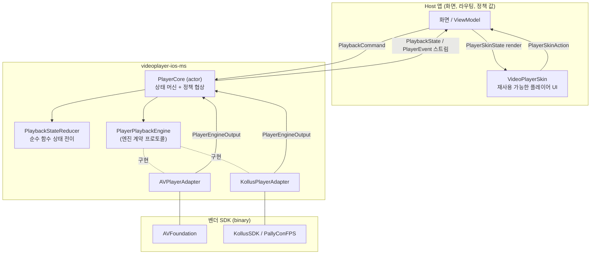

# 1편 — 이 패키지는 무엇인가

> [← 시리즈 목차](README.md) · [다음: 폴더 구조 →](02-folder-structure.md)

## 처음 든 의문: "왜 AVPlayer를 그냥 안 쓰지?"

처음 이 저장소를 열면 이런 생각이 들 수 있습니다. "영상 재생이면 `AVPlayer` 하나로 끝 아닌가?"

처음에는 그래 보입니다. 하지만 강의 앱의 플레이어는 금방 이런 요구사항과 얽힙니다.

- **DRM**: Kollus + PallyCon FairPlay로 암호화된 콘텐츠 재생
- **오프라인 다운로드**: 다운로드 진행률, 라이선스 만료, 저장소 관리
- **재생 정책**: 최대 배속 제한, 백그라운드 재생 허용 여부, 자동재생
- **앱 생명주기**: 백그라운드 전환 시 일시정지, 오디오 인터럽션(전화) 처리
- **UI**: 배속 패널, 자막, 화면 잠금, 구간 반복, 제스처

이 책임이 전부 화면(ViewController) 안으로 흘러들어가면 어떻게 될까요? 화면이 Kollus SDK의 delegate 26개를 직접 다루고, 재생 정책 분기와 UI 갱신이 한 파일에 섞입니다. 레거시 host 앱이 정확히 그 상태였고, 테스트도 실제 SDK 없이는 불가능했습니다.

이 패키지는 그 문제를 끊기 위해 만들어졌습니다.

## 해법: 공통 상태 머신 + 교체 가능한 재생 엔진

핵심 아이디어는 한 문장입니다.

> **앱은 재생 "의도"를 말하고, 엔진은 재생 "방법"을 안다.**

앱(host)이 다루는 것은 딱 3가지 타입뿐입니다.

| 타입 | 역할 | 예시 |
| --- | --- | --- |
| `PlaybackSource` | 무엇을 틀까 | `.url(URL)`, `.mediaKey("kollus-content-key")` |
| `PlaybackCommand` | 무엇을 할까 | `.play`, `.pause`, `.seek(to: 30)` |
| `PlaybackState` | 지금 어떤 상태인가 | `.playing`, `currentTime: 12.5, duration: 600` |

실제 재생은 "엔진"이 맡습니다. 엔진은 `PlayerPlaybackEngine` 프로토콜(계약)을 구현한 actor이고, 현재 두 종류가 있습니다.

- `AVPlayerAdapter` — 일반 URL/HLS. `AVPlayer`를 감싼다.
- `KollusPlayerAdapter` — Kollus MCK 재생 + DRM + 다운로드. Kollus SDK를 감싼다.

엔진을 바꿔도 앱 코드의 사용 흐름은 한 줄도 바뀌지 않습니다. 이것이 이 패키지의 존재 이유입니다.

## 전체 그림

흐름을 말로 풀면:

1. 화면(또는 Skin의 버튼)이 `PlayerCore`에 명령을 보낸다 — `try await core.execute(command: .play)`
2. `PlayerCore`가 정책(`PlayerFeaturePolicy`)과 엔진 동작 특성(`EngineRuntimeTraits`)을 확인하고 엔진에 위임한다
3. 엔진은 SDK를 호출하고, SDK 이벤트를 `PlayerEngineOutput`으로 정규화해 올려 보낸다
4. `PlayerCore`가 그 신호를 `PlaybackStateReducer`에 넣어 다음 상태를 계산한다
5. 화면은 `core.stateStream`(AsyncStream)만 구독하며, 엔진 내부는 전혀 모른다

## 설계 원칙 5가지

코드를 읽다가 "왜 이렇게 했지?"가 떠오를 때, 대부분 아래 원칙 중 하나로 설명됩니다.

### 1. 상태 소유권은 코어에 있다

엔진은 상태를 "결정"하지 않습니다. 신호(`playStarted`, `bufferingChanged(true)` 등)만 발행하고, 다음 상태는 `PlaybackStateReducer`라는 **순수 함수**가 유일하게 계산합니다. 덕분에 상태 전이 로직은 SDK 없이 단위 테스트됩니다. → [4편](04-state-machine.md)

### 2. 모든 엔진 명령은 `async throws`

`play()`조차 실패할 수 있습니다(SDK 미준비, DRM 거부…). 실패 가능성을 숨기지 않고 전부 `async throws`로 노출해, 앱이 실패를 사용자 메시지로 바꾸거나 테스트가 실패 경로를 검증할 수 있게 합니다.

### 3. 엔진은 actor로 격리

재생 상태 변경은 순서가 생명입니다(seek 중에 pause가 끼어들면?). 모든 엔진과 `PlayerCore`는 Swift actor라서 명령이 직렬화되고 데이터 레이스가 원천 차단됩니다.

### 4. 기능은 협상한다 — Policy vs Runtime Traits

- `PlayerFeaturePolicy`: 앱이 **허용**하는 것 (최대 배속 2.0, 백그라운드 재생 금지…)
- `EngineRuntimeTraits`: 엔진이 실제로 **지원**하는 것 (`.continuesWithoutSurface`, `.nativePiP`…)

`PlayerCore`가 둘을 협상해서, 예컨대 백그라운드 재생을 허용해 달라는 정책이 와도 엔진이 지원하지 않으면 정책을 다운그레이드하고 `policyDowngraded` 이벤트로 알립니다.

### 5. 벤더 SDK는 경계 안에 가둔다

`import KollusSDK`는 `VideoPlayerEngineKollus` 모듈 안에서만 등장합니다. `VideoPlayerCore`는 UIKit조차 모릅니다(macOS에서도 컴파일됩니다). host 앱은 Kollus SDK를 직접 import하지 않고 이 패키지의 product만 사용합니다.

## 이 패키지가 하지 **않는** 일

경계를 아는 것이 경계 안을 아는 것만큼 중요합니다. 다음은 전부 host 앱 책임입니다.

- 화면 전환, 강의실 라우팅, navigation 정책
- Remote Config fetch와 rollout 결정
- LMS 진도 전송, 학습 분석, 비즈니스 이벤트 (단, Kollus SDK의 LMS 콜백을 host로 전달하는 `KollusObserver` hook은 제공)
- 사용자에게 보여줄 에러 문구와 표시 방식
- 앱별 feature flag와 A/B 테스트

`PlayerModuleBoundaryTests`가 패키지 소스에 서비스 앱 용어가 들어오는 것을 자동으로 막고 있으니, 코드를 추가할 때 이 경계를 신경 쓰세요.

---

다음 편에서는 이 그림이 실제 폴더/모듈로 어떻게 배치되어 있는지 봅니다.

> [← 시리즈 목차](README.md) · [다음: 폴더 구조 →](02-folder-structure.md)
