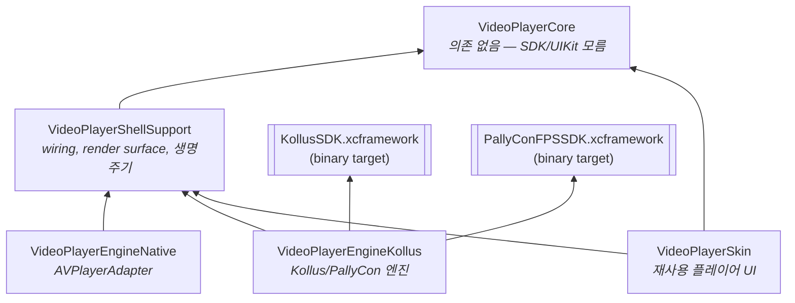

# 2편 — 폴더 구조와 모듈 지도

> [← 1편: 개요](01-overview.md) · [시리즈 목차](README.md) · [다음: 도메인 타입 →](03-domain-types.md)

## 모듈 의존 그래프부터

이 패키지는 5개 라이브러리 product로 나뉩니다. 의존 방향이 곧 "누가 누구를 알 수 있는가"입니다. (`Package.swift` 기준)



읽는 법:

- **`VideoPlayerCore`는 아무것도 의존하지 않습니다.** Foundation만 씁니다. 그래서 macOS에서도 컴파일되고, 순수 로직 테스트가 SDK 없이 돕니다.
- **엔진 둘(Native/Kollus)은 ShellSupport에 의존**합니다. 이유: 엔진이 화면에 영상을 붙이려면 ShellSupport의 `PlayerRenderSurface` 프로토콜이 필요하기 때문입니다.
- **Skin은 엔진을 모릅니다.** Core + ShellSupport만 의존합니다. host가 "조립된 PlayerModule"을 주입하므로 Skin 입장에서 엔진이 AVPlayer인지 Kollus인지 알 필요가 없습니다.
- Kollus/PallyCon SDK는 **binary target**입니다. 소스가 아니라 `Binaries/*.xcframework`로 들어옵니다.

## 디렉터리 트리

```text
videoplayer-ios-ms/
├── Package.swift                  # 모듈 정의의 단일 진실 — 구조가 궁금하면 여기부터
├── Project.swift                  # Tuist 매니페스트 (Example 앱용)
│
├── Sources/
│   ├── VideoPlayerCore/           # ❶ 도메인 + 상태 머신 (의존 없음)
│   │   ├── Domain/                #    PlaybackSource, PlaybackCommand, PlaybackState,
│   │   │                          #    PlayerEvent, PlayerError, PlayerFeaturePolicy …
│   │   ├── Contract/              #    PlayerEngineAdapter(엔진 계약), PlayerEngineOutput
│   │   ├── StateTransition/       #    PlaybackStateReducer (순수 함수 상태 전이)
│   │   ├── Internal/              #    PlayerCore (actor — 명령 orchestrator)
│   │   └── Download/              #    PlayerDownloadCenter 프로토콜, DownloadedContent
│   │
│   ├── VideoPlayerShellSupport/   # ❷ 앱과 코어를 잇는 접착제
│   │   │                          #    PlayerModuleWiring(조립), PlayerRenderSurface(화면 부착),
│   │   │                          #    PlayerLifecycleCoordinator, PlayerAudioSessionManager,
│   │   │                          #    PlayerNowPlayingCoordinator(잠금화면/제어센터),
│   │   │                          #    UnsupportedEnvironmentEngine(시뮬레이터 대체 엔진)
│   │
│   ├── VideoPlayerEngineNative/   # ❸ AVPlayer 엔진
│   │   ├── AVPlayerAdapter.swift
│   │   └── Signal/                #    AVPlayerSignalMapper (KVO → PlayerEngineOutput)
│   │
│   ├── VideoPlayerEngineKollus/   # ❹ Kollus 엔진 (SDK import는 여기만!)
│   │   ├── KollusPlayerAdapter.swift      # SDK player view 래핑 actor
│   │   ├── KollusPlayerModuleFactory.swift# host 진입점 팩토리
│   │   ├── KollusEnvironment.swift        # host 주입 설정의 단일 진입점
│   │   ├── KollusSessionBootstrapper.swift# SDK storage 부트스트랩 + 캐시
│   │   ├── KollusDelegateBridge.swift     # SDK delegate 4종 → 신호 변환
│   │   ├── KollusEngineSignal.swift       # SDK 콜백 26종의 enum 표현
│   │   ├── Signal/KollusSignalMapper.swift# 신호 → PlayerEngineOutput 정규화
│   │   ├── Downloads/                     # KollusDownloadCenter, StorageBridge
│   │   ├── Playback/                      # 북마크 캐시, 위치 폴러, 다음화 emitter
│   │   ├── Errors/KollusErrorClassifier.swift
│   │   └── Resources/PrivacyInfo.xcprivacy
│   │
│   └── VideoPlayerSkin/           # ❺ 재사용 플레이어 UI (Rx/SnapKit 의존 없음)
│       ├── Contract/              #    PlayerSkin, PlayerSkinOverlay 프로토콜
│       ├── Assembly/              #    Blueprint → Slot → Block 조립 시스템
│       ├── Blocks/                #    ProgressBar, PlayButton 등 UI 조각 20여 종
│       ├── Theme/                 #    색/폰트/아이콘 role 시스템
│       ├── Resources/             #    PlayerSkin.xcassets
│       └── (루트)                 #    PlayerSkinAction/State, 자막/제스처 오버레이
│
├── Tests/VideoPlayerModuleTests/
│   ├── Core/                      # Reducer 등 순수 로직 테스트 (macOS에서도 실행)
│   ├── Kollus/                    # KollusSignalMapper 등 (#if canImport(UIKit) 가드)
│   ├── Native/                    # AVPlayerSignalMapper 등
│   └── Support/                   # 테스트 공용 팩토리, 엔진 계약 공유 테스트
│
├── Example/                       # Tuist 기반 iOS 데모 앱
│   ├── Resources/kollus.local.plist.example  # 자격증명 템플릿 (실파일은 gitignored)
│   └── Sources/                   # Root/Player/Settings/Download 화면
│
├── Binaries/                      # KollusSDK / PallyConFPS XCFramework
├── Vendor/                        # 벤더 원본 산출물 (직접 수정 금지)
├── Packaging/                     # XCFramework 재생성 산출물
├── scripts/                       # sync/rebuild/verify packaging 스크립트
└── docs/                          # 설계·작업 문서 (이 시리즈 포함)
```

## "어디를 고쳐야 하지?" 빠른 지도

작업 종류별로 손댈 위치를 미리 알아두면 헤매지 않습니다.

| 하고 싶은 일 | 손댈 곳 | 참고 편 |
| --- | --- | --- |
| 새 재생 명령 추가 (예: AB 반복) | `Core/Domain/PlaybackCommand.swift` → `Internal/PlayerCore.swift` → 각 엔진 | [10편](10-example-tests-recipes.md) |
| 새 상태 전이 추가 | `Core/StateTransition/PlaybackStateReducer.swift` + `Tests/Core/` | [4편](04-state-machine.md) |
| Kollus SDK 새 콜백 연결 | `KollusEngineSignal` → `KollusDelegateBridge` → `KollusSignalMapper` | [6편](06-kollus-engine.md) |
| 플레이어 UI 버튼 추가 | `Skin/Blocks/` 에 Block 추가 → Blueprint에 배치 | [8편](08-skin.md) |
| SDK 에러를 새 분류로 매핑 | `Kollus/Errors/KollusErrorClassifier.swift` | [6편](06-kollus-engine.md) |
| Kollus SDK 버전 교체 | `Vendor/` + `scripts/sync_*_vendor.sh` → `rebuild_*` → `verify_kollus_packaging.sh` | [docs/kollus-sdk-packaging.md](../kollus-sdk-packaging.md) |
| 앱 생명주기 동작 변경 | `ShellSupport/PlayerLifecycleCoordinator.swift` | [7편](07-shell-support.md) |

## 경계 규칙 (어기면 테스트가 막는다)

1. `Core`는 SDK를 모른다 — Kollus/PallyCon import는 `VideoPlayerEngineKollus` 안에서만.
2. host 앱은 Kollus SDK를 직접 import하지 않는다 — 이 패키지의 product만 사용.
3. 서비스 앱 화면/라우팅/Remote Config/LMS 분석 코드는 가져오지 않는다.
4. 패키지 소스(주석 포함)에 서비스 앱 용어 금지 — `PlayerModuleBoundaryTests`가 검사. 레거시를 언급할 땐 "레거시 host 앱"처럼 일반화.
5. `Vendor/` 원본은 직접 수정 금지 — `Packaging/` + `scripts/`로 재현 가능해야 함.

---

> [← 1편: 개요](01-overview.md) · [시리즈 목차](README.md) · [다음: 도메인 타입 →](03-domain-types.md)
