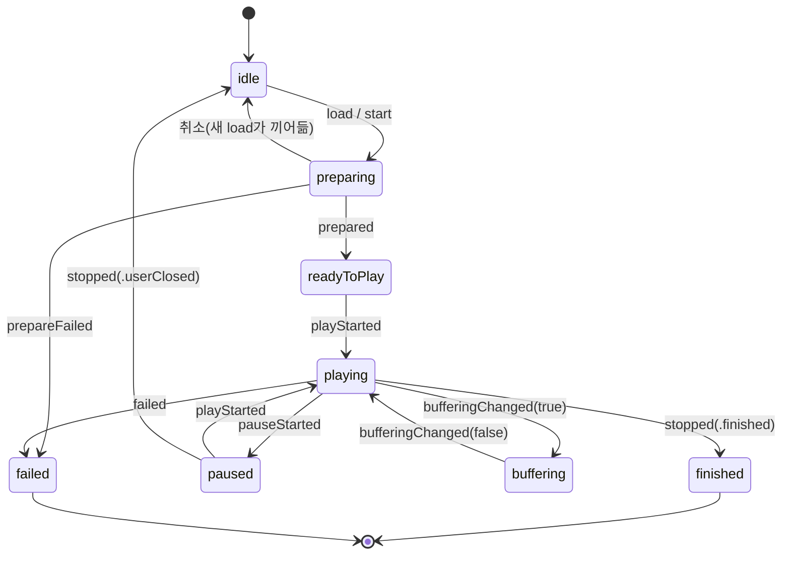
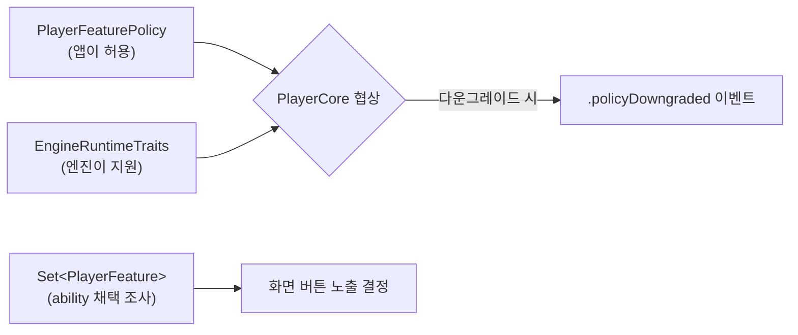

# 3편 — 도메인 타입: 패키지의 공용어

> [← 2편: 폴더 구조](02-folder-structure.md) · [시리즈 목차](README.md) · [다음: 상태 머신 →](04-state-machine.md)

이번 편은 `Sources/VideoPlayerCore/Domain/`을 읽습니다. 여기 있는 타입들이 패키지 전체의 "공용어"입니다. 화면도, 코어도, 엔진도 전부 이 타입으로 대화합니다.

읽는 순서는 자연스러운 질문 순서를 따릅니다: **무엇을 틀까 → 무엇을 시킬까 → 지금 상태는 → 무슨 일이 일어났나 → 무엇이 허용/지원되나 → 실패하면?**

## 1. PlaybackSource — 무엇을 틀까

```swift
// Sources/VideoPlayerCore/Domain/PlaybackSource.swift
public struct PlaybackSource: Equatable, Sendable {
    public enum Kind: Equatable, Sendable {
        case url(URL)           // 일반 URL / HLS → AVPlayerAdapter가 해석
        case mediaKey(String)   // 엔진 고유 키 (Kollus media content key 등)
    }

    public let kind: Kind
    public let options: [String: String]

    public static func url(_ url: URL) -> PlaybackSource
    public static func mediaKey(_ key: String) -> PlaybackSource
}
```

포인트:

- `mediaKey`는 **의도적으로 벤더 중립적인 이름**입니다. "Kollus key"라고 하지 않은 이유는 Core가 Kollus를 몰라야 하기 때문입니다.
- 엔진은 자기가 해석할 수 없는 `Kind`를 받으면 에러를 던집니다. 예: `AVPlayerAdapter`에 `.mediaKey`를 주면 `PlayerError.engineError`.
- 다운로드된 콘텐츠도 같은 방식으로 재생합니다: `DownloadedContent.id`를 그대로 `.mediaKey(id)`로.

## 2. PlaybackCommand — 무엇을 시킬까

사용자가 플레이어에 내릴 수 있는 모든 명령이 한 enum에 모여 있습니다.

```swift
// Sources/VideoPlayerCore/Domain/PlaybackCommand.swift
public enum PlaybackCommand: Equatable, Sendable {
    case load(PlaybackSource)
    case play
    case pause
    case seek(to: TimeInterval)
    case seekWithOrigin(to: TimeInterval, origin: PlayerSeekOrigin)  // skip 버튼용 상대 seek
    case setPlaybackRate(Double)
    case setSkipInterval(TimeInterval)
    case setSubtitleVisible(Bool)
    case selectSubtitleTrack(PlayerSubtitleTrackID?)
    case setCaptionFontSize(Int)
    case addBookmark(at: TimeInterval)
    case addBookmarkWithTitle(at: TimeInterval, title: String)
    case removeBookmark(at: TimeInterval)
    case selectSubtitleFile(URL?)
    case setDisplayLocked(Bool)
    case setDisplayScaleMode(PlayerDisplayScaleMode)
    case setDisplayScaled(Bool)
    case toggleDisplayScaleMode
    case toggleDisplayScaling
    case stop
}
```

새 기능(예: 구간 반복)을 추가할 때 시작점이 바로 이 enum입니다. case를 추가하면 컴파일러가 `PlayerCore.execute`의 switch에서 처리 누락을 잡아 줍니다.

## 3. PlaybackState — 지금 어떤 상태인가

```swift
// Sources/VideoPlayerCore/Domain/PlaybackState.swift
public struct PlaybackState: Equatable, Sendable {
    public enum Status: Equatable, Sendable {
        case idle          // 아무것도 안 함
        case preparing     // 소스 로딩 중
        case readyToPlay   // 준비 완료, 재생 대기
        case playing
        case paused
        case buffering     // 재생 중 버퍼링
        case finished      // 끝까지 재생 (terminal)
        case failed(PlayerError)  // (terminal)
    }

    public let status: Status
    public let currentTime: TimeInterval
    public let duration: TimeInterval
    public let isBuffering: Bool
    public let isLive: Bool
    public let liveDuration: TimeInterval?

    // 일부 필드만 바꾼 복사본 — reducer가 애용
    public func updating(status:currentTime:duration:isBuffering:isLive:liveDuration:) -> PlaybackState
}
```

상태 전이 다이어그램:



중요한 약속 두 가지:

- **`finished`/`failed`는 terminal**입니다. 늦게 도착한 buffering 이벤트가 죽은 상태를 되살리지 못하도록 reducer가 막습니다. ([4편](04-state-machine.md))
- 상태 값은 **오직 `PlaybackStateReducer`만 만듭니다.** 화면도 엔진도 `PlaybackState`를 직접 조립해 발행하지 않습니다.

## 4. PlayerEvent — 무슨 일이 일어났나

상태 전이와 별개로 "일어난 일"을 알리는 채널입니다.

```swift
// Sources/VideoPlayerCore/Domain/PlayerEvent.swift
public enum PlayerEvent: Equatable, Sendable {
    case stateDidChange(PlaybackState)
    case timeDidChange(currentTime: TimeInterval, duration: TimeInterval)
    case bufferingDidChange(isBuffering: Bool)
    case didFinish
    case didFail(PlayerError)
    case policyDowngraded(reason: PolicyDowngradeReason)   // 정책 협상 결과 통지
    case captionDidUpdate(text: String, isSecondary: Bool) // 자막
    case bookmarksDidLoad([Bookmark])
    case bitrateDidChange(Int)
    case heightDidChange(Int)
    case externalOutputDidChange(enabled: Bool)            // 외부 출력(미러링) 감지
    case naturalSizeDidResolve(CGSize)
    case videoFrameDidChange(CGRect)
    case framerateDidResolve(Int)
    case deviceLockPolicyChanged(locked: Bool)
    case nextEpisodeAvailable(NextEpisodeInfo)             // 다음화 버튼 노출 시점
}
```

**상태(state) vs 이벤트(event) 구분 기준**: UI가 "현재 모습"을 그리는 데 필요한 것은 상태, "그 순간 반응"해야 하는 것(토스트, 자막 한 줄, 다음화 버튼 등장)은 이벤트입니다.

## 5. PlayerFeaturePolicy vs EngineRuntimeTraits — 허용 vs 지원

이 둘의 구분이 이 패키지에서 가장 자주 헷갈리는 부분입니다.

```swift
// 앱이 "허용"하는 것 — host가 주입
public struct PlayerFeaturePolicy: Equatable, Sendable {
    public let allowsBackgroundPlayback: Bool
    public let allowedPlaybackRates: [Double]  // 허용 배속 목록 — Float가 아닌 Double, 이진 오차 방지
    public let allowsAutoplay: Bool
    public let skipInterval: TimeInterval
    public let nextEpisodeButtonLeadTime: TimeInterval
    public let allowsSeekPreview: Bool       // 시킹 프리뷰 모달 — 생성 시 결정, 런타임 토글 없음

    public static let `default` = PlayerFeaturePolicy(
        allowsBackgroundPlayback: false,
        allowedPlaybackRates: [0.5, 0.8, 1.0, 1.2, 1.5, 2.0],
        allowsAutoplay: true,
        skipInterval: 10,
        nextEpisodeButtonLeadTime: 30
    )
}

// 엔진이 실제로 "어떻게 동작"하는지 — 엔진이 선언 (preset: .avPlayer / .kollus / .default)
public struct EngineRuntimeTraits: Equatable, Sendable {
    public let surface: EngineSurfaceRuntimeTraits        // continuesWithoutSurface — 화면 없이 재생 지속(백그라운드)
    public let stateAuthority: EngineStateEventAuthority  // 아래 설명
}

public enum EngineStateEventAuthority {
    case engineEventsAreAuthoritative   // 엔진 권위 콜백이 상태를 만든다 (Kollus)
    case commandSuccessClosesState      // Core가 명령 성공 직후 상태를 닫는다 (Native)
}
```

`stateAuthority`는 미묘하지만 중요합니다: **Kollus SDK는 play/pause 성공을 별도 delegate 콜백으로 다시 알려주지만, AVPlayer는 그렇지 않습니다.** 그래서 Kollus(`.engineEventsAreAuthoritative`)는 콜백 신호가 상태를 만들고, Native(`.commandSuccessClosesState`)는 명령 성공 직후 `PlayerCore`가 직접 상태를 닫습니다. ([4편](04-state-machine.md)의 command-origin 참고)

여기에 더해 **세 번째 축**이 있습니다:

```swift
// 엔진이 제공할 수 있는 부가 기능의 식별자 — enum + CaseIterable
public enum PlayerFeature { case playbackRate, subtitles, bookmarks, pictureInPicture, zoom /* … */ }
```

`PlayerCore` 생성 시 `PlayerFeature.available(for: engine)`으로 엔진이 `EngineSubtitleAbility`, `EngineBookmarkAbility` 등을 구현했는지 검사해 `Set<PlayerFeature>`를 만들어 둡니다. 화면은 이 값으로 **버튼 노출 여부를 사전 결정**합니다 (지원 안 하는 기능의 버튼을 아예 숨김).

검사 로직(`isSupported(by:)`)과 정책 게이트(`PlayerFeaturePolicy.allows(_:)`)는 둘 다 default 없는 exhaustive switch입니다 — 새 feature를 추가하면 case 하나 추가 후 **컴파일 에러가 갱신 지점을 전부 안내**합니다. 깜빡해도 조용히 빠지는 일이 없습니다.



## 6. PlayerError — 실패하면

벤더 SDK의 에러 코드를 그대로 노출하지 않고, 앱이 대응 방법을 결정할 수 있는 분류로 바꿉니다.

```swift
// Sources/VideoPlayerCore/Domain/PlayerError.swift
public enum PlayerError: Error, Equatable, Sendable {
    case networkError(String)
    case authenticationFailed(String)     // 앱 키 인증 실패
    case decodingError(String)
    case engineError(String)              // 분류 불가한 엔진 내부 오류
    case licenseExpired(String)           // 재생 불가 — 재다운로드/문의 필요
    case licenseRenewalRequired(String)   // 갱신하면 복구 가능
    case storageFull(String)
    case downloadConflict(String)
    case contentNotFound(String)
    case deviceNotSupported(String)
    case unknown(String)
}
```

분류 기준은 "**앱이 무엇을 할 수 있는가**"입니다. 예를 들어 `licenseExpired`(사용자 안내)와 `licenseRenewalRequired`(갱신 버튼 노출)를 구분하는 이유가 그것입니다. 벤더 에러 → `PlayerError` 변환은 `PlayerErrorClassifier` 체인이 담당하며, Kollus 쪽 구현은 [6편](06-kollus-engine.md)에서 다룹니다.

## 7. 다운로드 도메인 — DownloadedContent

오프라인 다운로드도 같은 원칙(벤더 중립 모델)을 따릅니다.

```swift
// Sources/VideoPlayerCore/Download/DownloadedContent.swift
public struct DownloadedContent: Sendable, Hashable, Identifiable {
    public enum DownloadStatus { case notDownloaded; case inProgress(percent: Double, downloadedBytes: Int64); case completed }
    public enum LicenseStatus  { case unknown; case valid(LicenseConstraints); case expired }

    public let id: String        // 그대로 PlaybackSource.mediaKey(id)로 재생 가능
    public let title: String
    public let thumbnailPath: String?   // 시크 프리뷰용 — 스프라이트 시트일 수 있음
    public let snapshotPath: String?    // 단일 프레임 — NowPlaying artwork 등에 사용
    public let duration: TimeInterval
    public let lastPosition: TimeInterval
    public let download: DownloadStatus
    public let license: LicenseStatus
    public let fileSize: Int64
    public let vendorFields: [String: String]  // 벤더 고유 필드 escape hatch

    /// 오프라인 재생 가능 여부 사전 판정 — 만료/횟수/시간 제약 검사
    public func validateOfflinePlayability(now: Date = Date()) -> PlayerError?
}
```

`validateOfflinePlayability()`가 좋은 예시입니다. "다운로드는 됐는데 라이선스가 만료된" 콘텐츠를 재생 시도 **전에** 걸러내고, 실패 사유를 `PlayerError`로 돌려줍니다. Kollus 어댑터가 prepare 시점에 이걸 호출합니다.

다운로드 작업의 계약은 `PlayerDownloadCenter` 프로토콜(actor)이고, Kollus 구현체는 [6편](06-kollus-engine.md)에서 봅니다.

---

이제 공용어를 알았으니, 이 타입들이 실제로 흐르는 곳 — `PlayerCore`와 reducer — 으로 갑니다.

> [← 2편: 폴더 구조](02-folder-structure.md) · [시리즈 목차](README.md) · [다음: 상태 머신 →](04-state-machine.md)
