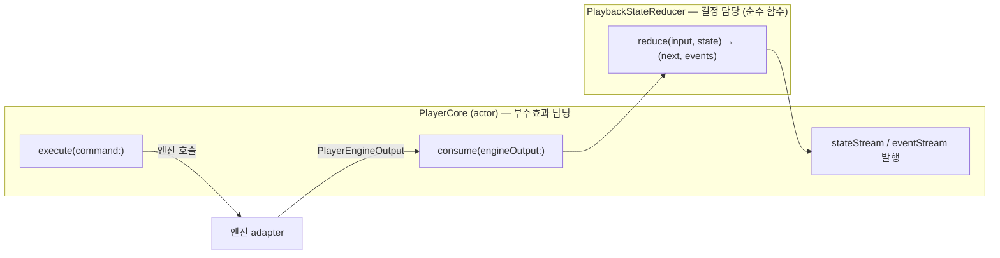
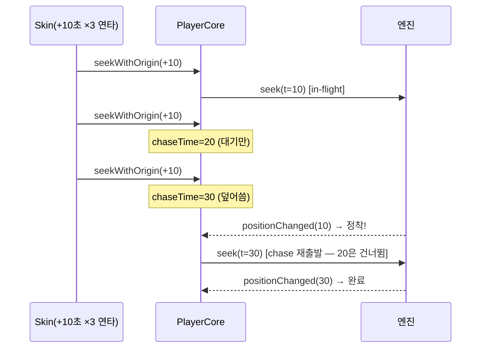

# 4편 — 상태 머신: PlayerCore와 PlaybackStateReducer

> [← 3편: 도메인 타입](03-domain-types.md) · [시리즈 목차](README.md) · [다음: 엔진 계약 →](05-engine-contract.md)

이번 편이 패키지의 심장입니다. 파일 두 개를 읽습니다.

- `Sources/VideoPlayerCore/Internal/PlayerCore.swift` — actor. 명령을 받아 엔진에 위임하고, 엔진 신호로 상태를 갱신하는 orchestrator
- `Sources/VideoPlayerCore/StateTransition/PlaybackStateReducer.swift` — 순수 함수. "(현재 상태 + 입력) → (다음 상태 + 이벤트)"

## 왜 둘로 나눴을까?

상태 전이 로직을 actor 안에 박아 두면 테스트하려면 actor hop, 엔진 mock, 비동기 대기가 전부 필요합니다. 그래서 **"무엇이 다음 상태인가"라는 결정만 순수 함수로 분리**했습니다. reducer는 SDK도 actor도 모르므로 `swift test`가 macOS에서 밀리초 단위로 돕니다.



## Reducer: 입력과 출력

엔진이 올려 보내는 "상태를 움직이는 입력"은 9가지뿐입니다.

```swift
// Sources/VideoPlayerCore/StateTransition/PlaybackStateInput.swift
public enum PlaybackStateInput: Sendable {
    case prepared(PlaybackPreparedSnapshot)   // 준비 완료 (position/duration/isLive 스냅샷)
    case prepareFailed(PlayerError)
    case playStarted
    case pauseStarted
    case bufferingChanged(Bool)
    case stopped(PlayerStopReason)            // .finished / .userClosed / .replacedSource / .appLifecycle
    case positionChanged(time: TimeInterval, duration: TimeInterval?)
    case seeking(time: TimeInterval)
    case failed(PlayerError)
}

// 출력: 다음 상태 + 그때 발행할 이벤트
public struct PlaybackStateReducerOutput: Sendable, Equatable {
    public let next: PlaybackState
    public let events: [PlayerEvent]
}
```

대표 전이 세 가지를 코드로 봅니다.

### 전이 1: prepared → readyToPlay (단순 케이스)

```swift
// PlaybackStateReducer.swift
case .prepared(let snapshot):
    let next = state.updating(
        status: .readyToPlay,
        currentTime: snapshot.position,
        duration: snapshot.duration,
        isBuffering: false,
        isLive: snapshot.isLive,
        liveDuration: .some(snapshot.liveDuration)
    )
    return PlaybackStateReducerOutput(next: next, events: [.stateDidChange(next)])
```

### 전이 2: bufferingChanged — terminal 상태 보호

```swift
private func reduceBufferingChanged(_ buffering: Bool, state: PlaybackState) -> PlaybackStateReducerOutput {
    // terminal 상태(.finished/.failed)는 늦게 도착한 buffering 이벤트로 되살리지 않는다
    if case .finished = state.status {
        return PlaybackStateReducerOutput(next: state, events: [.bufferingDidChange(isBuffering: buffering)])
    }
    if case .failed = state.status { /* 동일 */ }

    // .playing에서 시작한 버퍼링만 .buffering으로 전이
    let nextStatus: PlaybackState.Status
    if buffering {
        nextStatus = (state.status == .playing) ? .buffering : state.status
    } else {
        nextStatus = (state.status == .buffering) ? .playing : state.status
    }
    let next = state.updating(status: nextStatus, isBuffering: buffering)
    return PlaybackStateReducerOutput(next: next, events: [.bufferingDidChange(isBuffering: buffering)])
}
```

SDK 콜백은 순서를 보장하지 않습니다. 영상이 끝난 **뒤에** 버퍼링 해제 콜백이 도착하는 일이 실제로 일어나고, 이 가드가 그때 `finished` 상태가 `playing`으로 되살아나는 버그를 막습니다.

### 전이 3: seeking — 상태는 유지, 위치만 점프

```swift
case .seeking(let time):
    // seek: 목표 위치로 즉시 점프(위치만). 로딩 인디케이터/상태 변경 없음 (YouTube와 같은 동작)
    if case .finished = state.status { return PlaybackStateReducerOutput(next: state, events: []) }
    if case .failed   = state.status { return PlaybackStateReducerOutput(next: state, events: []) }
    let next = state.updating(currentTime: time)
    return PlaybackStateReducerOutput(next: next, events: [.timeDidChange(currentTime: time, duration: next.duration)])
```

## PlayerCore: actor가 하는 일

`PlayerCore`의 public 표면은 작습니다.

```swift
// Sources/VideoPlayerCore/Internal/PlayerCore.swift
public actor PlayerCore {
    public nonisolated let stateStream: AsyncStream<PlaybackState>   // 화면이 구독
    public nonisolated let eventStream: AsyncStream<PlayerEvent>     // 화면이 구독
    public nonisolated let availableFeatures: Set<PlayerFeature>

    public init(engine: PlayerPlaybackEngine, engineRuntimeTraits: EngineRuntimeTraits,
                initialPolicy: PlayerFeaturePolicy = .default)

    public func activate() async    // 엔진 출력 스트림 구독 시작
    public func dispose() async     // 정리
    public func start(source: PlaybackSource, policy: PlayerFeaturePolicy) async throws
    public func execute(command: PlaybackCommand) async throws
}
```

내부에는 단순 위임으로 보이지 않는 장치가 네 개 있습니다. 전부 "SDK의 비동기 콜백과 사용자의 빠른 입력이 경쟁하는" 실전 문제를 풀기 위한 것입니다.

### 장치 1: generation 기반 prepare 취소

사용자가 영상 A를 여는 도중 영상 B를 열면? 늦게 도착한 A의 실패/완료가 B의 상태를 망치면 안 됩니다.

```swift
public func start(source: PlaybackSource, policy: PlayerFeaturePolicy) async throws {
    // 같은 source가 이미 준비 중이면 중복 .load를 무시 (coalesce)
    if currentSource == source, pendingPrepareTask != nil, case .preparing = currentState.status {
        return
    }
    // …정책 협상…

    pendingPrepareTask?.cancel()
    prepareGeneration &+= 1
    let generation = prepareGeneration   // 이 start의 "세대" 도장

    transition(to: currentState.updating(status: .preparing, currentTime: 0, duration: 0, isBuffering: false))

    let task = Task { try await self.performStart(source: source, policy: effectivePolicy.policy) }
    pendingPrepareTask = task

    do {
        try await task.value
        if generation == prepareGeneration { pendingPrepareTask = nil }
    } catch {
        let playerError = mapToPlayerError(error)
        if generation == prepareGeneration {   // ← 내 세대일 때만 상태를 건드린다
            transition(to: currentState.updating(status: .failed(playerError), isBuffering: false))
            publish(event: .didFail(playerError))
        }
        throw playerError
    }
}
```

`generation == prepareGeneration` 검사가 핵심입니다. 더 새로운 start가 들어왔다면 이전 start의 결과는 상태에 반영되지 않습니다.

### 장치 2: seek chase — 연타 skip 처리

"+10초" 버튼을 다섯 번 연타하면 seek 5개가 동시에 SDK로 가면 안 됩니다(콜백이 뒤섞임). 그래서 **in-flight seek은 1개만 유지하고, 최신 목표(chaseTime)만 기억**합니다.

```swift
private func requestSeek(to target: TimeInterval) {
    chaseTime = target
    // UI는 즉시 점프한 것처럼 보여준다
    apply(stateReducer.reduce(.seeking(time: target), state: currentState))
    startChaseIfNeeded()
}

private func startChaseIfNeeded() {
    guard seekInProgressValue == nil, let chase = chaseTime else { return }  // 이미 비행 중이면 대기
    chaseTime = nil
    seekInProgressValue = chase
    dispatchEngineSeek(to: chase)
}
```

그리고 엔진의 `positionChanged` 신호가 들어올 때 "이번 seek이 목표에 정착했는가"를 판정합니다.

```swift
private func consume(engineOutput: PlayerEngineOutput) {
    switch engineOutput {
    case .stateInput(let input):
        // in-flight seek 정착 전의 stale positionChanged는 버린다
        if case .positionChanged(let time, _) = input, let inProgress = seekInProgressValue {
            guard abs(time - inProgress) <= Self.seekSettleThreshold else { return }
            // 이 leg는 도착. 그 사이 더 새 목표가 쌓였으면 그쪽으로 다시 seek
            if let next = chaseTime {
                chaseTime = nil
                seekInProgressValue = next
                dispatchEngineSeek(to: next)
                return
            }
            seekInProgressValue = nil
        }
        // 상태를 움직이는 입력은 reducer만 다음 상태를 만든다
        apply(stateReducer.reduce(input, state: currentState))
    case .event(let event):
        publish(event: event)   // 상태를 안 움직이는 이벤트는 passthrough
    }
}
```

흐름을 그림으로:



### 장치 3: command-origin — 엔진마다 다른 "성공 통지" 방식 흡수

3편에서 본 `stateAuthority` runtime trait가 여기서 쓰입니다.

```swift
case .play:
    try await executeEngineCommand { try await engine.play() }
    // 권위 콜백 엔진(Kollus)은 outputStream의 .playStarted가 상태를 만든다.
    // 권위 콜백이 없는 엔진(Native)은 Core가 command-origin으로 직접 닫는다.
    applyCommandOriginIfNeeded(.playStarted)
```

- **Kollus**: `play()` 성공 후 SDK가 `playStarted` delegate를 다시 쏘므로, 그 신호가 reducer로 가서 상태가 됩니다.
- **AVPlayer**: 그런 콜백이 없으므로 명령 성공 = 상태 확정으로 간주하고 Core가 직접 `.playStarted`를 reducer에 넣습니다.

이 차이를 runtime trait 플래그 하나로 흡수했기 때문에 화면 코드는 엔진별 분기가 없습니다.

### 장치 4: 정책 협상

```swift
private func applyEffectivePolicy(_ policy: PlayerFeaturePolicy)
    -> (policy: PlayerFeaturePolicy, reason: PolicyDowngradeReason?) {
    guard policy.allowsBackgroundPlayback else { return (policy, nil) }

    // 백그라운드 재생을 원하지만 엔진이 surface 없는 재생을 못 하면 → 다운그레이드
    guard engineRuntimeTraits.contains(.continuesWithoutSurface) else {
        return (PlayerFeaturePolicy(allowsBackgroundPlayback: false, /* 나머지 유지 */),
                .missingContinuesWithoutSurface)
    }
    return (policy, nil)
}
```

다운그레이드가 일어나면 `.policyDowngraded` 이벤트가 발행되어 화면이 사용자에게 알릴 수 있습니다.

## Host에서 보는 사용 패턴

```swift
let core = PlayerCore(engine: adapter, engineRuntimeTraits: AVPlayerAdapter.runtimeTraits)
await core.activate()                                   // 엔진 출력 구독 시작

Task {
    for await state in core.stateStream {               // 상태 구독
        render(state)
    }
}

try await core.start(source: .url(videoURL), policy: .default)
try await core.execute(command: .play)
// …
await core.dispose()
```

실전에서는 이 조립을 직접 하지 않고 `PlayerModuleWiring.makeModule`이 해 줍니다. → [7편](07-shell-support.md)

---

이제 코어가 "엔진"이라 부르는 것의 계약과 첫 번째 구현(AVPlayer)을 봅니다.

> [← 3편: 도메인 타입](03-domain-types.md) · [시리즈 목차](README.md) · [다음: 엔진 계약 →](05-engine-contract.md)
