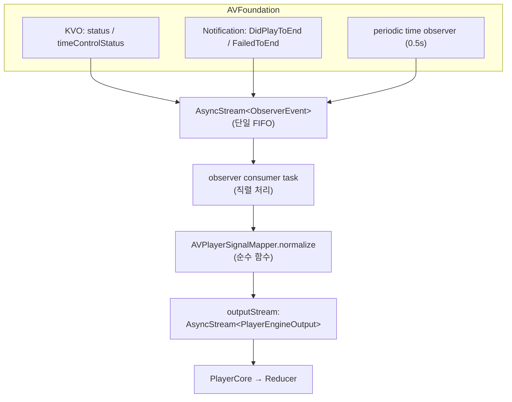

# 5편 — 엔진 계약과 AVPlayerAdapter

> [← 4편: 상태 머신](04-state-machine.md) · [시리즈 목차](README.md) · [다음: Kollus 엔진 →](06-kollus-engine.md)

## 엔진이 지켜야 할 최소 계약

모든 엔진은 actor이고, 이 프로토콜을 구현해야 합니다.

```swift
// Sources/VideoPlayerCore/Contract/PlayerPlaybackEngine.swift (+ EngineRuntimeTraits.swift, EngineAbilities.swift)
public protocol PlayerPlaybackEngine: Actor {
    nonisolated static var runtimeTraits: EngineRuntimeTraits { get }

    // 코어가 reducer 입력을 받는 유일한 통로
    var outputStream: AsyncStream<PlayerEngineOutput> { get }

    /// 단일 명령 싱크. 구현체는 모든 PlaybackCommand case를 exhaustive switch로 명시 처리하고,
    /// 미지원 명령은 PlayerError.unsupportedCommand를 던진다.
    func handle(_ command: PlaybackCommand) async throws

    /// Host/UI 버튼 노출용 기능 지원 신고. exhaustive switch라 새 feature 추가 시
    /// 모든 엔진이 컴파일 에러로 결정을 강제받는다.
    nonisolated func supports(_ feature: PlayerFeature) -> Bool
}
```

엔진 = **"명령이 들어오고(`handle`), 스트림이 나간다(`outputStream`)"**. 새 엔진 작성자가 외울 계약은 이 둘 + `supports` 신고가 전부입니다.

엔진은 상태를 직접 노출하지 않습니다. `outputStream`이 유일한 출력이고, 상태(`PlaybackState`)는
Core가 reducer로 만들어 소유합니다. 엔진 내부 `state`는 어디까지나 SDK 신호 해석용 내부 캐시입니다.

`PlayerEngineOutput`은 두 갈래입니다 — 4편에서 본 그대로, **상태를 움직이는 입력**과 **그냥 알리는 이벤트**:

```swift
public enum PlayerEngineOutput: Sendable {
    case stateInput(PlaybackStateInput)   // → reducer 행
    case event(PlayerEvent)               // → 화면 passthrough 행
}
```

### 부가 기능도 같은 명령 싱크로 — supports 신고와 짝

자막, 배속, 북마크 같은 기능은 엔진마다 지원 여부가 다릅니다. 기능별 명령은 전부 `PlaybackCommand` case이고, 엔진의 `handle` exhaustive switch가 case마다 **구현 또는 `unsupportedCommand` throw**를 명시적으로 결정합니다. 지원 여부는 `supports(_:)`로 신고합니다.

```swift
// 엔진 구현 모양 — handle과 supports가 같은 파일에 인접해 불일치가 리뷰에서 보인다
public func handle(_ command: PlaybackCommand) async throws {
    switch command {                       // default 없음 — 새 case 추가 시 컴파일 에러
    case .setPlaybackRate(let rate): try await setPlaybackRate(rate)
    case .setSubtitleVisible(let on): try await setSubtitleVisible(on)
    case .setDisplayLocked:
        throw PlayerError.unsupportedCommand("… does not support displayLock")
    // …
    }
}

public nonisolated func supports(_ feature: PlayerFeature) -> Bool {
    switch feature {                       // 역시 exhaustive — 기능마다 명시적 결정 강제
    case .playbackRate, .subtitles, …: return true
    case .displayLock, .pictureInPicture: return false
    }
}
```

`PlayerCore`는 정책 검증(`validateAgainstPolicy`) 후 명령을 그대로 `engine.handle(command)`로 통과시키고, `PlayerFeature.available(for: engine)`이 init 시점에 `supports`를 전 case 순회해 화면에 알려줍니다(버튼 노출 게이팅). `supports` 신고와 `handle` 처리의 일치는 `PlayerEngineFeatureCommandSnapshotTests`가 검증합니다.

조회형 데이터(북마크 목록, 스트림 목록, 콘텐츠 메타데이터)는 pull API가 아니라 `outputStream` 이벤트(`bookmarksDidLoad` / `streamInfoListDidLoad` / `contentMetadataDidLoad`)로 push됩니다.

명령 enum으로 표현할 수 없는 예외 2개만 protocol로 남습니다:

```swift
// 핀치 줌 — UIPinchGestureRecognizer가 non-Sendable + 매 이벤트 동기 적용 필요(actor hop 시 추적 끊김)
public protocol EngineSynchronousZoomAbility {
    func applyZoomGesture(_ recognizer: UIPinchGestureRecognizer)
}
// 시킹 스크럽 프리뷰 — time → UIImage? 요청-응답이라 push로 못 바꾼다. 실패는 nil로 통일
public protocol EngineSeekPreviewAbility: Actor {
    func seekPreviewImage(at time: TimeInterval) async -> UIImage?
}
```

화면 부착용 프로토콜은 ShellSupport에 있습니다 (UIKit이 필요해서 Core에 둘 수 없음):

```swift
// Sources/VideoPlayerShellSupport/PlayerRenderBindingEngine.swift
public protocol PlayerEngineAdapter: PlayerPlaybackEngine {
    func bind(renderSurface: PlayerRenderSurface)
    func unbindRenderSurface()
}
```

## AVPlayerAdapter 해부

`Sources/VideoPlayerEngineNative/AVPlayerAdapter.swift` — 가장 단순한 엔진이라 구조 학습에 최적입니다.

```swift
public actor AVPlayerAdapter: PlayerEngineAdapter, EngineSeekPreviewAbility {
    // .avPlayer preset: surface 분리 후에도 재생 유지,
    // stateAuthority는 .commandSuccessClosesState → play/pause는 Core가 command-origin으로 닫음
    public nonisolated static let runtimeTraits: EngineRuntimeTraits = .avPlayer

    public let outputStream: AsyncStream<PlayerEngineOutput>   // Core가 소비하는 유일한 출력

    private let player: AVPlayer
    private var state: PlaybackState
    @MainActor private var playerLayer: AVPlayerLayer?
    // KVO/Notification/주기 observer …
}
```

### 핵심 설계: observer 콜백을 단일 FIFO로 직렬화

AVPlayer의 이벤트는 네 군데서 옵니다 — KVO(`status`, `timeControlStatus`), Notification(재생 종료/실패), periodic time observer. 각자 다른 스레드/시점에 도착하므로 그대로 처리하면 **상태 역전**(예: 일시정지 후에 도착한 옛 시간 업데이트)이 생깁니다.

해법: 모든 콜백을 `AsyncStream<ObserverEvent>`에 yield만 하고, **단일 consumer task가 순서대로** 처리합니다.

```swift
/// KVO/Notification/periodic observer 콜백을 단일 FIFO 스트림으로 직렬 소비한다.
private enum ObserverEvent: Sendable {
    case itemFailed(PlayerError)
    case failedToEnd(PlayerError)
    case timeControl(AVPlayer.TimeControlStatus)
    case didFinish
    case periodicTime(seconds: Double)
}

private func installObservers(for item: AVPlayerItem) {
    statusObservation = item.observe(\.status, options: [.new]) { [observerEventContinuation] item, _ in
        guard item.status == .failed else { return }
        observerEventContinuation.yield(.itemFailed(.engineError(item.error?.localizedDescription ?? "...")))
    }

    timeControlObservation = player.observe(\.timeControlStatus, options: [.new]) { [observerEventContinuation] player, _ in
        observerEventContinuation.yield(.timeControl(player.timeControlStatus))
    }

    endObserver = NotificationCenter.default.addObserver(
        forName: .AVPlayerItemDidPlayToEndTime, object: item, queue: .main
    ) { [observerEventContinuation] _ in
        observerEventContinuation.yield(.didFinish)
    }

    timeObserverToken = player.addPeriodicTimeObserver(
        forInterval: CMTime(seconds: 0.5, preferredTimescale: 600), queue: .main
    ) { [observerEventContinuation] time in
        observerEventContinuation.yield(.periodicTime(seconds: max(0, time.seconds.isFinite ? time.seconds : 0)))
    }
}

private func startObserverConsumerIfNeeded() {
    guard observerConsumerTask == nil else { return }
    observerConsumerTask = Task { [weak self] in
        guard let stream = self?.observerEventStream else { return }
        for await event in stream {                    // ← 여기가 직렬화 지점
            guard let self else { return }
            switch event {
            case .didFinish:
                await self.handleDidFinish()
                await self.emitOutput(.didFinish)
            case .periodicTime(let seconds):
                await self.emitOutput(.periodicTime(seconds: seconds))
            // …
            }
        }
    }
}
```

### Signal Mapper — "어떤 신호가 상태가 되는가"를 한 곳에서

```swift
// Sources/VideoPlayerEngineNative/Signal/AVPlayerSignalMapper.swift
enum AVPlayerSignalMapper {
    static func normalize(_ signal: AVPlayerSignal) -> PlayerEngineOutput? {
        switch signal {
        case .failed(let error):
            return .stateInput(.failed(error))

        case .timeControl(let status):
            switch status {
            case .paused:                         return nil   // pause는 명령 결과 — Core가 닫음
            case .waitingToPlayAtSpecifiedRate:   return .stateInput(.bufferingChanged(true))
            case .playing:                        return .stateInput(.bufferingChanged(false))
            @unknown default:                     return nil
            }

        case .didFinish:
            return .stateInput(.stopped(.finished))

        case .periodicTime(let seconds):
            return .stateInput(.positionChanged(time: seconds, duration: nil))
        }
    }
}
```

이 mapper가 **순수 함수**라는 점이 중요합니다. `Tests/VideoPlayerModuleTests/Native/`에서 SDK 없이 "timeControl이 paused면 nil을 반환한다" 같은 매핑 규칙을 직접 검증합니다. `.paused → nil`인 이유: AVPlayer에는 "사용자 pause"와 "버퍼링으로 멈춤"이 같은 KVO로 오기 때문에, 사용자 명령의 성공은 command-origin([4편](04-state-machine.md))이 책임지고 observer는 버퍼링 판정만 맡습니다.

### prepare / seek 구현 요점

`handle`이 case별로 private 구현 메서드에 위임하는 구조라, 실제 재생 로직은 기존과 같은 모양입니다.

```swift
private func prepare(source: PlaybackSource) async throws {   // handle(.load)가 호출
    guard case .url(let url) = source.kind else {
        throw PlayerError.engineError("AVPlayerAdapter는 url source만 지원합니다.")
    }
    cleanupCurrentItemObservers()
    let item = AVPlayerItem(url: url)
    player.replaceCurrentItem(with: item)
    installObservers(for: item)

    let duration = try await waitUntilReady(item: item)        // status KVO를 await로 변환
    outputContinuation.yield(.stateInput(.prepared(
        PlaybackPreparedSnapshot(position: 0, duration: duration, isLive: false, liveDuration: nil)
    )))
}

private func seek(to time: TimeInterval) async throws {       // handle(.seek)가 호출
    let targetTime = CMTime(seconds: max(0, time), preferredTimescale: 600)
    try await withCheckedThrowingContinuation { continuation in
        player.seek(to: targetTime, toleranceBefore: .zero, toleranceAfter: .zero) { finished in
            // completion 기반 API → async throws로 변환. finished == false면 에러
            …
        }
    }
}
```

패턴 요약: **completion/KVO 기반의 옛 API를 전부 `async throws` + AsyncStream으로 감싼다.** 이것이 모든 엔진 어댑터의 공통 모양입니다.

### 화면 부착 (bind)

```swift
public func bind(renderSurface: PlayerRenderSurface) {
    let previousSurface = self.renderSurface
    self.renderSurface = renderSurface

    Task { @MainActor [weak self] in
        guard let self else { return }
        previousSurface?.engineDidDetach()
        self.attachPlayerLayer(to: renderSurface, displayScaleMode: displayScaleMode)
        renderSurface.engineDidAttach()
    }
}

@MainActor
private func attachPlayerLayer(to renderSurface: PlayerRenderSurface, displayScaleMode: PlayerDisplayScaleMode) {
    let layer = playerLayer ?? AVPlayerLayer(player: player)
    playerLayer = layer
    layer.videoGravity = Self.videoGravity(mode: displayScaleMode)
    layer.frame = renderSurface.containerView.bounds
    renderSurface.containerView.layer.addSublayer(layer)
}
```

actor 내부 상태는 actor에서, UIKit 작업은 `Task { @MainActor }`로 — 이 분리도 모든 엔진 공통 패턴입니다.

## 전체 데이터 흐름 한 장



새 엔진을 만들거나 Kollus 쪽을 읽을 때 이 그림을 기억하세요 — **Kollus도 정확히 같은 모양**이고, 입력이 KVO 대신 26개의 SDK delegate 콜백일 뿐입니다.

---

> [← 4편: 상태 머신](04-state-machine.md) · [시리즈 목차](README.md) · [다음: Kollus 엔진 →](06-kollus-engine.md)
