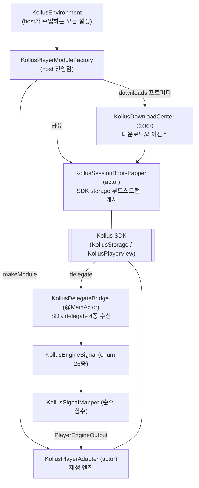
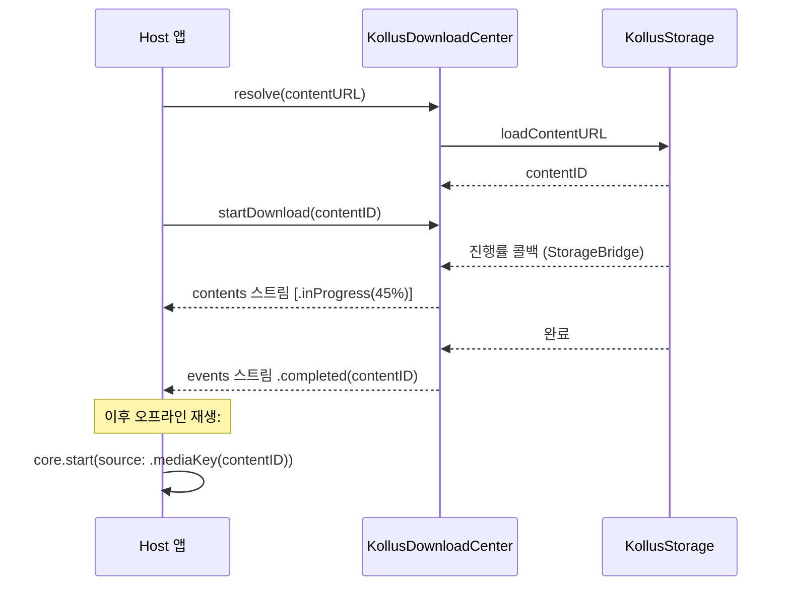

# 6편 — Kollus 엔진: SDK·DRM·다운로드를 가두는 법

> [← 5편: 엔진 계약](05-engine-contract.md) · [시리즈 목차](README.md) · [다음: ShellSupport →](07-shell-support.md)

`Sources/VideoPlayerEngineKollus/`는 이 패키지에서 가장 큰 모듈입니다. 하지만 구조는 5편의 AVPlayerAdapter와 **같은 모양**입니다. 다른 점은 SDK가 훨씬 수다스럽고(delegate 콜백 26종), 인증/DRM/다운로드라는 부가 시스템이 붙는다는 것뿐입니다.

## 등장인물 한 장 정리



핵심 약속: **같은 factory에서 만든 모듈들은 하나의 bootstrapper와 하나의 download center를 공유**합니다. SDK 인증(storage 시작)은 비싸고 한 번이면 충분하기 때문입니다.

## 1. KollusEnvironment — 설정의 단일 진입점

host가 알아야 할 모든 값(앱 키, 만료일, 저장 경로, DRM URL, 진단 hook)을 한 구조체로 받습니다.

```swift
// Sources/VideoPlayerEngineKollus/KollusEnvironment.swift
public struct KollusEnvironment: Sendable {
    // 필수
    public let applicationKey: String
    public let applicationBundleID: String
    public let applicationExpireDate: Date

    // 저장소/네트워크 (선택)
    public let keychainGroup: String?
    public let storagePath: URL?
    public let cacheSizeMB: Int?
    public let backgroundDownload: Bool
    public let networkTimeoutSeconds: Int?
    public let networkRetry: Int?

    // 플레이어 뷰 옵션
    public let aiPlaybackRateEnabled: Bool
    public let hardwareDecoderPreferred: Bool
    public let customSkinJSON: String?
    public let pauseOnForeground: Bool
    public let audioBackgroundPlayPolicy: Bool

    // DRM / hook
    public let drm: KollusDRMConfiguration       // fpsCertificateURL, fpsDRMURL, extraParameters
    public let observer: KollusObserver?         // DRM/LMS 이벤트를 host로
    public let diagnostics: KollusDiagnosticsSink?  // 모든 신호 로깅 sink

    public func validate(now: Date = Date()) throws {
        guard !applicationKey.isEmpty else { throw KollusEnvironmentError.missingApplicationKey }
        guard !applicationBundleID.isEmpty else { throw KollusEnvironmentError.missingBundleID }
        guard applicationExpireDate > now else {
            throw KollusEnvironmentError.expiredApplicationKey(expireDate: applicationExpireDate, now: now)
        }
        // cacheSizeMB ≥ 1, storagePath는 실재하는 디렉터리 … 등
    }
}
```

`validate()`를 **부트스트랩 전에** 호출해서, 잘못된 설정이 SDK 깊숙한 곳에서 알 수 없는 에러로 터지는 대신 명확한 에러로 일찍 실패하게 합니다.

## 2. KollusSessionBootstrapper — 비싼 초기화를 한 번만

SDK의 `KollusStorage.startStorage()`(인증 포함)는 비싸므로, actor가 캐시하고 동시 호출을 coalesce합니다.

```swift
// Sources/VideoPlayerEngineKollus/KollusSessionBootstrapper.swift
public actor KollusSessionBootstrapper {
    private var cachedStorage: KollusStorageProtocol?
    private var inFlightTask: Task<KollusStorageProtocol, Error>?

    func resolveStorage() async throws -> KollusStorageProtocol {
        if let cached = cachedStorage { return cached }          // ① 캐시 히트
        if let task = inFlightTask { return try await task.value } // ② 진행 중인 부트스트랩에 합류

        let task = Task { try await Self.bootstrap(environment: environment, storageFactory: storageFactory) }
        inFlightTask = task                                       // ③ 새로 시작
        // … 성공 시 cachedStorage에 저장
    }

    /// 캐시 폐기 → 다음 resolveStorage()가 재부트스트랩(재인증)
    public func invalidate() { … }

    @MainActor
    private static func bootstrap(…) async throws -> KollusStorageProtocol {
        try environment.validate()
        let storage = storageFactory()
        storage.applicationKey = environment.applicationKey
        storage.applicationBundleID = environment.applicationBundleID
        storage.applicationExpireDate = environment.applicationExpireDate
        try storage.startStorage()                                // ← SDK 인증 지점
        // 네트워크 타임아웃, 캐시 크기, 백그라운드 다운로드 설정 적용 …
        return storage
    }
}
```

`①캐시 → ②합류 → ③시작` 3단계 패턴은 "동시에 여러 화면이 모듈을 만들 때 인증이 두 번 나가는" 문제를 막습니다.

## 3. KollusPlayerAdapter — 26개 delegate를 한 줄로 세우기

prepare 시 SDK의 `KollusPlayerView`를 만들고 4종 delegate(Player/DRM/LMS/Bookmark)를 `KollusDelegateBridge` 하나에 연결합니다. bridge는 raw 콜백을 enum(`KollusEngineSignal`)으로 바꿔 **단일 스트림에 yield**하고, 어댑터의 단일 consumer가 직렬 처리합니다 — 5편의 FIFO 패턴 그대로입니다.

```swift
// KollusPlayerAdapter.prepare 내부 (요약)
try await MainActor.run {
    // 이전 playerView 정리
    if let previous = self.playerView { try? previous.stop(); previous.removeFromSuperview() }

    guard let playerView = Self.makePlayerView(for: source) else {
        throw PlayerError.engineError("KollusPlayerView 초기화에 실패했습니다.")
    }

    // bridge 생성 + 4종 delegate 부착
    let bridge = KollusDelegateBridge(
        onSignal: { signal in bridgeEventContinuation.yield(.signal(signal)) },
        onBookmarks: { bookmarks in bridgeEventContinuation.yield(.bookmarks(bookmarks)) },
        observer: observer, diagnostics: diagnostics
    )
    playerView.delegate = bridge
    playerView.drmDelegate = bridge
    playerView.lmsDelegate = bridge
    playerView.bookmarkDelegate = bridge

    // 환경값 주입: storage, DRM URL, 디코더, 커스텀 스킨 …
    playerView.storage = storageAdapter.storage
    if let cert = environment.drm.fpsCertificateURL { playerView.fpsCertURL = cert.absoluteString }
    if let drmURL = environment.drm.fpsDRMURL { playerView.fpsDrmURL = drmURL.absoluteString }
    playerView.setDecoder(environment.hardwareDecoderPreferred)
}
```

오프라인 콘텐츠라면 prepare가 SDK 호출 **전에** 라이선스를 검사합니다 (3편의 `validateOfflinePlayability`):

```swift
if case .mediaKey(let contentID) = source.kind {
    let downloaded = await storageProto.contentSnapshots.first { $0.id == contentID }?.toDownloadedContent()
    if let downloaded, case .completed = downloaded.download,
       let licenseError = downloaded.validateOfflinePlayability() {
        throw licenseError   // 만료된 라이선스 → SDK 가기 전에 명확한 에러
    }
}
```

### KollusSignalMapper — 신호 분류 규칙

26종 신호는 세 부류로 나뉩니다. mapper(순수 함수)가 그 분류의 단일 진실입니다.

```swift
// Sources/VideoPlayerEngineKollus/Signal/KollusSignalMapper.swift (발췌)
case .playStarted(_, let error):
    if let error { return .stateInput(.failed(mapError(error, "play"))) }
    return .stateInput(.playStarted)                       // ① 상태를 움직이는 신호

case .positionChanged(let time, let isSeeking):
    guard !isSeeking else { return nil }                   //    seek 중 위치는 버림 (chase가 처리)
    return .stateInput(.positionChanged(time: time, duration: nil))

case .captionUpdated(_, let caption):
    return .event(.captionDidUpdate(text: caption, isSecondary: false))  // ② passthrough 이벤트

case .scrollChanged, .zoomChanged, …:
    return nil                                             // ③ 상태도 이벤트도 아님
    // .thumbnailReady는 mapper에서 drop되지만 어댑터가 시킹 프리뷰 스프라이트
    // 캐시 무효화 + 재디코드 트리거로 소비한다.
```

SDK가 구분해주지 않는 두 가지를 mapper/어댑터가 보완합니다:

- `stopStarted(userInteraction: false)`는 **재생 완료와 시스템 강제 종료가 같은 신호**로 옵니다. mapper의 `stopReason`이 재생 위치로 구분합니다 — 끝 0.5초 이내면 `.finished`, 중간이면 `.appLifecycle`(didFinish 미발행).
- 시스템 pause 직후 buffering이 해소돼도 **SDK는 재생을 스스로 복원하지 않습니다**. 어댑터가 system-pause 플래그를 추적해 buffering 해제 시 `play()`를 재호출합니다.
- `pause`는 메인 스레드에서 영상 파이프라인 재셋업(`setupVideoPlaybackForURL`, 수백 ms)을 동반할 수 있습니다. 스크럽 시작처럼 **터치 추적과 겹치는 시점에 pause를 호출하면 UI 전체가 멈춥니다** (실기기 Time Profiler 확인). Example은 드래그 중 재생을 유지하고 `seekEnded`에서만 seek하는 방식으로 회피합니다.

### Playback/ 하위의 보조 장치 4개

Kollus SDK의 빈틈을 메우는 장치들입니다. 전부 "SDK가 안 해주는 것"이 존재 이유입니다.

| 파일 | SDK의 빈틈 | 해법 |
| --- | --- | --- |
| `KollusPositionPoller` | delegate가 seek 때만 위치를 알려줌 | 0.5초 주기 폴링으로 재생바 갱신. playStarted에 시작, pause/stop에 중지 |
| `KollusBookmarkStore` | add/remove가 로컬 목록에 즉시 반영 안 됨 | 낙관적 캐시 — 사용자 동작을 누적했다가 다음 SDK reload에 수렴 |
| `KollusNextEpisodeEmitter` | 다음화 버튼 노출 시점 계산 | readyToPlay에 메타 캐시, positionChanged hot path에선 산술 연산만 |
| `KollusSeekPreviewSource` | 시킹 프리뷰 썸네일이 전 프레임 스프라이트 시트 1장 | 파일명(`WxHxN`) 파싱 → 타일 crop. **전용 actor**에서 비트맵 강제 디코드(lazy decode가 메인을 막는 것 방지), prepare-ready/`.thumbnailReady`에 워밍업. 스프라이트는 DRM 없는 평문 이미지라 첫 로드 성공 시 파일 보호(`.complete`) + 백업 제외를 적용 |

`KollusBackgroundAudioKeeper`는 백그라운드 진입 시 player를 layer에서 분리해 오디오를 유지하고 복귀 시 재부착합니다 (`UIBackgroundModes=audio` 필요).

## 4. KollusDownloadCenter — 다운로드와 라이선스

`PlayerDownloadCenter` 계약([3편](03-domain-types.md))의 Kollus 구현입니다. SDK storage delegate를 `KollusStorageBridge`가 받아 두 AsyncStream으로 바꿉니다.

```swift
// Sources/VideoPlayerEngineKollus/Downloads/KollusDownloadCenter.swift
public actor KollusDownloadCenter: PlayerDownloadCenter {
    public nonisolated let contents: AsyncStream<[DownloadedContent]>  // .bufferingNewest(8) — 최신 스냅샷이면 충분
    public nonisolated let events: AsyncStream<DownloadEvent>          // .unbounded — 완료/실패는 델타라 유실 금지

    public func resolve(contentURL: String) async throws -> String     // URL → contentID
    public func startDownload(contentID: String) async throws
    public func cancelDownload(contentID: String) async throws
    public func remove(contentID: String) async throws
    public func renewLicenses(scope: LicenseRenewalScope) async throws  // .all / .expiredOnly
    public func storageMetrics() async throws -> StorageMetrics
}
```

버퍼링 정책 차이에 주목하세요. `contents`는 "최신 목록"만 의미 있으니 newest 8, `events`는 "완료됐다/실패했다"는 사실 자체가 중요하니 unbounded입니다.

두 가지 의미 규칙도 함께 기억하세요:

- `renewLicenses(scope:)`는 SDK `updateDownloadDRMInfo(bAll)`로 그대로 내려갑니다 — `.all`=전체 갱신, `.expiredOnly`=만료분만.
- `check(contentURL:)`는 조회 실패 전체를 미다운로드(nil)로 해석합니다. SDK가 미등록 URL을 에러로 알리면서 코드 상수를 공개하지 않아, 에러 코드로 "미등록"만 골라낼 방법이 없기 때문입니다.

다운로드 → 오프라인 재생의 전체 사이클:



## 5. 에러 분류 — codeTable + context 2단계

SDK의 NSError는 코드가 불완전합니다. 그래서 2단계로 분류합니다.

```swift
// Sources/VideoPlayerEngineKollus/Errors/KollusErrorClassifier.swift
public func classify(_ error: NSError, context: PlayerErrorContext) -> PlayerError? {
    // Foundation/AVFoundation 도메인은 Core 기본 분류기 담당
    guard error.domain != NSURLErrorDomain, error.domain != "AVFoundationErrorDomain" else { return nil }

    // 1단계: 실기기 QA로 확정한 코드 테이블
    if let kind = codeTable[error.code] { return playerError(for: kind, message: error.localizedDescription) }

    // 2단계: 코드를 모를 때 — "무엇을 하다가 실패했는가"(context)로 폴백
    switch context {
    case .bootstrap:       return .authenticationFailed(message)     // 인증 단계 실패
    case .licenseRenewal:  return .licenseRenewalRequired(message)   // 갱신 재시도 가능
    case .resolve, .download, .removal, .playback:
        return nil   // 저장소풀/중복/미존재가 코드 없이 섞이는 지점 — 미분류가 차라리 안전
    }
}
```

새 에러 코드를 실기기에서 확인하면 `codeTable`에 추가하는 것이 유지보수 루틴입니다.

## 6. 관측 창구: Observer와 Diagnostics

- `KollusObserver` — DRM 요청/응답, LMS 전송 완료 등 **host가 비즈니스적으로 반응**해야 할 콜백
- `KollusDiagnosticsSink` — 23종 `KollusEngineSignal` 전부를 받는 **로깅/디버깅용** sink

Example 앱의 Observer 로그 화면이 이 둘을 ring buffer에 합쳐 보여줍니다. 실기기에서 Kollus 문제를 디버깅할 때 가장 먼저 열어볼 화면입니다. → [10편](10-example-tests-recipes.md)

## 실기기 검증 주의

Kollus 실제 재생/DRM/다운로드는 **시뮬레이터로 닫기 어렵습니다** (SDK가 시뮬레이터 미지원). 이 모듈을 변경하면 실기기 검증 결과를 PR에 별도로 남기는 것이 저장소 규칙입니다. 시뮬레이터에서는 `UnsupportedEnvironmentEngine`([7편](07-shell-support.md))이 대신 들어갑니다.

---

> [← 5편: 엔진 계약](05-engine-contract.md) · [시리즈 목차](README.md) · [다음: ShellSupport →](07-shell-support.md)
