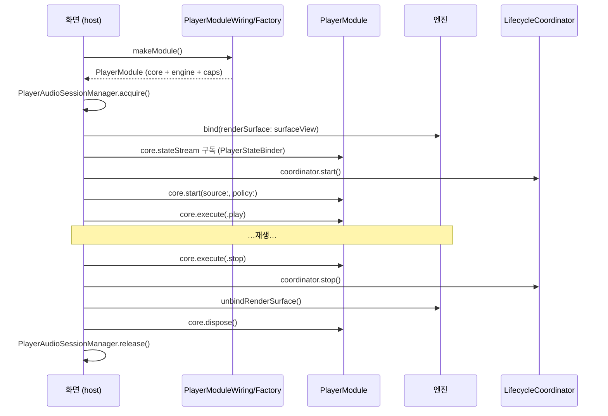

# 7편 — ShellSupport: 조립, 화면 부착, 생명주기

> [← 6편: Kollus 엔진](06-kollus-engine.md) · [시리즈 목차](README.md) · [다음: Skin →](08-skin.md)

`Sources/VideoPlayerShellSupport/`는 "앱 화면과 PlayerCore 사이의 접착제"입니다. 파일 수는 적지만 host 입장에서 가장 자주 만지는 모듈입니다.

## 1. PlayerModuleWiring — 조립의 표준 경로

4편 끝에서 본 `PlayerCore` 수동 조립을 한 번에 해 주는 팩토리입니다.

```swift
// Sources/VideoPlayerShellSupport/PlayerModuleWiring.swift
public struct PlayerModule {
    public let core: PlayerCore
    public let engine: PlayerEngineAdapter
    public let engineCapabilities: EngineCapabilities

    /// 엔진 가용 기능 — host/Skin이 init 직후 버튼 노출을 사전 결정한다.
    public var availableFeatures: PlayerFeatureAvailability { core.availableFeatures }
}

public static func makeModule(
    engine: PlayerEngineAdapter,
    engineCapabilities: EngineCapabilities,
    configuration: PlayerModuleConfiguration = .default   // initialPolicy + autoActivateCore
) async -> PlayerModule {
    let core = PlayerCore(engine: engine, engineCapabilities: engineCapabilities,
                          initialPolicy: configuration.initialPolicy)
    if configuration.autoActivateCore {
        await core.activate()      // 엔진 출력 스트림 구독 시작
    }
    return PlayerModule(core: core, engine: engine, engineCapabilities: engineCapabilities)
}
```

`PlayerModule`은 "조립 완료된 플레이어 한 세트"입니다. host는 이것 하나만 들고 다니면 됩니다.

- 일반 URL: `PlayerModuleWiring.makeModule(engine: AVPlayerAdapter(), engineCapabilities: AVPlayerAdapter.capabilities)`
- Kollus: `KollusPlayerModuleFactory(environment:).makeModule()` — 내부에서 같은 wiring을 호출 ([6편](06-kollus-engine.md))

## 2. PlayerRenderSurface — "영상을 여기에 그려줘"

엔진이 비디오 계층을 부착할 자리를 추상화한 프로토콜입니다.

```swift
// Sources/VideoPlayerShellSupport/PlayerRenderSurface.swift
public protocol PlayerRenderSurface: AnyObject {
    var containerView: UIView { get }

    func engineDidAttach()      // 기본 구현 제공 (no-op)
    func engineDidDetach()

    /// 시뮬레이터 등에서 엔진이 재생을 제공할 수 없을 때 "미지원" 안내를 표시하도록 요청.
    func showUnsupportedEnvironment(message: String)
}
```

host(또는 Skin의 `PlayerRenderSurfaceView`)가 이 프로토콜을 구현한 view를 만들고, 엔진에 넘깁니다.

```swift
try await module.engine.bind(renderSurface: myRenderSurfaceView)
// 화면 닫을 때:
await module.engine.unbindRenderSurface()
```

엔진별 부착 방식 — AVPlayer는 `AVPlayerLayer`를 sublayer로, Kollus는 SDK의 `KollusPlayerView`를 subview로 붙입니다. 어느 쪽이든 호출 순서는 같습니다: 이전 surface `engineDidDetach()` → 새 surface 부착 → `engineDidAttach()`.

## 3. UnsupportedEnvironmentEngine — 시뮬레이터의 친구

Kollus SDK는 시뮬레이터에서 동작하지 않습니다. 그렇다고 시뮬레이터에서 화면 개발을 못 하면 곤란하니, **계약은 다 지키지만 실제 재생은 안 하는** 대체 엔진을 둡니다.

```swift
// 시뮬레이터 분기 예시 (Example 앱의 실제 패턴)
#if targetEnvironment(simulator)
return await PlayerModuleWiring.makeModule(
    engine: UnsupportedEnvironmentEngine(message: "Kollus 재생은 실기기에서만 지원됩니다."),
    engineCapabilities: []
)
#else
return await kollusFactory.makeModule()
#endif
```

bind 시점에 `renderSurface.showUnsupportedEnvironment(message:)`를 호출해 화면에 안내 문구를 띄웁니다. 시뮬레이터에서도 화면 레이아웃/Skin/제스처 개발이 가능해지는 장치입니다.

## 4. PlayerStateBinder — 스트림 구독을 안전하게

`stateStream`/`eventStream` 구독 Task의 생성·취소를 관리하는 `@MainActor` 헬퍼입니다. ViewController가 직접 Task를 들고 있다가 deinit에서 까먹고 취소 안 하는 사고를 막습니다.

```swift
let binder = PlayerStateBinder(core: module.core)
binder.bind(
    onState: { [weak self] state in self?.render(state) },
    onEvent: { [weak self] event in self?.handle(event) }
)
// 화면 종료 시
binder.unbind()
```

## 5. PlayerLifecycleCoordinator — 백그라운드와 전화의 처리

앱 생명주기/오디오 인터럽션을 감시해 필요하면 pause 명령을 내리는 조정자입니다. **정책과 capability를 둘 다 보고 판단**하는 것이 핵심입니다.

```swift
// Sources/VideoPlayerShellSupport/PlayerLifecycleCoordinator.swift
private func handleDidEnterBackground() {
    guard policy.allowsBackgroundPlayback else {
        pauseForLifecycleTransition()     // 정책이 금지 → 그냥 pause
        return
    }
    guard engineCapabilities.contains(.continuesWithoutSurface) else {
        onEvent?(.policyDowngraded(reason: .missingContinuesWithoutSurface))
        pauseForLifecycleTransition()     // 정책은 허용했지만 엔진이 불가 → 알리고 pause
        return
    }
    // 둘 다 OK → 아무것도 안 함 (재생 지속)
}

private func handleAudioInterruption(_ notification: Notification) {
    // AVAudioSession.interruptionNotification — 전화/알람
    switch type {
    case .began: pauseForLifecycleTransition()
    case .ended: break    // 자동 재개는 하지 않음 — host 정책의 영역
    }
}
```

사용:

```swift
let coordinator = PlayerLifecycleCoordinator(
    core: module.core,
    policy: .default,
    engineCapabilities: module.engineCapabilities
)
coordinator.start()   // 화면 등장 시
coordinator.stop()    // 화면 퇴장 시
```

## 6. PlayerAudioSessionManager — 오디오 세션은 참조 카운트로

`AVAudioSession`은 앱 전역 자원입니다. 화면 A가 닫히면서 세션을 꺼버리면 화면 B의 재생이 죽습니다. 그래서 reference counting으로 보호합니다.

```swift
// Sources/VideoPlayerShellSupport/PlayerAudioSessionManager.swift
@MainActor
public final class PlayerAudioSessionManager {
    public static let shared = PlayerAudioSessionManager()
    private var retainCount = 0

    public func acquire(category: AVAudioSession.Category = .playback,
                        mode: AVAudioSession.Mode = .moviePlayback,
                        options: AVAudioSession.CategoryOptions = []) throws {
        guard retainCount == 0 else { retainCount += 1; return }  // 이미 활성 → 카운트만
        try session.setCategory(category, mode: mode, options: options)
        try session.setActive(true, options: [])
        retainCount = 1
    }

    public func release(options: AVAudioSession.SetActiveOptions = [.notifyOthersOnDeactivation]) throws {
        guard retainCount > 0 else { return }
        retainCount -= 1
        guard retainCount == 0 else { return }                    // 마지막 release만 실제 비활성화
        try session.setActive(false, options: options)
    }
}
```

## 화면 하나의 생애주기 종합

host 화면(ViewController)이 이 모듈의 부품들을 어떤 순서로 쓰는지 한 장으로:



이 순서 전체를 실제 코드로 보고 싶다면 Example 앱의 `PlayerViewController`가 정확히 이 패턴입니다. → [9편](09-full-flow.md), [10편](10-example-tests-recipes.md)

---

> [← 6편: Kollus 엔진](06-kollus-engine.md) · [시리즈 목차](README.md) · [다음: Skin →](08-skin.md)
