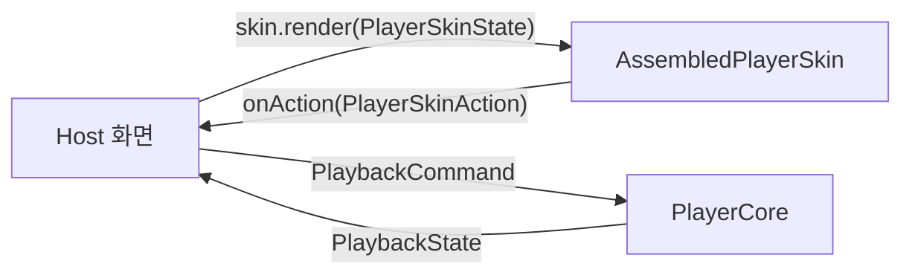

# 8편 — Skin: 플레이어 UI 조립 시스템

> [← 7편: ShellSupport](07-shell-support.md) · [시리즈 목차](README.md) · [다음: 전체 플로우 →](09-full-flow.md)

`Sources/VideoPlayerSkin/`은 재사용 가능한 플레이어 UI입니다. Rx/ReactorKit/SnapKit 의존이 **없고**, 엔진도 모릅니다. host와는 두 타입으로만 통신합니다.

- **들어가는 것**: `PlayerSkinState` — "지금 이렇게 생겨야 해" (host → skin, `render()` 호출)
- **나오는 것**: `PlayerSkinAction` — "사용자가 이걸 눌렀어" (skin → host, `onAction` 클로저)



즉 Skin은 **단방향 데이터 흐름**입니다. Skin 내부에 재생 상태가 없습니다. host가 `PlaybackState`를 `PlayerSkinState`로 번역해 매번 통째로 render합니다.

## 조립 모델: Blueprint → Slot → Block

화면 구성은 레고와 같습니다.

| 개념 | 역할 | 파일 |
| --- | --- | --- |
| `PlayerSkinSlot` | 화면의 고정 영역 9곳 (topLeading, centerControls, bottomBar…) | `Assembly/PlayerSkinSlot.swift` |
| `PlayerSkinBlock` | 슬롯에 끼우는 UI 조각 (재생 버튼, 진행바…) | `Assembly/PlayerSkinBlock.swift` |
| `PlayerSkinBlueprint` | "어느 슬롯에 어떤 블록을, 어떤 모드에서 보여줄지" 선언 | `Assembly/PlayerSkinBlueprint.swift` |
| `AssembledPlayerSkin` | Blueprint를 소비해 실제 뷰 계층을 조립한 결과물 | `Assembly/AssembledPlayerSkin.swift` |

슬롯 배치를 그림으로:

```text
┌─────────────────────────────────────────────┐
│ topLeading      topCenter       topTrailing │  ← 닫기 / 제목 / 잠금·더보기
│                                             │
│ leftRail      centerControls      rightRail │  ← 구간반복 / 재생·스킵 / (옵션)
│                          floatingCenterTrailing │  ← 배속 패널
│                                             │
│ sectionRepeatRange                          │
│ bottomBar                 floatingBottomTrailing │  ← 진행바 / 플로팅 버튼
└─────────────────────────────────────────────┘
```

기본 Blueprint는 이렇게 선언되어 있습니다.

```swift
// Sources/VideoPlayerSkin/Assembly/PlayerSkinBlueprint.swift
static var `default`: PlayerSkinBlueprint {
    PlayerSkinBlueprint(
        blocks: [
            .topLeading:      [{ CloseButtonBlock() }],
            .topCenter:       [{ TitleBlock() }],
            .topTrailing:     [{ TopMenuExtraControlsBlock() }, { DisplayScaleBlock() },
                               { LockButtonBlock() }, { MoreButtonBlock() }],
            .centerControls:  [{ CenterPlaybackControlsBlock() }],
            .leftRail:        [{ SectionRepeatBlock() }, { ExtraControlsRailBlock() }, { SettingButtonBlock() }],
            .bottomBar:       [{ ProgressBarBlock() }],
            .sectionRepeatRange:     [{ SectionRepeatRangeBlock() }],
            .floatingCenterTrailing: [{ RateControlBlock() }],
            .floatingBottomTrailing: [{ ExtraFloatingBlock() }]
        ],
        visibleSlots: [
            .verticalSplit:   [.topLeading, .topTrailing, .centerControls, .bottomBar /* … */],
            .horizontalSplit: [/* … */],
            .fullScreen:      Set(PlayerSkinSlot.allCases)   // 풀스크린은 전부 노출
        ]
    )
}
```

host는 기본 Blueprint를 변형해서 씁니다 — 블록을 빼거나 끼우거나:

```swift
// Example 앱의 실제 커스터마이즈
extension PlayerSkinBlueprint {
    @MainActor static var example: PlayerSkinBlueprint {
        var blueprint = PlayerSkinBlueprint.default
        blueprint.blocks[.topCenter, default: []].append { LiveBadgeBlock() }   // 라이브 배지 추가
        return blueprint
    }
}

let skin = AssembledPlayerSkin(blueprint: .example)
```

## 통신 타입 둘

```swift
// Sources/VideoPlayerSkin/PlayerSkinAction.swift — skin → host
public enum PlayerSkinAction: Equatable {
    case closeRequested
    case togglePlayPause
    case seekBegan                          // 스크러버 터치 시작
    case seekPreviewChanged(TimeInterval)   // 드래그 중
    case seekEnded(TimeInterval)            // 릴리스
    case skipBackward, skipForward
    case rateSelected(Double)
    case rateStepUp, rateStepDown
    case ratePanelRequested
    case toggleDisplayScaling, toggleScreenMode
    case holdToggleRequested                // 화면 잠금
    case sectionRepeatToggleRequested
    case extraControlTapped(String)         // host가 정의한 추가 버튼
    // …
}

// Sources/VideoPlayerSkin/PlayerSkinState.swift — host → skin
public struct PlayerSkinState: Equatable {
    public var isPlaying: Bool
    public var isLoading: Bool
    public var currentTime: TimeInterval
    public var duration: TimeInterval
    public var progress: Float              // 0~1
    public var playbackRate: Double
    public var controlsVisible: Bool        // 컨트롤 표시/자동숨김
    public var isFullScreenMode: Bool
    public var displayScaleMode: PlayerDisplayScaleMode
    public var isLocked: Bool               // 화면 잠금
    public var sectionRepeat: SectionRepeatState
    public var layoutMode: PlayerSkinLayoutMode  // verticalSplit / horizontalSplit / fullScreen
    // …
}
```

## Block 하나 해부: ProgressBarBlock

Block 구현 패턴의 표준 예시입니다. 모든 Block이 이 모양입니다: **UIView + `PlayerSkinBlock` 프로토콜, `render`로 상태 반영, `onAction`으로 입력 발행.**

```swift
// Sources/VideoPlayerSkin/Blocks/ProgressBarBlock.swift
public final class ProgressBarBlock: UIView, PlayerSkinBlock {
    public var view: UIView { self }
    public var onAction: ((PlayerSkinAction) -> Void)?

    private let slider = PlayerPlaybackSlider()
    private var isSeeking = false
    // 드래그 중 seek를 너무 자주 보내면 메인스레드 디코드와 thumb 애니메이션이 경쟁
    // → preview는 throttle, 최종 위치는 touchUp에서 보장
    private var lastPreviewEmit: CFTimeInterval = 0
    private static let previewThrottleInterval: CFTimeInterval = 0.12

    // ① 상태 반영 — host가 매 상태 변화마다 호출
    public func render(_ state: PlayerSkinState, theme: PlayerSkinTheme) {
        slider.minimumTrackTintColor = theme.color(.progressFill)
        if !isSeeking {                                  // 드래그 중엔 외부 갱신이 thumb을 끌고가지 않게
            slider.value = state.progress
            currentTimeLabel.text = PlayerSkinState.formatTime(state.currentTime)
        }
        durationLabel.text = PlayerSkinState.formatTime(state.duration)
        slider.isEnabled = !state.isLocked               // 잠금이면 조작 차단
    }

    // ② 사용자 입력 → 액션 발행
    @objc private func seekBegan() {
        isSeeking = true
        onAction?(.seekBegan)
    }

    @objc private func seekChanged() {
        let time = PlayerSkinState.previewTime(for: slider.value, duration: latestDuration)
        let now = CACurrentMediaTime()
        guard now - lastPreviewEmit >= Self.previewThrottleInterval else { return }  // 0.12초 throttle
        lastPreviewEmit = now
        onAction?(.seekPreviewChanged(time))
    }

    @objc private func seekEnded() {
        isSeeking = false
        onAction?(.seekEnded(time))                      // 최종 위치는 throttle 무시하고 정확히
    }
}
```

새 Block을 만들 때 체크리스트:

1. `UIView` 상속 + `PlayerSkinBlock` 채택 (`view`, `onAction`, `render(_:theme:)`)
2. `render`에서 상태/테마만 읽어 그린다 — Block이 자체 상태를 누적하지 않는다 (스크럽 중 `isSeeking` 같은 일시적 입력 상태만 예외)
3. `state.isLocked`를 존중한다
4. 색/폰트/아이콘은 직접 하드코딩하지 말고 `theme.color(.role)` / `theme.icon(.name)` 사용
5. Blueprint에 끼운다

## Theme — 색/폰트/아이콘의 role 시스템

`Theme/` 디렉터리의 `PlayerSkinColorRole`, `PlayerSkinFontRole`, `PlayerSkinIcon`이 시맨틱 role을 정의하고, host가 `PlayerSkinTheme`으로 실제 값을 주입합니다. Block은 role만 알고 실제 색은 모릅니다. 아이콘 에셋은 `Resources/PlayerSkin.xcassets`에 들어 있습니다.

## 오버레이: 자막, 제스처 HUD, 로딩

슬롯 시스템 밖에 전역 오버레이가 몇 개 있습니다.

- `PlayerCaptionView` — 자막 표시. `skin.setCaptionFontSize(_:)`, `setCaptionBottomInset(_:)`
- `PlayerGestureHUDView` — 더블탭/롱프레스 제스처 피드백. `skin.showGestureHUD(icon:title:)` (2초 자동 숨김)
- `PlayerLoadingIndicatorView` — `state.isLoading` 기반 로딩 표시
- `PlayerSeekPreviewView`/`PlayerSeekPreviewPresenter` — 시킹 스크럽 프리뷰 모달. skin이 `.seekBegan`/`.seekPreviewChanged`/`.seekEnded` 액션을 가로채 자체 구동하고, 썸네일은 host가 `skin.seekPreviewImageProvider`(async closure)로 주입한다(Skin은 엔진을 모름). 모달 위치는 `ProgressBarBlock.onScrubTick`(매 틱)으로 추적하고 이미지 요청은 throttle + in-flight 1건 coalescing. 스크럽 중에는 skin이 블록 전체 렌더를 보류했다가(`seekBegan`~`seekEnded`) 끝나는 순간 한 번에 따라잡는다 — 시간 갱신 상태가 매 이벤트 달라 블록 렌더(아이콘 재조회)가 터치 추적과 경합하기 때문. 공급자가 있으면 placeholder로 시작해 크기 점프를 막고, 첫 응답이 nil이면 라벨-only로 축소. on/off는 `PlayerFeaturePolicy.allowsSeekPreview`를 host가 `setSeekPreviewEnabled(_:)`로 1회 반영
- `PlayerScreenCaptureMonitor`/`PlayerScreenCaptureShieldView` — 화면 녹화/미러링 대응. 모니터가 `UIScreen.capturedDidChangeNotification`을 구독해 상태 전이 시에만 알리고, host가 `skin.setScreenCaptureProtectionEnabled(true)`를 켜면 캡처 중 최상단 차단막으로 화면을 가리고 시킹 프리뷰 모달을 닫는다. `skin.onScreenCaptureChanged`는 차단막 사용 여부와 무관하게 발행 — 일시정지 등 재생 정책은 host가 결정. AirPlay 화면 미러링도 캡처로 판정되는 점 주의
- `PlayerSecureDisplayContainerView` — 스크린샷 보호. iOS는 스크린샷 사전 차단 API가 없어 `UITextField.isSecureTextEntry`의 secure 캔버스를 컨테이너로 쓴다 — `embed(_:)`한 뷰는 스크린샷/녹화/미러링 결과물에서 제외된다. host가 영상 영역(렌더 서피스)만 embed하고 skin은 밖에 둬 캡처 결과물에 컨트롤은 남긴다. 문서화되지 않은 뷰 구조 의존이라 추출 실패 시 일반 컨테이너로 강등되고 `isSecureRenderingActive == false`로 감지 가능

잠금화면/제어센터 NowPlaying은 Skin이 아니라 ShellSupport의 `PlayerNowPlayingCoordinator`가 담당합니다 ([7편](07-shell-support.md)).

## host 쪽 와이어링 (요약)

```swift
let skin = AssembledPlayerSkin(blueprint: .default)
view.addSubview(skin)   // renderSurfaceView 위에 전체 화면으로

// 1회 설정
skin.configure(title: "강의 제목", maxPlaybackRate: policy.maxPlaybackRate)

// 액션 라우팅: PlayerSkinAction → PlaybackCommand
skin.onAction = { [weak self] action in
    switch action {
    case .togglePlayPause:       self?.interactor.togglePlayPause()
    case .seekBegan:             self?.interactor.send(.pause)       // 스크럽 동안 일시정지
    case .seekEnded(let time):   self?.interactor.send(.seek(to: time)); self?.interactor.send(.play)
    case .rateSelected(let r):   self?.interactor.send(.setPlaybackRate(r))
    case .closeRequested:        self?.dismiss(animated: true)
    // …
    default: break
    }
}

// 상태 반영: PlaybackState → PlayerSkinState → render
func render(_ playbackState: PlaybackState) {
    let skinState = PlayerSkinState(playbackState: playbackState, playbackRate: currentRate,
                                    controlsVisible: controlsVisible, /* … */)
    skin.render(skinState)
}
```

전체 와이어링의 실제 코드는 Example 앱 `PlayerViewController`에 있습니다. → [9편](09-full-flow.md)

---

> [← 7편: ShellSupport](07-shell-support.md) · [시리즈 목차](README.md) · [다음: 전체 플로우 →](09-full-flow.md)
