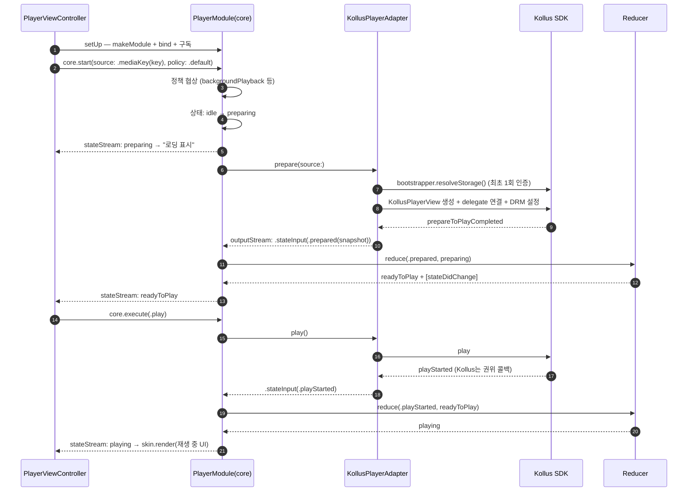
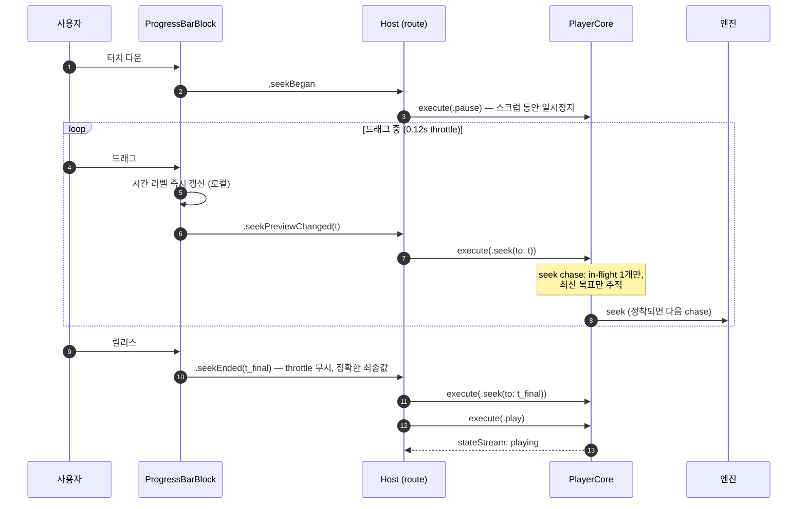
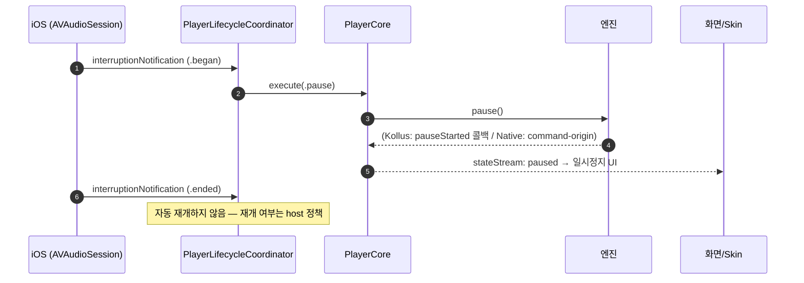
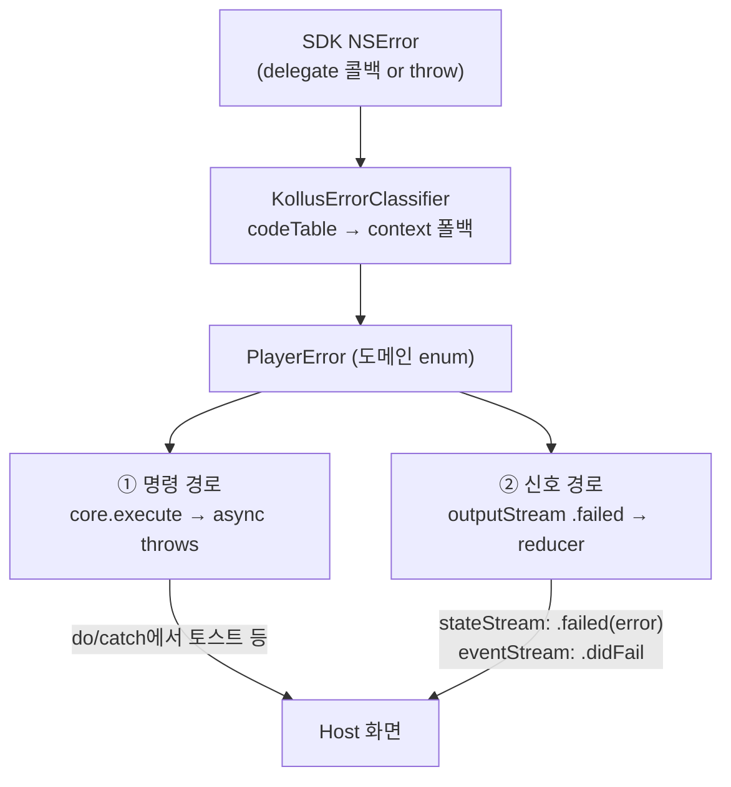

# 9편 — 전체 플로우 따라가기

> [← 8편: Skin](08-skin.md) · [시리즈 목차](README.md) · [다음: Example·테스트·레시피 →](10-example-tests-recipes.md)

지금까지 부품을 하나씩 봤으니, 이번엔 실제 시나리오 3개를 처음부터 끝까지 따라갑니다. 코드는 Example 앱(`Example/Sources/Player/PlayerViewController.swift`)의 실제 패턴입니다.

## 시나리오 1: 화면 열기 → 재생 시작

### 코드 (host 화면의 viewDidLoad 패턴)

```swift
@MainActor
final class PlayerViewController: UIViewController {
    private let renderSurfaceView = PlayerRenderSurfaceView()      // 영상이 그려질 자리
    private let skin = AssembledPlayerSkin(blueprint: .example)    // 플레이어 UI

    override func viewDidLoad() {
        super.viewDidLoad()
        configureHierarchy()        // 아래→위: renderSurfaceView → skin (토스트는 window에 별도 표시)
        skin.onAction = { [weak self] action in self?.route(action) }
        skin.configure(title: "VideoPlayer Example", allowedPlaybackRates: policy.allowedPlaybackRates)

        Task { @MainActor [weak self] in
            guard let self else { return }
            do {
                try await self.interactor.setUp(renderSurface: self.renderSurfaceView)
                //  └ 내부: module 생성 → engine.bind(renderSurface:) → stateStream 구독
                self.applyFeatureGating(self.interactor.availableFeatures)
                //  └ 엔진이 지원 안 하는 기능의 버튼은 아예 숨김
                try await self.interactor.start()
                //  └ core.start(source:, policy:) → 자동재생 정책에 따라 play
            } catch {
                self.presentErrorAndClose(error)
            }
        }
    }
}
```

### 내부에서 일어나는 일



포인트:

- 6단계에서 prepare가 실패하면(잘못된 키, 만료 라이선스) `PlayerError`가 throw되고, 화면은 catch 한 곳에서 에러를 처리합니다.
- Kollus의 인증(`resolveStorage`)은 bootstrapper가 캐시하므로 두 번째 화면부터는 즉시 통과합니다.

## 시나리오 2: 진행바 드래그(스크럽)

사용자가 진행바를 잡고 끌다 놓는 동작. 부품 4개가 협력합니다 — ProgressBarBlock(throttle) → host(액션 라우팅) → PlayerCore(seek chase) → 엔진.



두 단계의 보호 장치가 겹쳐 있다는 점이 중요합니다.

- **Block 레벨**: 0.12초 throttle — 메인스레드에서 seek 요청 폭주 방지
- **Core 레벨**: seek chase — 그래도 겹친 요청은 "최신 목표 1개"로 수렴 ([4편](04-state-machine.md))

## 시나리오 3: 재생 중 전화가 옴 (오디오 인터럽션)



백그라운드 전환도 같은 coordinator가 처리하되, `policy.allowsBackgroundPlayback`과 `engineRuntimeTraits.continuesWithoutSurface`를 모두 만족할 때만 재생을 유지합니다. ([7편](07-shell-support.md))

## 에러는 어디서 잡히나 — 한 장 정리

에러가 발생할 수 있는 지점과 전파 경로입니다. 디버깅할 때 "어느 층에서 난 에러인가"부터 찾으세요.



- **① 명령 경로**: 사용자가 시킨 일이 실패 — `try await core.execute(.play)`의 catch에서 받음. "지금 그 동작이 안 됐다"는 토스트가 어울립니다.
- **② 신호 경로**: 재생 중 비동기로 터진 문제(네트워크 끊김 등) — `stateStream`이 `.failed(error)` 상태로 전이. 화면 전체를 에러 뷰로 바꾸는 쪽이 어울립니다.

같은 `PlayerError`라도 두 경로 중 어디로 왔는지에 따라 UI 대응이 달라진다는 것을 기억하세요.

---

> [← 8편: Skin](08-skin.md) · [시리즈 목차](README.md) · [다음: Example·테스트·레시피 →](10-example-tests-recipes.md)
