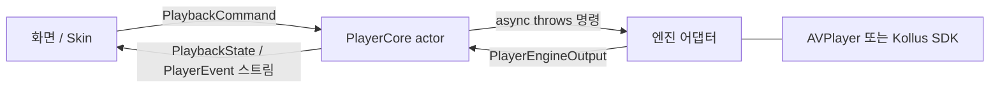

# VideoPlayerModule 인수인계 시리즈

> 작성: JunyoungJung, 2026-06-10
>
> 이 시리즈는 `videoplayer-ios-ms` 패키지를 처음 맡는 개발자를 위한 인수인계 문서입니다.
> "코드를 처음 열었을 때 떠오르는 질문" 순서대로 구성했으므로, 1편부터 차례로 읽는 것을 권장합니다.

## 읽는 순서

| 편 | 문서 | 답하는 질문 |
| --- | --- | --- |
| 1 | [01-overview.md](01-overview.md) | 이 패키지는 무엇이고 왜 이렇게 생겼나? |
| 2 | [02-folder-structure.md](02-folder-structure.md) | 폴더가 왜 5개 모듈로 나뉘어 있나? 어디에 뭐가 있나? |
| 3 | [03-domain-types.md](03-domain-types.md) | `PlaybackSource`, `PlaybackCommand`, `PlaybackState`… 핵심 타입은 뭔가? |
| 4 | [04-state-machine.md](04-state-machine.md) | 상태는 누가 어떻게 바꾸나? (`PlayerCore` + `PlaybackStateReducer`) |
| 5 | [05-engine-contract.md](05-engine-contract.md) | "엔진"이란 무엇이고 `AVPlayerAdapter`는 어떻게 동작하나? |
| 6 | [06-kollus-engine.md](06-kollus-engine.md) | Kollus SDK·DRM·다운로드는 어떻게 감싸져 있나? |
| 7 | [07-shell-support.md](07-shell-support.md) | 모듈 조립, 화면 부착, 생명주기/오디오는 누가 하나? |
| 8 | [08-skin.md](08-skin.md) | 플레이어 UI(Skin)는 어떻게 조립하나? |
| 9 | [09-full-flow.md](09-full-flow.md) | 버튼 탭부터 화면 갱신까지 한 번에 따라가 보기 |
| 10 | [10-example-tests-recipes.md](10-example-tests-recipes.md) | Example 앱, 테스트, 자주 하는 작업 레시피 |

## 30초 요약

- 화면은 **의도**(`PlaybackCommand`)만 말하고, 엔진은 **방법**(SDK 호출)만 안다.
- 상태의 주인은 `PlayerCore`(actor) 하나다. 엔진은 신호만 올려 보내고, 순수 함수 `PlaybackStateReducer`가 다음 상태를 계산한다.
- 엔진은 교체 가능하다: 일반 URL/HLS는 `AVPlayerAdapter`, Kollus DRM/다운로드는 `KollusPlayerAdapter`.
- 벤더 SDK(Kollus/PallyCon)는 `VideoPlayerEngineKollus` 모듈 밖으로 절대 새어 나가지 않는다.

## 이 문서가 다루지 않는 것

- 모듈 **사용법**(설치/조립/quickstart)은 저장소 루트의 [README.md](../../README.md)가 담당합니다.
- Kollus SDK packaging 절차는 [docs/kollus-sdk-packaging.md](../kollus-sdk-packaging.md)를 보세요.
- Kollus SDK 자체의 API 레퍼런스는 [docs/kollus-ios-sdk-reference.md](../kollus-ios-sdk-reference.md)에 있습니다.
