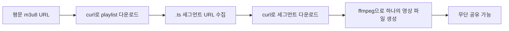
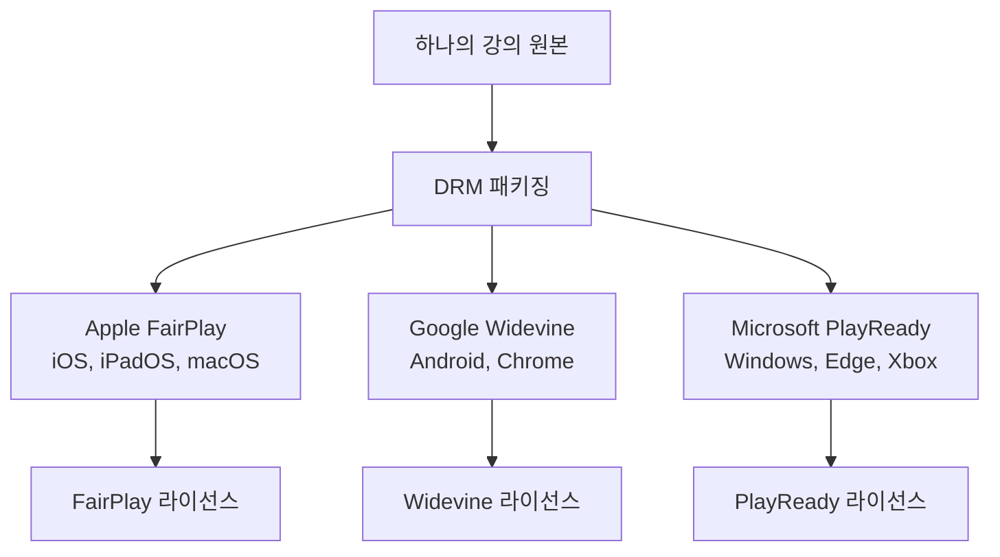
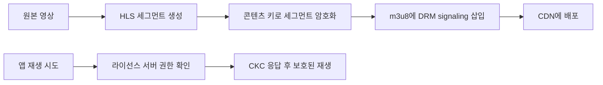
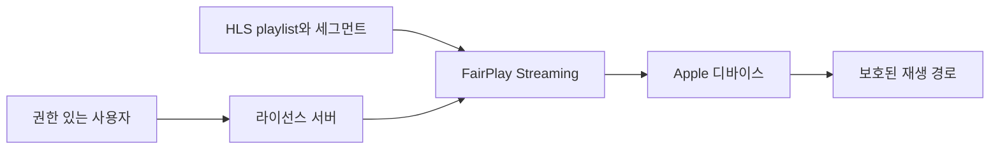
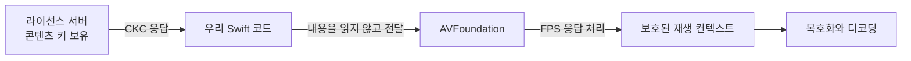
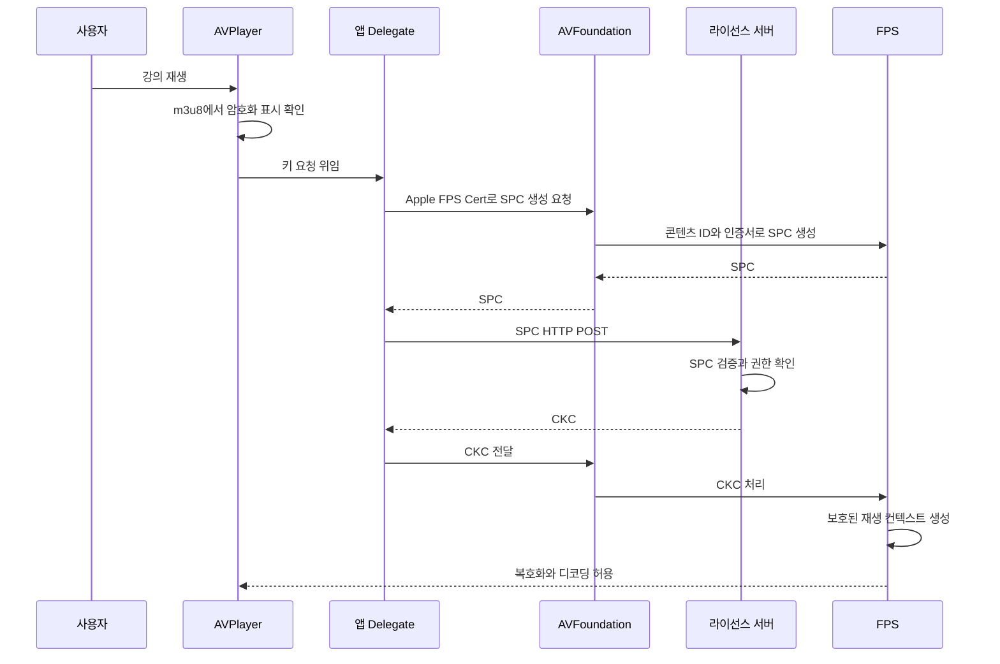
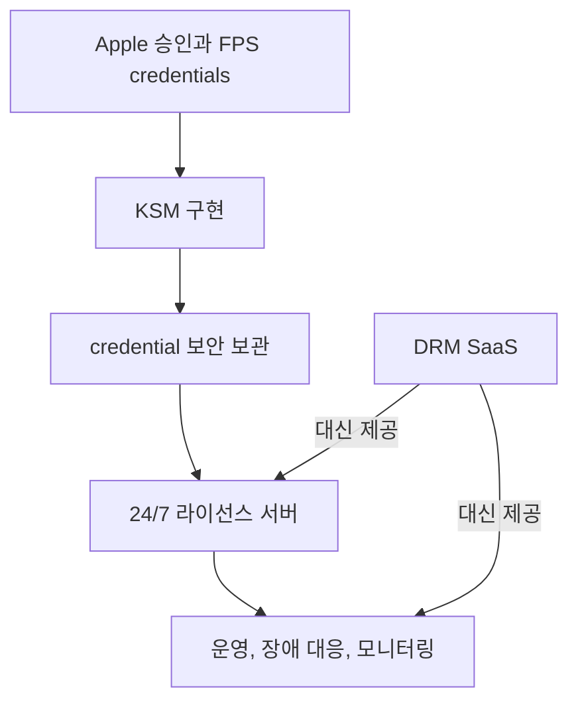
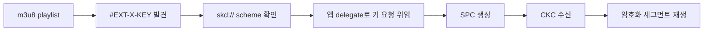

# [1편] DRM과 FairPlay Streaming부터 이해하기

> 시리즈: 교육 서비스 iOS 비디오 플레이어 모듈화 이야기 (1/5)
> Author: 정준영
> Date: 2026-05-15


---

## 들어가며

iOS 앱에서 영상을 재생하는 코드는 처음 보면 정말 짧다. `AVPlayer`에 URL 하나 던지면 끝이다. 그래서 강의 앱을 처음 맡은 주니어가 보통 이렇게 생각한다.

> "재생은 별거 없네, 이제 UI만 잘 만들면 되겠다."

그런데 며칠 안 가서 기획자가 이런 요청을 들고 온다. "강의 재생 중에 화면 녹화가 되면 안 됩니다." "외부 디스플레이로 미러링하면 영상이 빠져나가요." "다운로드한 강의는 수강 기간이 지나면 못 보게 해주세요." "탈옥한 기기에서는 재생을 막아주세요."

이 요구들은 모두 콘텐츠 보호라는 같은 문제로 이어진다. 그 중심에 **DRM(Digital Rights Management)** 이 있고, Apple 디바이스에서 HLS 영상을 보호할 때 쓰는 기술이 **FairPlay Streaming**, 줄여서 **FPS** 다. 화면 녹화 대응, 외부 출력 제한, 탈옥 탐지 같은 정책은 앱과 SDK와 OS 기능이 함께 맡지만, 암호화된 강의를 권한 있는 사용자에게만 재생시키는 핵심 축은 결국 DRM이다.

이 시리즈는 다섯 편으로 구성된다. 1편인 이 글은 가장 밑바닥, **DRM과 FPS가 도대체 무엇인가**를 다룬다. 주니어가 읽으면 다음 편 코드가 자연스럽게 이해되고, 시니어가 읽으면 후배에게 "왜 이렇게 짰는지" 설명할 때 쓸 정확한 어휘를 가져갈 수 있도록 썼다.

<details>
<summary>먼저 알고 읽으면 좋은 용어</summary>

- **DRM**: 유료 콘텐츠를 볼 권리가 있는 사용자에게만 재생을 허용하는 기술과 운영 체계다. 단순 암호화가 아니라 결제, 수강 기간, 기기 보안까지 함께 본다.
- **FairPlay Streaming(FPS)**: Apple 디바이스에서 HLS 영상을 보호할 때 쓰는 Apple의 DRM 기술이다.
- **HLS**: 영상을 작은 조각으로 나누고, m3u8 playlist를 보면서 필요한 조각을 순서대로 받아 재생하는 스트리밍 방식이다.
- **콘텐츠 키**: 암호화된 영상 조각을 재생 직전에 풀기 위해 필요한 비밀값이다. FPS에서는 앱 코드가 이 키를 직접 볼 수 없다.

</details>

---

## 1. 왜 DRM이 필요한가 — 영상 한 편을 잃지 않으려고

이 이야기는 "내가 만든 영상을 누가 훔쳐 갈 수 있는가"라는 질문에서 시작한다.

강의 한 편을 만드는 비용을 생각해 보자. 강사 출연료가 들고, 촬영팀이 붙고, 편집이 들어가고, 운영 인프라가 받친다. 한 편당 수백만 원에서 수천만 원이 그냥 녹는다. 회사는 그걸 월 구독료를 받아 회수한다.

그런데 만약 영상의 URL이 평문이라면 어떻게 될까. `curl`로 m3u8 playlist를 받고, 그 안에 적힌 `.ts` 또는 fMP4 세그먼트를 차례대로 받고, `ffmpeg`으로 이어 붙이면 끝이다. 노트북 한 대와 인터넷만 있으면 30분 안에 강의 한 편이 토렌트에 올라간다. 한 분기 매출 그래프를 통째로 깎아 먹는 시나리오가 너무 쉽게 그려진다.

<details>
<summary>용어 토글: curl, ffmpeg, m3u8, .ts가 무슨 뜻인가</summary>

- **curl**: 터미널에서 URL로 파일이나 응답을 내려받는 도구다. 브라우저 없이도 `https://.../playlist.m3u8` 같은 주소의 내용을 받을 수 있다.
- **ffmpeg**: 영상과 오디오 파일을 변환, 합치기, 자르기 할 때 많이 쓰는 커맨드라인 도구다. 여러 영상 조각을 하나의 파일로 이어 붙일 수 있다.
- **m3u8 playlist**: 영상 조각 목록이 적힌 텍스트 파일이다. 플레이어는 이 목록을 보고 다음에 받을 조각을 결정한다.
- **`.ts` 조각**: HLS에서 실제 영상 데이터가 들어 있는 작은 세그먼트 파일이다. 요즘은 fMP4 세그먼트도 함께 쓰지만, 초보자가 HLS를 이해할 때는 `.ts` 조각을 떠올리면 쉽다.
- **평문**: 암호화되지 않아 사람이 읽거나 도구로 바로 처리할 수 있는 상태를 뜻한다.

</details>



이걸 막는 방법은 결국 하나밖에 없다. **영상 자체를 암호화해서 전달하고, 재생 직전에만 키를 받아 풀어 버리는 것.** 그 키를 절대로 사용자에게 보여 주지 않는 것. 그게 DRM의 본질이다.

이렇게 말하면 또 주니어가 묻는다. "HTTPS면 충분하지 않나요?" 좋은 질문이다. HTTPS는 분명히 네트워크 구간을 암호화한다. 하지만 그건 서버에서 디바이스로 오는 그 짧은 여정만 보호한다. 영상이 디바이스에 도착하는 순간, 그 안에서는 다시 평문이다. 누군가 디스크 캐시를 뒤지거나, 화면을 그대로 녹화하면 콘텐츠가 그대로 빠져나간다.

그래서 DRM은 **디바이스 안에서도** 영상이 평문 형태로 노출되지 않도록 한다. 디코딩과 디스플레이 파이프라인을 OS가 손에 쥔 채로 처리해 버리는 것이다. 이 일을 앱 레이어에서는 절대 할 수 없다. OS, 미디어 프레임워크, 기기 보안 기능의 협조가 필요하다. 그래서 DRM은 항상 플랫폼 벤더(Apple, Google, Microsoft)의 기술이지, 우리가 손으로 짤 수 있는 게 아니다.

---

## 2. 세상에는 세 개의 DRM이 있다

DRM 표준은 사실상 세 개로 정리된다. Apple의 **FairPlay**, Google의 **Widevine**, Microsoft의 **PlayReady**.

세 표준은 놀랍게도 큰 그림이 같다. 콘텐츠는 대칭키로 암호화하고, 라이선스 서버가 권한을 확인한 뒤, 클라이언트의 보호된 재생 경로에만 키를 전달한다. 하지만 키 교환 프로토콜, 라이선스 포맷, 클라이언트 API가 서로 다르다. 그래서 같은 원본 영상을 여러 플랫폼에 서비스하려면 FairPlay, Widevine, PlayReady 각각에 맞는 패키징 신호와 라이선스 서버 처리가 필요하다. 구성에 따라 미디어 세그먼트를 재사용할 수도 있지만, DRM별 키 전달 정보와 라이선스 흐름은 따로 준비해야 한다. 이걸 **멀티 DRM**이라고 부른다. Netflix, Disney+, 그리고 우리 회사 같은 OTT/강의 서비스는 다 멀티 DRM을 운영한다.

<details>
<summary>용어 토글: AES-128, 비대칭 키 교환, 멀티 DRM</summary>

- **AES-128**: 영상을 암호화할 때 쓰는 대칭키 암호화 방식이다. 같은 키로 잠그고 같은 키로 푼다. 여기서 `128`은 키 길이가 128비트라는 뜻이다.
- **대칭키**: 잠글 때와 풀 때 같은 키를 쓰는 방식이다. 빠르기 때문에 영상처럼 데이터가 큰 콘텐츠 암호화에 적합하다.
- **비대칭키**: 공개키와 개인키가 한 쌍인 방식이다. 공개키로 잠근 데이터는 개인키로만 풀 수 있다. 속도는 느리지만 키를 안전하게 주고받을 때 유리하다.
- **비대칭 키 교환**: 빠른 콘텐츠 키 자체를 네트워크에 그대로 흘리지 않기 위해, 공개키/개인키 같은 암호 기술을 섞어 안전하게 전달하는 절차다.
- **멀티 DRM**: iOS, Android, Windows 같은 여러 플랫폼에 맞춰 FairPlay, Widevine, PlayReady를 함께 운영하는 방식이다.

</details>



여기서 **DRM 패키징**이라는 말이 처음 나온다. 이 단어를 그냥 "영상에 DRM을 건다" 정도로 넘기면 뒤 흐름이 헷갈린다. 패키징은 앱에서 재생 버튼을 눌렀을 때 일어나는 일이 아니라, 콘텐츠를 배포하기 전에 서버 쪽 파이프라인에서 미리 끝내 두는 작업이다.

패키저는 원본 영상을 HLS 세그먼트로 나누고, 각 세그먼트의 미디어 샘플을 콘텐츠 키로 암호화한다. 그리고 m3u8 playlist 안에 "이 콘텐츠는 암호화되어 있고, 키 요청은 이 식별자로 시작하라"는 신호를 적는다. FairPlay라면 뒤에서 볼 `#EXT-X-KEY`, `METHOD=SAMPLE-AES`, `KEYFORMAT="com.apple.streamingkeydelivery"`, `skd://...` 같은 값이 그 신호다.

중요한 건 패키징과 라이선스 발급이 서로 다른 단계라는 점이다. **패키징**은 영상을 암호화하고 playlist에 키 요청 힌트를 심는 일이다. **라이선스 서버**는 사용자가 실제로 재생을 시도할 때 SPC를 받고, 권한을 확인한 뒤 CKC를 돌려주는 일이다. 패키징이 미리 도로 표지판을 세워 두는 일이라면, 라이선스 서버는 사용자가 그 길로 들어올 자격이 있는지 검문하는 일에 가깝다.

<details>
<summary>용어 토글: DRM 패키징이 하는 일</summary>

- **패키저(packager)**: 원본 영상을 HLS나 DASH 같은 스트리밍 포맷으로 나누고, 암호화와 DRM 신호 삽입을 수행하는 서버 쪽 도구다.
- **콘텐츠 키(content key)**: 세그먼트를 암호화할 때 쓰는 대칭키다. 패키징 시점에는 암호화에 쓰이고, 재생 시점에는 라이선스 서버 응답을 통해 보호된 재생 경로로 전달된다.
- **키 식별자(key ID)**: 라이선스 서버가 "어떤 콘텐츠 키를 찾아야 하는지" 알 수 있게 해 주는 ID다. 실제 playlist에는 `skd://...` URI나 DRM별 signaling 안에 이 정보가 연결된다.
- **DRM signaling**: 플레이어가 어떤 DRM 방식으로 키 요청을 해야 하는지 알려 주는 playlist나 manifest 안의 메타데이터다.
- **라이선스 발급**: 사용자가 재생을 시작한 뒤, 권한 확인을 통과했을 때 CKC 같은 키 응답을 돌려주는 서버 작업이다.

</details>



iOS 앱을 만든다는 건 자동으로 한 가지가 결정된다. Apple이 제공하는 보호 재생 경로에서 HLS 콘텐츠를 DRM으로 재생하려면 **FairPlay Streaming**을 중심으로 설계해야 한다. 그래서 이 시리즈가 FPS 이야기로 흘러가는 것이다.

---

## 3. FairPlay Streaming은 결국 무엇인가

한 줄로 정의하면 이렇다.

> **HLS로 전달되는 영상 콘텐츠를, Apple 디바이스에서만, 권한이 있는 사용자에게만 재생되도록 만드는 Apple의 공식 DRM 기술.**



여기서 "HLS로 전달된다"는 말부터 풀어 보자. HLS는 **HTTP Live Streaming**의 약자로, 영상을 MP4 한 덩어리로 받는 게 아니라 m3u8이라는 텍스트 playlist와 그 안에 적힌 작은 `.ts` 또는 fMP4 세그먼트를 순서대로 받아 재생하는 방식이다. Apple이 만든 표준이고, iOS 영상 전송의 사실상 기본값이다. FPS는 이 HLS 위에 얹혀서 동작한다. 즉 FPS는 독립된 프로토콜이라기보다 HLS와 AVFoundation의 키 전달 흐름에 붙는 Apple의 DRM 체계라고 보는 편이 정확하다.

<details>
<summary>용어 토글: HLS, m3u8, 보호된 재생 경로</summary>

- **HLS(HTTP Live Streaming)**: 긴 영상을 작은 조각으로 나눠 HTTP로 전달하는 스트리밍 방식이다. 네트워크 상태에 맞춰 화질을 바꾸기도 쉽다.
- **m3u8**: HLS playlist 파일 확장자다. 어떤 영상 조각을 어떤 순서로 받을지, 어떤 키 전달 방식이 필요한지 같은 정보가 들어 있다.
- **보호된 재생 경로**: 콘텐츠 키, 복호화, 디코딩, 출력 보호를 앱 코드가 직접 만지지 못하도록 OS와 미디어 프레임워크가 관리하는 재생 경로다.

</details>

"Apple 디바이스에서만"이라는 부분은 단순히 앱 코드의 `if`문으로 막는다는 뜻이 아니다. FPS 키 전달과 복호화는 AVFoundation과 Apple 플랫폼의 보호된 미디어 재생 경로 안에서 처리된다. 앱은 콘텐츠 키를 문자열이나 변수로 들고 있지 않고, 라이선스 서버에서 받은 응답을 시스템 프레임워크에 넘길 뿐이다. 그래서 앱 레이어에서 메모리를 뒤져도 평문 콘텐츠 키를 직접 꺼내는 구조가 아니다.

실무에서도 이 차이가 바로 보인다. FairPlay 보호 콘텐츠는 보통 실기기 기준으로 검증해야 하고, 시뮬레이터에서는 vendor SDK나 보호 재생 기능이 그대로 동작하지 않는 경우가 많다. 우리 플레이어 모듈이 `VideoPlayerEngineKollus`를 별도 SPM product로 분리해 놓은 이유 중 하나가 바로 이 점이다. 시뮬레이터에서 빌드/테스트할 때 DRM 의존성을 통째로 빼 버릴 수 있어야 개발 사이클이 빨라진다. 이 이야기는 5편에서 다시 한다.

"권한이 있는 사용자에게만"이라는 부분은 라이선스 서버의 몫이다. 디바이스가 키를 달라고 요청하면, 서버는 "이 사용자가 이 콘텐츠를 풀어볼 권리가 있는가?"를 검사한 뒤에야 키를 발급한다. 만료된 강의, 결제 안 된 강의, 환불 처리된 강의는 여기서 끊어 버린다. **DRM은 단순히 암호화 기술이 아니라, 결국 권한 관리 시스템이다.** 이름이 Digital "Rights" Management인 진짜 이유다.

---

## 4. 콘텐츠 키는 누구에게도 보여 주지 않는다

FPS 모델에서 가장 인상 깊은 부분은, **앱 개발자조차 콘텐츠 키를 볼 수 없다**는 것이다.

처음 듣는 사람은 이게 의외라고 느낀다. 보통 우리가 "키를 받아서 처리한다"고 하면 그 키를 변수에 담아 디코더에 넘기는 그림을 상상한다. 그런데 FPS에서는 다르다. 라이선스 서버가 보내는 응답은 **CKC(Content Key Context)** 라는 보호된 바이트 데이터이고, 우리 Swift 코드는 그걸 받아 그대로 AVFoundation에 넘긴다. AVFoundation과 FPS가 그 응답을 처리해 재생 컨텍스트를 만들기 때문에, 앱 코드는 콘텐츠 키의 평문 값을 직접 읽지 않는다.

<details>
<summary>용어 토글: 공개키, 개인키, 보호된 응답</summary>

- **공개키**: 다른 사람에게 알려줘도 되는 키다. 이 키로 데이터를 잠글 수는 있지만, 풀 수는 없다.
- **개인키**: 절대 밖으로 나가면 안 되는 키다. 공개키로 잠긴 데이터를 푸는 데 사용한다.
- **보호된 응답**: 앱 코드가 의미를 해석하는 데이터가 아니라, AVFoundation/FPS에 그대로 전달해야 하는 바이트 덩어리라고 보면 된다.
- **AVFoundation**: iOS에서 오디오와 비디오 재생, 편집, 캡처를 담당하는 Apple 프레임워크다. FPS 통합도 이 프레임워크 위에서 이뤄진다.

</details>



이 모델 덕분에 앱이 콘텐츠 키를 잘못 로그로 찍거나, 변수에 오래 들고 있다가 유출시키는 시나리오를 크게 줄일 수 있다. 디버거를 붙여도 우리가 볼 수 있는 것은 SPC와 CKC 같은 프로토콜 메시지이지, 실제 콘텐츠 키의 평문 값이 아니다. 우리 회사 입장에서는 "앱 코드가 키 관리 로직을 잘못 짜서 키가 새는" 위험을 시스템 프레임워크와 DRM 서버 쪽으로 넘길 수 있다.

대신 비용이 있다. 우리는 콘텐츠 키를 **만들 수도 없고**, **풀 수도 없다**. 그저 키를 만드는 라이선스 서버와 키를 소비하는 AVFoundation/FPS 사이에서 안전하게 메신저 역할만 할 수 있다. 이 한 줄이 시리즈 후반부의 모든 의사결정을 설명한다. 우리가 직접 라이선스 서버를 운영할 수 있는가? 운영해도 되는가? 다른 더 좋은 방법은 없는가? 이 질문들에 답하면서 PallyCon이라는 회사가 왜 등장하는지가 자연스럽게 드러난다.

---

## 5. FPS의 심장 — SPC와 CKC

이제 FPS의 실제 동작을 보자. 단 두 개의 약자만 기억하면 된다. **SPC**와 **CKC**.

**SPC**는 **Server Playback Context**의 약자다. 디바이스가 만드는 "키 요청서"라고 생각하면 된다. 그냥 평범한 요청이 아니다. 앱이 넘긴 콘텐츠 식별자와 Apple FPS Certificate를 바탕으로 만들어지는 보호된 요청이고, 라이선스 서버는 이 안에서 세션 키, anti-replay 정보, 익명화된 디바이스 식별값 같은 재생 컨텍스트를 확인한다.

**CKC**는 **Content Key Context**의 약자다. 라이선스 서버가 만드는 "키 응답서"다. 서버는 SPC를 검증하고, 콘텐츠 키와 초기화 벡터(IV)를 FPS 규격에 맞게 감싸 CKC로 돌려준다. 이 응답은 해당 재생 요청의 컨텍스트와 anti-replay 정보에 묶여 있으므로, 다른 디바이스나 다른 요청에 그대로 복사해도 의미가 없다.

<details>
<summary>용어 토글: SPC, CKC, anti-replay, HTTP POST</summary>

- **SPC(Server Playback Context)**: 디바이스가 라이선스 서버에 보내는 키 요청 데이터다. "이 콘텐츠를 이 기기에서 재생하려고 하니 키를 주세요"에 해당한다.
- **CKC(Content Key Context)**: 라이선스 서버가 디바이스에 돌려주는 키 응답 데이터다. 실제 콘텐츠 키와 IV가 FPS 규격에 맞게 보호되어 들어 있다.
- **anti-replay 정보**: 예전 요청이나 응답을 그대로 복사해 다시 쓰는 재전송 공격을 막기 위한 검증 정보다.
- **HTTP POST**: 클라이언트가 서버에 데이터를 담아 요청할 때 쓰는 HTTP 메서드다. SPC처럼 바이트 데이터를 서버로 보낼 때 사용한다.

</details>

흐름을 글로 따라가 보자. 사용자가 강의 재생 버튼을 누른다. AVPlayer가 m3u8을 받아 보더니, 그 안에서 "이 콘텐츠는 암호화되어 있다"는 표시를 발견한다. AVPlayer는 우리가 미리 등록해 둔 delegate(`AVAssetResourceLoaderDelegate` 또는 `AVContentKeySession`)에게 신호를 보낸다. "키 요청을 만들어 줘."

신호를 받은 우리 코드는 Apple FPS Certificate를 들고 SPC를 만들어 달라고 AVFoundation에 부탁한다. AVFoundation/FPS는 콘텐츠 식별자와 애플리케이션 인증서를 사용해 SPC를 만든다. 이 SPC를 우리가 라이선스 서버에 HTTP POST로 보낸다. 서버는 SPC를 검증하고, 사용자 권한을 확인한 뒤, CKC를 만들어 돌려준다. 우리는 그 CKC를 받아 다시 AVFoundation에 건네준다. AVFoundation/FPS는 CKC를 처리해 보호된 재생 컨텍스트를 만들고, 그 컨텍스트 안에서 영상이 복호화되고 디코딩되며, 사용자 화면에 강의가 흐른다.



이 전체 과정에서 우리 앱은 SPC와 CKC라는 두 개의 보호된 바이트 뭉치를 주고받았을 뿐이다. 우리는 그 안에 무엇이 들어 있는지 알 수도 없고, 알 필요도 없다.

---

## 6. 라이선스 서버는 아무나 운영할 수 없다

여기서 시니어가 주목할 디테일이 하나 있다.

라이선스 서버가 SPC를 받아 검증하고 CKC를 만들려면 Apple이 승인한 **FairPlay Streaming credentials**와 Key Server Module(KSM) 구현이 필요하다. Apple은 운영 환경에 필요한 자격 증명을 아무에게나 주지 않는다.

Apple에 신청서를 제출하고, 사업자임을 증명하고, 콘텐츠 보호 수준을 약속하고, 심사를 거쳐야 받는다. 받은 다음에도 민감한 FPS credential을 안전하게 보관하고, 24시간 SPC 검증과 CKC 발급 서비스를 운영해야 한다. 트래픽 한 번 몰리면 라이선스 발급이 늦어져 사용자가 강의 재생 버튼을 누른 뒤 한참을 기다리게 되고, 그게 곧 클레임으로 돌아온다.

<details>
<summary>용어 토글: FPS credentials, KSM, DRM SaaS</summary>

- **FPS credentials**: FairPlay 라이선스 서버를 운영하기 위해 Apple 승인을 거쳐 발급받는 운영 자격 증명이다.
- **KSM(Key Server Module)**: SPC를 검증하고 CKC를 만들어 주는 FairPlay 키 서버 구현이다.
- **DRM SaaS**: FairPlay, Widevine, PlayReady 라이선스 서버 운영과 클라이언트 SDK를 서비스 형태로 제공하는 업체다.

</details>



요약하면 라이선스 서버를 직접 운영한다는 건 **Apple과의 계약 + 보안 인프라 + 24/7 운영팀**을 갖춘다는 뜻이다. 초대형 OTT라면 직접 운영할 이유가 있을 수 있지만, 우리 같은 규모의 강의 서비스는 굳이 그 부담을 직접 질 이유가 작다. 그래서 **DRM SaaS**라는 시장이 생겼다. PallyCon, Verimatrix, EZDRM 같은 회사들이 "Apple 승인 절차 + 라이선스 서버 + 클라이언트 SDK"를 한 묶음으로 판다. 시리즈 4편에서 PallyCon이 정확히 이 시장의 어디에 있는지를 자세히 본다.

---

## 7. m3u8 안의 단 두 줄 — `skd://` 스킴 이야기

마지막으로, FPS와 HLS가 실제로 어떻게 만나는지 m3u8 한 조각을 보면서 정리하자.

```m3u8
#EXTM3U
#EXT-X-VERSION:5
#EXT-X-KEY:METHOD=SAMPLE-AES,
           URI="skd://license.pallycon.com/key?contentId=lecture-12345",
           KEYFORMAT="com.apple.streamingkeydelivery",
           KEYFORMATVERSIONS="1"
#EXT-X-TARGETDURATION:10
#EXTINF:10.0,
segment_001.ts
#EXTINF:10.0,
segment_002.ts
```

평소 m3u8과 거의 똑같이 생겼다. 다른 건 `#EXT-X-KEY`라는 줄 하나다. 이 줄의 의미를 풀어 읽으면 이렇다. "이 playlist 아래의 영상 조각들은 AES로 암호화되어 있다. 키를 받으려면 `skd://license.pallycon.com/key?contentId=lecture-12345` 에서 받아라. 이 키는 Apple 표준 FairPlay 키 포맷이다."

<details>
<summary>용어 토글: #EXT-X-KEY와 skd:// 읽는 법</summary>

- **`#EXT-X-KEY`**: 이 playlist의 미디어 세그먼트가 어떤 방식으로 암호화되어 있고, 키를 어디서 얻어야 하는지 알려주는 HLS 태그다.
- **`METHOD=SAMPLE-AES`**: HLS 세그먼트 전체 파일이 아니라 미디어 샘플 단위로 AES 암호화가 적용되었다는 뜻이다. FairPlay에서 흔히 보는 방식이다.
- **`URI="skd://..."`**: 키 요청을 시작할 때 사용할 식별자다. 일반 웹페이지 주소처럼 직접 열기 위한 URL이 아니라 AVFoundation이 DRM 요청으로 해석하는 신호다.
- **`KEYFORMAT="com.apple.streamingkeydelivery"`**: 이 키 요청이 Apple FairPlay Streaming 방식이라는 표시다.
- **scheme**: URL 앞부분의 `https://`, `file://`, `skd://` 같은 접두어다. 어떤 규칙으로 이 주소를 처리할지 알려준다.

</details>



여기서 핵심은 `KEYFORMAT="com.apple.streamingkeydelivery"`와 **`skd://` URI**의 조합이다. AVFoundation은 m3u8의 `#EXT-X-KEY`를 읽고, 이 키가 FairPlay Streaming 방식이며 어떤 식별자로 키 요청을 시작해야 하는지 판단한다. 그리고 미리 등록된 우리 delegate에게 키 요청을 위임한다. 이 위임 지점이 곧 **DRM 통합 지점**이다.

이 위임을 누가 받느냐가 SDK 선택의 본질이다. 우리가 직접 받으면 `AVAssetResourceLoaderDelegate`를 채택해 SPC/CKC 흐름을 손으로 짜야 한다. PallyCon SDK를 쓰면 `PallyConFPSLicenseDelegate`만 채택하면 SDK가 알아서 가로채 처리한다. Kollus SDK를 쓰면 m3u8 자체를 Kollus가 발급하니까, 위 흐름 전체가 Kollus 안에서 일어난다. 우리 회사가 마지막 옵션을 선택한 이유는 다음 편들의 주제다.

---

## 8. 정리하며

지금까지의 이야기를 한 호흡으로 다시 흘려 보자.

영상을 안전하게 팔려면 콘텐츠 자체를 암호화해야 한다. 그 키는 절대 사용자가 보지 못해야 한다. iOS에서는 AVFoundation과 FPS가 보호된 재생 경로 안에서 키 응답을 처리하고, 앱은 라이선스 서버와 시스템 프레임워크 사이에서 SPC와 CKC라는 두 개의 보호된 메시지를 전달한다. 이 메시지를 만들고 검증하려면 Apple의 FPS 자격 증명과 키 서버 구현이 필요하다. 그래서 보통은 DRM SaaS 사업자를 쓰고, m3u8 안의 `KEYFORMAT="com.apple.streamingkeydelivery"`와 `skd://` URI가 모든 통합의 시작점이다.

이 큰 그림이 머릿속에 들어왔다면, 이제 다음 편에서 실제로 SPC와 CKC가 어떻게 생기고 어떻게 검증되는지, 그리고 오프라인 강의 다운로드를 위한 **persistent license**가 어떻게 다르게 동작하는지를 코드 레벨로 따라가 본다. Apple이 콘텐츠 키 처리를 위해 권장하는 `AVContentKeySession`이 왜 등장했는지, 그리고 우리 모듈의 `KollusPlayerAdapter`가 이 모든 디테일을 어떻게 한 줄짜리 인터페이스로 감추는지도 그 자리에서 다룬다.

> **다음 편: [2편] HLS 암호화와 SPC/CKC 키 교환 심층 분석**

---

### 참고

- Apple, [FairPlay Streaming](https://developer.apple.com/streaming/fps/)
- Apple, [FairPlay Streaming Overview](https://developer.apple.com/streaming/fps/FairPlayStreamingOverview.pdf)
- IETF, [RFC 8216 — HTTP Live Streaming](https://datatracker.ietf.org/doc/html/rfc8216), §5
- WWDC 2017 Session 504, [Advances in HTTP Live Streaming](https://developer.apple.com/videos/play/wwdc2017/504/)
- 사내 레포: [`videoplayer-ios-ms` README](../../README.md)
