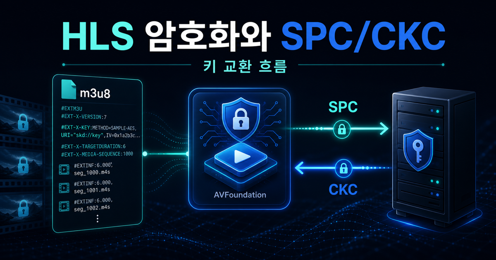
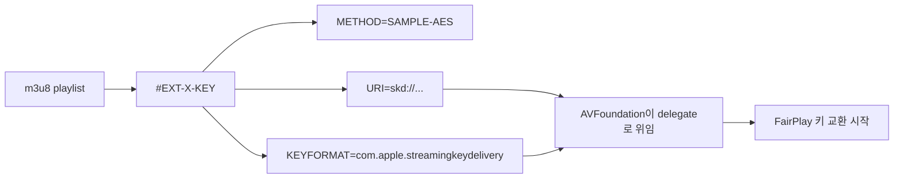
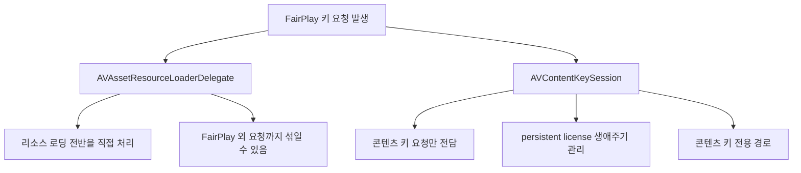
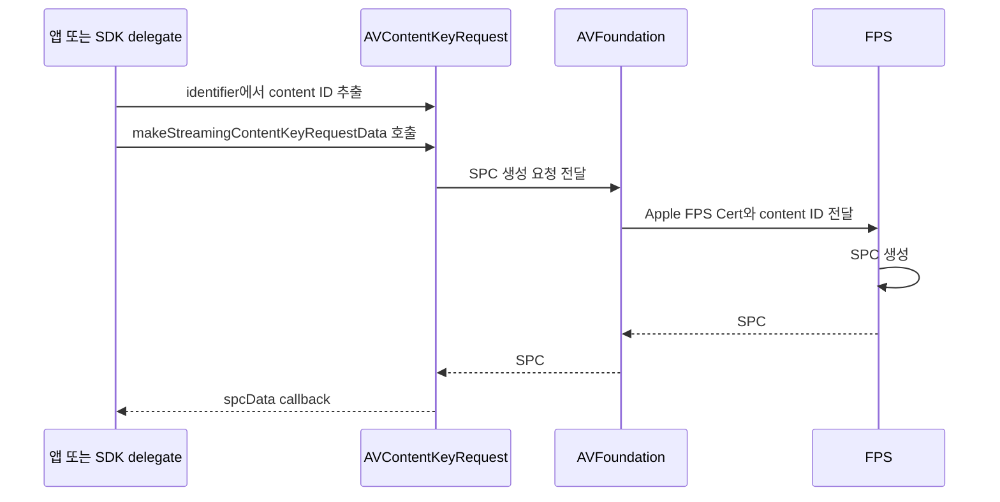
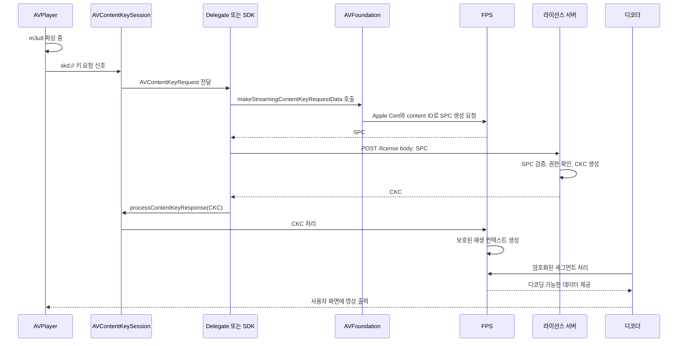
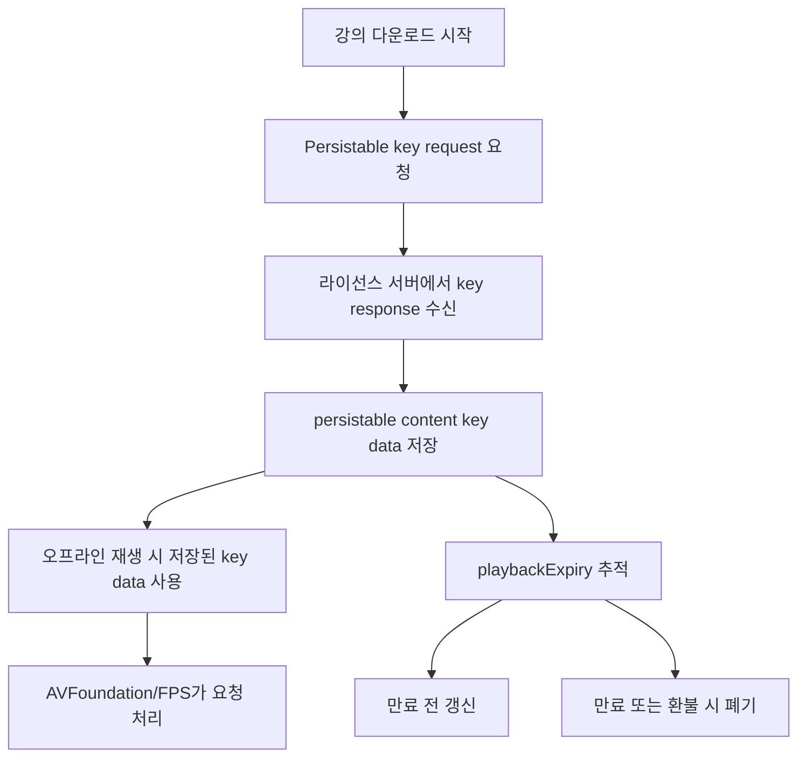
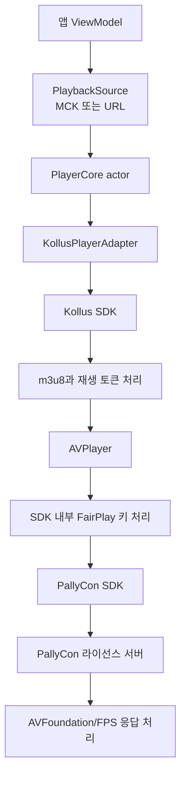

# [2편] HLS 암호화와 SPC/CKC 키 교환 심층 분석

> 시리즈: 교육 서비스 iOS 비디오 플레이어 모듈화 이야기 (2/5)
> Author: 정준영
> Date: 2026-05-15



---

## 1편 요약과 이번 글의 자리

지난 편에서는 DRM이 왜 필요한지, FairPlay Streaming이 무엇인지를 큰 그림으로 그렸다. 핵심은 세 문장이었다. 영상은 디바이스 안에서도 평문이면 안 되고, iOS에서는 AVFoundation과 FPS가 보호된 재생 경로 안에서 키 응답을 처리하며, 앱은 SPC와 CKC라는 두 보호된 메시지를 라이선스 서버와 시스템 프레임워크 사이에서 전달한다.

지금까지가 "왜"였다면 이번 편은 "어떻게"다. m3u8 한 줄에서 시작해 SPC가 만들어지고, 라이선스 서버에 다녀와 CKC가 도착하고, AVPlayer가 영상을 디코딩하기까지의 바이트 흐름을 따라간다. 그리고 그 흐름 위에 우리 모듈의 `KollusPlayerAdapter`가 어떻게 추상화를 얹는지를 본다.

주니어가 처음 읽으면 "이게 다 한 화면에서 일어난다고?"라는 느낌을 받을 것이다. 시니어가 읽으면 `AVAssetResourceLoaderDelegate`와 `AVContentKeySession` 중 무엇을 언제 골라야 하는지가 정리될 것이다.

<details>
<summary>먼저 알고 읽으면 좋은 용어</summary>

- **m3u8**: HLS 재생 목록 파일이다. 영상 조각 URL, 재생 시간, 암호화 키 정보 같은 메타데이터가 들어 있다.
- **SPC**: 디바이스가 라이선스 서버에 보내는 FairPlay 키 요청 데이터다.
- **CKC**: 라이선스 서버가 디바이스에 돌려주는 FairPlay 키 응답 데이터다.
- **delegate**: 어떤 이벤트가 발생했을 때 실제 처리를 다른 객체에게 맡기는 Cocoa/Cocoa Touch 패턴이다.
- **persistent license**: 다운로드 강의처럼 네트워크가 없어도 재생할 수 있도록 디바이스에 저장해 두는 FairPlay 라이선스다.

</details>

---

## 1. 다시 m3u8부터, 그런데 이번엔 조금 더 깊이

암호화된 HLS playlist의 핵심은 결국 한 줄이다.

```m3u8
#EXT-X-KEY:METHOD=SAMPLE-AES,
           URI="skd://license.pallycon.com/key?contentId=lecture-12345",
           KEYFORMAT="com.apple.streamingkeydelivery",
           KEYFORMATVERSIONS="1"
```

<details>
<summary>용어 토글: 이 m3u8 한 줄을 읽는 법</summary>

- **`#EXT-X-KEY`**: 이 playlist 아래의 미디어 세그먼트가 암호화되어 있으며, 키를 얻는 방법이 여기 적혀 있다는 뜻이다.
- **`METHOD=SAMPLE-AES`**: 영상 전체 파일을 통째로 암호화하는 대신, 미디어 샘플 단위로 AES 암호화를 적용한다는 뜻이다.
- **`URI="skd://..."`**: 일반 다운로드 URL이 아니라 FairPlay 키 요청을 시작하는 식별자다.
- **`KEYFORMAT="com.apple.streamingkeydelivery"`**: 이 키 요청이 Apple FairPlay Streaming 형식이라는 표시다.
- **`KEYFORMATVERSIONS="1"`**: FairPlay 키 전달 포맷 버전을 명시한다.

</details>



`METHOD=SAMPLE-AES`라는 표시부터 들여다보자. 이름이 "AES"라고만 되어 있지 않고 "SAMPLE-AES"인 데에는 이유가 있다. HLS에는 세그먼트 파일 전체를 AES-128 방식으로 암호화하는 경로도 있고, 미디어 샘플 단위로 암호화를 적용하는 경로도 있다. `SAMPLE-AES`는 후자다.

중요한 건 "세그먼트 전체 파일을 그대로 하나의 암호문으로 보는가"와 "미디어 샘플 구조를 보존한 채 암호화 정보를 붙이는가"의 차이다. FairPlay HLS에서는 `SAMPLE-AES`와 `KEYFORMAT="com.apple.streamingkeydelivery"` 조합을 흔히 보게 된다. 여기서는 배터리나 디코더 내부 최적화까지 단정하기보다, **HLS가 FairPlay 키 전달과 샘플 단위 암호화를 연결하는 표시**라고 이해하면 충분하다.

다음 줄, `URI="skd://..."`가 이번 글의 진짜 주인공이다. 일반 HLS 암호화라면 여기 들어가는 URI가 HTTPS 키 파일을 가리킬 수 있다. 그런데 FairPlay HLS에서는 `KEYFORMAT="com.apple.streamingkeydelivery"`와 `skd://` URI의 조합이 키 요청의 출발점이 된다. AVFoundation은 이 정보를 보고 "이건 일반 키 파일 다운로드가 아니라 FairPlay 키 전달 흐름으로 처리해야 한다"고 판단하고, 미리 등록된 delegate에게 키 요청을 위임한다.

`KEYFORMAT="com.apple.streamingkeydelivery"`는 그 키가 Apple 표준 FairPlay 포맷이라는 명시다. 이 값이 다르면(`com.widevine.alpha` 같은 식이면) 해당 DRM을 지원하는 클라이언트가 자기에게 맞는 라인을 고른다. 그래서 멀티 DRM을 운영하는 서비스는 보통 같은 콘텐츠에 여러 `#EXT-X-KEY` 라인을 적어두고, 클라이언트 OS가 자기에게 맞는 라인을 골라 처리한다.

이 `#EXT-X-KEY` 태그가 결국 "이제부터 FairPlay 키 요청이 필요하다"는 신호다. 신호를 받은 AVFoundation이 누구에게 위임할지, 그 위임 지점을 우리가 어떻게 채울지가 다음 절의 주제다.

---

## 2. 두 개의 delegate — 옛 길과 새 길

FairPlay 통합 지점에는 크게 두 길이 있다. 오래전부터 쓰던 `AVAssetResourceLoaderDelegate`가 있고, 콘텐츠 키 처리를 전담하도록 추가된 `AVContentKeySession`이 있다. 이 둘의 차이를 이해해야 우리 모듈이 왜 vendor SDK 뒤에 숨는 구조를 택했는지가 보인다.

### `AVAssetResourceLoaderDelegate` — 만능 망치

이 delegate는 사실 FairPlay 전용이 아니다. AVPlayer가 "이 리소스를 받고 싶은데 표준 HTTPS로 안 잡힌다, 네가 대신 받아 줘"라고 부탁할 때 부르는 일반 인터페이스다. 그래서 FairPlay뿐 아니라, 커스텀 인증이 필요한 콘텐츠나, 진짜 별난 스킴을 처리할 때도 쓴다.

문제는 이 만능성에서 온다. 한 delegate가 모든 resource loading을 받다 보니 FairPlay와 무관한 요청까지 다 거기로 흐른다. 코드가 길어지고, 책임이 흐려지고, 비동기 처리 흐름이 꼬이기 쉽다. 특히 오프라인 다운로드를 위한 **persistent license**를 다룰 때 이 delegate만으로는 한계가 분명하다. 라이선스의 생애 주기(발급, 갱신, 만료, 삭제)를 추적하는 도구가 부족하다.

### `AVContentKeySession` — 키만을 위한 전용 도구

Apple은 키 처리만을 위한 API로 `AVContentKeySession`을 제공한다. 이름 그대로 "콘텐츠 키 세션"이다. 이 세션은 키 발급 요청을 받고, 만료 리포트와 persistent content key 같은 콘텐츠 키 생애주기 처리를 더 명확한 인터페이스로 다룬다. 라이선스와 키 요청의 흐름을 리소스 로딩 전반에서 분리해 추적할 수 있다.

이 API가 좋은 또 다른 이유는 `AVContentKeyRequest`라는 1급 객체가 등장했다는 점이다. 이전에는 키 요청이 그냥 `AVAssetResourceLoadingRequest` 안에 묻혀 있었는데, 이제는 별도 타입이라 코드에서 명확히 구분된다. "이 요청은 키 요청이다"가 타입 시스템에 표현된다.

<details>
<summary>용어 토글: delegate와 content key API</summary>

- **`AVAssetResourceLoaderDelegate`**: AVAsset이 표준 방식으로 로드할 수 없는 리소스를 앱이 대신 처리하게 해 주는 범용 delegate다.
- **`AVContentKeySession`**: 콘텐츠 키 요청과 persistent license를 다루기 위한 전용 세션 API다.
- **`AVContentKeyRequest`**: "키가 필요하다"는 요청을 표현하는 객체다. SPC 생성과 CKC 응답 처리가 이 객체를 통해 이어진다.
- **1급 객체**: 코드에서 변수로 전달하고, 타입으로 구분하고, 별도 책임을 줄 수 있는 독립적인 객체라는 뜻이다.

</details>



### 그래서 무엇을 쓰는가

우리 모듈이 직접 FairPlay를 다뤘다면 콘텐츠 키 전용 API인 `AVContentKeySession`을 먼저 검토했을 것이다. 하지만 현실에선 PallyCon SDK가 관련 키 처리 API를 내부적으로 감싸고, Kollus는 그 위에 또 한 겹을 얹어 두었다. 그래서 우리 앱 코드 어디에도 `AVContentKeySession`이 직접 등장하지 않는다. **PallyCon이 디테일을 감추고, Kollus가 PallyCon을 감추고, 우리 모듈이 Kollus를 감춘다.** 3단 추상화의 끝에서 우리는 `PlaybackSource`에 MCK나 URL을 담아 use case로 넘긴다.

이 3단 추상화가 정당화되는 이유는 5편에서 자세히 본다. 일단 지금은 "두 가지 길이 있다, 새 길이 권장이다, 그러나 우리는 길 자체를 가린다"는 결론만 가져가자.

---

## 3. SPC가 만들어지기까지 — 한 호흡으로 따라가기

이제 SPC가 정말로 어떻게 만들어지는지 따라가 보자. 코드를 한꺼번에 보여 주기보다, 흐름을 글로 풀고 필요한 곳에서 한 조각씩 보여 주는 게 머릿속에 더 잘 남는다.

사용자가 재생 버튼을 누른 직후의 시점부터다. AVPlayer에는 `AVURLAsset`이 물려 있고, 그 asset의 m3u8이 막 파싱되고 있다. 파서가 위에서 본 `#EXT-X-KEY` 한 줄을 만난다. `KEYFORMAT`은 FairPlay를 가리키고, URI는 `skd://`로 시작한다. AVFoundation은 "이건 FairPlay 키 요청이 필요하다"고 판단하고, 미리 등록된 키 처리 delegate에게 신호를 보낸다. "키 요청 하나 생성할게, 받아 줘."

`AVContentKeySession` 경로라면 신호를 받은 세션이 `AVContentKeyRequest`를 만들어 우리(또는 SDK)의 delegate에게 넘긴다. 이 시점이 곧 우리의 코드가 처음으로 호출되는 순간이다. 동일한 일을 직접 짜면 대략 이런 모양이다. 이 코드는 PallyCon 내부 구현이 아니라 흐름을 설명하기 위한 예시다.

```swift
func contentKeySession(_ session: AVContentKeySession,
                       didProvide keyRequest: AVContentKeyRequest) {
    // 1. m3u8에서 들어온 키 식별자를 꺼낸다
    guard let identifier = keyRequest.identifier as? String,
          identifier.hasPrefix("skd://"),
          let assetIDString = identifier.removingSKDScheme(),
          let assetIDData = assetIDString.data(using: .utf8) else {
        keyRequest.processContentKeyResponseError(NSError(
            domain: "FairPlayExample",
            code: -2
        ))
        return
    }

    // 2. Apple FPS Certificate를 들고 SPC 생성을 요청한다
    keyRequest.makeStreamingContentKeyRequestData(
        forApp: appCertData,              // 우리 사업자 식별 인증서
        contentIdentifier: assetIDData,   // m3u8에서 꺼낸 콘텐츠 ID
        options: nil
    ) { spcData, error in
        guard let spcData else {
            keyRequest.processContentKeyResponseError(error ?? NSError(
                domain: "FairPlayExample",
                code: -1
            ))
            return
        }

        // 3. SPC를 라이선스 서버에 POST
        self.requestCKC(spcData: spcData) { result in
            switch result {
            case .success(let ckcData):
                // 4. 응답으로 받은 CKC를 키 요청에 돌려준다
                let response = AVContentKeyResponse(fairPlayStreamingKeyResponseData: ckcData)
                keyRequest.processContentKeyResponse(response)
            case .failure(let error):
                keyRequest.processContentKeyResponseError(error)
            }
        }
    }
}

private extension String {
    func removingSKDScheme() -> String? {
        guard hasPrefix("skd://") else { return nil }
        return String(dropFirst("skd://".count))
    }
}
```

<details>
<summary>용어 토글: 예시 코드에서 막히기 쉬운 표현</summary>

- **`keyRequest.identifier`**: m3u8의 `skd://...` 값에서 넘어온 키 식별자다. 보통 콘텐츠 ID를 뽑아내는 출발점이다.
- **`appCertData`**: Apple FPS Certificate 데이터다. SPC를 만들 때 AVFoundation에 넘긴다.
- **`contentIdentifier`**: 어떤 콘텐츠의 키를 요청하는지 알려주는 바이트 데이터다.
- **`spcData`**: AVFoundation/FPS가 만든 키 요청 데이터다. 앱은 이 값을 라이선스 서버로 전달할 뿐이다.
- **`AVContentKeyResponse`**: 라이선스 서버에서 받은 CKC를 AVFoundation이 이해할 수 있는 응답 객체로 감싼 것이다.
- **`processContentKeyResponse`**: CKC를 키 요청에 응답으로 넘기는 호출이다. 이 뒤로 AVFoundation/FPS가 보호된 재생 컨텍스트를 만든다.

</details>

이 짧은 함수 안에서 일어나는 일을 글로 풀면 이렇다.

먼저 m3u8에서 우리가 받은 키 식별자를 꺼낸다. `keyRequest.identifier`는 `skd://license.pallycon.com/key?contentId=lecture-12345` 같은 문자열이다. 여기서 콘텐츠 ID 부분만 잘라 바이트 배열로 만든다.

그다음이 가장 중요하다. `makeStreamingContentKeyRequestData`라는 함수를 호출하면 AVFoundation/FPS가 우리가 넘긴 Apple FPS Certificate와 콘텐츠 식별자를 사용해 SPC를 만들어 준다. **우리가 SPC 바이트 구조를 직접 조립하는 게 아니다.** 우리는 API에 필요한 입력을 넘기고, 만들어진 결과물을 받아 라이선스 서버로 전달할 뿐이다. 이 사실이 FPS 통합의 핵심이다.



SPC 데이터를 받은 다음은 평범한 HTTP 호출이다. 라이선스 서버 URL에 POST로 SPC 바이트를 던지고, 응답으로 CKC 바이트를 받는다. 이 구간은 그냥 우리가 매일 쓰는 `URLSession`이다. 라이선스 서버 입장에서는 SPC가 요청 바이트 덩어리이고, 응답으로 또 다른 바이트 덩어리(CKC)를 돌려준다. 이 두 덩어리는 앱 코드가 직접 해석하는 데이터가 아니라 FPS와 라이선스 서버가 약속한 프로토콜 메시지다.

마지막 단계. 받아 온 CKC를 `AVContentKeyResponse`로 감싸 `processContentKeyResponse`에 넘긴다. 이 호출이 끝나면 AVFoundation/FPS가 CKC를 처리해 보호된 재생 컨텍스트를 만들고, 그 컨텍스트 안에서 암호화된 미디어가 복호화된다. 앱 코드는 콘텐츠 키의 평문 값을 보지 못하고, 디코더는 시스템이 허용한 보호된 경로 안에서 재생을 이어 간다.

여기서 시니어 포인트 하나. `AVContentKeyRequest`는 비동기로 응답해야 한다. UI 스레드에서 SPC 생성 호출은 빨라도, 라이선스 서버 RTT는 수백 ms 단위다. 이걸 동기로 짜면 메인 스레드가 그동안 막힌다. PallyCon SDK는 내부 큐에서 처리하고, Kollus는 또 자기 큐에서 처리한다. 우리 모듈의 `KollusPlayerAdapter`가 `actor`인 이유 중 하나가 여기 있다. 여러 비동기 호출이 엔진 상태를 만지러 들어올 때, 동시성 제어를 컴파일 타임에 보장하려는 것이다.

---

## 4. 흐름을 한 장으로 다시 보기

글로 길게 풀어 봤으니 같은 흐름을 압축해 한 번 더 보자. 이제는 각 화살표가 무엇을 의미하는지 머릿속에 그려질 것이다.



읽으면서 한 번 더 머릿속에 각인할 것 하나. **SPC는 AVFoundation/FPS API가 만들고, CKC는 라이선스 서버가 만들고, 우리 앱은 그 두 메시지를 옮기는 메신저다.** 이 한 줄이 FPS 통합의 전부다.

---

## 5. 오프라인 강의 — Persistent License 이야기

지금까지의 흐름은 스트리밍 재생, 즉 온라인 재생에 해당한다. 라이선스가 아직 없거나 갱신이 필요한 시점에는 라이선스 서버에 접속할 수 있어야 한다. 그런데 우리 강의 앱에는 또 다른 핵심 기능이 있다. **다운로드 강의**. 학생이 통학 지하철에서, 비행기 모드에서 강의를 봐야 한다. 이 경우 재생 시점에 라이선스 서버에 접속할 방법이 없다.

해법은 **persistent license**다. 사용자가 강의를 다운로드하는 시점에 한 번, 라이선스 서버에서 받은 응답을 바탕으로 **persistable content key data**를 만들어 디바이스에 저장해 둔다. 재생 시점에는 네트워크 없이 그 저장된 키 데이터를 AVFoundation에 넘겨 같은 콘텐츠 키 요청에 응답할 수 있다.

`AVContentKeyRequest`에 persistable key 요청 메서드를 호출하면, AVFoundation이 키 요청을 "스트리밍용"에서 "저장 가능한 키 요청"으로 승격시킨다. 그러면 일반 `AVContentKeyRequest` 대신 `AVPersistableContentKeyRequest`가 새로 들어온다. 이 요청에서 라이선스 서버 응답을 받은 뒤 `persistableContentKeyFromKeyVendorResponse`로 저장 가능한 키 데이터를 만든다. 저장하는 것은 CKC 원본이라기보다, 이후 같은 키 요청에 응답할 수 있는 persistable content key data다.

<details>
<summary>용어 토글: persistent license와 오프라인 재생</summary>

- **스트리밍용 라이선스**: 재생 시점에 네트워크로 CKC를 받아 바로 사용하는 라이선스다.
- **persistent license**: 저장 가능한 content key data를 디바이스에 보관해 두고, 나중에 오프라인에서도 같은 콘텐츠 키 요청에 응답하는 방식이다.
- **`AVPersistableContentKeyRequest`**: 저장 가능한 콘텐츠 키를 요청할 때 쓰는 FairPlay 요청 객체다.
- **`playbackExpiry`**: 저장된 라이선스로 재생할 수 있는 만료 시각이다.
- **라이선스 폐기**: 환불, 수강 종료, 기기 변경 같은 상황에서 저장된 라이선스를 더 이상 쓰지 못하게 삭제하거나 무효화하는 처리다.

</details>



여기서 진짜 까다로운 부분이 시작된다. 저장된 키 데이터는 영원하지 않다. 라이선스 서버가 발급 시점에 `playbackExpiry`(재생 만료) 같은 메타데이터를 함께 내려줄 수 있다. 학원 수강 기간이 60일이라면 60일짜리 라이선스가 떨어진다. 만료가 다가오면 갱신하거나 삭제해야 한다. 만료된 라이선스로 재생을 시도하면 보호된 재생 경로가 재생을 허용하지 않는다. 사용자가 환불받았다면 즉시 라이선스를 폐기해야 한다.

이 모든 일을 디바이스 어딘가에 저장해 두고 추적해야 한다. PallyCon SDK가 자기 안에 **Core Data**로 라이선스 DB를 운영하는 이유가 정확히 이것이다. `ContentKey`, `License`, `Customer` 같은 NSManagedObject를 가진다. 우리 회사가 PallyCon SDK를 까 보면 그 안에 `PallyConFPSModel.momd`라는 데이터 모델 파일이 보인다. 우리가 직접 만들 수도 있지만, 만들 일이 없는 게 다행이다. 라이선스 한 건의 만료/갱신/폐기 흐름을 안정적으로 구현하는 데 보통 사람-월 단위가 든다.

이 모든 디테일이 PallyCon 안에서 일어나고, Kollus는 PallyCon을 더 추상화하고, 우리 모듈은 Kollus를 또 한 번 가린다. 우리 앱은 그냥 `KollusPlayerModuleFactory().makeModule()` 한 줄로 받는다. 그 안에 라이선스 DB, 만료 처리, persistent content key 갱신이 다 들어 있다. 추상화 위에 추상화가 쌓이지만, 매 층마다 그럴 만한 이유가 있다.

---

## 6. 우리 모듈에서 이 흐름은 어디에 있는가

여기까지 길게 흐른 SPC/CKC 이야기는, 우리 레포 `videoplayer-ios-ms` 안에서는 어디에도 명시적으로 등장하지 않는다. `grep -ri "PallyCon" Sources/`를 해 봐도 직접 호출이 한 줄도 나오지 않는다. 이 사실이 신기하게 느껴진다면, 그게 바로 추상화가 제대로 됐다는 신호다.

대신 우리 모듈에는 이런 인터페이스가 있다.

```swift
public enum PlaybackSource: Sendable {
    case kollus(mediaContentKey: String)       // Kollus MCK 기반 재생
    case url(URL)                              // 엔진별 URL 기반 재생
}
```

<details>
<summary>용어 토글: 우리 모듈 코드에서 보이는 단어</summary>

- **`PlaybackSource`**: 플레이어가 어떤 입력으로 재생을 시작할지 표현하는 enum이다.
- **`case kollus(mediaContentKey:)`**: Kollus VOD를 MCK로 시작하는 경로다. 내부에는 DRM, m3u8 발급, 라이선스 처리가 포함될 수 있다.
- **`case url(URL)`**: URL로 식별되는 콘텐츠 진입 경로다. Native 엔진에서는 AVPlayer 직접 URL이 되고, Kollus 엔진에서는 Kollus SDK의 contentURL 진입점으로 번역된다.
- **`Sendable`**: Swift Concurrency에서 동시성 경계를 넘어 안전하게 전달될 수 있음을 나타내는 프로토콜이다.
- **MCK(mediaContentKey)**: Kollus 쪽 콘텐츠를 식별하는 키다. FairPlay 콘텐츠 키와는 다른, 서비스 레벨의 콘텐츠 식별자라고 보면 된다.

</details>

대부분의 강의 재생에서 소비자(앱 ViewModel)는 `.kollus(mediaContentKey: "MCK-...")`를 던진다. 외부 링크나 URL로 식별되는 Kollus 콘텐츠라면 같은 추상화 안에서 `.url(...)`을 던질 수도 있다. 어느 쪽이든 그 뒤에 일어나는 일은 다음과 같다.

`PlayerCore`라는 actor가 명령을 받아 `KollusPlayerAdapter`라는 엔진에게 위임한다. 어댑터는 입력에 따라 Kollus SDK의 `KollusPlayerView(mediaContentKey:)` 또는 `KollusPlayerView(contentURL:)`를 만들고 재생 준비를 시킨다. 그 뒤 m3u8 발급, FairPlay 키 요청, PallyCon 라이선스 처리 같은 vendor 세부 흐름은 Kollus/PallyCon SDK 내부로 들어간다. 우리 코드에는 `AVContentKeySessionDelegate`도, SPC/CKC HTTP 호출도 없다. 우리 코드는 이 모든 과정에서 단 한 줄도 직접 짜지 않았다.



만약 우리가 직접 했다면, `Sources/VideoPlayerModule/Engine/Kollus/KollusPlayerAdapter.swift` 안에 키 처리 delegate 채택과 SPC/CKC 호출 코드가 들어 있었을 것이다. 지금 그 자리에는 "입력을 Kollus 뷰 생성 방식으로 번역하고, 명령과 이벤트를 우리 도메인 모델로 연결하라"는 어댑터 로직이 있다. 무게가 어디로 갔는지 보이는가? **Kollus SDK 안으로 갔다.** 그리고 그게 Kollus SDK를 살 만한 가치가 있다고 결정한 이유다. 다음 편에서 이 의사결정을 정면으로 다룬다.

---

## 7. 정리하며

이 글에서 본 것을 한 호흡으로 다시 흘려 보자.

m3u8 안의 `#EXT-X-KEY`가 `KEYFORMAT="com.apple.streamingkeydelivery"`와 `skd://` URI를 담고 있으면 FairPlay 키 요청 흐름이 시작된다. AVFoundation은 그 신호를 키 처리 delegate에게 넘기고, 우리 또는 SDK의 delegate가 호출된다. 우리는 AVFoundation/FPS에 SPC 생성을 요청하고, 받은 SPC를 라이선스 서버에 보내고, 응답으로 CKC를 받아 다시 AVFoundation에 전달한다. 그 뒤 콘텐츠 키 응답 처리는 보호된 재생 경로 안에서 이뤄지고, 앱 코드는 평문 콘텐츠 키를 직접 보지 않는다.

오프라인 재생을 위해서는 persistent license가 필요하고, 그 라이선스의 생애 주기를 디스크에 안전하게 저장하고 추적하는 데 또 한 겹의 복잡도가 든다. 이 모든 복잡도를 우리 앱 코드가 직접 짊어지지 않는다. PallyCon SDK가 라이선스 처리와 저장소를 가지고, Kollus SDK가 PallyCon을 감추며, 우리 모듈이 Kollus를 한 번 더 가린다. 우리는 `module.startPlaybackUseCase.execute(source: .kollus(mediaContentKey: ...))` 또는 URL 기반 진입에서는 `.url(...)`을 적는다.

이제 다음 편에서, **왜 우리가 직접 Kollus를 짜지 않고 Kollus SDK를 쓰는지**를 정면으로 다룬다. Build-vs-Buy 의사결정, 콘텐츠 호스팅 인프라의 현실, 그리고 우리 회사가 이미 내렸던 결정이 지금의 코드를 어떻게 만들었는지를 본다.

> **다음 편: [3편] 우리는 왜 KollusSDK를 쓰는가 — 콘텐츠 전달 문제와 Build-vs-Buy**

---

### 참고

- Apple, [AVContentKeySession](https://developer.apple.com/documentation/avfoundation/avcontentkeysession)
- Apple, [AVContentKeyRequest.makeStreamingContentKeyRequestData](https://developer.apple.com/documentation/avfoundation/avcontentkeyrequest/makestreamingcontentkeyrequestdata%28forapp%3Acontentidentifier%3Aoptions%3Acompletionhandler%3A%29)
- Apple, [HLS Authoring Specification for Apple Devices](https://developer.apple.com/documentation/http_live_streaming/hls_authoring_specification_for_apple_devices)
- WWDC 2017 Session 502, *HLS Authoring Update*
- 사내 코드: `Sources/VideoPlayerModule/Engine/Kollus/KollusPlayerAdapter.swift`
- 이전 편: [1편 DRM과 FairPlay Streaming부터 이해하기](./01-drm-fairplay-streaming-basics.md)
