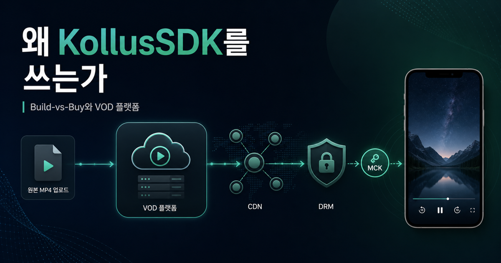
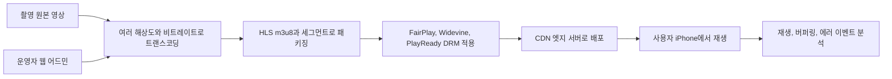
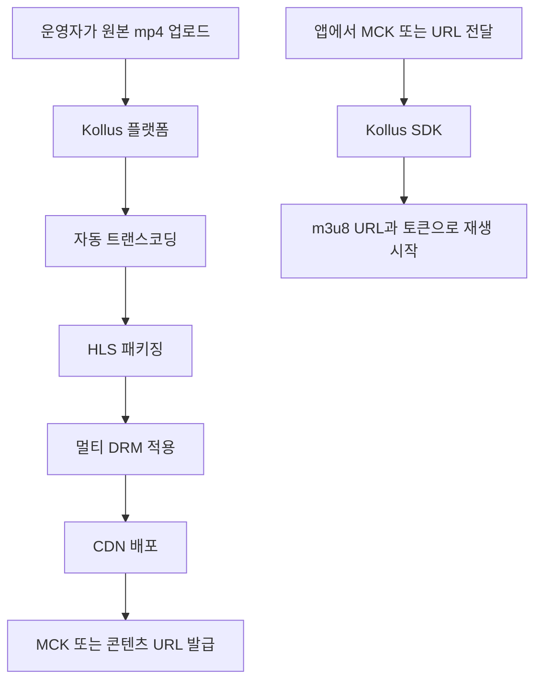
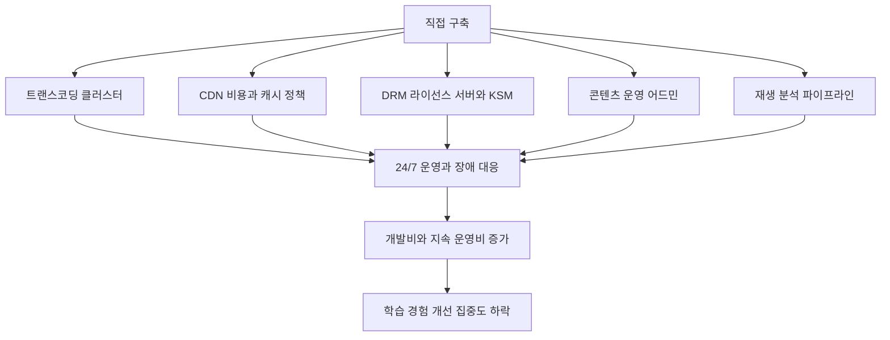
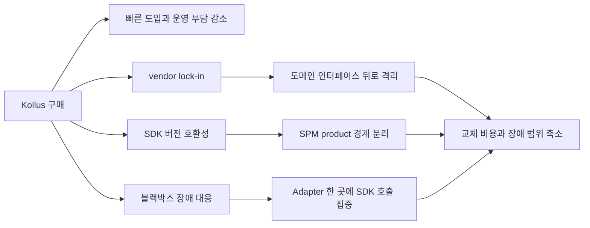
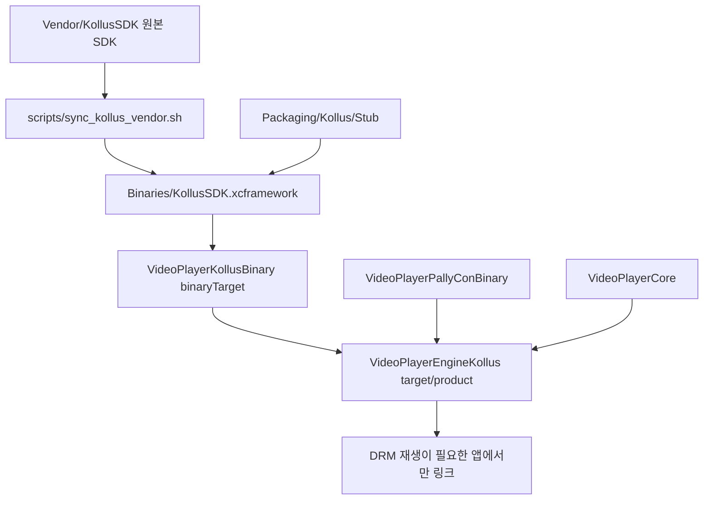
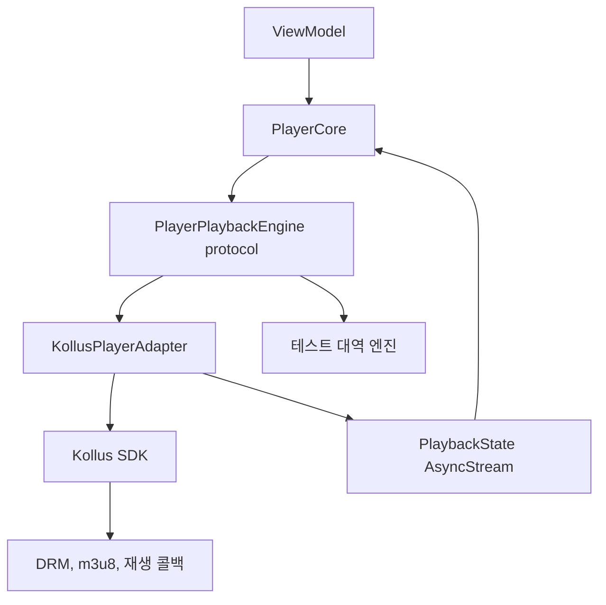

# [3편] 우리는 왜 KollusSDK를 쓰는가 — 콘텐츠 전달 문제와 Build-vs-Buy

> 시리즈: 교육 서비스 iOS 비디오 플레이어 모듈화 이야기 (3/5)
> Author: 정준영
> Date: 2026-05-15



---

## 이번 글이 다루는 질문

지난 두 편을 거쳐 DRM과 FairPlay Streaming의 동작을 봤다. m3u8이 어떻게 생겼고, SPC/CKC가 어떻게 교환되고, persistent license가 어떻게 저장되는지까지 따라왔다. 이제 자연스럽게 다음 질문이 떠오른다.

> "그러면 우리 회사는 왜 그걸 직접 안 짜고 Kollus라는 외부 SDK를 쓰는 거죠?"

이 글은 그 질문에 정면으로 답한다. 결론부터 말하면, Kollus가 풀어 주는 문제는 단순히 "DRM 통합"이 아니다. 강의 한 편이 사용자 디바이스 화면에 도달하기까지 거쳐야 하는 **콘텐츠 호스팅·전달·보호의 모든 인프라**다. 그 인프라를 직접 짓는 비용과 사는 비용을 비교한 뒤, 회사가 합리적으로 "사자"를 택한 결과가 지금의 코드다.

주니어가 이 글을 읽으면 "왜 SDK 한두 개 더 쓰는 게 그렇게 큰 결정인가"가 보일 것이고, 시니어가 읽으면 후배가 "이거 우리 직접 짜면 안 되나요?"라고 물을 때 5분 안에 설명할 수 있는 그림이 정리될 것이다.

<details>
<summary>먼저 알고 읽으면 좋은 용어</summary>

- **VOD(Video On Demand)**: 사용자가 원하는 시점에 영상을 재생하는 서비스 방식이다. 실시간 방송과 달리 업로드, 저장, 인코딩, 배포, 재생 권한 관리가 중요하다.
- **SDK**: 특정 서비스나 기능을 앱에서 쉽게 쓰도록 제공되는 라이브러리 묶음이다. KollusSDK는 Kollus VOD 재생을 앱에 붙이기 위한 도구다.
- **Build-vs-Buy**: 필요한 시스템을 직접 만들지, 외부 서비스를 구매할지 비교하는 의사결정이다.
- **vendor**: 우리 회사가 직접 만든 것이 아니라 외부 업체가 제공하는 제품이나 서비스를 뜻한다.
- **MCK(Media Content Key)**: Kollus에서 콘텐츠 하나를 식별하는 서비스 레벨 ID다. FairPlay 콘텐츠 키와는 다르다.

</details>

---

## 1. 강의 한 편이 사용자에게 도달하기까지

먼저 강의 영상이 촬영실에서 사용자 iPhone까지 어떤 여정을 거치는지부터 그려 보자. 이 그림을 머릿속에 그려야 Kollus가 정확히 어느 자리에 있는지가 보인다.

촬영실에서 강사가 강의를 한다. 카메라가 4K 60fps 원본 영상을 녹화한다. 한 시간짜리 영상이 수십 GB 단위로 나온다. 이걸 그대로 iPhone에 흘릴 수는 없다. iPhone마다 화면 크기와 네트워크 환경이 다르고, 와이파이가 좋은 학생도 있고 LTE 한 칸짜리 학생도 있다. 그래서 같은 영상을 여러 해상도·비트레이트로 **트랜스코딩**해야 한다. 1080p 5Mbps, 720p 2Mbps, 480p 1Mbps, 360p 600kbps. 각각을 HLS로 패키징해 m3u8 + .ts 조각들로 쪼갠다.

이게 끝이 아니다. 영상을 사용자에게 빠르게 전달하려면 **CDN**이 필요하다. 서울에 있는 우리 서버가 부산 학생에게 직접 영상을 흘리면 지연 시간이 늘어진다. CDN이 전국 각지의 엣지 서버에서 영상을 캐싱해 가장 가까운 위치에서 흘려야 첫 프레임이 빨리 뜬다. 첫 프레임이 늦어질수록 사용자는 앱이 멈췄다고 느끼고, 강의 재생 경험은 바로 나빠진다.

그다음이 **보안**이다. 우리가 시리즈 1-2편에서 본 DRM. 트랜스코딩된 영상을 FairPlay로 암호화하고, 멀티 디바이스 지원을 위해 Widevine과 PlayReady로도 함께 패키징해야 한다. m3u8 안의 `#EXT-X-KEY` 줄을 자동으로 채워야 하고, 라이선스 서버와 키 ID가 맞아야 한다.

그리고 **분석**이다. 어떤 학생이 어느 강의를 어디까지 봤고, 어디서 끊었고, 어떤 화질로 봤는지를 추적해야 학습 경험도 개선하고, 운영 이슈도 찾고, 콘텐츠 기획도 한다. 재생 이벤트, 버퍼링 이벤트, 에러 이벤트를 수집해 분석 파이프라인에 흘리는 인프라가 필요하다.

마지막으로 **운영**이다. 강사가 강의를 새로 찍어 올렸을 때 그게 30분 안에 학생에게 도달하려면, 위 모든 단계가 파이프라인으로 자동화돼야 한다. 사람이 트랜스코딩을 일일이 돌리고, CDN에 파일을 일일이 올리고, DRM 키를 일일이 발급할 수는 없다. 콘텐츠 운영자(보통은 IT 비전공 직원)가 웹 어드민에서 "업로드" 버튼만 누르면 다 되어야 한다.

이 다섯 단계 — **트랜스코딩, CDN, DRM, 분석, 운영 자동화** — 가 합쳐져 우리가 흔히 "VOD 플랫폼"이라고 부르는 것이다. Kollus는 정확히 이 VOD 플랫폼을 서비스 형태로 제공하는 제품군이다.

<details>
<summary>용어 토글: VOD 전달 파이프라인</summary>

- **트랜스코딩**: 원본 영상을 여러 해상도와 비트레이트의 재생용 파일로 변환하는 작업이다.
- **비트레이트**: 1초 동안 전송되는 영상 데이터 양이다. 높을수록 화질은 좋아지지만 네트워크와 저장 비용이 커진다.
- **HLS 패키징**: 영상을 m3u8 playlist와 작은 세그먼트 파일로 나누는 작업이다.
- **CDN(Content Delivery Network)**: 사용자의 위치와 가까운 엣지 서버에서 영상을 전달해 지연 시간을 줄이는 네트워크다.
- **엣지 서버**: 사용자와 가까운 CDN 캐시 서버다. 원본 서버까지 가지 않고 가까운 서버에서 영상을 받게 해 준다.
- **운영 자동화**: 콘텐츠 운영자가 업로드 버튼을 누르면 인코딩, 배포, 보호, 분석 준비까지 자동으로 이어지게 만드는 시스템이다.

</details>



---

## 2. Kollus가 정확히 무엇을 파는가

Kollus는 **Catenoid(카테노이드)** 가 운영하는 클라우드 VOD 플랫폼이다. 비유하자면 "한국 교육/기업 시장에 특화된 B2B 비디오 플랫폼"에 가깝다. 자체 영상 인프라를 모두 직접 운영하기 부담스러운 회사가 업로드, 변환, 보호, 배포, 플레이어 연동을 서비스로 빌려 쓸 수 있게 묶어 놓은 제품이다.

기능을 글로 풀면 이렇다. 강사가 강의를 찍어 Kollus 콘솔에 mp4 파일을 업로드한다. Kollus는 그 파일을 재생 가능한 형태로 변환하고, HLS 같은 스트리밍 포맷과 보안 설정을 적용하고, CDN과 플레이어 연동에 필요한 정보를 관리한다. Kollus 쪽 콘텐츠 하나마다 **MCK(Media Content Key)** 라는 고유 ID를 발급한다. 이 MCK가 우리 코드에서 가장 중요한 식별자다.

```swift
// 우리 코드에서 Kollus 콘텐츠 하나를 지칭하는 대표 경로
public enum PlaybackSource: Sendable {
    case kollus(mediaContentKey: String)   // "MCK-abc123def456..."
    case url(URL)                          // URL로 식별되는 Kollus 콘텐츠 진입
}
```

대부분의 강의는 MCK 한 문자열로 시작한다. 일부 외부 링크나 미리보기처럼 URL로 식별되는 Kollus 콘텐츠는 `.url(URL)` 경로로 들어올 수 있다. 어느 쪽이든 SDK는 Kollus 쪽 재생 흐름을 시작하고, 서비스 설정에 따라 재생 URL, 인증, DRM, 다운로드 같은 세부 처리를 vendor 내부 흐름으로 넘긴다. 우리 앱은 m3u8 URL이나 DRM 라이선스 요청을 직접 조립하지 않는다. 시리즈 2편에서 본 SPC/CKC 흐름이 필요하다면 그 지점도 SDK 내부에서 처리된다.

<details>
<summary>용어 토글: Kollus, MCK, 재생 토큰</summary>

- **클라우드 VOD 플랫폼**: 업로드된 영상을 재생 가능한 형태로 변환하고, 저장하고, 보호하고, 사용자에게 전달하는 SaaS다.
- **MCK(Media Content Key)**: Kollus 콘텐츠를 가리키는 대표 ID다. 일반 강의 재생은 보통 MCK를 넘긴다.
- **URL 진입**: MCK가 아니라 콘텐츠 URL로 식별되는 진입이다. 모듈은 이 입력도 Kollus SDK의 URL 기반 생성자로 번역한다.
- **재생 토큰**: 특정 사용자, 콘텐츠, 기기, 시간 조건에서만 재생을 허용하기 위해 쓰는 임시 권한값이다. 실제 발급 주체와 포맷은 서비스 연동 방식에 따라 달라질 수 있다.
- **m3u8 URL 발급**: 앱이 원본 파일 위치를 직접 알지 못하게 하고, 권한 확인 뒤 제한된 재생 URL만 쓰게 하는 방식이다.
- **DRM 라이선스 토큰**: PallyCon 같은 라이선스 서버에 키를 요청할 때 권한 정보를 전달하는 값이다. 실제 구조는 vendor SDK와 서버 설정에 묶인다.

</details>



다시 정리하면 Kollus는 우리에게 이런 가치를 판다.

**원본 mp4 한 개 → 재생용 변환 → 보안 설정 → CDN 배포 → MCK 또는 콘텐츠 URL 한 줄로 호출 가능.**

이 한 줄짜리 가치 제안 뒤에 트랜스코딩 클러스터, CDN 연동, 키 관리 시스템, 콘텐츠 어드민 웹, 분석 대시보드, 라이브 스트리밍 지원, 다운로드 권한 처리, 라이선스 만료 처리가 들어 있다.

---

## 3. 직접 짓는다면? — Build의 진짜 비용

여기서 가장 위험한 질문이 하나 등장한다.

> "오픈소스랑 AWS를 잘 조합하면 우리 직접 할 수 있지 않나요?"

이 질문은 정말 자주 나온다. 그리고 그때마다 같은 답을 줘야 한다. **할 수는 있다. 그런데 그 비용을 진짜로 계산해 보면 사는 게 압도적으로 싸다.** 무엇이 들어가는지 따라가 보자.

먼저 트랜스코딩 인프라. AWS MediaConvert나 GCP Transcoder API, 혹은 오픈소스 FFmpeg를 EC2에 띄워서 구성한다. 단순히 시간당 비용만이 아니다. 강의 한 편당 트랜스코딩 시간을 어떻게 줄일지(병렬 분할, 2-pass 인코딩), 실패한 잡을 어떻게 재시도할지, 진행 상태를 어떻게 추적할지, 새 강의가 30분 안에 학생에게 도달하도록 어떻게 SLA를 맞출지를 모두 설계해야 한다. 사람-월 단위 작업이고, 한 번 만들고 끝이 아니라 운영 중 계속 튜닝해야 한다.

다음 CDN. CloudFront나 Akamai를 깐다. 그런데 강의 시청 패턴이 OTT와 다르다. 시험 기간 직전에 트래픽이 폭증한다. CDN 캐시 정책을 강의별로 다르게 설정해야 하고, 인기 강의는 미리 warm-up을 돌려야 할 수 있다. 트래픽 비용은 사용량에 따라 크게 흔들린다. 비용 모니터링과 알림이 필요하고, 갑자기 어떤 강의가 비정상적으로 많이 트래픽을 끌면 어뷰징인지 정상인지 판단해야 한다.

그다음 DRM. FairPlay 라이선스 서버를 직접 짓는다? 시리즈 1편에서 본 Apple 승인 절차와 FairPlay Streaming credentials부터 시작해야 한다. 받은 다음에는 Key Server Module(KSM) 구현, 민감한 credential 보안 보관, 24시간 라이선스 발급 API 운영, SPC 검증 로직, 다중 DRM 지원, 사용자 권한 시스템과의 연동을 다 만들어야 한다. 보안과 운영 경험이 모두 필요한 장기 과제다.

이 모든 걸 직접 한다고 가정해 보자. 우리 인프라 팀은 트랜스코딩 클러스터 운영팀, CDN 비용 최적화팀, DRM 보안팀, 콘텐츠 운영 어드민 웹 팀으로 나뉘어야 한다. 강의를 새로 찍을 때마다 콘텐츠 운영자가 우리 어드민에 올리면 다 자동화돼야 한다. 그 어드민 웹도 우리가 만들어야 한다.

이걸 다 짓는 데 필요한 비용은 단순한 서버 요금이 아니다. 트랜스코딩, CDN, DRM, 어드민, 분석, 장애 대응을 모두 아는 사람이 필요하고, 만든 뒤에도 계속 운영해야 한다. 규모에 따라 수억 원에서 그 이상으로 쉽게 커질 수 있다. 그리고 가장 중요한 건, 이걸 짓는 동안 **우리 본업인 강의 콘텐츠와 학습 경험 개선에 쓸 시간이 줄어든다**는 점이다. 우리가 만들고 싶은 건 "더 잘 가르치는 앱"이지 "더 잘 영상을 트는 앱"이 아니다. 영상을 트는 일은 정말 잘하는 회사에게 맡기고, 우리는 가르치는 일에 집중하는 게 비교 우위를 맞게 만든다.

<details>
<summary>용어 토글: 직접 구축 비용을 볼 때 필요한 단어</summary>

- **2-pass 인코딩**: 영상을 두 번 분석해 더 안정적인 화질과 용량을 얻는 인코딩 방식이다. 품질은 좋아질 수 있지만 시간이 더 든다.
- **SLA(Service Level Agreement)**: "업로드 후 몇 분 안에 재생 가능해야 한다"처럼 서비스가 지켜야 하는 운영 수준 약속이다.
- **CDN warm-up**: 사용자가 몰리기 전에 인기 콘텐츠를 CDN 엣지에 미리 캐싱해 두는 작업이다.
- **어뷰징**: 비정상적인 방식으로 트래픽이나 콘텐츠 접근을 유발하는 행위다.
- **KSM(Key Server Module)**: FairPlay SPC를 검증하고 CKC를 만드는 키 서버 구현이다.
- **사람-월**: 한 사람이 한 달 동안 일하는 분량을 뜻한다. 예를 들어 3명이 4개월 일하면 12 사람-월이다.

</details>



---

## 4. Buy의 진짜 비용 — 그래도 공짜는 아니다

물론 Kollus를 사도 비용은 든다. 월 라이선스 비용이 트래픽과 저장 용량 기준으로 책정될 수 있고, 라이브 스트리밍 같은 부가 기능마다 추가 비용이 붙을 수 있다. 정확한 비용 구조는 계약 조건과 트래픽 규모에 따라 달라진다. 다만 직접 구축의 개발·운영 리스크까지 포함하면, 많은 회사에서는 SaaS를 사는 쪽이 더 예측 가능한 선택지가 된다.

대신 "사는 것"에는 다른 종류의 비용이 따라 온다. 시니어가 신경 써야 할 부분이다.

첫째, **vendor lock-in**. MCK라는 식별자가 우리 콘텐츠 메타 DB에 박힌다. Kollus를 떠나려면 그 모든 MCK를 새 식별자로 마이그레이션해야 하고, 콘텐츠 운영자가 쓰던 어드민도 다 바뀐다. 갈아엎는 비용이 누적된다.

둘째, **버전 호환성**. Kollus SDK는 자체 일정으로 릴리스된다. Apple이 iOS 26에서 새 보안 정책을 발표했을 때 Kollus가 SDK 업데이트를 늦게 내면, 우리는 그동안 발이 묶인다. 이 리스크가 실제로 일어나면 우리 강의 앱이 신규 iPhone에서 안 돌아가는 사태가 된다.

셋째, **SDK 내부 동작이 블랙박스**. 버그가 났을 때 우리가 직접 확인할 수 있는 범위가 줄어든다. Kollus에 티켓을 끊고, 그쪽 개발자가 회신할 때까지 기다려야 하는 경우가 생긴다. 운영 중 장애 대응 속도의 일부가 우리 손을 떠난다.

이 세 가지를 어떻게 완화할 것인가가 시리즈 5편의 핵심 주제다. **답은 "vendor에 의존하되, 코드 레벨에선 격리해 두는 것"이다.** vendor SDK를 어쩔 수 없이 쓰지만, 우리 도메인 코드는 그 SDK의 존재를 모르도록 인터페이스 뒤에 숨긴다. 그게 우리 모듈의 `PlayerPlaybackEngine` 프로토콜과 `KollusPlayerAdapter`가 하는 일이다.

<details>
<summary>용어 토글: Buy 전략의 리스크</summary>

- **vendor lock-in**: 특정 업체의 ID, SDK, 운영 도구에 깊게 묶여서 나중에 다른 업체로 옮기기 어려워지는 상태다.
- **버전 호환성**: iOS, Xcode, Swift, SDK 버전이 서로 맞아야 정상 빌드와 실행이 되는 특성이다.
- **블랙박스**: 내부 구현을 볼 수 없어 문제가 났을 때 원인을 직접 확인하기 어려운 구성요소다.
- **격리**: vendor SDK를 도메인 코드 곳곳에 퍼뜨리지 않고, 정해진 어댑터나 product 경계 안에 가두는 설계다.
- **완화 전략**: 리스크를 없애지는 못하지만, 문제가 터졌을 때 피해 범위를 줄이는 구조적 대응이다.

</details>



---

## 5. 우리 코드에서 Kollus는 어디에 있는가

이제 우리 레포로 돌아와 Kollus가 정확히 어디에 박혀 있는지를 보자. 한 호흡으로 따라가면 추상화 계층의 의미가 머릿속에 자리를 잡는다.

가장 먼저 `Vendor/KollusSDK/` 디렉토리가 있다. 여기에 Kollus가 우리에게 던져 준 원본 SDK가 그대로 들어가 있다. `include/` 폴더에 헤더 파일들이 있고, `lib/` 폴더에 정적 라이브러리가 있다. 우리는 이 디렉토리를 절대 손대지 않는다. Kollus가 새 버전을 던져 주면 `scripts/sync_kollus_vendor.sh`로 통째로 갈아 끼우기만 한다.

그다음 `Binaries/KollusSDK.xcframework/`가 있다. 이건 우리가 `Vendor/KollusSDK/`를 재가공해 SwiftPM이 이해하는 `xcframework` 포맷으로 묶은 결과물이다. `scripts/rebuild_kollus_xcframework.sh`가 이 작업을 자동화한다. 그 안에서 시뮬레이터용 stub slice도 함께 만들어 붙인다(`Packaging/Kollus/Stub/`). 시뮬레이터에서 빌드는 통과해야 하니까, DRM이 작동하지 않아도 컴파일은 되는 stub이 필요하다. 이 packaging 파이프라인 자체가 별도 문서(`docs/kollus-sdk-packaging.md`)에 정리될 만큼 디테일이 많다.

`Package.swift`에서는 이렇게 등장한다.

```swift
.binaryTarget(
    name: "VideoPlayerKollusBinary",
    path: "Binaries/KollusSDK.xcframework"
),

.target(
    name: "VideoPlayerEngineKollus",
    dependencies: [
        "VideoPlayerCore",
        "VideoPlayerKollusBinary",
        "VideoPlayerPallyConBinary"   // PallyCon은 다음 편에서
    ],
    ...
),
```

`VideoPlayerEngineKollus`라는 별도 product가 있다는 점이 핵심이다. 소비자가 `VideoPlayerCore`, `VideoPlayerShellSupport`, `VideoPlayerEngineNative`처럼 필요한 product만 골라 링크하면 Kollus 바이너리와 PallyCon 바이너리를 피할 수 있다. 반대로 umbrella 성격의 `VideoPlayerModule` product는 Kollus 엔진까지 포함하므로, 앱에서 어떤 product를 선택하느냐가 중요하다. **vendor 격리**라는 원칙이 SPM product 경계로 명시되어 있는 것이다.

<details>
<summary>용어 토글: repo 구조와 패키징 단어</summary>

- **`Vendor/`**: 외부 업체가 준 원본 SDK를 보관하는 위치다. 직접 수정하지 않는 원천 자료로 취급한다.
- **`xcframework`**: iOS 기기, 시뮬레이터, 아키텍처별 바이너리를 하나로 묶어 배포하는 Apple 프레임워크 포맷이다.
- **SwiftPM**: Swift Package Manager다. Swift 프로젝트의 dependency, target, product를 관리한다.
- **`binaryTarget`**: SwiftPM에서 소스가 아니라 이미 빌드된 바이너리 프레임워크를 연결할 때 쓰는 선언이다.
- **stub slice**: 시뮬레이터처럼 실제 vendor 기능을 실행할 수 없는 환경에서 빌드만 통과시키기 위한 가짜 바이너리 조각이다.
- **SPM product 경계**: 특정 기능을 별도 product로 나눠 필요한 앱이나 테스트에서만 링크하게 만드는 경계다.

</details>



마지막으로 `Sources/VideoPlayerModule/Engine/Kollus/KollusPlayerAdapter.swift`가 있다. 여기가 Kollus SDK 바이너리 모듈을 직접 import하고 호출하는 핵심 파일이다. 다른 도메인 코드에는 vendor SDK 호출이 퍼져 있지 않다. 이 어댑터는 우리 도메인의 `PlayerPlaybackEngine` 계열 프로토콜을 채택하고, Kollus SDK의 호출을 그 프로토콜의 메서드 호출로 번역한다.

```swift
// 단순화한 모양 (실제 코드보다 짧게 보여 줌)
actor KollusPlayerAdapter: PlayerPlaybackEngine {
    private var playerView: KollusPlayerView?
    private let bootstrapper: KollusSessionBootstrapper
    private let environment: KollusEnvironment
    private let playerType: KollusPlayerType

    func prepare(source: PlaybackSource) async throws {
        guard case let .kollus(mediaContentKey) = source else {
            throw PlayerError.engineError("Kollus 엔진은 MCK만 지원합니다.")
        }

        let storage = try await bootstrapper.resolveStorage()
        guard let storageAdapter = storage as? KollusStorageAdapter else {
            throw PlayerError.engineError("Kollus storage가 준비되지 않았습니다.")
        }

        let view = KollusPlayerView(mediaContentKey: mediaContentKey)
        view?.storage = storageAdapter.storage
        view?.fpsCertURL = environment.drm.fpsCertificateURL?.absoluteString
        view?.fpsDrmURL = environment.drm.fpsDRMURL?.absoluteString
        try view?.prepareToPlay(withMode: playerType)
        playerView = view

        // 실제 코드는 여기서 PlaybackState와 PlayerEvent로 변환한다.
    }

    func play() async throws { try playerView?.play() }
    func pause() async throws { try playerView?.pause() }
    func seek(to time: TimeInterval) async throws { playerView?.currentPlaybackTime = max(0, time) }
    func stop(reason: PlayerStopReason) async throws { try playerView?.stop() }
    // …
}
```

이 어댑터의 길이는 상대적으로 짧다. 무거운 로직은 Kollus SDK 안에 있다. 우리가 짠 건 "Kollus SDK 객체를 만들고, 우리 도메인의 `PlaybackState`와 `PlayerEvent`로 번역해 흘리는 어댑터"다. 그 위에 앉은 `PlayerCore`나 ViewModel은 Kollus라는 단어를 직접 만나지 않는다.

<details>
<summary>용어 토글: 어댑터 코드에서 중요한 단어</summary>

- **`actor`**: Swift Concurrency에서 내부 상태를 한 번에 하나의 작업만 접근하도록 보호하는 타입이다.
- **`PlayerPlaybackEngine`**: 우리 도메인이 기대하는 재생 엔진 인터페이스다. Kollus인지 AVPlayer인지 상위 레이어가 몰라도 된다.
- **Adapter**: 외부 SDK의 API를 우리 도메인의 인터페이스로 번역하는 계층이다.
- **`AsyncStream`**: 비동기로 들어오는 상태 변경 이벤트를 Swift Concurrency 방식의 스트림으로 흘려보내는 타입이다.
- **테스트 대역 엔진**: 테스트에서 실제 Kollus SDK 대신 주입하는 가짜 엔진이다. 이 레포에서는 `CoreOnlyEngine`, `TestPlayerEngineAdapter` 같은 테스트 전용 엔진으로 도메인 상태 머신을 빠르게 검증한다.

</details>



이 구조 덕분에 두 가지가 가능해진다. 하나, 시뮬레이터에서 단위 테스트를 빠르게 돌릴 수 있다. 테스트 대역 엔진을 주입하면 `PlayerCore`의 상태 머신 로직을 Kollus 없이 검증할 수 있다. 둘, Kollus가 아닌 다른 vendor로 교체할 때 도메인 코드의 변경 범위를 줄일 수 있다. 미래의 어느 날 우리가 다른 VOD 사업자로 갈아탄다고 해도, 새 어댑터를 추가하고 wiring을 바꾸는 방식으로 대응할 여지가 생긴다.

---

## 6. "그래서 우리 회사가 Kollus를 쓰는 진짜 이유"를 한 문장으로

지금까지의 이야기를 한 문장으로 압축하면 이렇다.

> **우리 회사의 비교 우위는 "잘 가르치는 일"에 있고, 그 우위를 지키려면 "잘 영상을 트는 일"은 전문 VOD 플랫폼(Kollus)에 맡기는 게 합리적이다. 다만 그 의존이 우리 앱의 도메인 코드를 오염시키지 않도록 SPM product와 actor 어댑터 경계로 격리해 두었다.**

이게 우리 회사가 내렸을 의사결정의 본질이고, 그 결정을 더 잘 굴리려는 노력이 지금의 `videoplayer-ios-ms` 모듈화 작업이다.

다음 편에서는 이야기를 한 층 더 들어간다. **그러면 우리 패키지의 Kollus 엔진은 왜 PallyCon FPS SDK까지 함께 링크하는가?** 같은 Build-vs-Buy 논리가 한 단계 위에서도 동일하게 적용되는 모습을 본다. 그 결과 우리 앱의 Kollus 경로에는 KollusSDK와 PallyConFPSSDK가 짝으로 링크된다.

> **다음 편: [4편] Kollus는 왜 PallyCon FPS와 짝꿍인가 — DRM SaaS의 시장 구조**

---

### 참고

- 사내 코드: `Sources/VideoPlayerModule/Engine/Kollus/KollusPlayerAdapter.swift`
- 사내 코드: `Package.swift`의 `VideoPlayerEngineKollus` target
- 사내 문서: `docs/kollus-sdk-packaging.md`
- Catenoid, [Kollus Video Player](https://www.catenoid.net/en/streaming/kollus-player.php)
- Kollus, [Kollus Documentation](https://docs.kollus.com/)
- 이전 편: [2편 HLS 암호화와 SPC/CKC 키 교환 심층 분석](./02-hls-spc-ckc-deep-dive.md)
