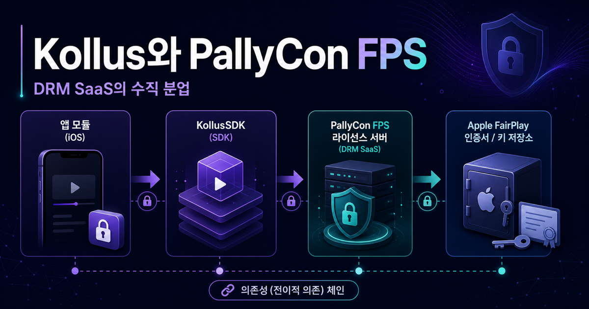
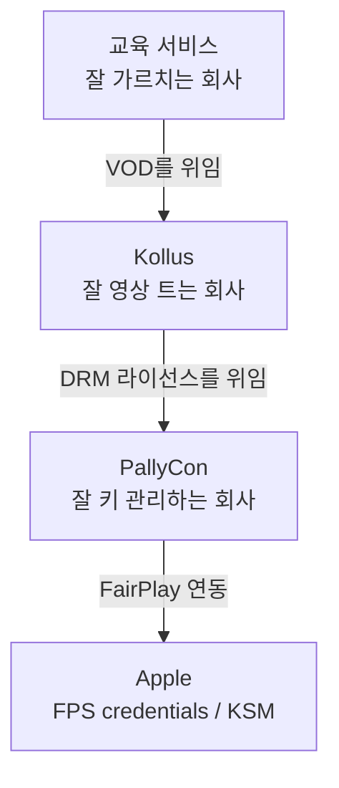
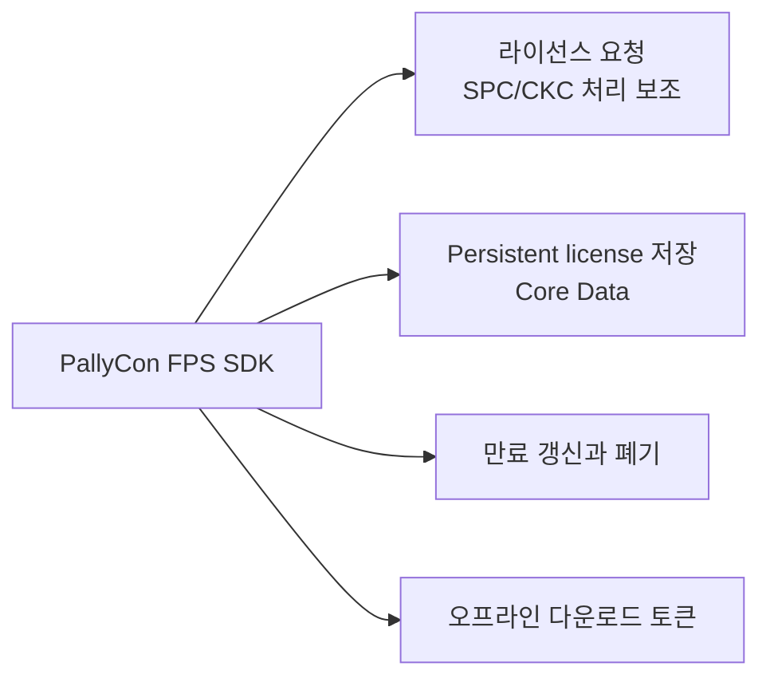
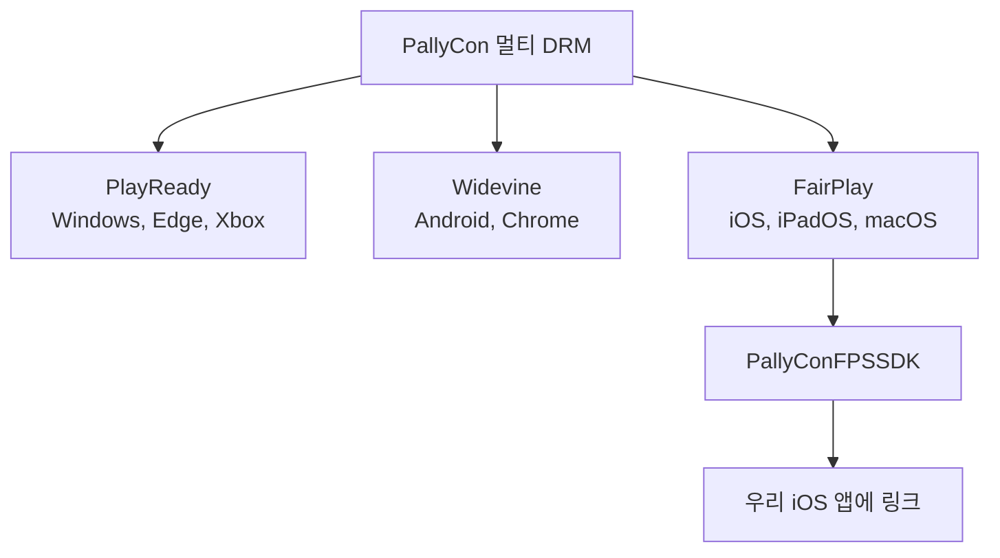
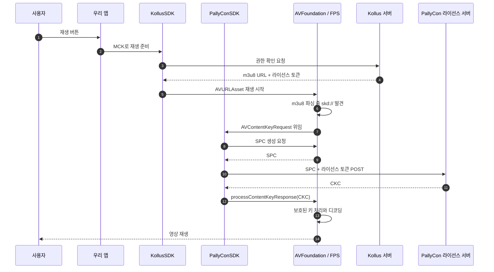
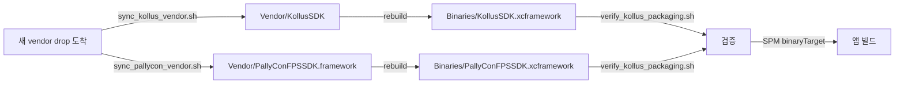

# [4편] Kollus는 왜 PallyCon FPS와 짝꿍인가 — DRM SaaS의 시장 구조

> 시리즈: 교육 서비스 iOS 비디오 플레이어 모듈화 이야기 (4/5)
> Author: 정준영
> Date: 2026-05-15



---

## 이번 글이 다루는 질문

지난 편에서 우리 회사가 왜 Kollus를 쓰는지를 다뤘다. 결론은 명료했다. 트랜스코딩, CDN, DRM 패키징, 어드민, 분석을 우리가 직접 짓느니, 그걸 전문으로 하는 Kollus에게 맡기는 게 비교 우위를 살린다. 이 결정은 우리 회사 입장에서 옳다.

그러면 자연스럽게 한 층 더 깊은 질문이 떠오른다.

> "그러면 Kollus는 왜 FairPlay 라이선스 서버를 직접 안 만들고 PallyCon이라는 또 다른 회사의 SDK를 쓰는 거죠?"

이 질문이 흥미로운 이유는, **같은 Build-vs-Buy 논리가 한 단계 위에서도 똑같이 작동한다**는 점이 보이기 때문이다. 우리가 Kollus에게 위임한 것과 비슷한 이유로 Kollus 경로는 PallyCon FPS SDK를 함께 요구한다. 이게 소프트웨어 시장의 자연스러운 **수직 분업** 구조다. 그리고 그 분업의 결과로 우리 패키지의 Kollus 엔진에는 KollusSDK와 PallyConFPSSDK가 짝으로 링크된다.

이 글은 그 분업의 정체와, 우리 코드 안에서 PallyCon이 정확히 어디에 있는지를 다룬다.

<details>
<summary>먼저 알고 읽으면 좋은 용어</summary>

- **DRM SaaS**: 라이선스 서버와 클라이언트 SDK를 한 묶음으로 빌려 주는 서비스 형태다. 사업자는 콘텐츠와 사용자 정보만 들고 와도 DRM을 켤 수 있다.
- **FPS Deployment Package / credentials**: FairPlay Streaming을 운영 환경에 적용하기 위해 Apple 승인 뒤 준비하는 서버 SDK, 배포 자격, 인증서 관련 자료를 통칭해서 설명하는 말이다. 실제 키 생성과 등록 절차는 Apple 문서와 DRM 사업자 가이드에 묶인다.
- **KSM(Key Server Module)**: FairPlay Streaming에서 클라이언트가 보낸 SPC를 처리하고 CKC를 돌려주는 라이선스 서버 쪽 구성요소다.
- **수직 분업**: 한 산업 안에서 단계별로 다른 회사가 전문화하는 구조다. 콘텐츠 호스팅은 Kollus, DRM 라이선스는 PallyCon이 맡는 식이다.

</details>

---

## 1. Kollus의 입장에서 다시 보기

이 글을 이해하려면 잠깐 우리가 교육 서비스를 운영하는 회사라는 사실을 잊고, Kollus 회사 안의 한 시니어 개발자가 됐다고 가정해 보자. Kollus는 한국 OTT, 강의, 기업 교육 시장에 VOD 플랫폼을 판다. 고객 회사가 Kollus 콘솔에 영상을 올리면, Kollus는 그걸 트랜스코딩하고 CDN에 배포한다. 여기까지는 Kollus의 자체 기술이다.

문제는 그다음이다. 고객이 "유료 콘텐츠라 DRM이 필요해요"라고 요구한다. Kollus 입장에서 선택지는 두 가지다.

하나는 **직접 짓는 길**. Apple FairPlay Streaming, Google Widevine, Microsoft PlayReady를 직접 연동하고, 각 DRM별 라이선스 발급 서버와 운영 절차를 갖춘다. 콘텐츠 키 관리, 권한 검증, 장애 대응, 키 로테이션, 보안 심사까지 자체 책임이 된다. 이 영역은 단순 API 서버가 아니라 DRM 운영 경험이 필요한 별도 전문 영역이다.

또 하나는 **사는 길**. PallyCon(DoveRunner), EZDRM, Verimatrix 같은 DRM SaaS와 계약한다. 그쪽이 이미 멀티 DRM 라이선스 발급 인프라와 클라이언트 SDK를 서비스로 제공하고 있다. Kollus는 자기 VOD 플랫폼 흐름 안에서 DRM 라이선스 처리를 외부 DRM SaaS와 연결하고, 사용자가 재생할 때 해당 DRM 서버가 권한에 맞는 라이선스를 발급해 준다.

이 두 선택지를 놓고 보면 방향은 분명해진다. **Kollus의 비교 우위는 VOD 플랫폼이지 DRM 라이선스 서버가 아니다.** DRM 라이선스 서버를 직접 짓는 인력과 시간을 더 좋은 트랜스코딩, 더 빠른 CDN, 더 똑똑한 어드민 웹에 쓰는 게 회사 전체에 훨씬 이득이다. 적어도 우리 레포의 현재 패키징 결과만 보면, Kollus 경로는 PallyConFPSSDK를 함께 요구하는 구조로 내려와 있다. 우리 회사가 Kollus를 산 것과 같은 계열의 위임 논리다.

<details>
<summary>용어 토글: Kollus 입장에서의 Build-vs-Buy</summary>

- **직접 짓는 길(Build)**: Apple, Google, Microsoft 계열 DRM을 직접 연동하고 라이선스 서버, 키 관리, 보안 운영을 직접 책임지는 선택이다.
- **사는 길(Buy)**: PallyCon 같은 DRM SaaS를 붙여 이미 운영 중인 라이선스 서버와 SDK를 사용하는 선택이다.
- **비교 우위**: 회사가 상대적으로 더 잘하고, 고객에게 더 큰 가치를 만드는 영역이다. Kollus의 비교 우위는 VOD 플랫폼이다.
- **수직 분업**: 고객 앱, VOD 플랫폼, DRM SaaS처럼 각 계층을 가장 잘하는 회사가 나눠 맡는 구조다.

</details>



---

## 2. PallyCon은 누구이고, 무엇을 파는가

PallyCon은 한국의 **INKA Entworks**가 운영하던 **멀티 DRM SaaS** 브랜드다. 2025년 이후 공식 문서에서는 PallyCon이 **DoveRunner**로 리브랜딩됐다고 안내하지만, 우리 레포와 현재 vendor SDK 이름에는 여전히 `PallyConFPSSDK`라는 이름이 남아 있다. 이 글에서는 레포 안의 실제 바이너리 이름에 맞춰 PallyCon이라고 부른다.

PallyCon이 파는 것은 두 가지로 정리할 수 있다. 하나는 **라이선스 서버 운영**이다. DoveRunner 문서 기준으로 멀티 DRM 라이선스 서비스는 PlayReady, Widevine, FairPlay Streaming 같은 DRM별 라이선스 발급과 콘텐츠 키 관리를 제공한다. 고객 회사는 토큰 방식이나 프록시 방식으로 권한 정보를 전달하고, DRM 서버는 단말의 DRM 타입에 맞는 라이선스를 발급한다.

또 하나는 **클라이언트 SDK**다. iOS용 `PallyConFPSSDK`, Android용 SDK, 웹용 플레이어 연동 문서가 있다. iOS FPS SDK는 시리즈 2편에서 본 SPC/CKC 흐름을 앱 쪽에서 직접 구현해야 하는 부담을 줄인다. 우리는 `AVContentKeySession`이나 `AVAssetResourceLoaderDelegate` 기반의 키 처리 흐름을 애플리케이션 코드에 직접 노출하지 않는다.

<details>
<summary>용어 토글: PallyCon이 파는 두 가지</summary>

- **라이선스 서버 운영**: 클라이언트가 보낸 DRM challenge를 처리하고, 권한이 있으면 DRM 타입에 맞는 라이선스를 발급하는 서버를 운영하는 일이다.
- **콘텐츠 키 등록**: 어떤 콘텐츠를 어떤 키로 암호화했는지 DRM SaaS에 등록해 두는 작업이다.
- **클라이언트 SDK**: 앱 안에서 FairPlay 라이선스 요청, CKC 전달, persistent license 저장 같은 반복 작업을 감싸 주는 라이브러리다.
- **멀티 DRM SaaS**: FairPlay, Widevine, PlayReady를 한 업체가 함께 제공하는 서비스다.

</details>

PallyCon SDK 안을 좀 들여다보면 라이선스 발급 외에도 흥미로운 기능이 들어 있다. 오프라인 다운로드를 위한 persistent license를 Core Data로 영속화해 주는 부분이다. 시리즈 2편에서 다룬 그 까다로운 부분이다. PallyCon SDK 헤더 파일 안에는 `ContentKey`, `License`, `Customer` 같은 NSManagedObject가 정의되어 있고, `PallyConFPSModel.momd`라는 데이터 모델 파일이 동봉되어 있다. 라이선스 한 건의 생애 주기 — 발급, 저장, 만료 체크, 갱신, 삭제 — 가 그 안에서 일관되게 처리된다. 우리가 직접 짰다면 사람-월 단위 작업이 들었을 부분이다.



<details>
<summary>용어 토글: Core Data, NSManagedObject, persistent license, momd</summary>

- **Core Data**: Apple이 제공하는 영속화 프레임워크다. 객체 모델을 정의하면 SQLite 등 저장소에 저장과 조회를 알아서 해 준다.
- **NSManagedObject**: Core Data가 관리하는 객체의 부모 클래스다. 한 줄짜리 강의 라이선스도 이 클래스의 인스턴스로 표현된다.
- **persistent license**: 다운로드된 콘텐츠를 오프라인에서도 재생할 수 있도록 저장되는 FairPlay의 persistable content key 계열 데이터다. 일반 파일처럼 다른 기기로 옮겨 재사용하는 용도의 데이터가 아니다.
- **momd**: 컴파일된 Core Data 모델 파일 묶음이다. SDK 안에 미리 정의된 라이선스 테이블 구조가 들어 있다.

</details>

---

## 3. iOS 앱에서 PallyCon은 iOS 슬라이스만 쓴다

여기서 한 가지 디테일을 짚고 가자. PallyCon은 멀티 DRM SaaS이지만, iOS 앱에는 그중 **FairPlay 부분만 들어온다**. SDK 이름이 `PallyConFPSSDK`인 이유다. `FPS = FairPlay Streaming`이라는 약자가 그대로 박혀 있다.

PallyCon의 헤더 파일을 들춰 보면 이런 enum이 있다.

```objc
typedef SWIFT_ENUM(int8_t, DrmType, open) {
  DrmTypePlayReady = 0,
  DrmTypeWideVine = 1,
  DrmTypeFairPlay = 2,
};
```

`DrmType`이 세 가지로 정의되어 있다. 하지만 우리가 링크한 바이너리는 이름부터 `PallyConFPSSDK`이고, iOS/FairPlay 경로를 위한 SDK다. 그래서 우리 앱 관점에서 이 enum은 사실상 `FairPlay` 경로를 설명하는 부가 정보에 가깝다. PallyCon 입장에서는 멀티 DRM 제품군의 공통 개념이 SDK 표면에 남아 있고, 우리 회사는 그중 iOS/FPS 슬라이스만 쓰는 것이다.

<details>
<summary>용어 토글: DrmType과 iOS 슬라이스</summary>

- **enum**: 정해진 선택지 중 하나만 표현하는 타입이다. 여기서는 PlayReady, Widevine, FairPlay 중 하나를 나타낸다.
- **PlayReady**: Microsoft 계열 플랫폼에서 주로 쓰는 DRM이다.
- **Widevine**: Google 계열 플랫폼과 Android, Chrome에서 주로 쓰는 DRM이다.
- **FairPlay**: Apple 플랫폼에서 쓰는 DRM이다. iOS 앱에서는 이 선택지만 실질적으로 의미가 있다.
- **슬라이스(slice)**: 큰 SDK나 제품군 중 특정 플랫폼에 필요한 일부만 떼어 보는 관점이다. `PallyConFPSSDK`는 PallyCon의 iOS/FairPlay 슬라이스다.

</details>



이 사실 하나만 봐도 PallyCon이 어떤 제품군인지가 그려진다. **Android와 Windows와 iOS와 웹을 모두 커버하는 멀티 DRM 사업자이고, iOS는 그중 한 슬라이스일 뿐이다.** Kollus 같은 VOD 플랫폼 입장에서는 한 사업자가 멀티 DRM을 다 처리해 준다는 점이 운영상 큰 이점이 된다. 여기서 "Kollus가 왜 PallyCon을 택했는가"는 외부 의사결정이므로 단정할 수 없지만, 우리 레포의 결과물은 그 선택의 흔적을 분명히 보여 준다.

---

## 4. 우리 앱에서 PallyCon은 어디에 있는가 — "직접 호출 0줄"의 의미

이제 우리 레포로 돌아오자. 가장 충격적인(혹은 인상적인) 사실은, 우리 레포의 `Sources/` 어디를 grep해도 `PallyCon`이라는 단어가 단 한 줄도 나오지 않는다는 점이다.

```bash
$ grep -ri "PallyCon" Sources/
$ # (출력 없음)
```

정확히 말하면, `Sources/`의 우리 Swift 코드에는 PallyCon이 직접 등장하지 않는다. 대신 패키징 표면에는 여러 군데 등장한다. `Vendor/PallyConFPSSDK.framework/`는 원본 SDK 복사본이고, `Binaries/PallyConFPSSDK.xcframework`는 SwiftPM이 소비하는 canonical 산출물이다. `Package.swift`, packaging 문서, 재생성 스크립트도 이 바이너리를 다룬다.

```swift
.binaryTarget(
    name: "VideoPlayerPallyConBinary",
    path: "Binaries/PallyConFPSSDK.xcframework"
),

.target(
    name: "VideoPlayerEngineKollus",
    dependencies: [
        "VideoPlayerShellSupport",
        "VideoPlayerKollusBinary",
        "VideoPlayerPallyConBinary"   // ← Kollus가 PallyCon에 link로 의존
    ],
    ...
),
```

`VideoPlayerPallyConBinary`는 SPM binaryTarget으로만 존재한다. `VideoPlayerEngineKollus`의 의존성 목록에 적혀 있을 뿐, 우리 Swift 코드가 `import PallyConFPSSDK`를 하는 곳은 없다. **그러면 PallyCon은 왜 거기 있을까?**

답은 **link dependency**다. Kollus static library 안에는 `PallyConFPSSDK` 클래스 참조가 들어 있고, 우리 `Package.swift`는 그 의존성을 `VideoPlayerEngineKollus` 타깃의 명시 dependency로 고정해 둔다. 우리 코드가 직접 `import PallyConFPSSDK`를 하지 않더라도, **Kollus 엔진을 쓰는 product를 선택하면 PallyCon binary target도 함께 링크되는** 구조다.

<details>
<summary>용어 토글: 직접 호출은 없는데 왜 링크해야 하나</summary>

- **직접 의존성**: 우리 코드가 `import`하거나 직접 호출하는 라이브러리다. `KollusPlayerAdapter` 입장에서는 KollusSDK가 직접 의존성이다.
- **전이 의존성(transitive dependency)**: 우리가 쓰는 라이브러리가 다시 필요로 하는 라이브러리다. PallyCon은 우리 도메인 코드가 직접 쓰지는 않지만 Kollus 경로가 필요로 하는 의존성이다.
- **link**: 컴파일된 코드 조각들이 서로 필요한 함수와 타입을 찾도록 바이너리를 연결하는 단계다.
- **symbol**: 바이너리 안에서 함수, 타입, 전역 값 등을 가리키는 이름이다.
- **undefined symbol**: link 단계에서 필요한 symbol을 찾지 못했다는 에러다. 이 글에서는 그런 류의 문제를 피하기 위해 PallyCon binary target을 명시적으로 함께 묶어 둔 구조를 설명한다.

</details>

이 사실은 시니어 입장에서 두 가지를 시사한다.


첫째, **추상화 경계가 얼마나 잘 그어졌는지**가 한눈에 드러난다. PallyCon은 Kollus의 구현 디테일이고, Kollus는 우리 모듈의 구현 디테일이다. 우리 도메인 코드는 두 단어 다 모른다. 추상화가 깨지지 않은 채 의존성 그래프 맨 아래에 PallyCon이 묻혀 있다.

둘째, PallyCon 바이너리는 product 선택에 따라 빌드 그래프에서 빠질 수 있다. `VideoPlayerCore`, `VideoPlayerShellSupport`, `VideoPlayerEngineNative`처럼 필요한 product만 선택하면 Kollus와 PallyCon binary target을 피할 수 있다. 반대로 umbrella 성격의 `VideoPlayerModule`이나 `VideoPlayerEngineKollus`를 선택하면 PallyCon도 함께 들어온다. vendor 격리는 자동 마법이 아니라 **SPM product 경계로 선택지를 만든 설계**다.

---

## 5. 라이선스 발급 흐름을 다시 따라가기 — 이번엔 PallyCon 시점으로

시리즈 2편에서 SPC/CKC 흐름을 우리(클라이언트) 시점에서 그렸다. 이번엔 같은 흐름을 PallyCon 시점에서 한 번 더 따라가 보자. 머릿속에서 입체가 잡힌다.

사용자가 우리 강의 앱에서 강의 재생 버튼을 누른다. 우리 모듈이 `KollusPlayerAdapter`에게 위임하고, 어댑터는 Kollus SDK에 MCK를 던지며 "재생 준비"를 요청한다. Kollus SDK는 자기 서버에 "이 사용자가 이 MCK를 풀어볼 수 있나"를 묻고, OK 응답을 받으면 사용자에게 m3u8 URL과 PallyCon 라이선스 발급에 쓸 **인증 토큰**을 함께 받는다. 이 토큰이 중요하다. 이게 시리즈 2편에서 "SPC와 함께 라이선스 서버에 보낼 추가 자료"라고 두루뭉술하게 언급한 그 자료다.

AVPlayer가 m3u8을 받아 파싱하다 FairPlay 키 요청이 필요한 구간을 만난다. 이때 키 요청을 처리하는 주체는 우리 앱 코드가 아니라 Kollus/PallyCon SDK 내부다. SDK는 AVFoundation의 FairPlay 키 요청 API를 이용해 SPC를 만들고, 그 SPC와 아까 받은 인증 토큰 또는 custom data를 묶어 PallyCon 라이선스 서버에 POST한다.

PallyCon 서버에서는 이런 일이 벌어진다. 받은 SPC와 권한 정보를 바탕으로 FairPlay KSM 경로에서 라이선스 발급 가능 여부를 판단한다. 토큰 방식이라면 토큰에 담긴 사용자, 콘텐츠, 만료, 보안 옵션을 검증하고, 프록시 방식이라면 서비스 백엔드와의 연동을 통해 권한을 확인한다. 조건을 통과하면 FPS KSM이 CKC 데이터를 만들어 응답한다.

<details>
<summary>용어 토글: 라이선스 토큰과 권한 검증</summary>

- **인증 토큰**: 사용자가 누구인지, 어떤 콘텐츠를 요청하는지, 언제까지 유효한지 같은 정보를 담은 짧은 권한 증명값이다.
- **라이선스 DB**: 콘텐츠 키, 사용자 권한, 만료 시간, 다운로드 가능 여부 같은 DRM 판단 정보를 저장하는 데이터베이스다.
- **DRM challenge**: 단말의 native DRM 모듈이 만든 라이선스 요청 데이터다. FairPlay에서는 SPC가 이 역할을 한다.
- **동시 접속 수**: 한 계정이나 라이선스로 동시에 재생할 수 있는 기기 수 제한이다.
- **CKC(Content Key Context)**: FairPlay KSM이 SPC에 대한 응답으로 돌려주는 키 응답 데이터다. 클라이언트는 이 데이터를 AVFoundation에 넘긴다.

</details>

응답으로 받은 CKC를 PallyCon SDK가 AVFoundation의 키 요청 흐름에 전달한다. 그 뒤 콘텐츠 키 처리는 AVFoundation/FairPlay의 보호된 재생 경로 안에서 진행되고, 사용자 화면에 강의가 흐른다. 여기서 중요한 점은 내부 보안 구현의 세부가 아니라, 우리 애플리케이션 코드가 SPC/CKC HTTP 호출과 키 응답 처리를 직접 들고 있지 않다는 사실이다.



이 전체 흐름에서 우리 앱 코드가 직접 짠 부분은 **첫 단계**(재생 버튼 누름) 단 하나뿐이다. 나머지는 모두 Kollus와 PallyCon이 내부에서 처리한다. 그리고 그 위임의 각 단계가 회사의 비교 우위와 정확히 맞물려 있다.

---

## 6. 패키징의 디테일 — Kollus와 PallyCon이 짝으로 묶이는 이유

마지막으로 우리 레포의 `docs/kollus-sdk-packaging.md` 문서가 왜 "Kollus와 PallyCon" 두 vendor를 함께 다루는지 짚고 가자. 디테일에 진짜 의미가 있다.

이 문서를 보면 vendor SDK 동기화 스크립트가 두 개로 짝지어 있다. `sync_kollus_vendor.sh`와 `sync_pallycon_vendor.sh`. 빌드 스크립트도 짝이다. `rebuild_kollus_xcframework.sh`와 `rebuild_pallycon_xcframework.sh`. 검증 스크립트는 하나(`verify_kollus_packaging.sh`)지만 그 안에서 두 vendor를 함께 본다.

이런 짝꿍 구조는 우연이 아니다. **두 SDK는 호환성 세트로 검증되어야 한다**. Kollus가 새 버전을 내놓을 때, 그 안에서 참조하는 PallyCon SDK 표면이 달라졌을 수 있다. 그래서 우리는 Kollus 새 버전 drop을 받으면, 그 안에 어떤 PallyCon 버전을 가정하고 있는지 확인하고, 두 vendor를 같은 검증 흐름에 올린다.

만약 PallyCon만 먼저 갱신하면 어떻게 될까. API나 binary symbol 호환성이 유지되면 괜찮을 수 있지만, 그렇지 않으면 link 실패나 런타임 오류가 날 수 있다. 반대도 마찬가지다. 그래서 두 SDK를 별개 파일로 보관하더라도 운영상으로는 **같은 호환성 묶음**으로 취급하는 편이 안전하다.



이 짝꿍 관리가 자동화되어 있지 않으면 운영이 굉장히 까다로워진다. 누군가 실수로 한쪽만 갱신해 올리면 다음 빌드나 실제 재생 검증에서 문제가 늦게 드러날 수 있다. 그래서 우리는 두 vendor를 같은 디렉토리 구조와 같은 패키징 파이프라인으로 묶었고, packaging 문서에 두 SDK를 같은 흐름에서 재생성하고 검증하는 규칙을 남겼다. **운영 디테일이 코드 구조에 그대로 반영된 사례**다.

<details>
<summary>용어 토글: xcframework, binary target, transitive dependency</summary>

- **xcframework**: 여러 아키텍처와 플랫폼(arm64 iOS, arm64+x86 시뮬레이터 등)의 바이너리를 한 패키지에 담는 Apple 표준 포맷이다. SwiftPM이 binaryTarget으로 직접 소비할 수 있다.
- **binary target**: 소스 컴파일 대신 미리 빌드된 바이너리를 SwiftPM이 가져다 쓰도록 선언하는 방식이다. xcframework 경로만 가리키면 된다.
- **transitive dependency**: 우리가 직접 의존하지 않더라도, 우리가 의존하는 라이브러리가 다시 의존하는 라이브러리를 뜻한다. PallyCon이 우리 입장에서 정확히 이 위치에 있다.

</details>

---

## 7. "그래서 왜 PallyCon이 거기 있나"를 한 문장으로

지금까지의 이야기를 한 문장으로 묶으면 이렇다.

> **Kollus 경로는 VOD 플랫폼 책임을 KollusSDK에 맡기고, FairPlay 라이선스 처리 책임을 PallyConFPSSDK와 함께 가져온다. 그래서 우리 패키지의 Kollus 엔진은 KollusSDK와 PallyConFPSSDK를 함께 링크하지만, 우리 도메인 코드는 두 SDK 어느 쪽도 직접 호출하지 않는다.**

이 한 문장이 의존성 그래프의 모든 의미를 담는다.

다음 편에서 마지막으로, 이 모든 이야기를 토대로 **왜 우리가 지금 플레이어 모듈화를 진행 중인지**를 정면으로 다룬다. 위에서 본 3단 추상화(우리 모듈 → Kollus → PallyCon)와, vendor 격리, 그리고 Swift Concurrency 기반의 actor 어댑터 설계가 어떤 문제를 풀려고 등장했는지를 마무리한다.

> **다음 편: [5편] 플레이어 모듈화 — 왜, 어떻게, 무엇을 얻었나**

---

### 참고

- Apple Developer: [FairPlay Streaming](https://developer.apple.com/streaming/fps/)
- DoveRunner Docs: [DoveRunner Content Security Docs](https://pallycon.com/docs/en/)
- DoveRunner Docs: [Multi-DRM Native Client Integration Guide](https://pallycon.com/docs/en/multidrm/clients/multidrm-native-integration/)
- DoveRunner: [Multi-DRM License Service](https://doverunner.com/kr/content-security/license-service/)
- 사내 코드: `Vendor/PallyConFPSSDK.framework/Headers/PallyConFPSSDK-ObjC.h`
- 사내 코드: `Package.swift`의 `VideoPlayerPallyConBinary` target
- 사내 문서: `docs/kollus-sdk-packaging.md`
- 이전 편: [3편 우리는 왜 KollusSDK를 쓰는가](./03-why-kollus-sdk.md)
