# [5편] 플레이어 모듈화 — 왜, 어떻게, 무엇을 얻었나

> 시리즈: 교육 서비스 iOS 비디오 플레이어 모듈화 이야기 (5/5)
> Author: 정준영
> Date: 2026-05-15

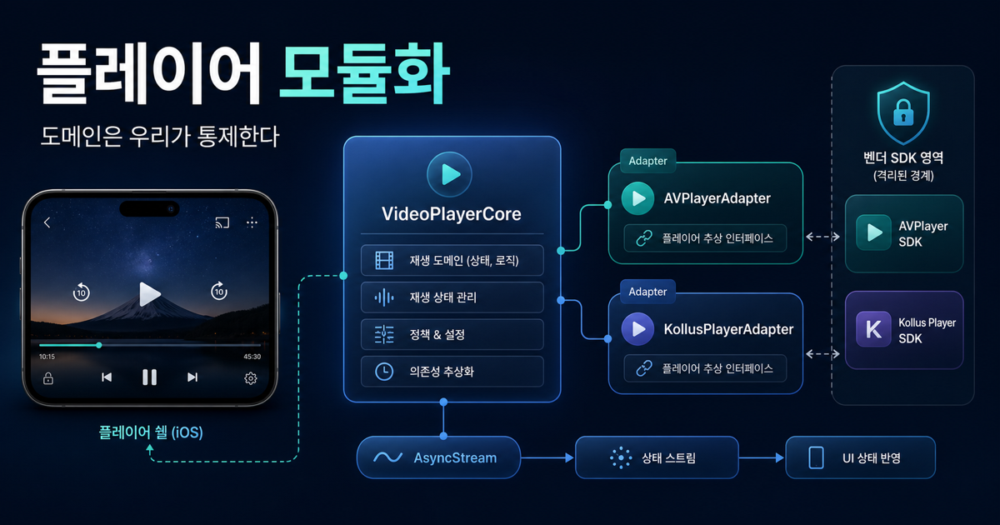

---

## 시리즈를 마무리하며

여기까지 따라오신 분이라면 이미 큰 그림이 잡혔을 것이다. 우리 강의 앱은 영상을 보호하기 위해 FairPlay라는 Apple DRM을 써야 하고, 그 통합 디테일은 PallyCon SDK가 감추고 있으며, 그 위에 Kollus SDK가 한 겹을 더 얹어 콘텐츠 전달까지 묶어 준다. 우리 회사는 그 두 SDK를 사서 강의 재생 인프라를 갖췄다.

이 마지막 편은 그 위에서 던지는 질문이다.

> "이미 Kollus SDK 한 줄로 강의가 재생되는데, 도대체 왜 우리가 별도의 플레이어 모듈을 또 만들어 그 위에 추상화를 얹고 있을까?"

답은 한 마디로 "**나중에 후회하지 않으려고**"다. 지금 잘 도는 코드가 미래에도 잘 돌리라는 보장은 없다. iOS가 바뀌고, vendor가 바뀌고, 사업이 바뀐다. 그때마다 강의 앱 전체를 다시 짜고 싶지 않다. 이 글은 그 미래를 위해 우리가 어떤 설계 원칙을 세웠고, 코드가 어떤 모양이 됐고, 어떤 효용이 이미 실현됐고, 어떤 trade-off를 받아들였는지를 정리한다.

<details>
<summary>먼저 알고 읽으면 좋은 용어</summary>

- **모듈화**: 한 덩어리 코드를 책임이 분명한 작은 단위로 나누는 작업이다. 보통 SPM product, 패키지, 프레임워크 같은 경계로 표현된다.
- **추상화**: 구체적인 구현 위에 더 단순한 인터페이스를 얹어 그 인터페이스 뒤에 디테일을 숨기는 일이다.
- **actor**: Swift 5.5에서 도입된 동시성 단위다. 내부 상태를 actor isolation으로 보호하고, 잘못된 cross-actor 접근을 컴파일러가 진단하게 해 준다.
- **AsyncStream**: Swift의 비동기 시퀀스 타입이다. 시간에 따라 발생하는 값들을 `for await`로 받아 처리할 수 있다.

</details>

---

## 1. 모듈화 이전의 풍경 — 어디가 아팠는가

모든 모듈화는 "지금 코드가 아프다"는 진단에서 시작한다. 우리 앱도 마찬가지였다. 모듈화 이전의 강의 앱 안에서 플레이어 코드가 어떤 모양이었는지를 먼저 그려 보자.

기존 앱에는 플레이어 ViewController가 있었다. 그 안에서 `KollusVideoView`를 직접 만들고, KollusSDK의 delegate를 직접 채택하고, 재생/일시정지/배속/자막 UI 콜백을 모두 같은 클래스에서 처리했다. 코드 자체는 잘 작성된 편이었지만, **한 화면 클래스 안에 너무 많은 책임이 섞여 있었다**. UI 상태 관리, KollusSDK 호출, 자막 토글 정책, 백그라운드 오디오 세션 제어, 다운로드 상태 처리, 분석 로깅까지 같은 흐름 안에 얽혔다.

이 모양이 만들어 내는 통증은 일상이 됐다. 시뮬레이터에서 자막 버튼 UI를 테스트하려고 빌드를 돌리면 KollusSDK가 시뮬레이터 슬라이스에서 잘못 link되어 실패했다. 자막 로직 단위 테스트를 짜려고 보면, 그 로직이 KollusSDK 콜백 안에 박혀 있어 분리가 불가능했다. 누가 새 기능을 추가할 때마다 "이 코드가 어디서부터 어디까지가 책임인지" 한참을 들여다봐야 했다.

여기에 더 큰 그림자가 하나 있었다. **vendor lock-in이 코드 레벨까지 침투해 있었다**. 사업 부서에서 "다른 VOD 사업자로 갈아탈 수 있나?"라는 질문이 들어왔을 때, 기술적으로 답하기 어려웠다. ViewController 곳곳에 `import KollusSDK`와 `kollusView.something()`이 흩뿌려져 있으면, vendor를 바꿀 때 그 줄들을 다 찾아 다시 써야 한다. 이 구조는 벤더 변경 가능성을 낮추고, 장기 운영 선택지를 좁힌다.

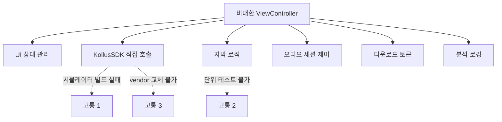

이 모든 통증이 한 곳에 모여 "이제 정말 갈라야 한다"는 합의를 만들었다. 그게 `videoplayer-ios-ms` 모듈화 작업의 출발점이다.

<details>
<summary>용어 토글: 모듈화 이전 코드에서 아팠던 지점</summary>

- **ViewController 비대화**: 화면 표시, 사용자 입력, SDK 호출, 상태 관리, 로깅이 한 클래스에 모여 변경 영향 범위가 커진 상태다.
- **delegate 직접 채택**: 외부 SDK 콜백을 화면 클래스가 바로 받는 구조다. 빠르게 붙일 수 있지만 테스트와 교체가 어려워진다.
- **vendor lock-in**: 특정 SDK 호출이 앱 코드 곳곳에 퍼져 나중에 다른 vendor로 바꾸기 어려워진 상태다.
- **시뮬레이터 슬라이스**: 시뮬레이터에서 link할 수 있는 바이너리 조각이다. vendor SDK가 이 조각을 제대로 제공하지 않으면 시뮬레이터 빌드가 깨진다.
- **단위 테스트 불가**: 테스트하려는 정책이 SDK 콜백이나 UI 클래스 안에 묶여 있어 작은 단위로 검증할 수 없는 상태다.

</details>

---

## 2. 설계의 다섯 원칙 — 우리가 합의한 것들

모듈화에 들어가기 전, 우리는 다섯 가지 설계 원칙을 먼저 글로 적었다. 코드를 짜기 전에 원칙을 먼저 정한 이유는 단순하다. **원칙 없는 모듈화는 결국 또 다른 거대 클래스를 만든다.** 무엇을 분리해야 하고 무엇을 같이 둬야 하는지 판단할 잣대가 필요했다.

### 2.1 엔진 교체 가능성 (Engine Replaceability)

첫 번째 원칙. 재생 엔진은 protocol 뒤에 숨는다. 코드 어디에서도 `KollusVideoView`나 `AVPlayer`를 직접 만지지 않는다. 도메인 코드가 다루는 건 오직 `PlayerPlaybackEngine`이라는 protocol뿐이다.

```swift
public protocol PlayerPlaybackEngine: Actor {
    nonisolated static var capabilities: EngineCapabilities { get }

    func prepare(source: PlaybackSource) async throws
    func play()
    func pause()
    func seek(to time: TimeInterval) async
    func stop()

    var currentState: PlaybackState { get }
    var eventStream: AsyncStream<PlayerEvent> { get }
}
```

이 protocol을 채택하는 구현체는 두 개가 있다. `AVPlayerAdapter`와 `KollusPlayerAdapter`. 미래에는 `BrightCovePlayerAdapter`나 `JWPlayerAdapter`가 추가될 수도 있다. 어느 쪽이든 도메인 코드(`PlayerCore`, ViewModel)는 그 차이를 모른다.

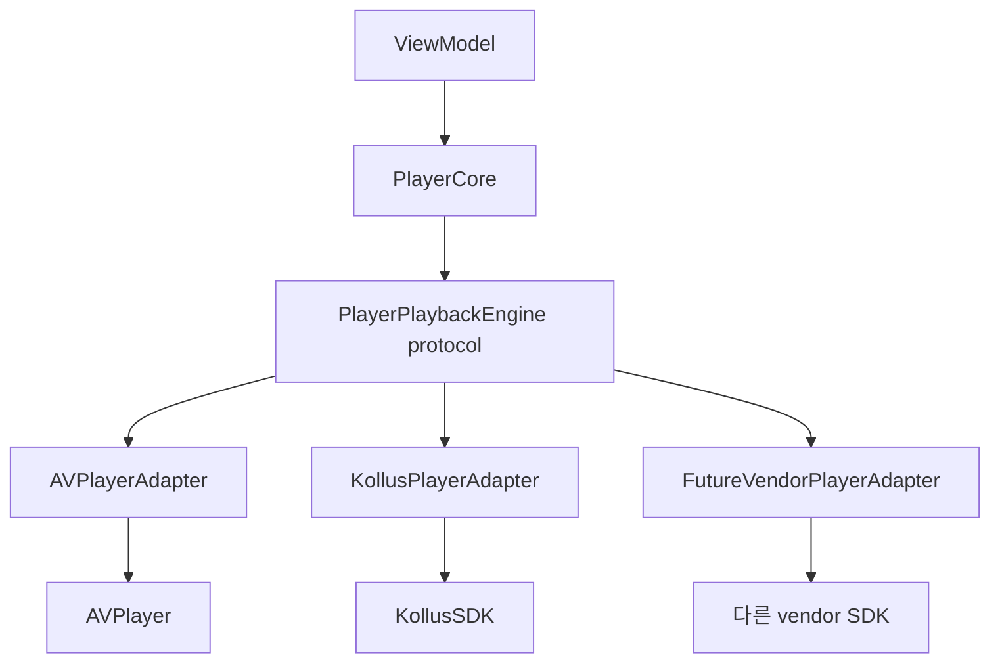

### 2.2 단방향 상태 흐름 (Unidirectional State Flow)

두 번째 원칙. 명령은 한 방향으로만 들어오고, 상태는 다른 한 방향으로만 나간다.

```swift
public enum PlaybackCommand: Sendable {
    case load(PlaybackSource)
    case play
    case pause
    case seek(to: TimeInterval)
    case seekWithOrigin(to: TimeInterval, origin: PlayerSeekOrigin)
    case setPlaybackRate(Double)
    case setSkipInterval(TimeInterval)
    case setSubtitleVisible(Bool)
    case selectSubtitleTrack(PlayerSubtitleTrackID?)
    case setCaptionFontSize(Int)
    case addBookmark(at: TimeInterval)
    case addBookmarkWithTitle(at: TimeInterval, title: String)
    case removeBookmark(at: TimeInterval)
    case selectSubtitleFile(URL?)
    case setDisplayLocked(Bool)
    case setDisplayScaled(Bool)
    case toggleDisplayScaling
    case stop
    // …
}

public struct PlaybackState: Sendable {
    public enum Status: Sendable {
        case idle
        case preparing
        case readyToPlay
        case playing
        case paused
        case buffering
        case finished
        case failed(PlayerError)
    }

    public let status: Status
    public let currentTime: TimeInterval
    public let duration: TimeInterval
    public let isBuffering: Bool
    public let isLive: Bool
    public let liveDuration: TimeInterval?
}

public enum PlayerEvent: Sendable {
    case stateDidChange(PlaybackState)
    case bufferingDidChange(isBuffering: Bool)
    case captionDidUpdate(text: String, isSecondary: Bool)
    case bookmarksDidLoad([Bookmark])
    case bitrateDidChange(Int)
    case externalOutputDidChange(enabled: Bool)
    case nextEpisodeAvailable(NextEpisodeInfo)
    // …
}
```

ViewModel은 use case를 통해 `PlaybackCommand`를 던지고, `PlayerCore`가 내보내는 `AsyncStream<PlaybackState>`를 구독한다. 그 사이에 양방향 추가 채널은 없다. 엔진이 "자기 마음대로 UI를 그리는" 경로는 의도적으로 차단했다. 이렇게 하면 디버깅 지점이 줄어든다. 화면이 이상하면 마지막 들어간 command와 마지막 나온 state를 먼저 확인하면 된다.

Kollus coverage 확장 이후에는 이 단방향 흐름이 더 중요해졌다. 자막 파일 선택, 제목 있는 북마크 추가/삭제, 라이브 여부, 비트레이트 변화, 외부 출력 가능 여부 같은 SDK 이벤트도 화면이 vendor 객체를 직접 만지는 대신 `PlaybackCommand`, `PlaybackState`, `PlayerEvent`로 흘러야 한다.

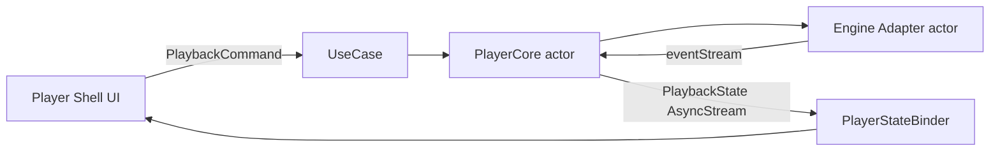

<details>
<summary>용어 토글: Command와 State 흐름</summary>

- **Command**: 사용자의 의도나 앱 정책이 플레이어로 들어가는 입력이다. `play`, `pause`, `seek` 같은 명령이 여기에 해당한다.
- **State**: 플레이어가 현재 어떤 상태인지 밖으로 내보내는 출력이다. `playing`, `paused`, `buffering`, `failed` 같은 값이다.
- **단방향 상태 흐름**: 입력은 한 방향으로 들어가고, 상태 변화는 반대 방향으로만 나가게 제한하는 구조다.
- **Binder**: 도메인 상태를 UI가 그릴 수 있는 형태로 연결해 주는 계층이다.
- **양방향 추가 채널 차단**: 엔진이나 UI가 몰래 서로 상태를 바꾸는 경로를 막아 디버깅 지점을 줄이는 설계다.

</details>

### 2.3 Capability 기반 기능 게이팅 (Capability Gating)

세 번째 원칙. 모든 엔진이 모든 기능을 지원하지는 않는다. 그러면 어떻게 해야 하나? 우리는 capability OptionSet을 도입했다.

```swift
public struct EngineCapabilities: OptionSet, Sendable {
    public static let continuesWithoutSurface = EngineCapabilities(rawValue: 1 << 0)
    public static let seamlessSurfaceSwap     = EngineCapabilities(rawValue: 1 << 1)
    public static let nativePiP              = EngineCapabilities(rawValue: 1 << 2)
    // …
}
```

엔진은 자기 capability를 선언한다. 그리고 보조 protocol(`PlayerPlaybackRateEngine`, `PlayerSubtitleEngine`, `PlayerTitledBookmarkEngine`, `PlayerExternalSubtitleEngine`, `PlayerDisplayEngine`, `PlayerAdaptiveStreamingEngine`, `PlayerPiPCapability`)을 채택 여부로 추가 기능 지원을 표현한다. 현재 `EngineCapabilities`는 백그라운드 재생처럼 엔진의 큰 동작 특성을 판단하는 데 쓰이고, 배속/자막/북마크/디스플레이/ABR/PiP 같은 명령은 보조 protocol 채택 여부로 검사한다. 지원하지 않으면 `PlayerError.engineError`를 던지거나, 정책을 안전한 값으로 자동 downgrade한다.

예를 들어 `allowsBackgroundPlayback` 정책이 켜져 있는데 엔진이 `.continuesWithoutSurface`를 지원하지 않으면, `PlayerCore`는 자동으로 정책을 끄고 `.policyDowngraded(.missingContinuesWithoutSurface)` 이벤트를 발행한다. Shell UI는 그걸 받아 "백그라운드 재생이 비활성화됨" 토스트를 띄울 수 있다. **기능이 없다고 크래시가 나는 게 아니라, 정책이 우아하게 한 단계 내려간다.**

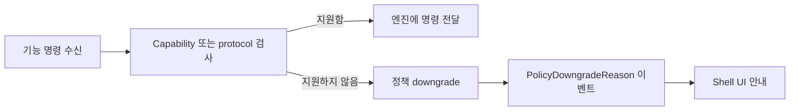

### 2.4 Vendor 격리 (Vendor Isolation)

네 번째 원칙. Kollus와 PallyCon 같은 vendor SDK는 별도 SPM product로 격리한다. Kollus가 필요 없는 화면은 그 product를 link하지도 않는다.

```swift
// Package.swift
.product(name: "VideoPlayerCore",          ...),    // 도메인만
.product(name: "VideoPlayerShellSupport",  ...),    // 조립 헬퍼
.product(name: "VideoPlayerEngineNative",  ...),    // AVPlayer 어댑터
.product(name: "VideoPlayerEngineKollus",  ...),    // Kollus + PallyCon 바이너리 포함
.product(name: "VideoPlayerModule",        ...),    // 위 전부 묶은 umbrella
```

이 분리 덕분에 두 가지가 가능해진다. AVPlayer만 쓰는 미리보기 화면이나 광고 영상은 `VideoPlayerEngineNative`만 link해서 앱 사이즈에 무거운 vendor 바이너리를 포함시키지 않을 수 있다. 테스트도 product 구성을 어떻게 잡느냐에 따라 DRM 의존성을 우회할 수 있다. 현재 패키지의 iOS test target은 Kollus 경로도 함께 검증하도록 잡혀 있지만, 소비자 앱이나 별도 테스트 구성에서는 필요한 product만 골라 링크할 수 있다.

최근 Kollus 경로는 이 원칙을 더 엄격하게 밀고 있다. SmartLearning Shell이 `KollusSDK`를 직접 import하지 않아도 되도록 `KollusEnvironment`, `KollusObserver`, `KollusDiagnosticsSink`, `KollusDownloadCenter` 같은 모듈 표면을 추가했다. Storage 인증, delegate 등록, DRM/LMS/Bookmark 콜백, 다운로드 라이프사이클은 `VideoPlayerEngineKollus` 안에 갇히고, Shell은 환경 값과 도메인 command/event만 다룬다.

### 2.5 Swift Concurrency First

다섯 번째 원칙. 모든 엔진은 `actor`로 격리되고, 상태와 이벤트는 `AsyncStream`으로 흐른다. actor-isolated 상태를 아무 곳에서나 만지지 못하게 컴파일러의 도움을 받는다.

이 결정은 단순한 트렌드가 아니다. KollusSDK와 PallyCon SDK는 내부에서 자기네 큐를 돌리고 콜백을 던진다. AVFoundation은 메인 스레드 reentrancy 이슈가 있다. 이 모든 비동기 호출이 우리 엔진 어댑터로 모일 때, 누가 누구의 상태를 만지는지를 추적하는 건 정말 어렵다. `actor` 격리를 기본값으로 두면 적어도 엔진 내부 mutable state에 대한 잘못된 cross-actor 접근은 컴파일 단계에서 드러난다.

<details>
<summary>용어 토글: 다섯 원칙에 등장한 표현</summary>

- **OptionSet**: 여러 옵션을 하나의 비트 마스크로 표현하는 Swift 표준 패턴이다. capability를 결합하기 좋다.
- **Sendable**: 여러 스레드에 안전하게 전달할 수 있다는 컴파일 타임 보증이다. 도메인 값 타입에 거의 필수로 붙는다.
- **reentrancy**: 같은 함수가 끝나기 전에 다시 호출되는 상황이다. 메인 스레드와 콜백이 얽히면 자주 발생한다.
- **umbrella product**: 여러 SPM product를 한 묶음으로 노출하는 상위 product다. 소비자가 한 줄로 import하기 편하다.
- **protocol**: 구현체가 지켜야 할 메서드와 속성의 약속이다. 엔진 교체 가능성의 핵심 경계다.
- **capability**: 특정 엔진이 지원하는 기능 목록이다. 기능 지원 여부를 런타임 정책으로 판단하게 해 준다.

</details>

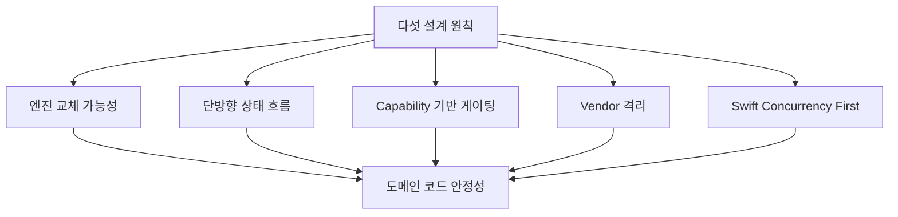

---

## 3. 코드의 모양 — 다섯 원칙이 디렉토리에 어떻게 박혔는가

원칙은 글로 적으면 멋있지만 코드로 박지 않으면 곧 잊힌다. 우리는 디렉토리 구조 자체에 원칙을 새겨 두었다. 한 번 훑어 보자.

```text
videoplayer-ios-ms/
├── Sources/VideoPlayerModule/
│   ├── Core/                # 도메인 + 유즈케이스 + 코어 (VideoPlayerCore product)
│   │   ├── Domain/         #   값 타입 도메인 모델 (Sendable)
│   │   ├── Internal/       #   PlayerCore actor (상태 머신)
│   │   └── UseCase/        #   @MainActor 유즈케이스 (Shell 경계)
│   │
│   ├── Engine/             # 엔진 어댑터들
│   │   ├── PlayerEngineAdapter.swift   # 추상 프로토콜
│   │   ├── Native/AVPlayerAdapter.swift            # VideoPlayerEngineNative
│   │   └── Kollus/KollusPlayerAdapter.swift        # VideoPlayerEngineKollus
│   │
│   └── ShellSupport/       # 조립 헬퍼 (VideoPlayerShellSupport product)
│
├── Binaries/               # SPM binaryTarget이 소비하는 xcframework
│   ├── KollusSDK.xcframework
│   └── PallyConFPSSDK.xcframework
│
├── Vendor/                 # source-of-truth (직접 수정 금지)
│   ├── KollusSDK/
│   └── PallyConFPSSDK.framework
│
├── Packaging/Kollus/Stub/  # 시뮬레이터 slice 생성용 stub
└── scripts/                # vendor sync + xcframework rebuild 자동화
```

이 디렉토리를 가만히 들여다보면 다섯 원칙이 그대로 보인다. `Core/Domain/`은 어떤 vendor도 모르고, `Engine/`은 protocol과 구현이 분리되어 있고, `Vendor/`와 `Binaries/`는 격리되어 있고, `actor`가 박힌 파일은 `Core/Internal/PlayerCore.swift`다. **원칙이 곧 폴더 이름이다.**

특히 흥미로운 부분이 `Packaging/Kollus/Stub/`이다. 시뮬레이터에서 빌드만이라도 통과시키기 위해 만든 stub SPM 패키지다. 시뮬레이터에는 KollusSDK 실제 바이너리가 동작하지 않으니, 시뮬레이터용 slice는 stub 라이브러리로 대체한다. 그 stub은 실제로 동작하지 않지만 link에는 성공한다. 이 트릭이 없으면 시뮬레이터 빌드가 통째로 깨진다. 패키징 디테일이 별도 문서(`docs/kollus-sdk-packaging.md`)에 정리될 만큼 정교하게 다뤄지는 이유다.

<details>
<summary>용어 토글: 디렉토리 구조를 읽는 법</summary>

- **`Core/Domain`**: vendor SDK와 UI를 모르는 순수 도메인 값 타입이 놓이는 곳이다.
- **`Core/Internal`**: 외부에 직접 노출하지 않는 내부 상태 머신과 actor 구현이 놓이는 곳이다.
- **`UseCase`**: UI가 호출하기 쉬운 단위로 도메인 기능을 감싼 경계다.
- **`Engine/Native`**: Apple `AVPlayer` 기반 구현이다. DRM vendor SDK 없이 동작한다.
- **`Engine/Kollus`**: Kollus SDK 호출을 우리 도메인 인터페이스로 번역하는 구현이다.
- **`Vendor/`**: 외부 업체가 준 원본 SDK 보관소다. 직접 수정하지 않는 source-of-truth로 다룬다.
- **`Binaries/`**: SwiftPM이 소비하는 `xcframework` 결과물이 놓이는 곳이다.

</details>

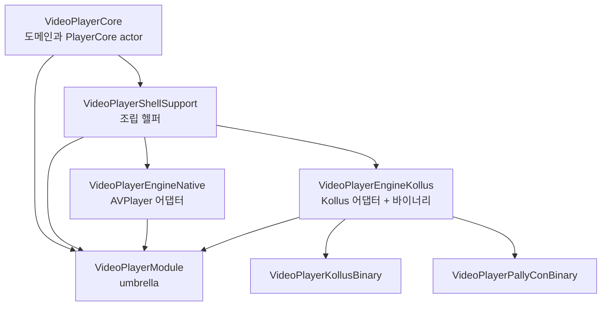

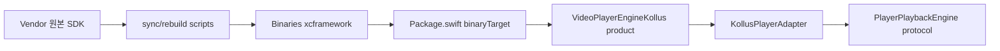

---

## 4. 모듈화가 가져다준 것들 — 이미 실현된 효용

원칙은 미래를 위한 것이지만, 효용은 이미 현재에 와 있다. 다섯 가지로 정리할 수 있다.

첫째, **테스트 가능성**. `PlayerCore`는 actor이고 protocol 의존만 받으니, 테스트용 엔진을 주입해 상태 전이와 명령 위임을 검증할 수 있다. `PlayerInterfaceTests.swift`와 `PlayerCoreRound4Tests.swift`에는 `CoreOnlyEngine`, `RateControllableEngine`, `TestPlayerEngineAdapter` 같은 테스트용 actor가 있고, `Tests/VideoPlayerModuleTests/Support/`에는 AVPlayer/Kollus 양쪽에 같은 계약 테스트를 적용하기 위한 contract factory가 있다. 최근 커밋 로그를 보면 `test: migrate AVPlayer render surface tests to Swift Testing`, `test: migrate Kollus factory tests to Swift Testing`처럼 Swift Testing으로 옮기는 작업도 진행 중이다. 이게 가능한 이유는 코드가 이미 테스트 가능한 모양이기 때문이다.

둘째, **시뮬레이터 친화성**. 도메인과 AVPlayer만으로 돌리는 빌드는 vendor 바이너리를 link하지 않는다. UI 일부 작업이나 자막 로직 검증 같은 일을 시뮬레이터에서 빠르게 돌릴 수 있다. 이전에는 매 빌드마다 KollusSDK가 시뮬레이터에서 발목을 잡았는데, 이제는 그 의존 자체를 빼는 길이 있다.

셋째, **vendor 교체 가능성**. 미래 어느 날 우리가 BrightCove로 갈아탄다고 가정해 보자. 이상적인 변경 범위는 `BrightCovePlayerAdapter.swift` 같은 새 엔진 어댑터와 `Package.swift`의 `VideoPlayerEngineBrightCove` product 정의다. 실제 전환에서는 vendor별 기능 차이를 capability와 보조 protocol로 흡수해야 하겠지만, 최소한 도메인 코드가 vendor SDK 타입을 직접 알지 않는 구조는 마련됐다. 이 구조가 있어야 기술 비교나 가격 협상에서도 "갈아탈 수 있는가"를 현실적으로 검토할 수 있다.

넷째, **책임의 명확성**. 비대한 ViewController에 섞여 있던 책임이 protocol, use case, engine adapter, shell support로 갈라졌다. 자막 로직을 고치고 싶은 사람은 자막 관련 protocol과 그 구현을 먼저 보면 된다. 백그라운드 오디오 정책을 바꾸고 싶은 사람은 `PlayerAudioSessionManager`와 lifecycle coordinator를 보면 된다. 새 팀원이 합류했을 때 "이 코드 어디서부터 봐야 해요?"라는 질문에 더 짧게 답할 수 있다.

다섯째, **컴파일 타임 안전성**. actor와 Sendable 덕분에 엔진 내부 상태를 아무 곳에서나 동기적으로 건드리는 코드는 컴파일 단계에서 드러난다. 이것이 모든 동시성 버그를 없애 주지는 않는다. 그래도 새 엔진을 추가하는 사람이 actor isolation이나 Sendable 경계를 어기면 컴파일러가 먼저 알려 주는 구조가 된다.

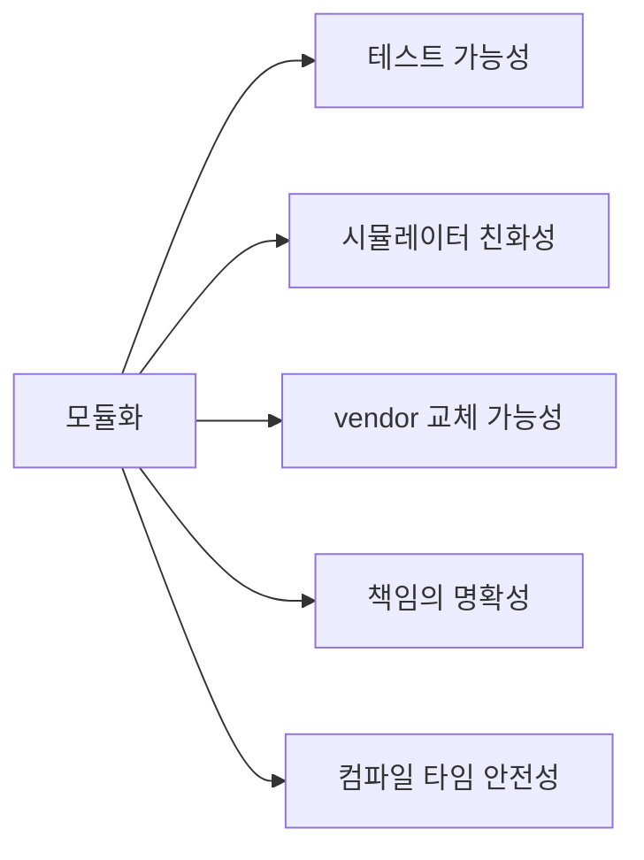

<details>
<summary>용어 토글: 모듈화 효용을 검증하는 기준</summary>

- **테스트 가능성**: 실제 vendor SDK 없이도 상태 머신과 정책을 검증할 수 있는 정도다.
- **시뮬레이터 친화성**: 실기기 전용 바이너리나 DRM 의존성 없이도 빠르게 빌드하고 테스트할 수 있는 정도다.
- **vendor 교체 가능성**: 새 어댑터를 추가해도 ViewModel과 도메인 코드가 거의 바뀌지 않는 정도다.
- **책임의 명확성**: 특정 기능을 고칠 때 봐야 할 파일과 계층이 예측 가능한 정도다.
- **컴파일 타임 안전성**: actor isolation, Sendable 같은 규칙 위반을 실행 전 컴파일러가 진단해 주는 정도다.

</details>

---

## 5. 우리가 받아들인 trade-off — 솔직한 한 페이지

좋은 점만 적으면 마케팅 글이다. 시니어 독자를 위해 우리가 어떤 비용을 받아들였는지도 적어 둔다.

첫째, **추상화 계층의 학습 비용**. 신입 개발자가 합류했을 때 `PlayerPlaybackEngine`, `PlayerCore`, `PlayerStateBinder`, `PlayerModuleWiring`, `EngineCapabilities`, `PlayerFeaturePolicy`라는 단어를 한꺼번에 만난다. README가 길어진 이유다. 작은 강의 앱을 만든다면 이 수준의 추상화는 과잉이다. 우리처럼 장기 운영, vendor 교체 가능성, 여러 재생 시나리오를 고려해야 하는 코드에서 정당화되는 비용이다.

둘째, **간접화의 디버깅 비용**. 재생이 안 될 때 ViewController 한 곳만 보면 됐던 시절에 비해, 이제는 ViewModel → UseCase → PlayerCore → Engine → vendor SDK까지 다섯 단계를 따라가야 한다. 우리는 이걸 완화하려고 단방향 상태 흐름과 명시적 이벤트(`PolicyDowngradeReason`)를 도입했다. 그래도 처음 디버깅하는 사람은 한 번은 헷갈린다.

셋째, **vendor SDK 패키징 운영**. `scripts/sync_kollus_vendor.sh`, `rebuild_kollus_xcframework.sh`, `verify_kollus_packaging.sh` 같은 스크립트를 관리해야 한다. 새 vendor 버전이 올 때마다 누군가 운영 정신을 들고 동기화해야 한다. 이 책임을 누가 들 것인지 팀 안에 명확히 해 두지 않으면 잊혀진다. 우리는 패키징 문서를 별도로 분리해 둠으로써 이 운영을 단순한 "체크리스트" 작업으로 만들었다.

넷째, **단위 테스트와 실기기 테스트의 갭**. 단위 테스트는 가짜 엔진으로 모든 상태 전이를 검증하지만, "실제 Kollus 강의가 진짜 재생되는가"는 실기기에서만 확인된다. 자동화 한계가 분명히 있고, 우리는 그걸 받아들였다. 대신 자동화 가능한 모든 것은 자동화했다.

이 네 가지 trade-off를 정직하게 인정하면서도, 모듈화 이전의 통증과 비교해 우리는 지금이 훨씬 낫다고 본다.

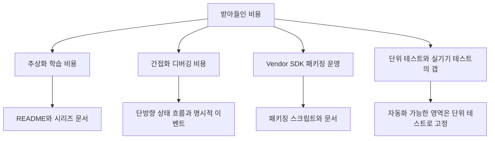

<details>
<summary>용어 토글: trade-off를 읽는 법</summary>

- **trade-off**: 한 가지 장점을 얻기 위해 다른 비용을 감수하는 선택이다.
- **간접화**: 직접 호출하지 않고 protocol, use case, adapter 같은 중간 계층을 거쳐 호출하는 구조다.
- **패키징 운영**: 외부 SDK를 받아 repo 구조에 맞게 변환하고, link와 시뮬레이터 빌드를 검증하는 반복 작업이다.
- **실기기 테스트 갭**: 시뮬레이터나 단위 테스트로는 DRM 재생 같은 실제 기기 조건을 완전히 검증할 수 없는 한계다.

</details>

---

## 6. 앞으로의 방향 — 이 모듈은 어디로 가는가

마지막으로 이 모듈이 앞으로 어떻게 진화할지를 짧게 적어 두자. 시리즈의 끝맺음이자, 후배가 이 코드를 이어받았을 때 길잡이가 됐으면 한다.

가까운 미래에는 두 가지가 있다. 하나는 **테스트 마이그레이션 완료**. XCTest에서 Swift Testing으로 옮기는 작업이 진행 중이고, 이게 끝나면 `confirmation`을 활용한 더 자연스러운 비동기 테스트가 가능해진다. 또 하나는 **Kollus coverage 확장 검증**. PiP, 외부 출력, HLS ABR, 라이브 상태, 다음 회차 이벤트 같은 표면은 API로 드러나기 시작했지만, 실제 강의 플로우에서 어떤 기능을 켜고 어떤 기능을 Shell 정책으로 막을지 정착시키는 작업이 남아 있다.

중기적으로는 **두 번째 vendor 어댑터 도입 가능성**. 현재로서는 가설이지만, 벤더 비교나 기술 검증 차원에서 BrightCove나 다른 사업자의 어댑터를 실험적으로 만들어 보는 게 의미가 있다. 우리 도메인 인터페이스가 정말 vendor-agnostic한지 검증되는 순간이 될 것이다.

장기적으로는 **live streaming 지원 고도화**. 현재 모듈은 VOD에 최적화되어 있고, 라이브 여부와 타임쉬프트 길이를 표현할 수 있는 상태 필드는 들어왔다. 실시간 강의(라이브 클래스, 모의고사 라이브) 시나리오가 본격 도입되면, capability와 상태 머신을 실제 운영 정책에 맞게 더 다듬어야 한다. 그때도 도메인 코드는 살아남고, 새 엔진 어댑터와 capability 표면만 확장되는 형태로 가는 게 이상이다.

이 모든 미래에서 변하지 않을 한 가지는 명료하다. **vendor가 어떻게 바뀌어도, iOS가 어떻게 바뀌어도, 사업이 어떻게 바뀌어도, "우리 도메인은 우리가 통제한다"는 약속**이다. 그 약속을 지키기 위해 다섯 원칙을 코드 깊숙이 박아 두었다.

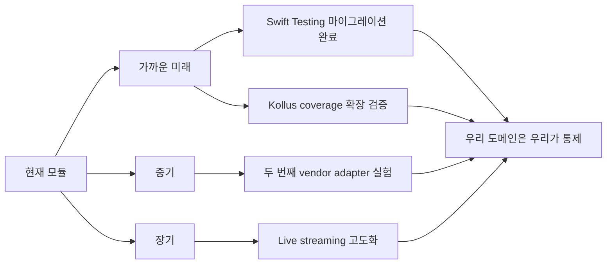

---

## 7. 시리즈 전체를 한 호흡으로 회상하며

다섯 편을 따라오신 분들께 마지막으로 한 호흡 회상을 드린다.

영상을 안전하게 팔려면 콘텐츠를 암호화해야 하고, FairPlay 재생에서는 AVFoundation/FPS의 보호된 키 처리 경로가 필요하다. 키 요청과 응답은 SPC와 CKC라는 두 메시지로 압축되고, 라이선스 서버를 직접 운영하려면 Apple의 FairPlay Streaming 자격과 KSM 운영 책임을 져야 한다. 우리 회사는 그 운영을 PallyCon에게 위임한 Kollus 경로를 사용해 강의 재생 인프라를 갖췄고, 그 결과 우리 앱의 Kollus 엔진에는 KollusSDK와 PallyConFPSSDK가 짝으로 link된다. 하지만 우리 도메인 코드는 두 SDK 어느 쪽도 모른다. 다섯 가지 설계 원칙이 그 무지를 가능하게 한다. 엔진 교체 가능성, 단방향 상태 흐름, capability 게이팅, vendor 격리, Swift Concurrency First. 이 원칙들이 디렉토리와 SPM product 경계와 actor 격리에 그대로 박혀 있고, 그 덕분에 테스트 가능한 구조, product 선택권, vendor 격리, 책임 분리, actor isolation 기반의 컴파일 타임 진단을 얻었다.

이게 우리가 "교육 서비스 iOS 비디오 플레이어 모듈화"라고 부르는 작업의 전부다. 그 위에 우리가 매일 짓는 강의 앱이 있다.

> **시리즈 끝. 끝까지 함께해 주셔서 감사합니다.**

---

### 참고

- 사내 README: [`videoplayer-ios-ms/README.md`](../../README.md)
- 사내 코드: `Package.swift`, `Sources/VideoPlayerModule/`, `Tests/VideoPlayerModuleTests/Support/`
- 사내 문서: `docs/kollus-sdk-packaging.md`
- 이전 편: [4편 Kollus는 왜 PallyCon FPS와 짝꿍인가](./04-why-pallycon-fps.md)
- 시리즈 시작: [1편 DRM과 FairPlay Streaming부터 이해하기](./01-drm-fairplay-streaming-basics.md)
