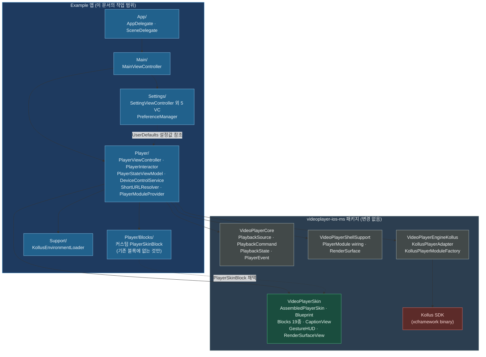
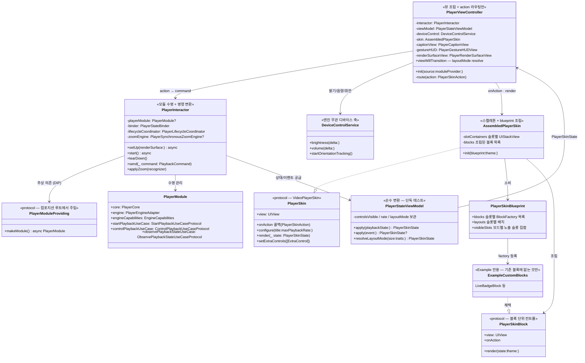
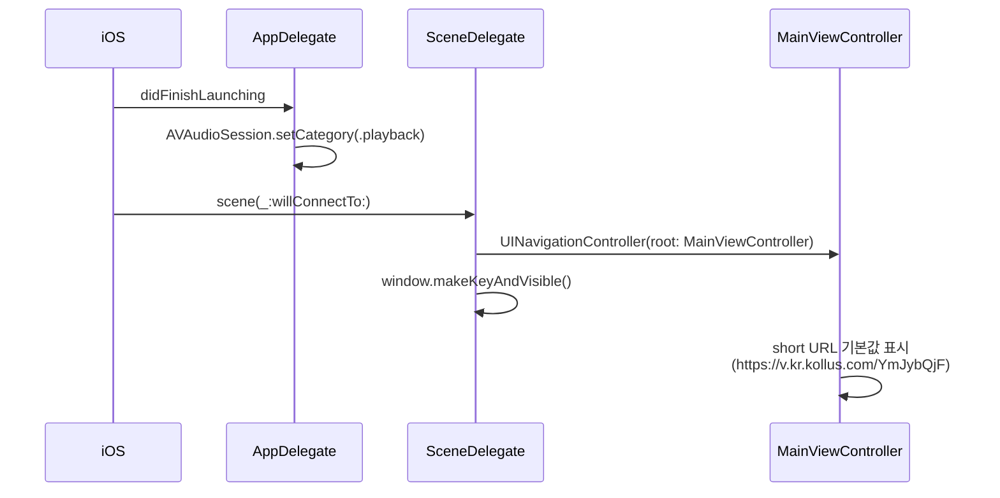
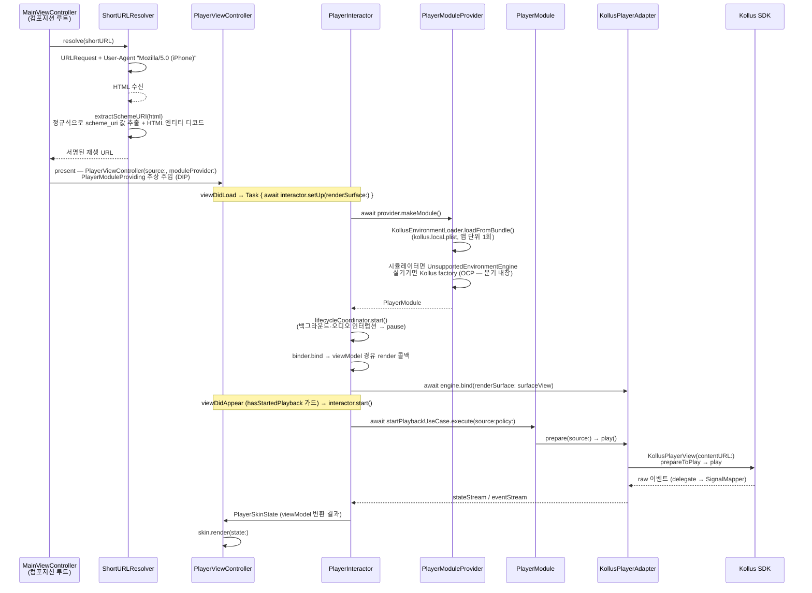
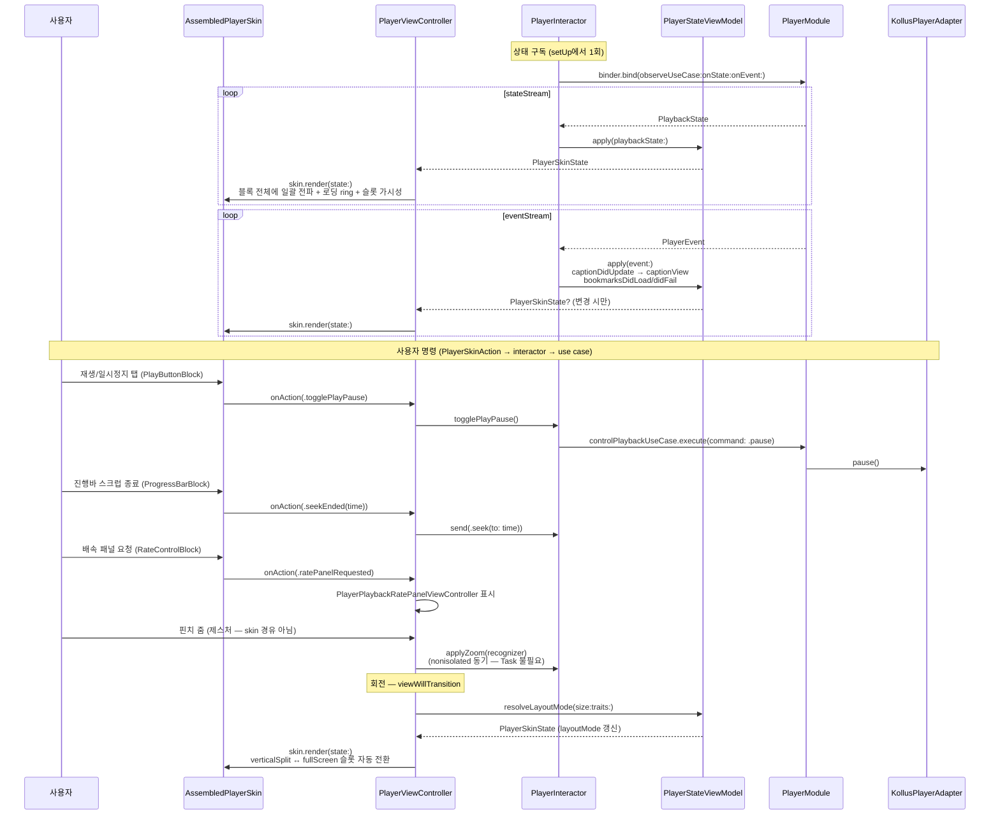
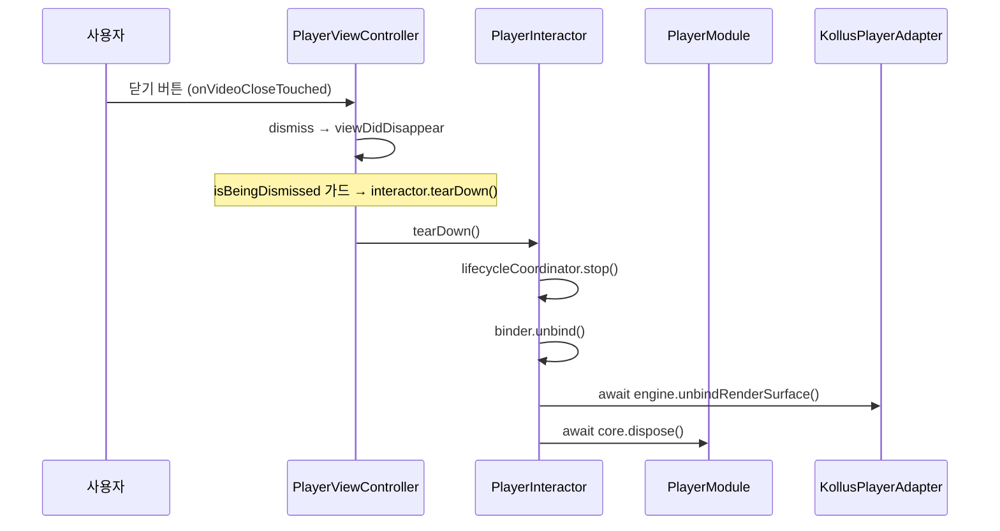
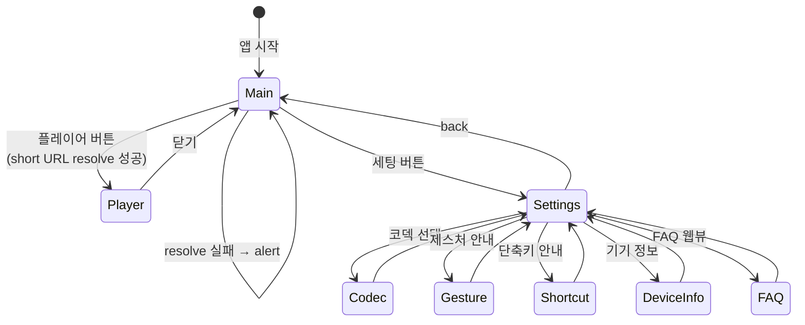

# Example 앱 재구축 설계 문서

- 작성자: JunyoungJung
- 작성일: 2026-06-05
- 상태: **구현 완료** (2026-06-05, `feature/example-app-rebuild`) — 실기기 QA 대기 (§9 체크리스트)

---

## 1. 목표

Kollus 제공 샘플 앱(`KollusPlayer_iOS_2024.01.12`)을 참고하여 `Example/` 앱을 전면 재구축한다.

| 항목 | 결정 |
|---|---|
| 화면 구성 | 메인 / 플레이어 / 세팅 3화면 |
| 기존 Example 소스 | 전부 교체 (`KollusEnvironmentLoader`만 재사용) |
| 재생 경로 | 패키지 product 경유 (`KollusPlayerModuleFactory` → `PlayerModule`) — SDK 직접 import 금지 |
| 플레이어 UI | **`VideoPlayerSkin` 조립 사용** — `AssembledPlayerSkin` + 커스텀 `PlayerSkinBlueprint`. 자체 컨트롤 뷰 마이그레이션 금지, 부족한 컨트롤만 `PlayerSkinBlock` 채택 커스텀 블록으로 추가. 샘플 UI는 기능 parity 기준으로만 참고 |
| 화면 방향 | 세로(verticalSplit) + 가로(fullScreen) 모두 지원 — `PlayerSkinState.layoutMode`로 skin이 슬롯 가시성 자동 분기 (PlayerSkinState.swift:18-22) |
| 세팅 화면 | 샘플 `SettingViewController` 전체 복제 |
| URL 재생 | 샘플 AppDelegate의 `autoPlayFromShortURL` 로직 채택 — 플레이어 진입 시 short URL 해석 후 재생 |

### 샘플 앱 ↔ Example 구조 대응

| 샘플 앱 | Example | 비고 |
|---|---|---|
| `AppDelegate.autoPlayFromShortURL` (AppDelegate.swift:301) | `ShortURLResolver` | 트리거를 앱 시작 → 플레이어 진입으로 이동 |
| `Controller/PlayerViewController/PlayerViewController.swift` (2,981줄) | `Player/PlayerViewController.swift` + `PlayerInteractor` | SDK 직접 호출 → use case/adapter, UI는 skin 조립 |
| `Controller/PlayerViewController/VideoControlView.swift` (1,572줄) + xib | `AssembledPlayerSkin` + 커스텀 blueprint | **마이그레이션 안 함** — 기존 Blocks 재사용 (§6 매핑표) |
| `Controller/PlayerViewController/UIView/*` (11개) | 기존 `VideoPlayerSkin/Blocks/*` 19종 + 커스텀 블록 소수 | §6 블록 매핑표 참고 |
| 자막 라벨 / 로딩 / 밝기·음량 HUD | `PlayerCaptionView` / `PlayerLoadingIndicatorView`(skin 내장) / `PlayerGestureHUDView` | Skin 모듈 기성품 |
| `Controller/Setting/*` (6개 VC) | `Settings/*` | Storyboard → code |
| `Base/PreferenceManager.swift` | `Settings/PreferenceManager.swift` | `@UserDefault` wrapper 그대로 |
| `Controller/ListViewController/ListViewController.swift` | `Main/MainViewController.swift` | 다운로드 목록 → 단순 진입 화면으로 축소 |

---

## 2. 아키텍처

### 2.1 전체 정적 구조 (모듈 의존)



**경계 규칙**: Example 코드는 Kollus SDK를 직접 import하지 않는다. 모든 SDK 접근은 `KollusPlayerAdapter`(`PlayerEngineAdapter` 계약) 뒤에 숨는다. 컨트롤 UI는 자체 구현하지 않고 `VideoPlayerSkin` 조립으로만 구성 — host와 skin의 통신은 `PlayerSkinAction` / `PlayerSkinState` 두 타입뿐.

**Project.swift 변경 필요**: Example 타깃 dependencies에 `.package(product: "VideoPlayerSkin")` 추가 (현재 미연결 — Project.swift:50-55).

### 2.2 플레이어 화면 내부 구조 (정적)

SOLID 진단 반영(§2.4): 샘플 2,981줄 VC의 모놀리식 구조를 그대로 이식하지 않고 변경 축별로 분할. 컨트롤 UI는 자체 구현 없이 **`AssembledPlayerSkin` + 커스텀 blueprint 조립** — 스켈레톤(슬롯 위치·반응형·lock 게이트)은 패키지 소유, 내용물만 blueprint로 채운다 (AssembledPlayerSkin.swift:9-11).



기존 제공 블록 19종(Blocks/): `CloseButtonBlock`, `TitleBlock`, `CenterPlaybackControlsBlock`(재생+±N초), `ProgressBarBlock`(진행바+시간), `RateControlBlock`/`RateButtonBlock`/`RateStepBlock`(배속), `DisplayScaleBlock`, `LockButtonBlock`, `MoreButtonBlock`, `SettingButtonBlock`, `SectionRepeatBlock`/`SectionRepeatRangeBlock`(구간반복), `SkipButtonBlock`, `PlayButtonBlock`, `TopMenuExtraControlsBlock`/`ExtraControlsRailBlock`/`ExtraFloatingBlock`(host 주입 버튼), `PlayerSkinIconButton`(베이스). 샘플 컨트롤 → 블록 매핑은 §6.

### 2.2.1 세로/가로 레이아웃

`PlayerSkinLayoutMode` 3종을 skin이 이미 지원 — blueprint의 `visibleSlots`가 모드별 슬롯 노출을 선언적으로 결정 (PlayerSkinBlueprint.swift:56-77):

| 모드 | 트리거 (Example 기준) | 노출 슬롯 (default blueprint) |
|---|---|---|
| `verticalSplit` | iPhone 세로 | topLeading·topTrailing·centerControls·bottomBar·floating 2종 |
| `fullScreen` | iPhone 가로 / 전체화면 토글 | 전 슬롯 (title·leftRail·sectionRepeatRange 포함) |
| `horizontalSplit` | iPad 가로 split — Example 미사용 | — |

Example은 `viewWillTransition(to:with:)` + traitCollection에서 `verticalSplit`/`fullScreen` resolve 후 `viewModel.resolveLayoutMode(...)` → `skin.render(state)` — 회전 시 별도 제약 재계산 코드 불필요 (skin 스켈레톤이 처리).

### 2.3 데이터 흐름 (단방향)

```mermaid
graph LR
    UI["AssembledPlayerSkin<br/>(블록 → 사용자 입력)"] -- "onAction(PlayerSkinAction)" --> VC["PlayerViewController<br/>(라우팅만)"]
    VC -- "send(command:)" --> INT["PlayerInteractor<br/>(명령 변환)"]
    INT -- "Task { try await }" --> UC["controlPlaybackUseCase<br/>/ capability protocol"]
    UC --> Adapter["KollusPlayerAdapter<br/>(actor)"]
    Adapter --> SDK["Kollus SDK"]
    SDK -- "raw 이벤트" --> Mapper["KollusSignalMapper"]
    Mapper -- "PlayerEngineOutput" --> Reducer["PlaybackStateReducer"]
    Reducer -- "PlaybackState 스트림" --> Binder["PlayerStateBinder"]
    Binder -- "PlaybackState/PlayerEvent" --> VM["PlayerStateViewModel<br/>(순수 변환)"]
    VM -- "PlayerSkinState<br/>skin.render(state:)" --> UI

    style UI fill:#1e3a5f,stroke:#5dade2,color:#eaf2f8
    style VC fill:#21618c,stroke:#85c1e9,color:#eaf2f8
    style INT fill:#21618c,stroke:#85c1e9,color:#eaf2f8
    style VM fill:#21618c,stroke:#85c1e9,color:#eaf2f8
    style UC fill:#424949,stroke:#aab7b8,color:#f2f4f4
    style Adapter fill:#6e5b13,stroke:#f4d03f,color:#fcf3cf
    style SDK fill:#5c2b29,stroke:#ec7063,color:#fadbd8
    style Mapper fill:#424949,stroke:#aab7b8,color:#f2f4f4
    style Reducer fill:#424949,stroke:#aab7b8,color:#f2f4f4
    style Binder fill:#424949,stroke:#aab7b8,color:#f2f4f4
```



샘플 앱은 SDK delegate 4종 + 0.2초 폴링 타이머로 상태를 끌어왔다. Example은 패키지의 두 스트림으로 일원화한다 — **폴링 타이머 제거**:

- `stateStream: AsyncStream<PlaybackState>` — status/currentTime/duration/isBuffering/isLive/liveDuration (ObservePlaybackStateUseCase.swift:13)
- `eventStream: AsyncStream<PlayerEvent>` — `captionDidUpdate(text:isSecondary:)`(자막), `bookmarksDidLoad([Bookmark])`, `didFail(PlayerError)`, `policyDowngraded`, `naturalSizeDidResolve` 등 (PlayerEvent.swift:17-33)

구독은 `PlayerStateBinder.bind(observeUseCase:onState:onEvent:)` 하나로 처리 (PlayerStateBinder.swift:19).

### 2.4 SOLID 설계 결정

샘플 앱 구조를 그대로 이식할 때의 위반을 진단하고 구조에 반영한 결과.

| 원칙 | 진단 (이식 전) | 반영 (이식 후) |
|---|---|---|
| **S** | 샘플 VC에 변경 축 5개 혼재: 뷰 계층 / 모듈 수명 / 상태 분배 / 명령 변환 / 디바이스 제어 | 분할 — `PlayerViewController`(skin 조립·action 라우팅) / `PlayerInteractor`(수명+명령) / `PlayerStateViewModel`(상태 변환, 순수) / `DeviceControlService`(밝기·음량·회전). 컨트롤 UI 축은 통째로 `VideoPlayerSkin` 모듈로 — Example엔 UI 변경 축 자체가 없음 |
| **O** | 엔진 선택 `#if` 분기가 VC 안, 세팅 row 하드코딩, 컨트롤 추가 = 컨트롤 뷰 본문 수정 | 엔진 선택은 `PlayerModuleProvider` 내장(시뮬레이터/실기기), 세팅 화면은 `SettingSection`/`SettingItem` 데이터 주도, 컨트롤 추가는 **blueprint에 블록 factory 등록**만 — `AssembledPlayerSkin` 수정 없음 (OCP가 skin 설계 자체) |
| **L** | `module.engine as? KollusPlayerAdapter` 구체 다운캐스트 — 시뮬레이터 엔진에서 기능 silently dead | capability protocol 캐스트로 대체 (`as? PlayerSynchronousZoomEngine`, `as? PlayerAdaptiveStreamingEngine` — PlayerEngineAdapter.swift:64-133). 캐스트 실패 = 해당 버튼 비활성 |
| **I** | `VideoControlViewDelegate` 20+ 메서드 단일 프로토콜 — 플레이리스트 3종 no-op 강제 | skin이 구조적으로 해소: 사용자 입력은 `PlayerSkinAction` enum 단일 채널(미사용 case는 `default: break`), 컨트롤은 `PlayerSkinBlock` 단위(블록당 1책임) — 안 쓰는 블록은 blueprint에 등록 안 하면 끝 |
| **D** | VC가 `KollusPlayerModuleFactory` 구체 의존, 고수준 화면이 Kollus를 직접 앎. UI도 구체 컨트롤 뷰에 결합 | `PlayerInteractor`는 `PlayerModuleProviding` 추상에 의존, 구체는 컴포지션 루트(`MainViewController`)에서 주입. UI는 `PlayerSkin` 프로토콜(view/onAction/render) 뒤 — skin 통째 교체 가능 (PlayerSkin.swift:20) |

**비용 회피 결정** (오버엔지니어링 방지 — 변경 축 없는 곳에 추상화 금지):

- ❌ `PreferenceManager` protocol화 보류 — 변경 축 1개, 샘플 호환 목적. static 유지
- ❌ `ShortURLResolver` URLSession 주입 보류 — 변경 빈도 0 예상
- ❌ 세팅 하위 안내 화면(제스처/단축키/기기정보) 추상화 없음 — 정적 표시 전용
- ❌ DIContainer 미도입 — 화면 3개, 컴포지션 루트는 `MainViewController`로 충분

---

## 3. 폴더 구조

```
Example/
├── Resources/
│   ├── kollus.local.plist.example      # 기존 유지 (gitignored 실물)
│   └── PlayerAssets.xcassets           # 샘플 앱 아이콘 리소스 이관
└── Sources/
    ├── App/
    │   ├── AppDelegate.swift           # AVAudioSession(.playback)
    │   └── SceneDelegate.swift         # window → UINavigationController(MainViewController)
    ├── Main/
    │   └── MainViewController.swift    # short URL 입력 + 플레이어/세팅 진입 버튼
    ├── Player/
    │   ├── PlayerViewController.swift  # skin/캡션/HUD/서피스 조립 + PlayerSkinAction 라우팅 + layoutMode resolve
    │   ├── PlayerInteractor.swift      # 모듈 수명(setUp/start/tearDown), action→PlaybackCommand 변환,
    │   │                               #   capability protocol 캐스트 보관 (LSP — 구체 다운캐스트 제거)
    │   ├── PlayerStateViewModel.swift  # PlaybackState/PlayerEvent → PlayerSkinState 순수 변환 (단독 테스트 가능)
    │   │                               #   controlsVisible/rate/layoutMode 등 UI 로컬 상태 보관
    │   ├── PlayerSkinBlueprint+Example.swift  # 커스텀 blueprint — 기존 블록 + 커스텀 블록 슬롯 배치,
    │   │                               #   verticalSplit/fullScreen별 visibleSlots 정의
    │   ├── DeviceControlService.swift  # 밝기(UIScreen)/음량(MPVolumeView)/회전(CoreMotion) — 엔진 무관 축
    │   ├── ShortURLResolver.swift      # short URL → scheme_uri 추출
    │   ├── PlayerModuleProvider.swift  # PlayerModuleProviding 채택 (DIP). plist+세팅 합성,
    │   │                               #   시뮬레이터/실기기 엔진 선택 내장 (OCP), 세팅 변경 시 재생성
    │   └── Blocks/                     # 커스텀 PlayerSkinBlock — 기존 19종에 없는 것만 (§6 갭 기준)
    │       └── LiveBadgeBlock.swift    # 라이브 표시/skip-to-live (기존 블록 부재 시)
    ├── Settings/
    │   ├── PreferenceManager.swift             # @UserDefault property wrapper
    │   ├── SettingViewController.swift         # 설정 루트 (섹션 테이블)
    │   ├── PlayerCodecViewController.swift     # 코덱 선택
    │   ├── GestureViewController.swift         # 제스처 안내
    │   ├── ShortcutViewController.swift        # 단축키 안내
    │   ├── DeviceInformationViewController.swift
    │   └── WebViewController.swift             # FAQ 웹뷰
    └── Support/
        └── KollusEnvironmentLoader.swift       # 기존 파일 재사용 — DemoConfiguration(environment, mediaContentKey) 반환
```

신규 파일 약 18개 + 재사용 1개 — 컨트롤 뷰 14종 마이그레이션이 skin 재사용으로 제거됨.

Skin 모듈 기성품으로 대체되는 것 (Example에서 구현 금지):

| Example에서 안 만드는 것 | VideoPlayerSkin 제공 |
|---|---|
| 렌더 서피스 뷰 | `PlayerRenderSurfaceView` (PlayerRenderSurfaceView.swift:21, `PlayerRenderSurface` 채택) |
| 자막 라벨/배경 | `PlayerCaptionView` + `PlayerCaptionState` |
| 로딩 인디케이터 | `PlayerLoadingIndicatorView` — `AssembledPlayerSkin` 내장, `isLoading`에 자동 반응 |
| 밝기/음량/시크 제스처 HUD | `PlayerGestureHUDView` + `PlayerGestureAction`(brightnessPreview/volumePreview/pinchPreview 등) |
| 배속 패널 | `PlayerPlaybackRatePanelViewController` (`.ratePanelRequested` action) |
| 컨트롤 토글/잠금 게이트 | `AssembledPlayerSkin.applyVisibility` (controlsVisible/isLocked) |

**Project.swift 변경 1건 필요**: Example 타깃 dependencies에 `.package(product: "VideoPlayerSkin")` 추가.

`KollusEnvironment`는 plist 자격증명 외에 동작 플래그도 받는다(KollusEnvironment.swift:12-34) — `PlayerModuleProvider`가 `PreferenceManager` 설정값을 합성해 생성:

| KollusEnvironment 필드 | 기본값 | 연결되는 세팅 |
|---|---|---|
| `hardwareDecoderPreferred` | true | 코덱 선택 (`PreferenceManager.playerCodec`) |
| `audioBackgroundPlayPolicy` | — | 백그라운드 오디오 (`isBackgroundAudioPlay`). true면 factory가 `.continuesWithoutSurface` capability OR-in (KollusPlayerModuleFactory.swift:36-39) |
| `aiPlaybackRateEnabled` | false | AI 재생속도 — `playerView.aiRateEnable`에 적용 (KollusPlayerAdapter.swift:646) |
| `drm` / `chat` | plist | DRM·라이브 채팅 |

**주의**: environment는 factory 생성 시점에 고정 — 세팅 변경 시 `PlayerModuleProvider`가 factory를 재생성해야 다음 재생에 반영된다.

---

## 4. 핵심 플로우

### 4.1 앱 시작 → 메인 화면



샘플과 차이: 샘플은 AppDelegate에서 1.5초 지연 후 플레이어 자동 present(AppDelegate.swift:49-51). Example은 메인 화면에서 사용자가 진입 — `autoPlayFromShortURL`의 **해석 로직**만 채택하고 트리거는 버튼으로 이동.

### 4.2 플레이어 진입 → 재생 (autoPlayFromShortURL 채택)



시뮬레이터 분기: Kollus 엔진은 시뮬레이터에서 실재생 불가 — `PlayerModuleProvider`가 `#if targetEnvironment(simulator)`에서 `PlayerModuleWiring.makeModule(engine: UnsupportedEnvironmentEngine(message:), engineCapabilities: [])`로 대체 (UnsupportedEnvironmentEngine.swift:18, `PlayerRenderSurface.showUnsupportedEnvironment`로 안내 표시). 분기가 provider 안에 있으므로 VC/Interactor는 엔진 종류를 모른다.

resolve 실패 시(HTML 수신 실패 / scheme_uri 미검출): 메인 화면에서 alert 표시, 플레이어 미진입.

### 4.3 재생 중 상태/명령 루프 (동적)



명령 경로 원칙: `PlaybackCommand`에 케이스가 있으면 `controlPlaybackUseCase.execute(command:)` 경유(Core가 정책·capability 협상, PlaybackCommand.swift:11-32). 케이스 밖 기능(핀치줌 동기 경로, `currentBookmarks()` 조회, `streamInfoList()`)은 `PlayerInteractor`가 **capability protocol 캐스트**로 보관 후 호출 — `engine as? PlayerSynchronousZoomEngine`, `engine as? PlayerAdaptiveStreamingEngine` (LSP — 구체 타입 `KollusPlayerAdapter` 다운캐스트 금지, 캐스트 실패 시 해당 버튼 비활성).

### 4.4 플레이어 종료



정리 순서는 기존 `KollusPlayerShellViewController.swift:81-94` 패턴 그대로: coordinator stop → binder unbind → (Task 안에서) `unbindRenderSurface()` → `core.dispose()`. 모듈 수명은 전부 `PlayerInteractor.tearDown()` 한 곳 — 스와이프 백 등 모든 종료 경로가 `viewDidDisappear`로 수렴.

### 4.5 화면 전이 (전체)



---

## 5. 예시 코드

> 의사코드 수준 스케치. 실제 구현 시 패키지 API 시그니처에 맞춰 조정.

### 5.1 ShortURLResolver — autoPlayFromShortURL 마이그레이션

샘플 `AppDelegate.swift:301-339`의 로직을 독립 타입으로 분리.

```swift
import Foundation

/// Kollus short URL의 HTML에서 scheme_uri(서명된 재생 URL)를 추출한다.
/// 샘플 앱 AppDelegate.autoPlayFromShortURL / extractSchemeURI 마이그레이션.
struct ShortURLResolver {
    enum ResolveError: Error {
        case invalidURL
        case htmlFetchFailed(underlying: Error?)
        case schemeURINotFound
    }

    func resolve(_ shortURLString: String) async throws -> URL {
        guard let shortURL = URL(string: shortURLString) else {
            throw ResolveError.invalidURL
        }
        var request = URLRequest(url: shortURL)
        request.setValue("Mozilla/5.0 (iPhone)", forHTTPHeaderField: "User-Agent")

        let (data, _) = try await URLSession.shared.data(for: request)
        guard let html = String(data: data, encoding: .utf8) else {
            throw ResolveError.htmlFetchFailed(underlying: nil)
        }
        guard let streamingURL = extractSchemeURI(from: html) else {
            throw ResolveError.schemeURINotFound
        }
        return streamingURL
    }

    /// HTML 내 JSON의 "scheme_uri" 값(HTML 엔티티 인코딩)을 추출·디코드.
    private func extractSchemeURI(from html: String) -> URL? {
        guard let regex = try? NSRegularExpression(pattern: "scheme_uri&quot;:&quot;(.+?)&quot;") else { return nil }
        let range = NSRange(html.startIndex..., in: html)
        guard let match = regex.firstMatch(in: html, options: [], range: range),
              let valueRange = Range(match.range(at: 1), in: html) else { return nil }

        var value = String(html[valueRange])
        value = value.replacingOccurrences(of: "\\/", with: "/")
        value = value.replacingOccurrences(of: "&amp;", with: "&")
        return URL(string: value)
    }
}
```

### 5.2 MainViewController — 진입 화면

```swift
import UIKit
import VideoPlayerCore

final class MainViewController: UIViewController {
    private let urlField = UITextField()
    private let playerButton = UIButton(configuration: .filled())
    private let settingsButton = UIButton(configuration: .tinted())
    private let resolver = ShortURLResolver()

    override func viewDidLoad() {
        super.viewDidLoad()
        title = "VideoPlayer Example"
        view.backgroundColor = .systemBackground
        setupLayout()   // UIStackView + anchor 제약
        urlField.text = "https://v.kr.kollus.com/YmJybQjF"   // 샘플 기본 URL
    }

    @objc private func didTapPlayer() {
        guard let shortURL = urlField.text, !shortURL.isEmpty else { return }
        playerButton.isEnabled = false
        Task { @MainActor in
            defer { playerButton.isEnabled = true }
            do {
                let streamingURL = try await resolver.resolve(shortURL)
                // PlayerModuleProvider: kollus.local.plist + PreferenceManager 합성 → factory 보관/재생성
                let factory = try PlayerModuleProvider.shared.currentFactory()
                let player = PlayerViewController(source: .url(streamingURL), moduleFactory: factory)
                player.modalPresentationStyle = .fullScreen
                present(player, animated: false)   // 샘플과 동일: 풀스크린 present
            } catch {
                presentAlert(message: "재생 준비 실패: \(error.localizedDescription)")
            }
        }
    }

    @objc private func didTapSettings() {
        navigationController?.pushViewController(SettingViewController(), animated: true)
    }
}
```

### 5.3 플레이어 화면 — SRP 4분할 골격

실제 패키지 API 기준 (기존 `KollusPlayerShellViewController.swift` 검증 패턴 이식). §2.4 SOLID 결정 반영 — VC는 조립·전달만, 모듈 수명/명령 변환은 `PlayerInteractor`, 상태 변환은 `PlayerStateViewModel`.

#### PlayerModuleProviding — DIP 경계 + OCP 엔진 분기

```swift
import VideoPlayerCore
import VideoPlayerShellSupport
import VideoPlayerEngineKollus

/// Interactor가 의존하는 추상 — 구체(Kollus/Unsupported)는 provider 내부에만 존재.
@MainActor
protocol PlayerModuleProviding {
    func makeModule() async -> PlayerModule
}

@MainActor
final class PlayerModuleProvider: PlayerModuleProviding {
    static let shared = PlayerModuleProvider()
    private var factory: KollusPlayerModuleFactory?      // 세팅 변경 시 nil로 무효화 → 재생성

    func makeModule() async -> PlayerModule {
        #if targetEnvironment(simulator)
        // 시뮬레이터: Kollus 실재생 불가 — 엔진 선택이 여기 캡슐화 (VC/Interactor는 모름)
        return await PlayerModuleWiring.makeModule(
            engine: UnsupportedEnvironmentEngine(message: "Kollus 재생은 실기기에서만 지원됩니다."),
            engineCapabilities: []
        )
        #else
        let factory = try await resolveFactory()   // plist + PreferenceManager 합성
        return await factory.makeModule()
        #endif
    }
}
```

#### PlayerInteractor — 모듈 수명 + 명령 변환 (LSP: capability 캐스트)

```swift
import UIKit
import VideoPlayerCore
import VideoPlayerShellSupport

@MainActor
final class PlayerInteractor {
    private let source: PlaybackSource
    private let moduleProvider: PlayerModuleProviding    // DIP — 구체 factory를 모름
    private let featurePolicy: PlayerFeaturePolicy
    private let viewModel: PlayerStateViewModel
    private let onRender: (PlayerSkinState) -> Void

    private var playerModule: PlayerModule?
    private let binder = PlayerStateBinder()
    private var lifecycleCoordinator: PlayerLifecycleCoordinator?

    // LSP — 구체 KollusPlayerAdapter 다운캐스트 금지. capability protocol로만 접근.
    // 캐스트 실패(UnsupportedEnvironmentEngine 등) = 해당 기능 버튼 비활성.
    private var zoomEngine: PlayerSynchronousZoomEngine?
    private var streamingEngine: PlayerAdaptiveStreamingEngine?

    init(source: PlaybackSource,
         moduleProvider: PlayerModuleProviding,
         viewModel: PlayerStateViewModel,
         onRender: @escaping (PlayerSkinState) -> Void) {
        self.source = source
        self.moduleProvider = moduleProvider
        self.viewModel = viewModel
        self.onRender = onRender
        self.featurePolicy = PlayerFeaturePolicy(
            allowsBackgroundPlayback: PreferenceManager.isBackgroundAudioPlay,
            maxPlaybackRate: 2.0,
            allowsAutoplay: true,
            skipInterval: TimeInterval(PreferenceManager.seekRange)
        )
    }

    func setUp(renderSurface: PlayerRenderSurface) async {
        let module = await moduleProvider.makeModule()
        playerModule = module
        zoomEngine = module.engine as? PlayerSynchronousZoomEngine
        streamingEngine = module.engine as? PlayerAdaptiveStreamingEngine

        let coordinator = PlayerLifecycleCoordinator(
            controlUseCase: module.controlPlaybackUseCase,
            policy: featurePolicy,
            engineCapabilities: module.engineCapabilities,
            onEvent: { [weak self] event in self?.consume(event: event) }
        )
        lifecycleCoordinator = coordinator
        coordinator.start()       // 백그라운드 진입·오디오 인터럽션 → 정책 기반 pause

        binder.bind(
            observeUseCase: module.observePlaybackStateUseCase,
            onState: { [weak self] state in
                guard let self else { return }
                self.onRender(self.viewModel.apply(playbackState: state))
            },
            onEvent: { [weak self] event in self?.consume(event: event) }
        )

        await module.engine.bind(renderSurface: renderSurface)
    }

    func start() async throws {
        guard let module = playerModule else { return }
        try await module.startPlaybackUseCase.execute(source: source, policy: featurePolicy)
    }

    func tearDown() {
        lifecycleCoordinator?.stop()
        binder.unbind()
        Task { [playerModule] in
            await playerModule?.engine.unbindRenderSurface()
            await playerModule?.core.dispose()
        }
    }

    // MARK: - 명령 (delegate 콜백 → PlaybackCommand)
    func send(_ command: PlaybackCommand) {
        Task { @MainActor [weak self] in
            guard let module = self?.playerModule else { return }
            try? await module.controlPlaybackUseCase.execute(command: command)
        }
    }

    func togglePlayPause() {
        Task { @MainActor [weak self] in
            guard let self, let module = self.playerModule else { return }
            let isPlaying = await module.engine.currentState.status == .playing
            try? await module.controlPlaybackUseCase.execute(command: isPlaying ? .pause : .play)
        }
    }

    func seekBy(_ delta: TimeInterval) {
        Task { @MainActor [weak self] in
            guard let self, let module = self.playerModule else { return }
            let now = await module.engine.currentState.currentTime
            try? await module.controlPlaybackUseCase.execute(command: .seek(to: now + delta))
        }
    }

    func applyZoom(_ recognizer: UIPinchGestureRecognizer) {
        // nonisolated 동기 경로 — Task hop 없이 매 이벤트 즉시 적용 (PlayerEngineAdapter.swift:109-116)
        zoomEngine?.applyZoomGesture(recognizer)
    }

    private func consume(event: PlayerEvent) {
        // captionDidUpdate / bookmarksDidLoad / didFail / policyDowngraded → viewModel 반영
        if let next = viewModel.apply(event: event) {
            onRender(next)
        }
    }
}
```

#### PlayerViewController — skin 조립 + action 라우팅만

```swift
import UIKit
import VideoPlayerCore
import VideoPlayerSkin

@MainActor
final class PlayerViewController: UIViewController {
    private let interactor: PlayerInteractor
    private let viewModel: PlayerStateViewModel
    private let deviceControl = DeviceControlService()   // 밝기/음량/회전 — 엔진 무관 축

    // 전부 VideoPlayerSkin 기성품 — Example 자체 컨트롤 뷰 없음
    private let renderSurfaceView = PlayerRenderSurfaceView()          // Skin 제공
    private let skin = AssembledPlayerSkin(blueprint: .example)        // §5.5 커스텀 blueprint
    private let captionView = PlayerCaptionView()                      // 자막
    private let gestureHUD = PlayerGestureHUDView()                    // 밝기/음량/시크 HUD
    private var hasStartedPlayback = false

    init(source: PlaybackSource, moduleProvider: PlayerModuleProviding) {
        let viewModel = PlayerStateViewModel()
        self.viewModel = viewModel
        var renderSink: ((PlayerSkinState) -> Void) = { _ in }
        self.interactor = PlayerInteractor(
            source: source, moduleProvider: moduleProvider,
            viewModel: viewModel, onRender: { renderSink($0) }
        )
        super.init(nibName: nil, bundle: nil)
        renderSink = { [weak self] state in self?.skin.render(state) }
    }

    @available(*, unavailable)
    required init?(coder: NSCoder) { fatalError("init(coder:) has not been implemented") }

    override func viewDidLoad() {
        super.viewDidLoad()
        view.backgroundColor = .black
        // 계층: surface(하단) → captionView → skin(컨트롤 오버레이) → gestureHUD
        setupViewHierarchy()
        skin.onAction = { [weak self] action in self?.route(action) }
        skin.configure(title: "Example", maxPlaybackRate: 2.0)
        Task { @MainActor [weak self] in
            guard let self else { return }
            await self.interactor.setUp(renderSurface: self.renderSurfaceView)
        }
    }

    override func viewDidAppear(_ animated: Bool) {
        super.viewDidAppear(animated)
        guard hasStartedPlayback == false else { return }
        hasStartedPlayback = true
        Task { @MainActor [weak self] in
            do { try await self?.interactor.start() }
            catch { self?.presentErrorAndClose(error) }
        }
    }

    override func viewDidDisappear(_ animated: Bool) {
        super.viewDidDisappear(animated)
        if isBeingDismissed || isMovingFromParent {
            interactor.tearDown()
        }
    }

    // 세로/가로 — layoutMode resolve 후 skin이 슬롯 가시성 자동 전환 (§2.2.1)
    override func viewWillTransition(to size: CGSize, with coordinator: UIViewControllerTransitionCoordinator) {
        super.viewWillTransition(to: size, with: coordinator)
        let mode: PlayerSkinLayoutMode = size.width > size.height ? .fullScreen : .verticalSplit
        skin.render(viewModel.resolveLayoutMode(mode))
    }

    // MARK: - PlayerSkinAction 라우팅 (유일한 입력 채널)
    private func route(_ action: PlayerSkinAction) {
        switch action {
        case .togglePlayPause:            interactor.togglePlayPause()
        case .skipBackward:               interactor.seekBy(-TimeInterval(PreferenceManager.seekRange))
        case .skipForward:                interactor.seekBy(+TimeInterval(PreferenceManager.seekRange))
        case .seekBegan:                  interactor.send(.pause)            // freeze — 레거시 parity
        case .seekEnded(let time):        interactor.send(.seek(to: time))
        case .rateSelected(let rate):     interactor.send(.setPlaybackRate(rate))
        case .ratePanelRequested:         presentRatePanel()                  // PlayerPlaybackRatePanelViewController
        case .toggleDisplayScaling:       interactor.send(.toggleDisplayScaling)
        case .holdToggleRequested:        skin.render(viewModel.toggleLock())
        case .sectionRepeatToggleRequested,
             .sectionRepeatStartRequested,
             .sectionRepeatEndRequested:  interactor.handleSectionRepeat(action)
        case .extraControlTapped(let id): handleExtra(id)                     // 북마크 목록 등
        case .closeRequested:             dismiss(animated: false)            // 정리는 viewDidDisappear로 수렴
        default: break                    // 미사용 action — ISP: no-op 강제 없음
        }
    }
}
```

핀치줌·팬 제스처는 VC가 `UIPinchGestureRecognizer`로 받아 `interactor.applyZoom(recognizer)` 동기 호출, 밝기/음량 팬은 `deviceControl` + `gestureHUD` 표시 (`PlayerGestureAction.brightnessPreview/volumePreview` 모델 재사용).

### 5.4 PreferenceManager — 샘플 그대로 이식

샘플 키 전수 (PreferenceManager.swift:25-75 확인): `playedContents`, `isFirstExecuted`, `isFirstWatched`, `sortOrder`, `seekRange`(저장 키는 `"seekerRange"` — 오타지만 호환 위해 유지), `isUseSubtitleBackground`, `isUseSubtitleSubBackground`, `subtitleSize`, `subtitleSubSize`, `subtitleColor`, `subtitleSubColor`, `DRMCheckBox`, `UsePlayerType`, `isBackgroundAudioPlay`, `isUseNetworkData`, `playerCodec`. (`sampleContents`는 콘텐츠 목록용 — Example 미사용으로 제외, `sortOrder`/`playedContents`도 목록 화면 전용이라 제외 가능)

```swift
import Foundation

@propertyWrapper
struct UserDefault<T> {
    let key: String
    let defaultValue: T

    init(_ key: String, defaultValue: T) {   // 샘플과 동일한 positional 시그니처
        self.key = key
        self.defaultValue = defaultValue
    }

    var wrappedValue: T {
        get { UserDefaults.standard.object(forKey: key) as? T ?? defaultValue }
        set { UserDefaults.standard.set(newValue, forKey: key) }
    }
}

enum PreferenceManager {
    @UserDefault("isBackgroundAudioPlay", defaultValue: false)
    static var isBackgroundAudioPlay: Bool

    @UserDefault("isUseNetworkData", defaultValue: true)
    static var isUseNetworkData: Bool

    @UserDefault("playerCodec", defaultValue: PlayerCodec.nativePlayer.rawValue)
    static var playerCodec: Int

    @UserDefault("seekerRange", defaultValue: SeekRange.r10.rawValue)   // 샘플 키 그대로
    static var seekRange: Int

    @UserDefault("subtitleSize", defaultValue: SubtitleSize.normal.rawValue)
    static var subtitleSize: Int

    @UserDefault("subtitleColor", defaultValue: SubtitleColor.white.rawValue)
    static var subtitleColor: Int

    @UserDefault("isUseSubtitleBackground", defaultValue: true)
    static var isUseSubtitleBackground: Bool

    @UserDefault("DRMCheckBox", defaultValue: true)
    static var DRMCheckBox: Bool

    // ... 나머지 키 동일 패턴

    static func reset() { /* 샘플 resetPreferenceDatas(): isFirstExecuted·isFirstWatched·playedContents 제외 전체 삭제 */ }
}
```

### 5.5 커스텀 Blueprint + 커스텀 블록 — UI 조립

샘플 `VideoControlView` 1,572줄은 마이그레이션하지 않는다. 기존 블록 19종을 슬롯에 배치하는 blueprint 선언 + 부족한 블록만 `PlayerSkinBlock` 채택으로 추가.

```swift
import VideoPlayerSkin

extension PlayerSkinBlueprint {
    /// Example 전용 조립 — default 기반, 샘플 기능 parity에 필요한 블록만 추가/제외.
    static var example: PlayerSkinBlueprint {
        var blueprint = PlayerSkinBlueprint.default        // 기존 배치 1:1 (PlayerSkinBlueprint.swift:28)
        // 커스텀 블록 추가 — 기존 블록에 없는 것만 (예: 라이브 배지)
        blueprint.blocks[.topCenter, default: []].append { LiveBadgeBlock() }
        // 세로/가로 노출 슬롯은 default가 이미 정의 (verticalSplit/fullScreen) — 필요 시만 조정
        return blueprint
    }
}
```

커스텀 블록은 `PlayerSkinBlock` 3요소(view / onAction / render)만 구현 (PlayerSkinBlock.swift:11-15):

```swift
import UIKit
import VideoPlayerSkin

/// 라이브 표시 배지 — 기존 19종에 없는 Example 커스텀 블록 예시.
final class LiveBadgeBlock: PlayerSkinBlock {
    private let label = UILabel()
    var view: UIView { label }
    var onAction: ((PlayerSkinAction) -> Void)?

    init() {
        label.text = "LIVE"
        label.font = .systemFont(ofSize: 12, weight: .bold)
        label.textColor = .systemRed
    }

    func render(_ state: PlayerSkinState, theme: PlayerSkinTheme) {
        label.isHidden = state.isSeekEnabled    // seek 가능 = VOD → 숨김
    }
}
```

조립 규칙:

- **기존 블록 우선** — 새 컨트롤 필요 시 Blocks/ 19종에서 먼저 찾는다 (§6 매핑표)
- 커스텀 블록은 `Example/Sources/Player/Blocks/`에 — 패키지 Skin 모듈에 넣지 않는다 (Example 전용 데모)
- 블록은 상태를 갖지 않는다 — `render(state:theme:)`가 유일한 입력, `onAction`이 유일한 출력
- 호스트 주입 동적 버튼(북마크 등)은 커스텀 블록 대신 `ExtraControl` + `setExtraControls()` 사용

## 6. SDK 직접 호출 → 패키지 API 매핑

원칙: `PlaybackCommand` 케이스가 있으면 `controlPlaybackUseCase.execute(command:)` 경유 — Core가 정책·capability 협상. 케이스 밖 기능은 `PlayerInteractor`가 보관한 **capability protocol 캐스트**(`PlayerSynchronousZoomEngine`, `PlayerAdaptiveStreamingEngine` 등)로 호출 — 구체 타입 다운캐스트 금지 (§2.4 LSP).

| 샘플 (KollusPlayerView 직접) | Example (패키지 경유) | 경로 |
|---|---|---|
| `KollusPlayerView(contentURL:)` | `PlaybackSource.url(URL)` | `startPlaybackUseCase` (KollusPlayerAdapter.swift:1196에서 contentURL 매핑) |
| `prepareToPlay(withMode:)` + `play()` | `startPlaybackUseCase.execute(source:policy:)` | use case |
| `pause()` / `stop()` | `.pause` / `.stop` | command |
| 시크 | `.seek(to:)` / `.seekWithOrigin(to:origin:)` | command |
| `currentPlaybackTime` 0.2초 폴링 | `stateStream` (`PlaybackState.currentTime`) | 스트림 — 폴링 제거 |
| `currentPlaybackRate = x` | `.setPlaybackRate(Double)` | command (policy `maxPlaybackRate` 상한) |
| ±10초 간격 설정 | `.setSkipInterval(TimeInterval)` + `policy.skipInterval` | command |
| 자막 표시/선택/크기 | `.setSubtitleVisible` / `.selectSubtitleTrack` / `.setCaptionFontSize` / `.selectSubtitleFile` | command |
| 자막 텍스트 수신 (delegate) | `PlayerEvent.captionDidUpdate(text:isSecondary:)` | event 스트림 |
| `bookmarkDelegate` 수신 | `PlayerEvent.bookmarksDidLoad([Bookmark])` | event 스트림 |
| 북마크 추가/삭제 | `.addBookmark(at:)` / `.addBookmarkWithTitle` / `.removeBookmark(at:)` | command (조회는 `PlayerTitledBookmarkEngine.currentBookmarks()`) |
| `scalingMode` | `.setDisplayScaleMode` / `.toggleDisplayScaleMode` / `.setDisplayScaled` | command |
| 핀치줌 (스크롤뷰 zoom) | `PlayerSynchronousZoomEngine.applyZoomGesture(recognizer)` — nonisolated 동기 | capability 캐스트 (PlayerEngineAdapter.swift:114) |
| 패닝(줌 상태 이동) | `PlayerScrollEngine.scroll(by:)` / `stopScroll()` | capability 캐스트 |
| 대역폭 선택 | `PlayerAdaptiveStreamingEngine.changeBandwidth(bps)` / `streamInfoList()` | capability 캐스트 |
| `setDecoder` (코덱) | `KollusEnvironment.hardwareDecoderPreferred` | environment (KollusPlayerAdapter.swift:647) |
| `setAIRate` (AI 속도) | `KollusEnvironment.aiPlaybackRateEnabled` | environment (KollusPlayerAdapter.swift:646) |
| 백그라운드 오디오 | `KollusEnvironment.audioBackgroundPlayPolicy` + `policy.allowsBackgroundPlayback` | environment + policy + `PlayerLifecycleCoordinator` |
| delegate 4종 (view/bookmark/lms/drm) | `stateStream` + `eventStream` | 일원화 |
| 백그라운드/인터럽션 직접 처리 | `PlayerLifecycleCoordinator.start()/stop()` | ShellSupport (PlayerLifecycleCoordinator.swift:14) |
| 라이브 판별 (`isLive`/`liveDuration`) | `PlaybackState.isLive` / `liveDuration` | 스트림 |

### 샘플 컨트롤 → VideoPlayerSkin 매핑 (UI)

| 샘플 (VideoControlView + 서브뷰) | VideoPlayerSkin | 액션 |
|---|---|---|
| 닫기 버튼 | `CloseButtonBlock` (topLeading) | `.closeRequested` |
| 제목 (MarqueeLabel) | `TitleBlock` (topCenter) | — |
| 재생/일시정지 + SeekerButton ±10초 | `CenterPlaybackControlsBlock` | `.togglePlayPause` / `.skipBackward` / `.skipForward` |
| PlayerSliderView + 시간 라벨 | `ProgressBarBlock` (bottomBar) | `.seekBegan` / `.seekPreviewChanged` / `.seekEnded` |
| PlaySpeedView (배속 팝업) | `RateControlBlock` + `PlayerPlaybackRatePanelViewController` | `.rateSelected` / `.ratePanelRequested` / `.rateStepUp/Down` |
| 화면 비율 토글 | `DisplayScaleBlock` | `.toggleDisplayScaling` |
| 화면 잠금 | `LockButtonBlock` | `.holdToggleRequested` |
| 더보기 | `MoreButtonBlock` | `.moreRequested` |
| SliderRepeatView (구간 반복 마커) | `SectionRepeatBlock` + `SectionRepeatRangeBlock` | `.sectionRepeat*Requested` |
| BottomButtonsStackView (자막 등 버튼 모음) | `ExtraControl` 주입 → `TopMenuExtraControlsBlock` / `ExtraControlsRailBlock` | `.extraControlTapped(id:)` |
| 북마크 버튼/목록 (BookmarkView) | `ExtraControl(id: "bookmark")` + VC 레벨 패널 | `.extraControlTapped` |
| 자막 라벨/배경 | `PlayerCaptionView` (skin 모듈, 오버레이) | — |
| 로딩 인디케이터 | `PlayerLoadingIndicatorView` — `AssembledPlayerSkin` 내장 | `isLoading` 자동 |
| VerticalProgressView (밝기/음량 바) | `PlayerGestureHUDView` + `DeviceControlService` | `PlayerGestureAction` 모델 |
| 컨트롤 토글 (탭) / 잠금 게이트 | `AssembledPlayerSkin.applyVisibility` — `controlsVisible`/`isLocked` | `PlayerGestureAction.toggleControlsVisibility` |
| 세로/가로 레이아웃 분기 | blueprint `visibleSlots` + `layoutMode` | §2.2.1 |
| 라이브 표시 | **커스텀 `LiveBadgeBlock`** (§5.5) | — |
| NSecSkipView (이어보기), 썸네일 2종 | 대응 블록 없음 — 아래 갭 표 | — |

### 알려진 갭 (1차에서 UI 비활성/대체)

| 샘플 기능 | 실제 상태 | 처리 |
|---|---|---|
| PIP | 어댑터에 `startPiP/stopPiP` 표면은 있으나 **실 구현 없음** — `policyDowngraded` 이벤트만 발행, `isPiPActive` 항상 false (KollusPlayerAdapter.swift:480-512, H9) | PIP 버튼 숨김 또는 토스트. host `AVPictureInPictureController` 통합은 별도 작업 |
| AI 재생속도 런타임 토글 | environment 플래그로만 제어(생성 시 고정) — 재생 중 토글 API 없음 | 세팅 화면 항목으로 이동, 다음 재생부터 반영 |
| 시크 썸네일 이미지 | SDK 썸네일 API 미노출 | 썸네일 뷰는 시간 라벨만 표시 |
| 밝기/음량 | 엔진 무관 | `UIScreen.brightness` + `MPVolumeView` 앱 레벨 구현 (샘플과 동일) |
| 실시간 채팅 (`ChattingWebView`) | `KollusEnvironment.chat`(`KollusLiveChatProfile`) 주입만 존재 | 1차 제외, 후속 검토 |
| LMS delegate | 패키지 미노출 | Example 미사용 |
| 구간 반복(RepeatMode) | UI는 `SectionRepeatBlock`/`SectionRepeatRangeBlock` 제공, 루프 로직은 어댑터 API 없음 | shell 레벨 구현: `stateStream`의 `currentTime`이 구간 끝 도달 시 `.seek(to: 시작점)` 발행 |
| 이어보기 N초 스킵 (NSecSkipView) | 대응 블록 없음 | 1차 제외 — 필요 시 커스텀 블록 또는 `ExtraControl` |

### 세팅 → 패키지 적용 지점

| PreferenceManager 키 | 적용 지점 | 반영 시점 |
|---|---|---|
| `playerCodec` | `KollusEnvironment.hardwareDecoderPreferred` | factory 재생성 → 다음 재생 |
| `isBackgroundAudioPlay` | `KollusEnvironment.audioBackgroundPlayPolicy` + `PlayerFeaturePolicy.allowsBackgroundPlayback` | factory 재생성 + 재생 시작 시 policy |
| `seekRange` | `PlayerFeaturePolicy.skipInterval` (또는 `.setSkipInterval` command) | 재생 시작 시 |
| `subtitleSize` | `.setCaptionFontSize(Int)` command | 재생 중 즉시 |
| `isUseSubtitleBackground` / `subtitleColor` | 자막 라벨 UI 속성 (앱 레벨) | 즉시 |
| `isUseNetworkData` | resolve 전 셀룰러 확인 후 alert (앱 레벨) | 진입 시 |
| `DRMCheckBox` / `UsePlayerType` | 다운로드/목록 기능 전용 — Example 1차 미사용 | — |

---

## 7. 작업 단계 (Phase)

```mermaid
gantt
    dateFormat X
    axisFormat %s
    section 골격
    P0 기존 소스 정리 + 빌드 통과        :p0, 0, 1
    P1 App + 메인 화면                   :p1, after p0, 1
    section 세팅
    P2 PreferenceManager + 세팅 6 VC     :p2, after p1, 2
    section 플레이어
    P3 PlayerVC 골격 + skin 연결 + 재생  :p3, after p2, 2
    P4 blueprint + action 라우팅 + 회전  :p4, after p3, 2
    P5 ExtraControl·구간반복·줌·디바이스 :p5, after p4, 2
    P6 커스텀 블록 + 마무리              :p6, after p5, 1
    section 검증
    P7 빌드 검증 + 실기기 QA 항목 기록    :p7, after p6, 1
```



| Phase | 내용 | 완료 기준 |
|---|---|---|
| P0 | `Example/Sources` 기존 파일 삭제(`KollusEnvironmentLoader` 제외), 골격 디렉터리 생성 | `tuist generate` + 빌드 통과, 빈 앱 부팅 |
| P1 | AppDelegate / SceneDelegate / MainViewController | 메인 화면 표시, 버튼 동작 |
| P2 | PreferenceManager + SettingViewController + 하위 5 VC | 세팅 진입·저장·복원 동작 |
| P3 | ShortURLResolver, PlayerModuleProvider(`PlayerModuleProviding`+엔진 분기), PlayerInteractor, PlayerStateViewModel(→`PlayerSkinState`), PlayerViewController 골격 + `AssembledPlayerSkin(.default)` 연결, `PlayerCaptionView` | 시뮬레이터에서 미지원 안내 표시(UnsupportedEnvironmentEngine 경로), 상태 스트림 → `skin.render(state:)` 동작. ViewModel 순수 변환 테스트 |
| P4 | 커스텀 blueprint(`.example`) + action 라우팅 전체(`route(_:)`) + 세로/가로 layoutMode resolve | play/pause·시크·±N초·배속·시간표시·컨트롤 토글·회전 시 슬롯 전환 |
| P5 | `ExtraControl` 주입(북마크 등) + 북마크 패널, 구간 반복(shell 레벨 루프), 핀치줌/스크롤, `DeviceControlService`(밝기/음량/CoreMotion), 백그라운드 오디오(`PlayerLifecycleCoordinator`), `PlayerGestureHUDView` | 각 기능 동작 (PIP는 갭 — 버튼 숨김) |
| P6 | 커스텀 블록(LiveBadgeBlock 등 — 갭 기준 최소), 마무리 | 기능 parity 완료 |
| P7 | `xcodebuild` 시뮬 빌드, 코드 리뷰 | DRM/실재생 실기기 QA 체크리스트 작성 |

각 Phase 종료마다 빌드 확인 후 커밋.

---

## 8. 리스크 및 제약

| 리스크 | 영향 | 대응 |
|---|---|---|
| 시뮬레이터에서 Kollus DRM/실재생 제한 | P3~P6 동작 검증 불완전 | `UnsupportedEnvironmentEngine` 라우팅(§4.2) + 실기기 QA 체크리스트 분리 (CLAUDE.md 정책) |
| scheme_uri 서명 URL의 `.url()` 재생 수용 여부 | 재생 자체 실패 가능 | adapter가 `contentURL`로 전달함은 확인됨(KollusPlayerAdapter.swift:1196). 실기기 1순위 검증 항목 |
| 샘플 PlayerViewController 2,981줄 마이그레이션 분량 | 일정 | UI(1,572줄 VideoControlView + 서브뷰 11종)는 skin 재사용으로 제거 — 재생 제어/수명 로직만 이식 |
| 샘플과 외관 차이 | 데모 기대치 | parity 기준은 **기능**(재생/시크/배속/잠금/구간반복) — 픽셀 단위 외관 아님. 외관 조정은 `PlayerSkinTheme`으로 |
| PIP 어댑터 미구현 (표면만 존재) | 기능 공백 | 버튼 숨김 + `policyDowngraded` 토스트. host AVPictureInPictureController 통합은 별도 작업 |
| environment 불변 — 세팅 즉시 반영 불가 | 코덱/AI속도/백그라운드 오디오는 다음 재생부터 적용 | `PlayerModuleProvider`가 세팅 변경 감지 시 factory 재생성, 세팅 화면에 "다음 재생부터 적용" 안내 |
| 구간 반복 어댑터 API 없음 | RepeatMode 구현 방식 | shell 레벨 — `stateStream` 감시 + `.seek` 재발행 |
| 패키지 금지어 규칙 | 테스트 실패 | 주석 포함 서비스 앱 용어 미사용 |
| 3rd-party 의존 (샘플: SnapKit·MarqueeLabel) | 의존성 추가 부담 | 미도입 — skin 블록이 자체 레이아웃 보유, 제목은 `TitleBlock` |

---

## 9. 검증

```bash
# 프로젝트 생성 + 빌드
tuist generate
xcodebuild build \
    -workspace VideoPlayerExample.xcworkspace \
    -scheme VideoPlayerExample \
    -configuration Debug \
    -destination 'platform=iOS Simulator,name=iPhone 15'

# 패키지 테스트 (변경 없음 확인)
swift test
```

### 구현 검증 결과 (2026-06-05)

- [x] 시뮬레이터(iPhone 15, iOS 18.x) 빌드 — BUILD SUCCEEDED
- [x] 패키지 테스트 — `swift test` 70개 전부 통과 (경계 테스트 포함, 패키지 회귀 없음)
- [x] Example 단위 테스트 — `VideoPlayerExampleTests` 11개 통과
  - `PlayerStateViewModelTests` 8개 (상태/이벤트 변환, layoutMode, 잠금/구간반복/배속 유지)
  - `ShortURLResolverTests` 3개 (scheme_uri 추출/디코드, 미검출/빈 입력)
- [x] 시뮬레이터 스모크 — 앱 부팅 + 메인 화면 표시
- [x] 코드 리뷰 — HIGH 3건(setUp/start 경쟁·tearDown actor·toast 강참조)·MEDIUM 3건(팬 좌우 고정·HTTP 상태 검증·라이브 배지 조건) 수정 반영 (`fcab3fb`). 잔여 기록: 동시 재생 진입 방어는 메인 버튼 비활성으로 1차 처리(Example에 외부 트리거 없음), factory 세션 공유는 의도된 설계

### 실기기 QA 체크리스트 (시뮬레이터 검증 불가 항목)

- [ ] short URL → scheme_uri → 실제 재생 성공 (1순위 — `.url()` 서명 URL 수용 검증)
- [ ] DRM 콘텐츠 재생
- [ ] 백그라운드 오디오 유지 (세팅 on/off — environment 재생성 경로 포함)
- [ ] 회전(세로↔가로 슬롯 전환) / 핀치줌 / 시크 정확도
- [ ] 시킹 프리뷰 모달 — 스트리밍 콘텐츠에서 드래그 중 thumb 추적, 스프라이트 준비 전 라벨-only → 준비 후 이미지 표시
- [ ] 시킹 프리뷰 모달 — 다운로드 콘텐츠에서 이미지 표시, 썸네일 미제공 콘텐츠는 라벨-only
- [ ] 시킹 프리뷰 모달 — 드래그 중 회전/잠금 시 즉시 닫힘, 설정(시킹 미리보기 썸네일) off 후 다음 재생부터 모달 미표시
- [ ] 화면 녹화 대응 — 제어센터 녹화 시작 시 차단막 표시 + 일시정지 토스트, 녹화 종료 시 차단막 해제 (AirPlay 미러링도 캡처로 판정됨 — 동작 확인 후 정책 결정)
- [ ] 스크린샷 보호 — 재생 중 스크린샷 결과물에서 영상 영역만 비고 skin(컨트롤/자막)은 보임, 안내 토스트 표시, secure 캔버스 안에서 Kollus 영상 렌더/터치/회전 정상 (문서화되지 않은 뷰 구조 의존 — iOS 메이저 업데이트마다 재확인)
- [ ] 스프라이트 파일 보호 — 프리뷰 1회 표시 후 다운로드 콘텐츠 재다운로드/이어받기 정상 동작 (`.complete` 보호 클래스가 잠금 중 SDK 쓰기에 영향 없는지)
- [ ] 자막 수신(`captionDidUpdate`) + 자막 크기 세팅 반영
- [ ] 북마크 추가/이동 (ExtraControl 시트)
- [ ] 구간 반복 (shell 레벨 루프)
- [ ] 배속 패널 (0.8x~2.0x)
- [ ] 코덱 세팅 변경 → 다음 재생 반영
- PIP — 어댑터 미구현 (토스트만 표시, 별도 작업)
