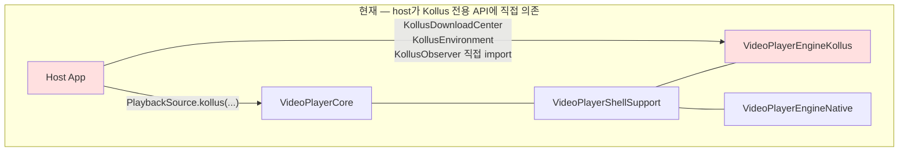
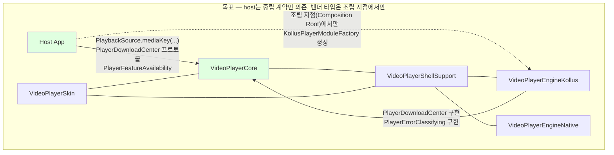
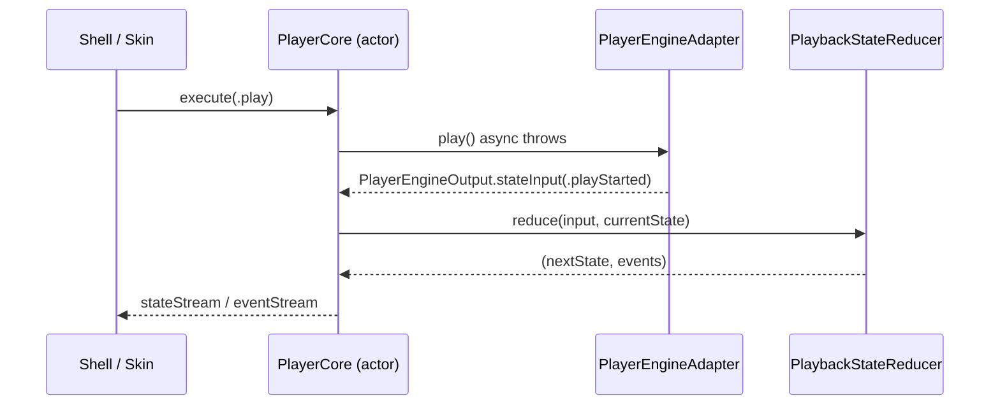
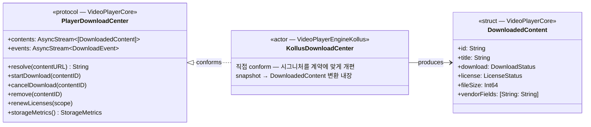
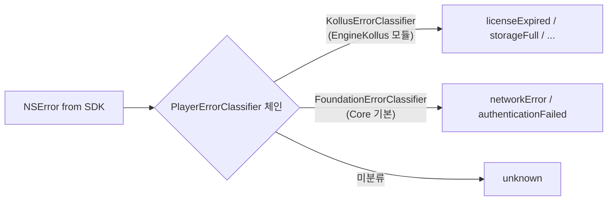
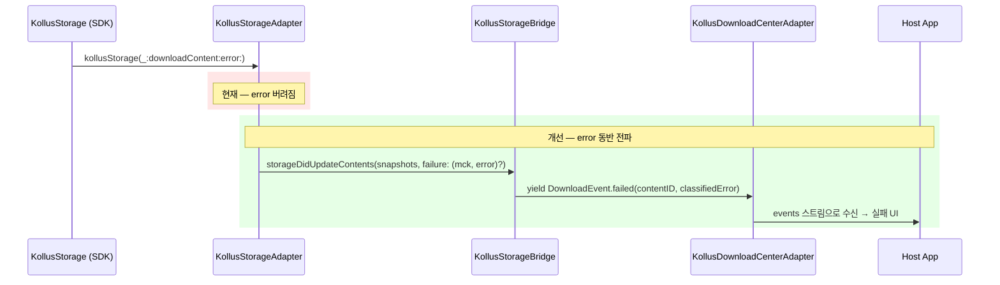
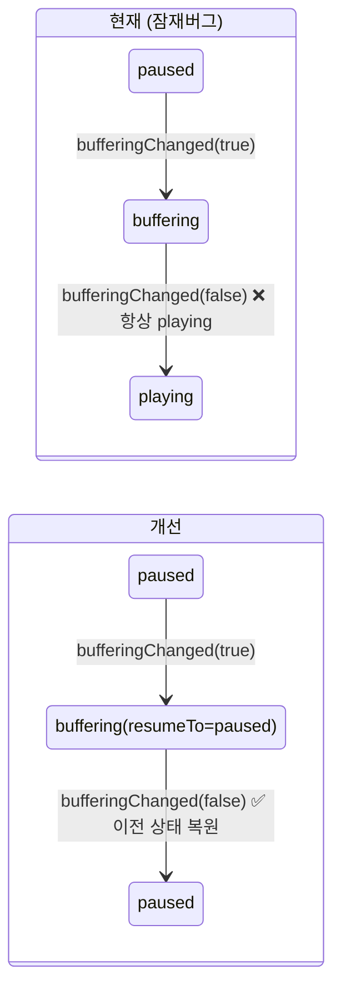
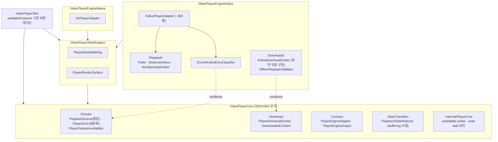

# videoplayer-ios-ms 개선 설계 문서

- 작성자: JunyoungJung
- 작성일: 2026-06-10
- 입력 문서:
  - [architecture-review-2026-06-10.md](./architecture-review-2026-06-10.md) — 아키텍처 검토
  - [kollus-sdk-coverage-review-2026-06-10.md](./kollus-sdk-coverage-review-2026-06-10.md) — Kollus SDK 기능 대조 검토
- 목적: 두 검토에서 발견된 문제를 해소하는 구체적 설계 — 목표 아키텍처, 폴더 구조, 예시 코드, 작업 순서

---

## 1. 개선 목표 요약

| # | 개선 항목 | 출처 | 해결하는 문제 |
|---|----------|------|--------------|
| P1 | `PlaybackSource` 벤더 중립화 | 아키텍처 §3.1 | Core에 `kollus` 케이스 누수 → SDK 추가 시 Core 수정 |
| P2 | 엔진 중립 다운로드 계약 (`PlayerDownloadCenter`) | 아키텍처 §3.2 | host가 Kollus 전용 API에 직접 의존 → SDK 교체 시 host 전면 재작성 |
| P3 | 기능 가용성 사전 협상 (`PlayerFeatureAvailability`) | 아키텍처 §3.3 | 엔진별 기능 차이가 런타임 실패로만 드러남 |
| P4 | 에러 분류 체계 확장 + 다운로드 에러 전파 | SDK 대조 §2.1–2.3 | Kollus 에러 11종이 `.unknown` 수렴, 다운로드 실패 무음 드롭 |
| P5 | 오프라인 DRM 사전 검증 + snapshot 필드 보강 | SDK 대조 §3.4 | 만료 콘텐츠가 재생 시도 후에야 실패 |
| P6 | `KollusPlayerAdapter` 분해 | 아키텍처 §4.4 | 1,202줄 god object |
| P7 | 잔여 정리 (PiP, UseCase, 채팅, reducer 버그, seek Task) | 양쪽 | 가짜 구현·보일러플레이트·잠재버그 |

**P1 → P2 → P3 순서가 중요.** P1이 도메인 타입을 바꾸므로 가장 먼저, P2/P3는 P1의 중립 타입 위에 쌓인다. P4는 독립적이라 병행 가능.

> **마이그레이션 방침**: 현재 개발 단계이므로 **일괄(big-bang) 마이그레이션**으로 진행한다. deprecated alias·병행 계약·래퍼 어댑터 같은 하위 호환 장치는 두지 않고, 구 API는 즉시 삭제한다. 호출부(패키지 내부 + Example)는 같은 커밋에서 함께 수정한다.

---

## 2. 목표 아키텍처

### 2.1 현재 vs 목표 모듈 의존 그래프





핵심 변화: **host의 일상 코드는 Core의 중립 계약만 본다.** Kollus 타입은 앱 시작 시 조립 지점(composition root) 한 곳에서만 등장 → SDK 교체 시 그 한 곳만 수정.

### 2.2 명령/신호 흐름 (변경 없음 — 유지할 강점)



상태 소유권은 Core 단일 — 이 구조는 그대로 유지. 개선은 이 흐름의 **양 끝**(도메인 타입, host 노출 표면)에 집중한다.

---

## 3. P1 — `PlaybackSource` 벤더 중립화

### 문제

```swift
// 현재: Sources/VideoPlayerCore/Domain/PlaybackSource.swift
public enum PlaybackSource: Equatable, Sendable {
    case kollus(mediaContentKey: String)   // ❌ Core에 벤더명
    case url(URL)
}
```

### 설계

벤더명 제거 + 확장 여지 확보. 어댑터가 해석 책임을 진다.

```swift
// 개선: Sources/VideoPlayerCore/Domain/PlaybackSource.swift
public struct PlaybackSource: Equatable, Sendable {
    /// 소스 식별 방식. 엔진이 자신이 지원하는 kind만 해석한다.
    public enum Kind: Equatable, Sendable {
        /// 일반 URL (로컬 파일, HLS, progressive)
        case url(URL)
        /// 엔진 고유 콘텐츠 키 (Kollus media_content_key, 향후 SDK의 contentId 등)
        case mediaKey(String)
    }

    public let kind: Kind
    /// 엔진별 부가 힌트 (예: 시작 위치 강제, 인트로 스킵). 모르는 키는 무시.
    public let options: [String: String]

    public init(kind: Kind, options: [String: String] = [:]) {
        self.kind = kind
        self.options = options
    }

    // 편의 생성자 — 호출부 마이그레이션 비용 최소화
    public static func url(_ url: URL) -> PlaybackSource { .init(kind: .url(url)) }
    public static func mediaKey(_ key: String) -> PlaybackSource { .init(kind: .mediaKey(key)) }
}
```

### 어댑터 측 변경

```swift
// KollusPlayerAdapter — 해석 책임은 어댑터에
private func makePlayerView(for source: PlaybackSource) throws -> KollusPlayerView {
    switch source.kind {
    case .mediaKey(let key):
        return KollusPlayerView(mediaContentKey: key)
    case .url(let url):
        return KollusPlayerView(contentURL: url.absoluteString)
    }
}

// AVPlayerAdapter — 지원하지 않는 kind는 명시적으로 거부
guard case .url(let url) = source.kind else {
    throw PlayerError.unsupportedSource("AVPlayer engine은 mediaKey 소스를 재생할 수 없습니다.")
}
```

### 마이그레이션

`case kollus(mediaContentKey:)` 호출부는 패키지 내 어댑터 2곳 + Example 앱뿐. **한 커밋에서 일괄 치환 후 구 케이스 즉시 삭제** (deprecated alias 없음):
`.kollus(mediaContentKey: key)` → `.mediaKey(key)`. `PlayerModuleBoundaryTests` 금지어에 `"case kollus"` 추가해 재발 차단.

---

## 4. P2 — 엔진 중립 다운로드 계약

### 문제

host가 `KollusDownloadCenter`/`KollusContentSnapshot`/`KollusObserver`를 직접 import. 오프라인/DRM 경로는 SDK 교체 시 host 전면 재작성.

### 설계 — Core에 계약, Kollus 모듈에 구현



```swift
// 신규: Sources/VideoPlayerCore/Download/PlayerDownloadCenter.swift
public protocol PlayerDownloadCenter: Actor {
    /// 다운로드 콘텐츠 목록 스냅샷 스트림 (변경 시마다 전체 목록 재발행)
    nonisolated var contents: AsyncStream<[DownloadedContent]> { get }
    /// 개별 이벤트 스트림 — 실패가 여기로 전파된다 (P4와 연결)
    nonisolated var events: AsyncStream<DownloadEvent> { get }

    func resolve(contentURL: String) async throws -> String
    func startDownload(contentID: String) async throws
    func cancelDownload(contentID: String) async throws
    func remove(contentID: String) async throws
    func renewLicenses(scope: LicenseRenewalScope) async throws
    func storageMetrics() async throws -> StorageMetrics
}

public enum DownloadEvent: Sendable {
    case progressed(contentID: String, percent: Double, bytes: Int64)
    case completed(contentID: String)
    case failed(contentID: String, error: PlayerError)        // ★ 무음 드롭 해소
    case licenseRenewed(contentID: String)
    case removedByPolicy(contentID: String, reason: String)   // 서버 강제 삭제 (kind:2/3)
}

public enum LicenseRenewalScope: Sendable {
    case all
    case expiredOnly
}

public struct StorageMetrics: Sendable {
    public let downloadedBytes: Int64
    public let streamingCacheBytes: Int64
}
```

```swift
// 신규: Sources/VideoPlayerCore/Download/DownloadedContent.swift
public struct DownloadedContent: Sendable, Hashable, Identifiable {
    public enum DownloadStatus: Sendable, Hashable {
        case notDownloaded
        case inProgress(percent: Double, downloadedBytes: Int64)
        case completed
    }

    /// P5에서 보강되는 시간제한 필드 포함
    public enum LicenseStatus: Sendable, Hashable {
        case none                                   // DRM 없는 콘텐츠
        case valid(LicenseConstraints)
        case expired
        case unknown
    }

    public struct LicenseConstraints: Sendable, Hashable {
        public let expiresAt: Date?
        public let playCountRemaining: Int?
        public let playTimeRemaining: TimeInterval?  // ★ DRMExpirePlayTime
        public let needsRenewalPrompt: Bool          // ★ DRMExpireRefreshPopup
    }

    public let id: String
    public let title: String
    public let duration: TimeInterval
    public let lastPosition: TimeInterval
    public let download: DownloadStatus
    public let license: LicenseStatus
    public let fileSize: Int64
    public let downloadedAt: Date?
    /// 중립 모델로 일반화 안 되는 벤더 고유 필드 (course, teacher, contentIndex 등)
    public let vendorFields: [String: String]
}
```

### Kollus 구현 — 직접 conformance (일괄 전환)

래퍼 어댑터 없이 **`KollusDownloadCenter` 자체가 `PlayerDownloadCenter`를 채택**하도록 시그니처를 계약에 맞게 개편한다. 기존 `mediaContentKey:` 파라미터명·`updateDRM` 등 Kollus 어휘 메서드는 삭제하고 계약 메서드로 대체. `KollusContentSnapshot` → `DownloadedContent` 변환은 center 내부(`KollusStorageBridge` yield 직전)에서 수행한다.

```swift
// 개편: Sources/VideoPlayerEngineKollus/Downloads/KollusDownloadCenter.swift
public actor KollusDownloadCenter: PlayerDownloadCenter {
    public nonisolated let contents: AsyncStream<[DownloadedContent]>
    public nonisolated let events: AsyncStream<DownloadEvent>

    public func startDownload(contentID: String) async throws {
        let storage = try await ensureStorage()
        try await storage.downloadContent(contentID)
    }

    public func renewLicenses(scope: LicenseRenewalScope) async throws {
        let storage = try await ensureStorage()
        try await storage.updateDownloadDRMInfo(includeExpired: scope == .expiredOnly)
    }

    public func storageMetrics() async throws -> StorageMetrics {
        let storage = try await ensureStorage()
        return await StorageMetrics(
            downloadedBytes: storage.storageSize,
            streamingCacheBytes: storage.cacheDataSize
        )
    }
    // resolve / cancelDownload / remove 동일 패턴
    // Kollus 전용 운영 API(setCacheSize, setBackgroundDownload, sendStoredLMS 등)는
    // KollusDownloadCenter의 추가 메서드로 유지 — 계약 밖이지만 조립 지점에서만 접근
}
```

> `KollusContentSnapshot`은 SDK 변환 전용 internal 타입으로 강등하고, host에 노출되는 것은 `DownloadedContent`뿐. Example 앱의 다운로드 화면도 같은 커밋에서 `DownloadedContent` 기반으로 전환한다.

### host 사용 예 — SDK 교체에 안전

```swift
// host 코드: Kollus 타입 없음
let center: any PlayerDownloadCenter = playerModule.downloadCenter

Task {
    for await event in center.events {
        switch event {
        case .failed(let id, let error):
            showDownloadFailureToast(contentID: id, error: error)
        case .removedByPolicy(let id, _):
            refreshDownloadList(removing: id)
        default:
            break
        }
    }
}
```

---

## 5. P3 — 기능 가용성 사전 협상

### 문제

자막·북마크·줌·스크롤·adaptive streaming이 Kollus 전용인데, host는 명령 실패 후에야 알 수 있다.

### 설계

Core가 init 시점에 엔진의 optional protocol 채택 여부를 조회해 스냅샷 제공.

```swift
// 신규: Sources/VideoPlayerCore/Domain/PlayerFeatureAvailability.swift
public struct PlayerFeatureAvailability: OptionSet, Sendable {
    public let rawValue: Int
    public init(rawValue: Int) { self.rawValue = rawValue }

    public static let playbackRate      = Self(rawValue: 1 << 0)
    public static let subtitles         = Self(rawValue: 1 << 1)
    public static let externalSubtitles = Self(rawValue: 1 << 2)
    public static let bookmarks         = Self(rawValue: 1 << 3)
    public static let zoom              = Self(rawValue: 1 << 4)
    public static let scroll            = Self(rawValue: 1 << 5)
    public static let adaptiveStreaming = Self(rawValue: 1 << 6)
    public static let pictureInPicture  = Self(rawValue: 1 << 7)
    public static let displayScaling    = Self(rawValue: 1 << 8)
}
```

```swift
// PlayerCore 내부 — 프로토콜 채택 여부로 자동 산출 (엔진 측 추가 작업 불필요)
private static func probeAvailability(of engine: any PlayerPlaybackEngine) -> PlayerFeatureAvailability {
    var features: PlayerFeatureAvailability = []
    if engine is any PlayerPlaybackRateEngine      { features.insert(.playbackRate) }
    if engine is any PlayerSubtitleEngine          { features.insert(.subtitles) }
    if engine is any PlayerExternalSubtitleEngine  { features.insert(.externalSubtitles) }
    if engine is any PlayerBookmarkEngine          { features.insert(.bookmarks) }
    if engine is any PlayerScrollEngine            { features.insert(.scroll) }
    if engine is any PlayerAdaptiveStreamingEngine { features.insert(.adaptiveStreaming) }
    if engine is any PlayerDisplayScalingEngine    { features.insert(.displayScaling) }
    if engine is any PlayerPiPCapability           { features.insert(.pictureInPicture) }
    #if canImport(UIKit)
    if engine is any PlayerZoomEngine              { features.insert(.zoom) }
    #endif
    return features
}
```

`PlayerStateSnapshot`에 `availableFeatures: PlayerFeatureAvailability` 추가 → Skin/host가 init 직후 버튼 노출 여부 결정.

```swift
// host/Skin 사용 예 — 런타임 실패 대신 사전 게이트
skinState = skinState.updating(
    isBookmarkButtonHidden: !snapshot.availableFeatures.contains(.bookmarks),
    isQualityMenuHidden: !snapshot.availableFeatures.contains(.adaptiveStreaming)
)
```

**전제 조건**: PiP 가짜 구현 제거 (P7). `KollusPlayerAdapter`가 `PlayerPiPCapability`를 채택한 채 항상 실패하면 이 협상이 거짓말을 하게 됨.

---

## 6. P4 — 에러 분류 체계 + 다운로드 에러 전파

### 6.1 `PlayerError` 세분화

```swift
// 개선: Sources/VideoPlayerCore/Domain/PlayerError.swift
public enum PlayerError: Error, Equatable, Sendable {
    case networkError(String)
    case authenticationFailed(String)
    case decodingError(String)
    case engineError(String)
    case unsupportedSource(String)                  // P1 연계
    // ★ 신설 — SDK 대조 §2.3의 11종 카테고리 대응
    case licenseExpired(String)                     // DRM 기한/횟수/시간 만료
    case licenseRenewalRequired(String)             // 갱신하면 해결되는 만료
    case storageFull(String)
    case downloadConflict(String)                   // 중복 다운로드, 완료 상태 재요청
    case contentNotFound(String)
    case deviceNotSupported(String)
    case unknown(String)
}
```

### 6.2 분류기 — 확장 가능한 체인



```swift
// 신규: Sources/VideoPlayerCore/Domain/PlayerErrorClassifier.swift
public protocol PlayerErrorClassifier: Sendable {
    /// 분류 성공 시 PlayerError, 모르는 에러면 nil (다음 분류기로)
    func classify(_ error: NSError) -> PlayerError?
}

public struct PlayerErrorClassifierChain: Sendable {
    private let classifiers: [any PlayerErrorClassifier]

    public init(classifiers: [any PlayerErrorClassifier]) {
        self.classifiers = classifiers
    }

    public func classify(_ error: Error) -> PlayerError {
        if let playerError = error as? PlayerError { return playerError }
        let nsError = error as NSError
        for classifier in classifiers {
            if let classified = classifier.classify(nsError) { return classified }
        }
        return .unknown(nsError.localizedDescription)
    }
}
```

```swift
// 신규: Sources/VideoPlayerEngineKollus/Errors/KollusErrorClassifier.swift
// 실제 도메인/코드 값은 SDK 헤더에서 확인 후 채움 — docs/kollus-ios-sdk/guide/09-error-code.md 대응
public struct KollusErrorClassifier: PlayerErrorClassifier {
    public func classify(_ error: NSError) -> PlayerError? {
        guard error.domain == kollusErrorDomain else { return nil }
        switch error.code {
        case .drmDateExpired, .drmPlayCountExceeded, .drmPlayTimeExceeded:
            return .licenseRenewalRequired(error.localizedDescription)
        case .storageFull, .fileWriteFailed:
            return .storageFull(error.localizedDescription)
        case .downloadDuplicated, .downloadAlreadyCompleted:
            return .downloadConflict(error.localizedDescription)
        case .contentNotFound:
            return .contentNotFound(error.localizedDescription)
        case .deviceNotSupported:
            return .deviceNotSupported(error.localizedDescription)
        case .authenticationFailed:
            return .authenticationFailed(error.localizedDescription)
        default:
            return nil
        }
    }
}
```

조립: `KollusPlayerModuleFactory`가 `KollusErrorClassifier`를 체인 맨 앞에 등록. 어댑터의 `mapError` 클로저가 체인을 사용.

### 6.3 다운로드 에러 전파 (무음 드롭 해소)



```swift
// 개선: KollusStorageAdapter.swift
func kollusStorage(_ kollusStorage: KollusStorage, downloadContent content: KollusContent, error: Error?) {
    let failure = error.map {
        DownloadFailure(
            mediaContentKey: content.mediaContentKey ?? "",
            error: errorClassifier.classify($0)
        )
    }
    storageDelegate?.storageDidUpdateContents(contentSnapshots, failure: failure)
}

// 개선: checkContentURL — try? 제거, "미등록"과 "실패" 구분
func checkContentURL(_ url: String) throws -> String? {
    do {
        return try storage.checkContentURL(url)
    } catch let error as NSError where error.isKollusContentNotRegistered {
        return nil                       // 미등록 → nil (정상 시그널)
    }
    // 그 외 에러는 throw — 호출자가 네트워크/스토리지 장애로 처리
}
```

---

## 7. P5 — 오프라인 DRM 사전 검증

### snapshot 필드 보강

```swift
// 개선: KollusContentSnapshot.DRMStatus — 시간제한 필드 추가
public enum DRMStatus: Sendable, Hashable {
    case unknown
    case valid(
        expiresAt: Date?,
        playCountRemaining: Int?,
        playTimeRemaining: TimeInterval?,   // ★ DRMExpirePlayTime
        needsRenewalPrompt: Bool            // ★ DRMExpireRefreshPopup
    )
    case expired
}

// fromSDKContent에 추가 캡처
// content.drmTotalExpirePlayTime / content.drmExpirePlayTime / content.contentIndex / content.downloadStopSize
```

### 사전 검증 — guide/05-offline-playback.md의 4조건

```swift
// 신규: Sources/VideoPlayerEngineKollus/Downloads/KollusOfflinePlaybackValidator.swift
enum KollusOfflinePlaybackValidator {
    /// 문서 4조건: DRMExpired == false, 만료일 미도래, 재생 시간 잔여, 재생 횟수 잔여
    static func validate(_ snapshot: KollusContentSnapshot, now: Date = Date()) -> PlayerError? {
        switch snapshot.drm {
        case .expired:
            return .licenseRenewalRequired("오프라인 라이선스가 만료되었습니다.")
        case .valid(let expiresAt, let countRemaining, let timeRemaining, _):
            if let expiresAt, expiresAt <= now {
                return .licenseRenewalRequired("라이선스 유효 기간이 지났습니다.")
            }
            if let countRemaining, countRemaining <= 0 {
                return .licenseExpired("남은 재생 횟수가 없습니다.")
            }
            if let timeRemaining, timeRemaining <= 0 {
                return .licenseExpired("남은 재생 시간이 없습니다.")
            }
            return nil
        case .unknown:
            return nil   // DRM 정보 없음 — SDK prepare에 위임
        }
    }
}
```

```swift
// KollusPlayerAdapter.prepare — 다운로드 콘텐츠면 SDK 호출 전 선검증
if case .mediaKey(let key) = source.kind,
   let snapshot = await downloadedSnapshot(for: key),
   case .completed = snapshot.download {
    if let drmError = KollusOfflinePlaybackValidator.validate(snapshot) {
        throw drmError    // ★ 재생 버튼 누르기 전 UI가 미리 알 수 있음
    }
}
```

추가: host용 헬퍼 `DownloadedContent.license`로도 같은 검증 가능 → 목록 화면에서 만료 뱃지 표시.

---

## 8. P6 — `KollusPlayerAdapter` 분해

### 목표 폴더 구조

```
Sources/VideoPlayerEngineKollus/
├── KollusPlayerAdapter.swift            # ~400줄 목표: 프로토콜 conformance + 위임만
├── KollusPlayerModuleFactory.swift
├── KollusEnvironment.swift
├── KollusSessionBootstrapper.swift
├── KollusDelegateBridge.swift
├── KollusEngineSignal.swift
├── KollusObserver.swift
├── KollusDiagnosticsSink.swift
├── KollusBackgroundAudioKeeper.swift
├── KollusDRMConfiguration.swift
├── KollusLiveChatProfile.swift          # P7 결정에 따라 배선 또는 제거
├── Signal/
│   └── KollusSignalMapper.swift
├── Playback/                            # ★ 신규 — adapter에서 추출
│   ├── KollusPositionPoller.swift       #   0.5s 폴링 (간격 설정값화)
│   ├── KollusBookmarkStore.swift        #   낙관적 북마크 캐시
│   └── KollusNextEpisodeEmitter.swift   #   next-episode 메타 캐시 + 임계 체크
├── Errors/                              # ★ 신규 — P4
│   └── KollusErrorClassifier.swift
├── Downloads/
│   ├── KollusDownloadCenter.swift           # P2 — PlayerDownloadCenter 직접 conform으로 개편
│   ├── KollusOfflinePlaybackValidator.swift # ★ 신규 — P5
│   ├── KollusContentSnapshot.swift          # internal 강등 — SDK 변환 전용
│   └── KollusStorageBridge.swift
├── KollusStorageAdapter.swift
└── KollusStorageProtocol.swift

Sources/VideoPlayerCore/
├── Domain/
│   ├── PlaybackSource.swift             # P1 개편
│   ├── PlayerError.swift                # P4 세분화
│   ├── PlayerErrorClassifier.swift      # ★ 신규 — P4
│   ├── PlayerFeatureAvailability.swift  # ★ 신규 — P3
│   └── ...
├── Download/                            # ★ 신규 — P2 중립 계약
│   ├── PlayerDownloadCenter.swift
│   └── DownloadedContent.swift
├── Contract/ ...
├── StateTransition/ ...
└── Internal/PlayerCore.swift            # P3 probe, P7 seek Task 취소
```

### 추출 예시 — `KollusPositionPoller`

```swift
// 신규: Sources/VideoPlayerEngineKollus/Playback/KollusPositionPoller.swift
/// Kollus SDK의 position 콜백이 seek 전용인 한계를 보완하는 주기 폴러.
/// adapter가 play/pause/stop 시점에 start/stop을 호출한다.
actor KollusPositionPoller {
    private var task: Task<Void, Never>?
    private let interval: Duration
    private let readPosition: @Sendable () async -> TimeInterval?
    private let onTick: @Sendable (TimeInterval) async -> Void

    init(
        interval: Duration = .milliseconds(500),
        readPosition: @escaping @Sendable () async -> TimeInterval?,
        onTick: @escaping @Sendable (TimeInterval) async -> Void
    ) {
        self.interval = interval
        self.readPosition = readPosition
        self.onTick = onTick
    }

    func start() {
        guard task == nil else { return }
        task = Task { [interval, readPosition, onTick] in
            while !Task.isCancelled {
                try? await Task.sleep(for: interval)
                guard let position = await readPosition() else { continue }
                await onTick(position)
            }
        }
    }

    func stop() {
        task?.cancel()
        task = nil
    }
}
```

adapter 본체는 12개 프로토콜 conformance + 컴포넌트 위임만 남긴다. 시그널 처리(`handleSignal`)는 유지 — 상태 권위 흐름의 중심이라 분리 시 오히려 추적 어려움.

---

## 9. P7 — 잔여 정리

| 항목 | 조치 | 비고 |
|------|------|------|
| PiP 가짜 구현 | `KollusPlayerAdapter`에서 `PlayerPiPCapability` 채택 **제거** | P3 협상 신뢰성의 전제. host AVPictureInPictureController 통합은 별도 과제로 |
| UseCase 3종 | 삭제, Shell이 `PlayerCore` 직접 호출 | 로깅/재시도 필요해지면 그때 데코레이터로 |
| 채팅 | 즉시 결정: 요구사항 있으면 `playerView.kollusChat` 주입 구현, 없으면 `KollusEnvironment.chat`/`KollusLiveChatProfile` **삭제** | 반쪽 상태 해소 — deprecated 유예 없음 |
| seek Task 미취소 | `pendingSeekTask` 보관 → `dispose()`에서 cancel | `PlayerCore.swift:378` |
| reducer paused→buffering 버그 | buffering 진입 전 status 보존 후 복원 | 아래 상태도 |
| `userInteraction` 플래그 | `PlaybackStateInput.playStarted(origin:)`으로 전파 | 자동재생 분석 필요 시 |
| 챕터/자막 트랙 | 제품 요구사항 확인 후 별도 설계 | 현재 기능 단위로 깔끔히 비어 있어 추후 추가 용이 |

### reducer 수정 — buffering 종료 시 이전 상태 복원



```swift
// PlaybackState에 buffering 진입 전 상태 기억 필드 추가
// (또는 reducer가 isBuffering 플래그와 status를 분리 관리 — 현 구조상 후자가 자연스러움)
case .bufferingChanged(let isBuffering):
    if isBuffering {
        return state.updating(isBuffering: true)          // status는 유지
    } else {
        return state.updating(isBuffering: false)         // playing/paused 그대로 복원
    }
```

> 참고: buffering 자동 재생(SDK 문서는 수동 `play()` 요구)은 의도적 일탈로 유지하되, 위 수정으로 "일시정지 중 버퍼링"이 재생으로 둔갑하는 케이스만 제거.

---

## 10. 작업 순서 및 단계별 검증

```mermaid
gantt
    title 개선 작업 순서 (의존 관계 기준)
    dateFormat X
    axisFormat %s

    section Phase 1 — 기반
    P1 PlaybackSource 중립화           :p1, 0, 2
    P4 에러 분류 체계 (독립 병행 가능)   :p4, 0, 3
    P7 PiP 제거 / seek Task / reducer  :p7, 0, 2

    section Phase 2 — 계약
    P2 PlayerDownloadCenter 계약+구현   :p2, after p1, 4
    P3 FeatureAvailability 협상        :p3, after p7, 2

    section Phase 3 — 품질
    P5 오프라인 DRM 사전 검증           :p5, after p2, 2
    P6 Adapter 분해                    :p6, after p3, 3
    P7b UseCase 제거 / 채팅 결정        :p7b, after p6, 1
```



### 단계별 완료 기준

| Phase | 완료 기준 |
|-------|----------|
| P1 | `swift test` 통과 + `PlayerModuleBoundaryTests`에 `"case kollus"` 금지어 추가 + Example 빌드 |
| P4 | Kollus 에러 도메인별 분류 단위 테스트 (`Tests/VideoPlayerModuleTests/Kollus/KollusErrorClassifierTests.swift`) + 다운로드 실패 이벤트 수신 테스트 |
| P2 | host(Example)에서 Kollus import 없이 다운로드 목록/시작/취소/실패 처리 동작. 실기기 다운로드 QA |
| P3 | Kollus/Native 각각 availability 스냅샷 검증 테스트. Skin이 미지원 버튼 숨김 |
| P5 | 만료 snapshot으로 prepare 시 `licenseRenewalRequired` throw 테스트. 실기기 만료 콘텐츠 QA |
| P6 | adapter 줄 수 ~400 이하, 추출 컴포넌트 각각 단위 테스트, 기존 시그널 매핑 테스트 전부 통과 |

### 리스크

- **P1·P2 시그니처 변경**: 일괄 전환이므로 host 앱(smartlearning-ios-ms)이 패키지를 이미 참조 중이면 **같은 시점에 host 호출부도 함께 수정**해야 함 (deprecated 유예 없음). 패키지·host 변경을 한 작업 단위로 묶을 것.
- **P4 에러 코드 값**: SDK 헤더의 실제 도메인/코드 상수 확인 필수. 문서(guide/09)는 카테고리만 정의 — 코드 값은 `KollusSDK.xcframework` 헤더에서 추출.
- **Kollus 실기기 의존**: P2/P5는 시뮬레이터 검증 불가. 실기기 QA 체크리스트를 `example-app-rebuild-plan.md` 방식으로 기록.

---

## 11. 최종 상태 모듈 그래프



**SDK 교체 시나리오 최종 점검**: 새 SDK 도입 = ① 새 엔진 모듈 생성(`PlayerEngineAdapter` + optional protocols 구현), ② `PlayerDownloadCenter` 구현, ③ `PlayerErrorClassifier` 구현, ④ 조립 지점에서 factory 교체. **Core·Shell·Skin·host 일상 코드 수정 0건** — 설계 의도 달성.
