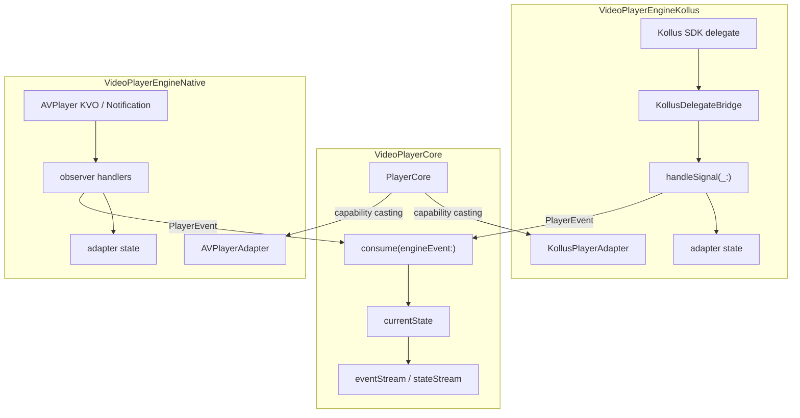
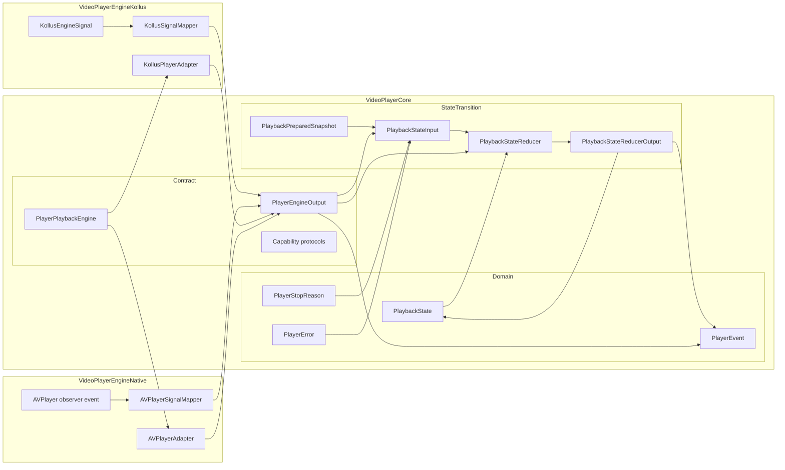
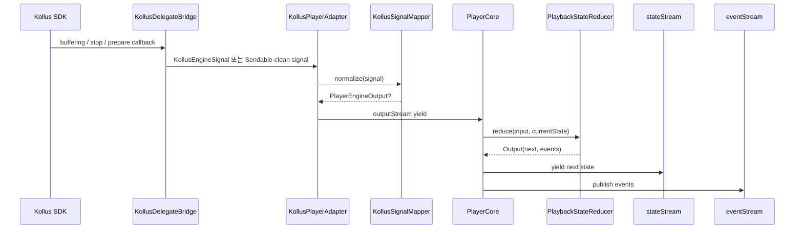
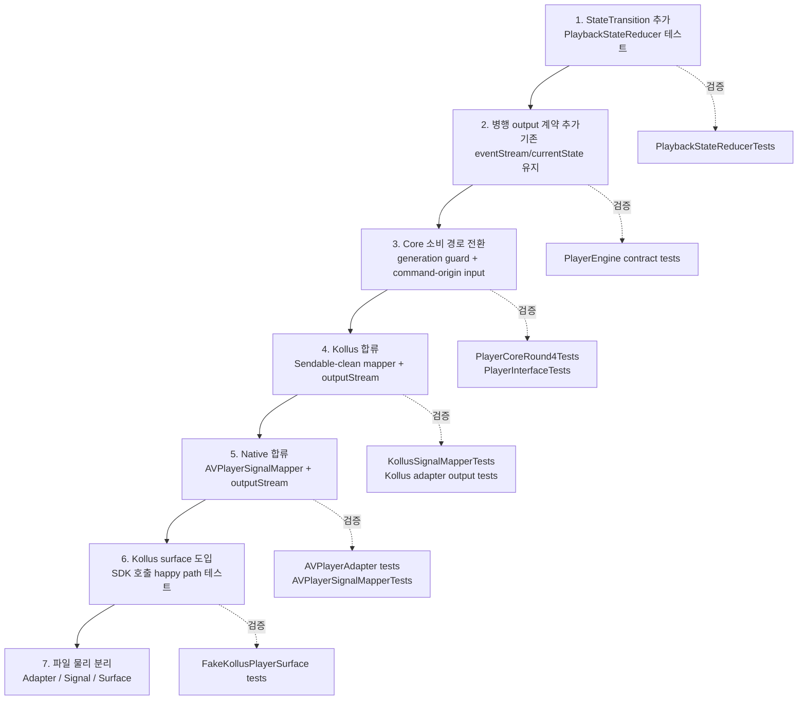

# 플레이어 엔진 어댑터 리팩터링 아키텍처

> 작성: 모바일개발팀_정준영 · 2026-06-04
> 대상: `Sources/VideoPlayerEngineKollus/KollusPlayerAdapter.swift` (1,085줄) 외 엔진 어댑터 전반
> 독자: 이 모듈을 처음 보는 주니어 포함 전체 팀

---

## 0. 결론

1. `KollusPlayerAdapter`는 actor 하나가 엔진 프로토콜 10개를 직접 구현하고, SDK 배선·상태 전이·기능 위임을 한 파일에 담아 1,085줄까지 커졌다.
2. 프로토콜은 이미 capability 단위로 나뉘어 있다. 문제는 인터페이스가 뚱뚱한 것이 아니라, 한 구현체 안에 서로 다른 변경 이유가 섞인 것이다.
3. `PlayerCore`가 단일 엔진 객체를 들고 `as? PlayerPlaybackRateEngine` 같은 런타임 캐스팅으로 capability를 찾기 때문에, 프로토콜별 구현체 분리는 facade나 registry 없이는 맞지 않는다.
4. 가장 가치 있는 분리는 "상태가 어떻게 진화하는가"라는 SDK 독립 규칙을 순수하게 테스트 가능한 곳으로 옮기는 것이다.
5. 아직 실험 단계이고 구조 변경 여유가 있으므로 장기 구조는 **B안: Core가 상태를 소유하고 엔진은 신호만 낸다**로 간다.
6. `KollusPlayerSurface` 같은 SDK 표면 추상화는 테스트성 개선에는 유효하지만, 주 리팩터링 축은 아니다. 주 축은 `PlayerCore`를 유일한 상태 소유자로 세우는 것이다.
7. B안에는 구현 전 반드시 닫아야 할 정합성 함정 3개가 있다. (a) outputStream이 스냅샷→**델타**로 바뀌므로 lossless·순서보존(`bufferingNewest` 금지)이 필요하다(§5.1). (b) play/pause/seek의 상태 권위 출처가 **엔진마다 다르다**. Native play는 권위 콜백이 없어 command-origin으로 닫지 않으면 `.playing`에 도달하지 못한다(§5.2.1). (c) 마이그레이션은 Core 소비 전환(3단계) 전에 adapter outputStream shim(2단계)이 있어야 한다(§8).

---

## 1. 현재 구조

### 1.1 `KollusPlayerAdapter`

```
KollusPlayerAdapter (actor, 1085줄)
├─ 채택 프로토콜 10개
│   PlayerEngineAdapter / PlayerPlaybackRateEngine / PlayerTitledBookmarkEngine
│   PlayerSubtitleEngine / PlayerExternalSubtitleEngine / PlayerDisplayScalingEngine
│   PlayerZoomEngine / PlayerScrollEngine / PlayerAdaptiveStreamingEngine / PlayerPiPCapability
│
├─ 소유 상태
│   state(PlaybackState) · eventContinuation · @MainActor playerView(KollusPlayerView)
│   bridge · signalConsumerTask(FIFO) · positionPollTask · pendingPrepareContinuation
│   nextEpisodeMeta · currentZoom · displayScaleMode · subtitlePathBuffer
│
└─ 책임
    A. SDK 신호를 상태/이벤트로 바꾸는 규칙
    B. Kollus SDK 생성·delegate·DRM·proxy·prepare 배선
    C. rate/bookmark/subtitle/zoom/scroll/streaming/pip/scaling 기능 위임
```

### 1.2 `PlayerCore`의 제약

`PlayerCore`는 엔진을 단일 객체로 보관하고, 기능이 필요할 때마다 capability protocol로 캐스팅한다.

```swift
private let engine: PlayerPlaybackEngine

func setPlaybackRate(_ rate: Double) async throws {
    guard let rateEngine = engine as? any PlayerPlaybackRateEngine else {
        throw PlayerError.engineError("Playback rate is not supported by current engine.")
    }
    try await rateEngine.setPlaybackRate(rate)
}
```

따라서 `KollusRateEngineImpl`, `KollusBookmarkEngineImpl`처럼 프로토콜별 구현체를 별도로 만들면 다시 하나로 묶는 facade가 필요하다. 이 변경은 단순 파일 분리가 아니라 `PlayerCore`의 capability 탐색 모델 변경이다.

### 1.3 현재 상태 전이 흐름

현재는 Kollus/Native adapter가 1차로 상태를 만들고, `PlayerCore`가 엔진 이벤트를 받아 다시 Core 상태로 접는다.



이 그림에서 중복되는 부분은 `KHandle`, `AVHandle`, `CoreConsume`이 모두 `PlaybackState`를 해석한다는 점이다.

---

## 2. SDK 독립성 경계

이 패키지의 핵심 목표는 앱·UI·Core가 실제 재생 SDK를 몰라도 되는 것이다. 이 경계는 큰 틀에서 이미 작동한다.

```
VideoPlayerCore
└─ PlayerPlaybackEngine + capability protocols
   ├─ VideoPlayerEngineKollus  → Kollus SDK import
   ├─ VideoPlayerEngineNative  → AVPlayer import
   └─ VideoPlayerEngineAqua    → 향후 Aqua SDK import
```

정확히 말하면:

- `KollusSDKBinary`는 `VideoPlayerEngineKollus`에 갇혀 있다.
- `VideoPlayerCore`는 Kollus/AVPlayer/Aqua 타입을 모른다.
- `AVFoundation`은 Native 엔진뿐 아니라 ShellSupport/Skin에서도 일부 사용한다. 따라서 문서에서 "AVFoundation이 Native에만 존재한다"고 쓰면 부정확하다. 중요한 것은 `VideoPlayerCore`가 재생 SDK 타입을 직접 알지 않는다는 점이다.

결론: SDK 독립성을 위해 새로운 공유 `PlayerSurface`를 만드는 것이 1순위가 아니다. Core 관점의 공통 추상은 `PlayerPlaybackEngine`이고, Shell/render binding 관점의 호출자 계약은 `PlayerEngineAdapter`다. 지금의 냄새는 SDK 타입 누수보다 **상태 전이 규칙과 재생 수명주기 규칙이 여러 곳에 흩어져 있는 것**이다.

---

## 3. 실제 문제

### 3.1 구현 뭉침

`KollusPlayerAdapter`에는 세 변경축이 같이 있다.

| 축 | 내용 | 바뀌는 이유 |
|---|---|---|
| A. 상태 규칙 | 준비, 재생, 일시정지, buffering, stop, failure, position, next episode | 재생 정책/상태 의미 변경 |
| B. SDK 배선 | playerView 생성, storage/DRM/proxy/skin 주입, delegate 연결, prepareToPlay | Kollus SDK/API/환경 변경 |
| C. 기능 위임 | rate, bookmark, subtitle, zoom, scroll, ABR, PiP, scaling | 기능 추가 또는 SDK 호출부 변경 |

축 B/C는 Kollus 전용이다. 축 A는 Kollus 전용이 아니다. `AVPlayerAdapter`도 stop/failure/buffering/time update에서 같은 의미의 상태 규칙을 다시 구현한다.

### 3.2 상태 규칙은 어댑터에만 있는 것이 아니다

현재 상태 규칙은 세 군데에 있다.

| 위치 | 역할 |
|---|---|
| `KollusPlayerAdapter.handleSignal(_:)` | Kollus delegate 신호를 adapter state/event로 반영 |
| `AVPlayerAdapter` observer handlers | AVPlayer KVO/Notification 신호를 adapter state/event로 반영 |
| `PlayerCore.consume(engineEvent:)` | 엔진이 낸 `PlayerEvent`를 Core state/event로 다시 반영 |
| `PlayerCore.start/performStart/execute(.stop)` | prepare generation, autoplay, cancellation, stop reason 같은 수명주기 규칙 처리 |
| `KollusPlayerAdapter.prepare/handleSignal` | pending prepare continuation, late prepare callback, playerView teardown 처리 |

이 점이 중요하다. 상태 전이 reducer를 새로 추가하면서 adapter에도 reducer를 두고 Core에도 기존 `consume` reducer를 남기면 상태 전이의 단일 진실원이 생기지 않는다. 오히려 reducer가 하나 더 늘어난다. 또한 signal reducer만 옮긴다고 끝나지 않는다. `prepareGeneration`, autoplay, cancellation, `.appLifecycle`/`.replacedSource` stop reason 같은 **재생 수명주기 규칙**도 Core가 소유할지, adapter가 output을 통해 보고할지 같이 정해야 한다.

### 3.3 SOLID 관점 진단

SOLID는 "원칙 이름에 맞춰 파일을 쪼개는 규칙"이 아니라, 변경이 들어왔을 때 어디가 같이 흔들리는지 보는 진단 도구로 사용한다.

| 원칙 | 위반/위험 | 근거 | 변경 빈도 | 권장 조치 |
|---|---|---|---|---|
| SRP | 높음 | `KollusPlayerAdapter`가 SDK 배선, 상태 전이, 기능 위임, prepare continuation, polling을 함께 처리 | 잦음 | 상태 전이 정책은 Core `StateTransition`으로 이동. SDK 배선과 기능 위임은 adapter 내부에 남긴 뒤 파일만 분리 |
| OCP | 중간 | 새 엔진 추가 시 stop/buffering/failure/position 규칙을 새 adapter에 다시 작성해야 함 | 엔진 추가 시 발생 | vendor별 `KollusSignalMapper`, `AVPlayerSignalMapper`만 추가하고 reducer는 수정하지 않는 구조로 전환 |
| LSP | 중간 | `PlayerPlaybackEngine` 계약을 `currentState/eventStream`에서 `outputStream`으로 바꾸면 기존 fake/adapter/호출자 기대가 깨짐 | 전환 기간에 높음 | 구/신 계약을 동시에 만족하는 adapter shim 또는 contract test를 먼저 둔다 |
| ISP | 낮음 | 기능 protocol은 이미 rate/subtitle/bookmark/display/zoom/scroll/PiP로 분리되어 있음 | 가끔 | capability protocol 추가 분리는 보류. 문제는 protocol 크기가 아니라 구현체 집중 |
| DIP | 중간 | `PlayerCore`는 SDK 타입은 모르지만, 상태 정책을 engine이 만든 `PlayerEvent` 의미에 의존함 | 상태 정책 변경 시 발생 | Core가 `PlaybackStateInput`이라는 안정된 정책 입력에 의존하게 바꾼다 |

따라서 이 문서의 리팩터링은 "SOLID를 위해 protocol을 더 쪼개자"가 아니다. **변경 빈도가 높은 상태 정책을 안정된 Core 정책으로 끌어올리고, vendor adapter는 번역 계층으로 낮추는 것**이 핵심이다.

LSP 관점에서 별도 주의가 필요한 현재 계약 불일치도 있다. `KollusPlayerAdapter`는 `PlayerPiPCapability`를 채택하지만 실제 PiP를 시작하지 않고 policy downgrade event만 발행하며 `isPiPActive`는 항상 false다. 이 동작을 "미지원 capability"로 볼지, "요청은 가능하지만 host PiP 통합 전까지 활성화되지 않는 capability"로 볼지 정하지 않으면 호출자 계약이 모호하다. `EngineCapabilities`에 이미 `.nativePiP` 비트가 있으므로, "protocol 채택 + 런타임 no-op" 대신 capability 비트로 지원 여부를 표현하는 선택지가 있다(§6). 이 결정은 상태 전이 리팩터링과 별개지만, B안 전환 전에 계약 문서와 테스트에서 먼저 고정해야 한다.

---

## 4. 하지 않을 것

| 안 하는 것 | 이유 |
|---|---|
| 프로토콜별 구현체 분리·주입 | PlayerCore가 단일 엔진 객체를 캐스팅하는 구조와 맞지 않는다. facade/registry 변경 없이는 배선만 늘어난다. |
| 공유 `PlayerSurface` | AVPlayer는 KVO/periodic observer, Kollus는 delegate+polling, Aqua는 또 다를 수 있다. 최소공통분모나 합집합 interface가 되기 쉽다. |
| vendor 고유 신호 전체 정규화 | caption, hlsHeight, devicePolicy 등 상태를 움직이지 않는 신호는 adapter에서 `PlayerEvent`로만 내보내면 된다. |
| OCP 명목의 signal handler 객체 난립 | vendor 신호 집합은 사실상 닫혀 있고, switch가 더 읽기 쉽다. |

---

## 5. 개선 방향

### 5.1 선택: B안으로 간다

이번 리팩터링의 장기 목표는 **Core가 상태를 소유하고 엔진은 신호만 내는 구조**다.

```text
SDK callback / AVPlayer observer
→ Engine adapter
→ PlaybackStateInput 또는 passthrough PlayerEvent
→ PlayerCore
→ PlaybackStateReducer
→ PlaybackState + PlayerEvent
→ stateStream / eventStream
```

B안의 핵심 결정:

- `PlayerCore`가 유일하게 `PlaybackState`를 만든다.
- 엔진 adapter는 `PlaybackState`를 만들지 않는다.
- 엔진 adapter는 SDK 신호를 `PlaybackStateInput`으로 정규화한다.
- caption, hlsHeight, bitrate, naturalSize처럼 상태를 움직이지 않는 신호는 `PlayerEvent` passthrough로 Core에 넘긴다.
- `PlayerPlaybackEngine.currentState/eventStream`은 장기적으로 제거하거나 adapter 호환용 deprecated surface로만 남긴다.
- `prepare`, `stop`, command success/failure 같은 수명주기 입력도 Core reducer를 통과한다. 단, 권위 콜백이 오지 않는 명령은 "성공 확인 후 Core가 command-origin input을 적용"하는 경로를 남긴다. 어떤 명령이 권위 콜백을 갖는지는 **엔진마다 다르다**(§5.2.1 권위 매트릭스). 이 분기는 엔진 무관 Core에 하드코딩하면 안 되고 capability로 모델링한다.
- prepare 성공/실패 output에는 source identity 또는 generation을 붙이거나, Core가 active generation과 맞는 output만 소비해야 한다. 그렇지 않으면 이전 source의 늦은 `.prepared`/`.failed`가 새 source 상태를 덮어쓸 수 있다.
- **outputStream은 `PlaybackStateInput`을 델타로 싣는다. 따라서 lossless·순서보존이어야 한다.** 현재 `engine.eventStream`은 `bufferingNewest(8)`이고, 지금은 adapter가 완성된 상태 스냅샷(`.stateDidChange(state)`)을 보내므로 중간값이 drop돼도 최신 스냅샷이 권위적이라 수렴한다. B안에서 입력이 스냅샷→델타로 바뀌면 drop된 입력은 **영구 상태 desync**를 만든다. outputStream은 `bufferingPolicy: .unbounded`로 고정하거나, stateInput을 idempotent snapshot으로 유지해 델타 손실을 원천 차단한다.

이 선택은 A안보다 변경 범위가 크다. 하지만 실험 단계라면 이 비용을 지금 치르는 편이 낫다. 새 엔진(Aqua 등)을 붙일 때 상태 규칙을 다시 복제하지 않으려면 Core가 상태 단일 진실원이 되어야 한다.

### 5.2 Core 내부 이름과 책임

처음 제안한 After 구조는 `VideoPlayerCore/Domain` 아래에 `EngineSignal.swift`와 `PlaybackStateMachine.swift`를 둔다. 이 배치는 이름과 책임이 조금 맞지 않는다.

| 초안 이름 | 문제 | 수정 방향 |
|---|---|---|
| `Domain/EngineSignal.swift` | `Engine`은 도메인 용어가 아니라 adapter 경계 용어다. Domain에 두면 Core Domain이 엔진 계층을 아는 것처럼 보인다. | `StateTransition/PlaybackStateInput.swift` 또는 `Contract/PlaybackStateInput.swift` |
| `Domain/PlaybackStateMachine.swift` | 순수 도메인 값 객체가 아니라 상태 전이 규칙이다. `Effect`까지 반환하면 adapter 부수효과 조율 책임도 암시한다. | `StateTransition/PlaybackStateReducer.swift` |
| `PreparedInfo` | 준비 완료 스냅샷인데 이름이 일반적이다. 무엇의 준비인지 드러나지 않는다. | `PlaybackPreparedSnapshot` |
| `Effect.resolvePrepare` | 상태 전이 결과라기보다 adapter가 continuation을 resume하라는 명령이다. Domain에 두기엔 인프라 냄새가 난다. | reducer 밖 adapter 처리 또는 `PlaybackStateReducerEffect`로 명확히 한정 |

권장 구조:

```text
VideoPlayerCore/
├── Domain/
│   ├── PlaybackState.swift
│   ├── PlayerEvent.swift
│   ├── PlayerError.swift
│   ├── PlayerCapabilities.swift      # 현재 PlayerStopReason 위치
│   └── PlayerStopReason.swift        # 선택: stop reason만 물리 분리할 경우
├── StateTransition/
│   ├── PlaybackStateInput.swift
│   ├── PlaybackPreparedSnapshot.swift
│   ├── PlaybackStateReducer.swift
│   └── PlaybackStateReducerOutput.swift
└── Contract/
    ├── PlayerEngineOutput.swift
    └── PlayerEngineAdapter.swift
```

`StateTransition`은 SDK를 모르지만, 순수 값 객체 모음인 `Domain`과도 다르다. "현재 상태 + 입력 → 다음 상태 + 발행할 이벤트"를 계산하는 정책 계층이다.

`PlayerStopReason`은 현재 `Sources/VideoPlayerCore/Domain/PlayerCapabilities.swift` 안에 있다. After 구조의 `PlayerStopReason.swift`는 필수 설계 변경이 아니라, stop reason을 상태 전이 입력에서 자주 참조하게 될 때 가독성을 위해 분리할 수 있다는 의미다.



상태 전이 입력은 `EngineSignal`보다 `PlaybackStateInput`이 낫다. 이 타입은 "엔진이 보낸 신호"가 아니라 "재생 상태를 움직이는 입력"을 표현한다.

```swift
public enum PlaybackStateInput: Sendable {
    case prepared(PlaybackPreparedSnapshot)
    case prepareFailed(PlayerError)
    case playStarted
    case pauseStarted
    case bufferingChanged(Bool)
    case stopped(PlayerStopReason)
    case positionChanged(time: TimeInterval, duration: TimeInterval?)
    case failed(PlayerError)
}

public struct PlaybackPreparedSnapshot: Sendable {
    public let position: TimeInterval
    public let duration: TimeInterval
    public let isLive: Bool
    public let liveDuration: TimeInterval?
}
```

엔진이 Core로 내보내는 출력은 상태 입력과 단순 passthrough 이벤트로 나눈다.

```swift
public enum PlayerEngineOutput: Sendable {
    case stateInput(PlaybackStateInput)
    case event(PlayerEvent)
}
```

`PlayerEngineOutput`에는 `Error` existential을 싣지 않는다. `KollusEngineSignal`은 현재 `Error?` payload를 포함하므로 Swift 5.9 패키지에서는 통과하더라도, strict concurrency를 켜는 Swift 6 전환에서는 `Sendable` 진단 대상이 된다. 장기 구조에서는 `KollusDelegateBridge`나 bridge event 소비 직후 `Error`를 `PlayerError`로 바꾸고, `Error` payload를 가진 vendor signal을 actor/stream 경계 밖으로 보내지 않는다. 단순히 `KollusSignalMapper.normalize` 안에서 늦게 변환하는 것만으로는 Swift 6 Sendable 문제를 닫지 못한다.

reducer는 순수 결정만 한다. Kollus polling, prepare continuation resume 같은 작업은 reducer 안에서 실행하지 않는다. B안에서는 Core가 엔진 내부 부수효과를 실행하면 안 되므로 reducer output도 effect를 갖지 않는다.

```swift
public struct PlaybackStateReducerOutput: Sendable {
    public let next: PlaybackState
    public let events: [PlayerEvent]
}

public struct PlaybackStateReducer: Sendable {
    public func reduce(_ input: PlaybackStateInput, state: PlaybackState) -> PlaybackStateReducerOutput {
        switch input {
        case .prepared(let info):
            let next = state.updating(
                status: .readyToPlay,
                currentTime: info.position,
                duration: info.duration,
                isBuffering: false,
                isLive: info.isLive,
                liveDuration: .some(info.liveDuration)
            )
            return PlaybackStateReducerOutput(next: next, events: [.stateDidChange(next)])

        case .playStarted:
            let next = state.updating(status: .playing, isBuffering: false)
            return PlaybackStateReducerOutput(next: next, events: [.stateDidChange(next)])

        case .pauseStarted:
            let next = state.updating(status: .paused, isBuffering: false)
            return PlaybackStateReducerOutput(next: next, events: [.stateDidChange(next)])

        case .bufferingChanged(let buffering):
            if case .finished = state.status {
                return PlaybackStateReducerOutput(next: state, events: [.bufferingDidChange(isBuffering: buffering)])
            }
            if case .failed = state.status {
                return PlaybackStateReducerOutput(next: state, events: [.bufferingDidChange(isBuffering: buffering)])
            }
            let status: PlaybackState.Status = buffering ? .buffering : (state.status == .readyToPlay ? .readyToPlay : .playing)
            let next = state.updating(status: status, isBuffering: buffering)
            return PlaybackStateReducerOutput(next: next, events: [.bufferingDidChange(isBuffering: buffering)])

        case .stopped(let reason):
            let next: PlaybackState
            switch reason {
            case .finished:
                next = state.updating(status: .finished, isBuffering: false)
            case .userClosed, .replacedSource, .appLifecycle:
                next = .idle
            }
            let events: [PlayerEvent] = reason == .finished ? [.stateDidChange(next), .didFinish] : [.stateDidChange(next)]
            return PlaybackStateReducerOutput(next: next, events: events)

        case .positionChanged(let time, let duration):
            let resolvedDuration: TimeInterval
            if let duration, duration > 0 {
                resolvedDuration = duration
            } else {
                resolvedDuration = state.duration
            }
            let next = state.updating(currentTime: time, duration: resolvedDuration)
            return PlaybackStateReducerOutput(next: next, events: [.timeDidChange(currentTime: time, duration: resolvedDuration)])

        case .prepareFailed(let error):
            let next = state.updating(status: .failed(error), isBuffering: false)
            return PlaybackStateReducerOutput(next: next, events: [.stateDidChange(next), .didFail(error)])

        case .failed(let error):
            let next = state.updating(status: .failed(error), isBuffering: false)
            return PlaybackStateReducerOutput(next: next, events: [.stateDidChange(next), .didFail(error)])
        }
    }
}
```

> **잠재버그 보존 주의**: 위 `.bufferingChanged(false)` 규칙은 직전 status가 `.paused`여도 `.playing`을 반환한다(현재 `consume(engineEvent:)`/`handleSignal`과 동일). 즉 일시정지 중 버퍼링이 끝나면 상태가 재생으로 되살아난다. reducer는 기존 행위를 충실히 복제하므로 이 quirk도 그대로 옮겨진다. 행위보존이 1차 목표라 의도적이지만, reducer 추출은 이 엣지(`.paused` + buffering 종료)를 테스트로 고정하고 고칠 적기다. 최소한 "의도적 보존"임을 reducer 테스트에 명시한다.

### 5.2.1 명령별 상태 권위 매트릭스

B안의 함정은 "play/pause/seek 성공 후 상태를 누가 만드는가"가 **엔진마다 다르다**는 점이다. Core `execute(command:)`는 엔진 무관 계층이라 이 분기를 직접 알 수 없다.

| 명령 | Kollus 권위 출처 | Native 권위 출처 | 근거 |
|---|---|---|---|
| prepare | callback (`prepareToPlayCompleted`) | callback (item status observer) | 양쪽 vendor가 완료 콜백 발행 |
| play | callback (`playStarted`) | **없음** | Native `handleTimeControlStatus(.playing)`은 `bufferingDidChange(false)`만 발행하고 play-started 상태 입력은 안 만든다 |
| pause | callback (`pauseStarted`) | **없음** | Native `.paused`는 무시(break) |
| seek | polling/positionChanged | **없음** | Native seek 완료는 command completion으로만 확인 |
| stop | callback (`stopStarted`) | command completion | — |

여기서 **CRITICAL 위험**: 문서 초안은 "play는 engine output `.playStarted`가 결정"이라고 단정했다. Kollus엔 맞지만 **Native엔 틀리다**. Native는 play 성공 후 어떤 권위 콜백도 `.playStarted`를 보내지 않으므로, 낙관적 전이를 전 엔진에서 제거하면 Native는 play 성공 후에도 status가 `.readyToPlay`/`.buffering`에 영원히 머문다.

따라서 권위 출처를 capability로 모델링한다.

```swift
public struct EngineCapabilities: OptionSet, Sendable {
    // 기존 비트 …
    /// 엔진이 play/pause/seek 성공을 별도 observer 신호로 다시 통지한다.
    /// (Kollus = true, Native = false)
    public static let emitsObservedCommandState = EngineCapabilities(rawValue: 1 << 3)
}
```

규칙:
- 권위 콜백이 있는 명령(엔진이 `emitsObservedCommandState` 보유): Core는 명령 성공 후 상태를 만들지 않고 outputStream의 `.stateInput`만 신뢰한다.
- 권위 콜백이 없는 명령: Core가 명령 성공 직후 command-origin `PlaybackStateInput`을 reducer에 넣는다.
- 둘 다 발생하는 경합(Kollus가 콜백도 보내고 Core도 command-origin을 넣는 중복)을 피하려면, command-origin 적용은 `!emitsObservedCommandState`인 엔진에만 한다.

이렇게 하면 play는 Kollus=콜백, Native=command-origin으로 **각각** 닫힌다.

### 5.3 기존 코드와 변경 코드 예시

#### Before: adapter 안에 상태 규칙이 직접 있음

현재 `KollusPlayerAdapter.handleSignal(_:)`는 SDK 신호 해석, 상태 전이, 이벤트 발행, polling 제어를 한 switch 안에서 처리한다.

```swift
func handleSignal(_ signal: KollusEngineSignal) async {
    switch signal {
    case .bufferingChanged(let buffering, _, let error):
        if let error {
            handleFailure(playerError(from: error, operation: "buffering"))
            return
        }

        if case .finished = state.status {
            publish(event: .bufferingDidChange(isBuffering: buffering))
            return
        }
        if case .failed = state.status {
            publish(event: .bufferingDidChange(isBuffering: buffering))
            return
        }

        let nextStatus: PlaybackState.Status
        if buffering {
            nextStatus = .buffering
        } else if case .readyToPlay = state.status {
            nextStatus = .readyToPlay
        } else {
            nextStatus = .playing
        }

        transition(
            to: state.updating(status: nextStatus, isBuffering: buffering),
            emitStateEvent: false
        )
        publish(event: .bufferingDidChange(isBuffering: buffering))

    case .stopStarted(let userInteraction, let error):
        if let error {
            handleFailure(playerError(from: error, operation: "stop"))
            return
        }

        stopPositionPolling()
        let nextStatus: PlaybackState.Status = userInteraction ? .idle : .finished
        transition(to: state.updating(status: nextStatus, isBuffering: false))
        if nextStatus == .finished {
            publish(event: .didFinish)
        }

    default:
        break
    }
}
```

같은 의미의 규칙이 `AVPlayerAdapter`와 `PlayerCore.consume(engineEvent:)`에도 흩어진다. 그래서 정책 변경이 있을 때 여러 파일을 같이 고쳐야 한다.

#### After: mapper는 번역만, Core가 reducer 실행

Kollus mapper는 vendor 신호를 Core가 이해하는 engine output으로 바꾼다. 아래 코드는 현재 `KollusEngineSignal`의 `Error?` payload를 유지한 1차 전환 예시다. Swift 6 strict concurrency까지 목표로 할 때는 같은 구조를 쓰되, bridge event stream을 넘기기 전에 `Error`를 `PlayerError`로 바꾼 Sendable-clean signal을 mapper 입력으로 삼아야 한다.

```swift
enum KollusSignalMapper {
    static func normalize(
        _ signal: KollusEngineSignal,
        preparedSnapshot: () async -> PlaybackPreparedSnapshot,
        mapError: (Error, String) -> PlayerError
    ) async -> PlayerEngineOutput? {
        switch signal {
        case .prepareToPlayCompleted(let error):
            if let error {
                return .stateInput(.prepareFailed(mapError(error, "prepareToPlay")))
            }
            return .stateInput(.prepared(await preparedSnapshot()))

        case .playStarted(_, let error):
            if let error {
                return .stateInput(.failed(mapError(error, "play")))
            }
            return .stateInput(.playStarted)

        case .pauseStarted(_, let error):
            if let error {
                return .stateInput(.failed(mapError(error, "pause")))
            }
            return .stateInput(.pauseStarted)

        case .bufferingChanged(let buffering, _, let error):
            if let error {
                return .stateInput(.failed(mapError(error, "buffering")))
            }
            return .stateInput(.bufferingChanged(buffering))

        case .stopStarted(let userInteraction, let error):
            if let error {
                return .stateInput(.failed(mapError(error, "stop")))
            }
            return .stateInput(.stopped(userInteraction ? .userClosed : .finished))

        case .positionChanged(let time, let isSeeking):
            guard !isSeeking else { return nil }
            return .stateInput(.positionChanged(time: time, duration: nil))

        case .unknownError(let error):
            return .stateInput(.failed(mapError(error, "unknown")))

        case .naturalSizeResolved(let size):
            return .event(.naturalSizeDidResolve(size))

        case .framerateResolved(let framerate):
            return .event(.framerateDidResolve(framerate))

        case .externalOutputEnabledChanged(let enabled):
            return .event(.externalOutputDidChange(enabled: enabled))

        case .devicePolicyLocked(_):
            return .event(.deviceLockPolicyChanged(locked: true))

        case .captionUpdated(_, let caption):
            return .event(.captionDidUpdate(text: caption, isSecondary: false))

        case .subCaptionUpdated(_, let caption):
            return .event(.captionDidUpdate(text: caption, isSecondary: true))

        case .hlsHeightChanged(let height):
            return .event(.heightDidChange(height))

        case .hlsBitrateChanged(let bitrate):
            return .event(.bitrateDidChange(bitrate))

        default:
            return nil
        }
    }
}
```

Reducer는 SDK를 모른다.

```swift
let output = PlaybackStateReducer().reduce(
    .bufferingChanged(false),
    state: PlaybackState(
        status: .playing,
        currentTime: 10,
        duration: 120,
        isBuffering: true
    )
)

// output.next.status == .playing
// output.next.isBuffering == false
// output.events == [.bufferingDidChange(isBuffering: false)]
```

Adapter는 reducer를 실행하지 않고 output stream에 전달한다. position polling 같은 엔진 내부 장치는 adapter가 자체적으로 관리한다.

```swift
public let outputStream: AsyncStream<PlayerEngineOutput>
private let outputContinuation: AsyncStream<PlayerEngineOutput>.Continuation

func handleSignal(_ signal: KollusEngineSignal) async {
    switch signal {
    case .playStarted(_, _):
        startPositionPolling()
    case .pauseStarted(_, _), .stopStarted(_, _):
        stopPositionPolling()
    default:
        break
    }

    guard let output = await KollusSignalMapper.normalize(
        signal,
        preparedSnapshot: { await makePlaybackPreparedSnapshot() },
        mapError: { error, operation in
            playerError(from: error, operation: operation)
        }
    ) else {
        return
    }

    outputContinuation.yield(output)
}
```

Prepare continuation은 reducer effect로 넣지 않는다. prepare 완료/실패는 adapter가 `prepare(source:)`의 await 계약을 지키기 위해 별도로 처리하고, 동시에 Core에는 상태 입력을 보낸다.

```swift
private func handlePrepareCompleted(error: Error?) async {
    let output = await KollusSignalMapper.normalize(
        .prepareToPlayCompleted(error: error),
        preparedSnapshot: { await makePlaybackPreparedSnapshot() },
        mapError: { error, operation in
            playerError(from: error, operation: operation)
        }
    )

    guard let output else {
        return
    }

    outputContinuation.yield(output)

    switch output {
    case .stateInput(.prepared):
        completePendingPrepare(with: .success(()))
    case .stateInput(.prepareFailed(let playerError)):
        completePendingPrepare(with: .failure(playerError))
    default:
        break
    }
}
```

`makePlaybackPreparedSnapshot()`은 현재 `readyStateSnapshot()`에서 하던 SDK 조회 중 `PlaybackState` 생성만 제거한 새 helper다. 즉 position, duration, live 여부, next episode 메타 캐시는 adapter가 계속 담당하되, `PlaybackState(status: .readyToPlay, ...)` 생성은 Core reducer가 맡는다.

prepare 관련 output은 generation/source guard가 필요하다. 현재 `PlayerCore`는 `prepareGeneration`으로 오래된 prepare 성공/실패를 억제한다. B안에서도 이 속성은 유지되어야 하며, 선택지는 두 가지다.

1. Core가 `start(source:)`마다 generation을 증가시키고, engine output을 소비할 때 active generation과 맞는 prepare output만 reducer에 넣는다.
2. `PlayerEngineOutput` 또는 `PlaybackStateInput.prepared/prepareFailed`에 source identity/generation을 포함한다.

어느 쪽이든 이전 source의 늦은 `.prepared`나 `.prepareFailed`가 새 source 상태를 덮어쓰지 못해야 한다.

#### PlayerCore 변경 예시

계약도 같이 바뀐다. 현재는 엔진이 상태와 이벤트를 모두 노출한다.

```swift
public protocol PlayerPlaybackEngine: Actor {
    nonisolated static var capabilities: EngineCapabilities { get }

    func prepare(source: PlaybackSource) async throws
    func play() async throws
    func pause() async throws
    func seek(to time: TimeInterval) async throws
    func stop(reason: PlayerStopReason) async throws

    var currentState: PlaybackState { get }
    var eventStream: AsyncStream<PlayerEvent> { get }
}
```

B안의 최종 형태에서는 엔진이 상태를 노출하지 않고, Core가 해석할 출력 스트림만 제공한다.

```swift
public protocol PlayerEngineOutputProducing: Actor {
    nonisolated static var capabilities: EngineCapabilities { get }

    func prepare(source: PlaybackSource) async throws
    func play() async throws
    func pause() async throws
    func seek(to time: TimeInterval) async throws
    func stop(reason: PlayerStopReason) async throws

    var outputStream: AsyncStream<PlayerEngineOutput> { get }
}
```

이 계약 변경은 LSP 관점에서 가장 위험한 지점이다. 현재 테스트 fake, `UnsupportedEnvironmentEngine`, 실제 adapter, 공용 contract test는 모두 `currentState`와 `eventStream`을 제공한다. 따라서 한 번에 `PlayerPlaybackEngine`을 교체하지 않는다.

1. 전환 기간에는 `PlayerEngineOutputProducing` 같은 병행 protocol을 추가한다.
2. 실제 adapter는 `PlayerPlaybackEngine & PlayerEngineOutputProducing`을 동시에 만족한다.
3. `PlayerCore`만 먼저 `outputStream` 소비로 옮긴다.
4. 공용 contract test와 fake가 새 계약을 검증한 뒤 `eventStream/currentState`를 deprecated 또는 제거한다.

둘 중 어느 쪽이든 `PlayerPlaybackEngine`의 대체 가능성은 contract test로 보존해야 한다.
`outputStream`은 adapter lifetime 동안 동일한 장수명 stream 인스턴스여야 하며, teardown/deinit에서 `finish()`되어야 한다. 계산 프로퍼티가 매번 새 stream을 반환하는 구현은 `PlayerCore.activate()`의 단일 소비 모델과 맞지 않는다.

Before의 `PlayerCore.consume(engineEvent:)`는 이벤트를 다시 상태 규칙으로 해석한다.

```swift
private func consume(engineEvent: PlayerEvent) {
    switch engineEvent {
    case .bufferingDidChange(let isBuffering):
        if case .finished = currentState.status {
            publish(event: engineEvent)
            return
        }
        let nextStatus: PlaybackState.Status = isBuffering ? .buffering : .playing
        transition(to: currentState.updating(status: nextStatus, isBuffering: isBuffering), emitEvent: false)
        publish(event: engineEvent)

    case .didFinish:
        transition(to: currentState.updating(status: .finished, isBuffering: false))
        publish(event: .didFinish)

    default:
        publish(event: engineEvent)
    }
}
```

After의 B안에서는 Core가 엔진 output을 받아 reducer를 실행한다. adapter가 만든 `stateDidChange`를 그대로 반영하는 구조가 아니다.

```swift
private let stateReducer = PlaybackStateReducer()

private func consume(engineOutput: PlayerEngineOutput) {
    switch engineOutput {
    case .stateInput(let input):
        let output = stateReducer.reduce(input, state: currentState)
        currentState = output.next
        stateContinuation.yield(output.next)
        output.events.forEach(publish)

    case .event(let event):
        publish(event: event)
    }
}
```

Core 명령 실행도 "성공 확인 전 optimistic state transition"을 제거한다. 다만 Native의 `pause`나 `seek`처럼 별도 observer 신호가 오지 않는 명령은, 엔진 호출이 성공한 뒤 Core가 command-origin input을 reducer에 넣어야 한다.

```swift
public func execute(command: PlaybackCommand) async throws {
    switch command {
    case .play:
        try await executeEngineCommandAsInput {
            try await engine.play()
        }
        // 권위 콜백이 있는 엔진(Kollus)은 .stateInput(.playStarted)가 상태를 만든다.
        // 권위 콜백이 없는 엔진(Native)은 Core가 command-origin으로 닫는다.
        applyCommandOriginIfNeeded(.playStarted)

    case .pause:
        try await executeEngineCommandAsInput {
            try await engine.pause()
        }
        applyCommandOriginIfNeeded(.pauseStarted)

    case .seek(let time):
        try await executeEngineCommandAsInput {
            try await engine.seek(to: time)
        }
        applyCommandOriginIfNeeded(.positionChanged(time: time, duration: nil))

    case .stop:
        try await executeEngineCommandAsInput {
            try await engine.stop(reason: .userClosed)
        }
        // stop은 양쪽 다 command-origin으로 닫아도 안전(.idle은 멱등).
        apply(stateReducer.reduce(.stopped(.userClosed), state: currentState))

    default:
        break
    }
}

private func executeEngineCommandAsInput(_ operation: () async throws -> Void) async throws {
    do {
        try await operation()
    } catch {
        let playerError = mapToPlayerError(error)
        apply(stateReducer.reduce(.failed(playerError), state: currentState))
        throw playerError
    }
}

/// 권위 콜백이 없는 엔진에서만 command-origin 입력을 reducer에 넣는다.
/// 권위 콜백이 있는 엔진(Kollus)은 outputStream의 .stateInput이 상태를 만들므로
/// 여기서 또 넣으면 이중 적용/경합이 된다.
private func applyCommandOriginIfNeeded(_ input: PlaybackStateInput) {
    guard !engineCapabilities.contains(.emitsObservedCommandState) else {
        return
    }
    apply(stateReducer.reduce(input, state: currentState))
}
```

이 차이는 중요하다. B안의 의미는 "Core가 상태를 만들지 않는다"가 아니라 **Core만 상태를 만든다**이다. command 성공이 vendor callback으로 다시 오지 않는 엔진(`!emitsObservedCommandState`)에서는 Core가 성공 이후 직접 `PlaybackStateInput`을 만들어 reducer에 넣는다. 반대로 vendor callback이 authoritative한 엔진은 outputStream으로 들어온 input만 사용하고 command-origin은 건너뛴다. play조차 Native에선 command-origin, Kollus에선 콜백으로 닫히는 이유다(§5.2.1).

### 5.4 Mapper와 adapter 역할

어댑터는 SDK 신호를 정규화하고, `PlayerEngineOutput`만 발행한다.

```swift
func handleSignal(_ signal: KollusEngineSignal) async {
    guard let output = await KollusSignalMapper.normalize(
        signal,
        preparedSnapshot: { await makePlaybackPreparedSnapshot() },
        mapError: { error, operation in
            playerError(from: error, operation: operation)
        }
    ) else {
        return
    }

    outputContinuation.yield(output)
}
```

Mapper가 할 일:

- `KollusEngineSignal.prepareToPlayCompleted(nil)` → `.stateInput(.prepared(snapshot))`
- `KollusEngineSignal.prepareToPlayCompleted(error)` → `.stateInput(.prepareFailed(mappedError))`
- `KollusEngineSignal.stopStarted(userInteraction: false, nil)` → `.stateInput(.stopped(.finished))`
- `KollusEngineSignal.stopStarted(userInteraction: true, nil)` → `.stateInput(.stopped(.userClosed))`
- caption/hlsHeight/bitrate/naturalSize 등은 `.event(PlayerEvent)` passthrough

흐름은 아래처럼 단방향이다.



상태를 움직이지 않는 output은 reducer를 거치지 않는다.

```swift
private func consume(engineOutput: PlayerEngineOutput) {
    switch engineOutput {
    case .stateInput(let input):
        let output = stateReducer.reduce(input, state: currentState)
        apply(output)

    case .event(let event):
        publish(event: event)
    }
}
```

### 5.5 `KollusPlayerSurface`

`KollusPlayerSurface`는 보조 작업이다. 목적은 SDK 독립성이 아니라 Kollus adapter 내부 테스트성이다.

```swift
@MainActor
protocol KollusPlayerSurface: AnyObject {
    func play() throws
    func pause() throws
    func stop() throws
    var currentPlaybackTime: TimeInterval { get set }
    var isSeeking: Bool { get }
    var disablePlayRate: Bool { get }
    var currentPlaybackRate: Float { get set }
    var bookmarkModifyEnabled: Bool { get }
    func addBookmark(_ time: TimeInterval, value: String) throws
    func removeBookmark(_ time: TimeInterval) throws
    func setSubtitleVisible(_ isVisible: Bool) throws
    func selectSubtitleFile(_ fileURL: URL?) throws
    func zoom(_ recognizer: UIPinchGestureRecognizer) throws
    func scroll(_ distance: CGPoint) throws
    func stopScroll() throws
    func changeBandwidth(_ bps: Int) throws
    var streamInfoList: [StreamInfo] { get }
}
```

도입 순서는 Core 상태 소유 구조가 안정된 이후가 낫다. 상태 전이와 SDK 호출부를 동시에 바꾸면 회귀 원인을 분리하기 어렵다. 위 protocol은 실제 happy path 테스트 범위를 드러내기 위한 후보 표면이다. 실제 구현에서는 기능별 surface를 더 작게 나눌 수 있다.

---

## 6. 추가로 드러난 문제

상태 전이 reducer 추출만으로 닫히지 않는 문제들이다. 별도 work item으로 관리한다.

| 항목 | 근거 | 권장 처리 |
|---|---|---|
| `bind`/`unbind` fire-and-forget | Kollus/Native 모두 `Task { @MainActor in detach/attach }`로 detach/attach를 비동기 분리 | render surface binding을 await 가능한 경로로 바꾸거나 generation token으로 오래된 detach를 무시 |
| DRM error surfacing | `KollusDelegateBridge.handleDRMResponse`가 observer로만 전달하고 상태/이벤트 실패로 승격하지 않음 | observer 계약만으로 충분한지 host 요구사항 확인. 필요하면 `PlayerEvent.didFail` 또는 별도 policy/error event로 승격 |
| Swift 6 Sendable | `KollusEngineSignal: Sendable`이 `Error` payload를 포함. 패키지는 현재 Swift tools 5.9라 즉시 오류는 아니지만 strict concurrency 전환 시 차단요인 | bridge event stream을 넘기기 전에 `PlayerError`로 조기 변환해 Core output에는 non-Sendable `Error`를 싣지 않는다 |
| AVPlayer paused 의미 | 현재 `AVPlayerAdapter.handleTimeControlStatus(.paused)`는 상태를 바꾸지 않는다. B안 mapper에서 이를 무심코 `.pauseStarted`로 바꾸면 stop/finish 뒤 늦은 paused가 상태를 되살릴 수 있음 | `.paused`는 기본적으로 무시하고, 사용자 pause 명령 성공 경로에서만 `.pauseStarted`를 발행할지 별도 정책으로 결정 |
| PiP capability 계약 | Kollus는 `PlayerPiPCapability`를 채택하지만 실제 PiP는 미구현이다. 다만 `startPiP/stopPiP`는 준비/타입 검증 후 policy downgrade event를 발행하고 `isPiPActive`는 false | 추가 이슈가 아니라 현재 호출자 계약 불일치다. **`EngineCapabilities`에 이미 `.nativePiP` 비트가 있다.** protocol을 채택하고 런타임에 no-op으로 거짓 보고하는 대신, PiP 지원 여부는 `.nativePiP` capability로 모델링하고 호출자가 비트로 분기하게 하는 편이 깔끔하다. 미지원 capability 채택 제거 vs "요청 가능, host 통합 전까지 비활성" 계약 유지를 이 비트 기준으로 먼저 결정 |

---

## 7. 폴더 구조

### Before

```
Sources/
├── VideoPlayerCore/
│   ├── Contract/PlayerEngineAdapter.swift
│   ├── Domain/PlaybackState.swift / PlayerEvent.swift
│   └── Internal/PlayerCore.swift
├── VideoPlayerEngineKollus/
│   └── KollusPlayerAdapter.swift
└── VideoPlayerEngineNative/
    └── AVPlayerAdapter.swift
```

### After

```
Sources/
├── VideoPlayerCore/
│   ├── Contract/
│   │   ├── PlayerEngineAdapter.swift
│   │   └── PlayerEngineOutput.swift
│   ├── Domain/
│   │   ├── PlaybackState.swift
│   │   ├── PlayerEvent.swift
│   │   ├── PlayerError.swift
│   │   ├── PlayerCapabilities.swift
│   │   └── PlayerStopReason.swift        # 선택 분리
│   ├── StateTransition/
│   │   ├── PlaybackStateInput.swift
│   │   ├── PlaybackPreparedSnapshot.swift
│   │   ├── PlaybackStateReducer.swift
│   │   └── PlaybackStateReducerOutput.swift
│   └── Internal/PlayerCore.swift
│
├── VideoPlayerEngineKollus/
│   ├── Adapter/
│   │   ├── KollusPlayerAdapter.swift
│   │   └── KollusPlayerAdapter+Prepare.swift
│   ├── Signal/KollusSignalMapper.swift
│   ├── Surface/KollusPlayerSurface.swift
│   └── Surface/KollusPlayerViewSurface.swift
│
└── VideoPlayerEngineNative/
    ├── AVPlayerAdapter.swift
    └── Signal/AVPlayerSignalMapper.swift
```

테스트:

```
Tests/VideoPlayerModuleTests/
├── Core/PlaybackStateReducerTests.swift
├── Kollus/KollusSignalMapperTests.swift
├── Kollus/Support/FakeKollusPlayerSurface.swift
└── Native/AVPlayerSignalMapperTests.swift
```

---

## 8. 단계별 마이그레이션



### 1단계: Core에 순수 상태 전이 규칙 추가

- `PlaybackStateInput`
- `PlaybackPreparedSnapshot`
- `PlaybackStateReducer`
- `PlaybackStateReducerOutput`
- `PlayerEngineOutput`
- `PlaybackStateReducerTests`

검증:
- actor/SDK 없는 순수 테스트로 stop, buffering terminal guard, failure, prepared, position duration 유지 규칙을 전수 검증한다.
- `prepareFailed`는 `didFail` 이벤트까지 보장해야 한다.
- `PlaybackState.updating(liveDuration:)`은 `TimeInterval??` 시그니처이므로 live duration을 지우는 경우와 유지하는 경우를 모두 테스트한다.

### 2단계: 병행 output 계약 추가

- `PlayerPlaybackEngine.currentState`와 `eventStream`을 바로 삭제하지 않는다.
- `PlayerEngineOutputProducing` 같은 병행 protocol을 추가하고, 실제 adapter가 `PlayerPlaybackEngine & PlayerEngineOutputProducing`을 동시에 만족하게 한다.
- `outputStream: AsyncStream<PlayerEngineOutput>`은 adapter lifetime 동안 동일 인스턴스를 반환하고, deinit/teardown에서 finish하는 contract로 고정한다. **버퍼링은 `.unbounded`**로 둔다. stateInput이 델타라 `bufferingNewest`는 손실 시 영구 desync를 만든다(§5.1).
- **순서 함정**: 3단계에서 Core가 `outputStream`을 소비하려면 그 시점에 adapter가 이미 `outputStream`을 발행해야 한다. 따라서 2단계에서 adapter에 **`eventStream`→`PlayerEngineOutput` 변환 shim**을 먼저 넣는다. shim은 기존 `PlayerEvent`를 그대로 `.event(...)`로 감싸 흘리고, 상태성 이벤트는 임시로 `.stateInput`으로 번역한다. 이렇게 해야 3단계(Core 전환)와 4·5단계(adapter 정식 mapper) 사이에 입력 공급자 없는 깨진 창이 안 생긴다.
- `UnsupportedEnvironmentEngine`, test fake, `PlayerEngineContractTestShared`, `PlayerEngineAdapterContractTestable`도 병행 계약을 만족하게 한다.
- adapter는 `emitsObservedCommandState` capability를 정확히 신고한다(Kollus=true, Native=false). §5.2.1.

검증:
- fake/Native/Kollus/Unsupported 엔진이 같은 입력·출력·에러 의미를 지키는 contract test

### 3단계: PlayerCore 소비 경로 전환

- 전제: 2단계의 `eventStream`→`PlayerEngineOutput` shim이 이미 들어가 있어야 Core가 소비할 output 공급자가 존재한다. shim 없이 3단계를 먼저 하면 입력 없는 깨진 창이 생긴다.
- `PlayerCore.consume(engineEvent:)`를 `consume(engineOutput:)`으로 바꾸고, Core가 유일하게 `PlaybackState`를 갱신하게 한다.
- `prepareGeneration` 또는 source identity guard로 stale `.prepared`/`.prepareFailed` output을 무시한다.
- `play`, `pause`, `seek`, `stop` 명령은 성공 확인 전 상태를 바꾸지 않는다.
- 권위 콜백이 없는 엔진(`!emitsObservedCommandState`, 예: Native)은 `play`/`pause`/`seek`/일부 stop 성공 후 Core가 command-origin `PlaybackStateInput`을 reducer에 넣는다. 권위 콜백이 있는 엔진(Kollus)은 넣지 않는다(이중 적용 방지). §5.2.1.
- `.appLifecycle`, `.replacedSource`, `.userClosed`, `.finished` 네 stop reason이 모두 닫히는지 검증한다.

검증:
- `PlayerCoreRound4Tests`
- `PlayerInterfaceTests`
- stale prepare success/failure regression tests

### 4단계: Kollus를 engine output 구조로 합류

- `KollusSignalMapper` 추가
- `KollusPlayerAdapter.handleSignal(_:)`를 mapper → `outputStream.yield`로 변경
- adapter 내부 `state`와 `transition(to:)` 의존을 제거하거나 단계적으로 deprecated 처리
- `Error` payload는 bridge event stream을 넘기기 전에 `PlayerError`로 바꿔 Sendable-clean한 signal/output만 흘린다.
- `pendingPrepareContinuation`, `positionPollTask`, `emitNextEpisodeIfNeeded`는 상태 reducer와 분리된 adapter 내부 장치로 유지하되, prepare completion은 generation/source guard를 통과해야 한다.

검증:
- 현재 커버리지는 lifecycle/error regression 중심이다. `prepareToPlayCompleted` 성공/실패, buffering false 복귀, position polling, next episode, Sendable-clean signal을 mapper/output 테스트로 보강한다.
- 기존 `KollusPlayerAdapterSignalTests`는 상태 직접 assertion에서 output/reducer assertion으로 의도를 보존해 조정한다.

### 5단계: Native를 engine output 구조로 합류

- `AVPlayerSignalMapper` 추가
- `AVPlayerAdapter`의 stop/failure/buffering/time update 상태 규칙을 `PlaybackStateInput`으로 매핑
- `AVPlayerAdapter`도 `PlayerEvent` 대신 `PlayerEngineOutput`을 발행
- `.paused`는 현재처럼 기본 무시한다. 사용자 pause 명령 성공 경로만 command-origin `.pauseStarted` input을 발행한다.
- **play도 command-origin이다.** Native `handleTimeControlStatus(.playing)`은 `bufferingDidChange(false)`만 발행하고 play-started 상태 입력을 안 만든다. 따라서 play 성공 후 Core가 command-origin `.playStarted`를 넣지 않으면 status가 `.playing`에 도달하지 못한다. Native는 `emitsObservedCommandState = false`로 신고하고, §5.2.1 경로로 닫는다.
- seek 성공은 현재 command completion 경로에서 발생하므로, observer signal을 기다리지 말고 command-origin `.positionChanged`로 닫는다.

검증:
- `AVPlayerAdapterRenderSurfaceTests`
- Native contract tests
- 신규 `AVPlayerSignalMapperTests`
- paused/terminal 상호작용, seek completion, buffering false 복귀 테스트

### 6단계: Kollus surface 도입

- `KollusPlayerSurface`
- `KollusPlayerViewSurface`
- `FakeKollusPlayerSurface`
- playerView 직접 호출부를 surface 경유로 치환

검증:
- rate/bookmark/removeBookmark/subtitle/external subtitle/zoom/scroll/scaling/bandwidth/streamInfo happy path 테스트
- playerView nil/error path 테스트

### 7단계: 파일 물리 분리

- `KollusPlayerAdapter+Prepare.swift`
- `Adapter/`, `Signal/`, `Surface/` 폴더 이동
- 행위 변화 없이 import/access control만 정리

---

## 9. 기대 효과

| 항목 | Before | After |
|---|---|---|
| 상태 규칙 | Kollus/Native/Core에 분산 | Core가 유일하게 `PlaybackState`를 만들고 순수 reducer 1벌에 수렴 |
| 신규 SDK 추가 | 상태 전이 규칙을 새 어댑터에 다시 작성 | SDK 신호 mapper + `PlayerEngineOutput` 발행만 구현 |
| 상태 테스트 | actor/SDK 경유 테스트 중심 | 순수 reducer 테스트 중심 |
| Kollus 기능 테스트 | 실제 `KollusPlayerView` 의존으로 happy path 검증 어려움 | Fake surface로 기능 위임 검증 가능 |
| PlayerCore 변경 | 영향이 작다고 보기 쉬움 | 실제로는 상태 소유권과 engine output 소비 계약 변경이 필요 |
| 명령→상태 전이 | Core가 모든 명령에 낙관적 전이 | 권위 콜백 유무를 `emitsObservedCommandState` capability로 엔진별 분기 |
| output 스트림 손실 내성 | 상태 스냅샷이라 drop돼도 수렴 | 델타 입력이라 lossless 필요(`.unbounded`) |
| SDK import | Kollus SDK는 엔진 모듈 내부 | 유지 |

---

## 10. 참고

- `Sources/VideoPlayerCore/Internal/PlayerCore.swift`
- `Sources/VideoPlayerCore/Contract/PlayerEngineAdapter.swift`
- `Sources/VideoPlayerEngineKollus/KollusPlayerAdapter.swift`
- `Sources/VideoPlayerEngineKollus/KollusEngineSignal.swift`
- `Sources/VideoPlayerEngineNative/AVPlayerAdapter.swift`
- `Sources/VideoPlayerShellSupport/PlayerRenderBindingEngine.swift`
- `Sources/VideoPlayerShellSupport/PlayerRenderSurface.swift`
- `docs/engine-deep-review-2026-06-02.md`
