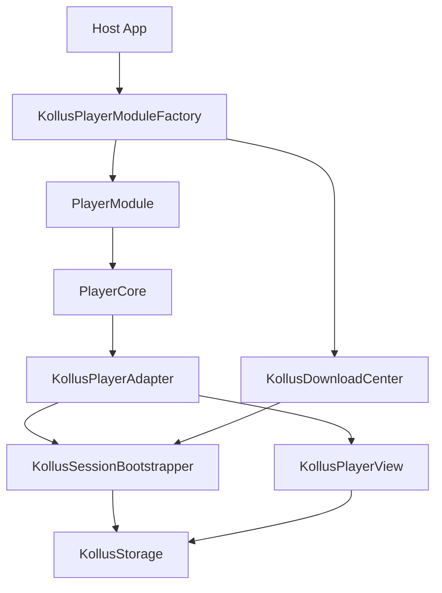

# Kollus SDK Implementation Guide

Author: JunyoungJung
Date: 2026-05-16

## 목적

이 문서는 host 앱이 `VideoPlayerEngineKollus`를 사용해 Kollus SDK 기반 플레이어를 구현할 때 필요한 흐름을 정리한다. 공식 SDK의 클래스 이름을 그대로 앱으로 노출하지 않고, 이 패키지의 Swift API로 어떤 기능을 사용할 수 있는지에 초점을 둔다.

공식 API 자체의 상세 메모는 [kollus-ios-sdk-reference.md](./kollus-ios-sdk-reference.md)를 보고, SDK binary packaging과 교체 절차는 [kollus-sdk-packaging.md](./kollus-sdk-packaging.md)를 따른다.

## 통합 방향

Kollus SDK는 크게 두 축으로 나뉜다.

- `KollusStorage`: 인증, 다운로드, 캐시, DRM, LMS, 다운로드 콘텐츠 목록을 담당한다.
- `KollusPlayerView`: 실제 재생 view와 재생 제어, 자막, 북마크, 화면 제어, delegate callback을 담당한다.

이 패키지는 두 SDK 객체를 host 앱에 직접 노출하지 않는다.



host 앱의 기본 원칙은 단순하다.

1. SDK 인증/운영 값을 `KollusEnvironment`로 만든다.
2. `KollusPlayerModuleFactory`를 앱 composition layer에서 한 번 만든다.
3. 화면이 필요할 때 `factory.makeModule()`로 `PlayerModule`을 만든다.
4. 재생 명령은 `PlayerModule`의 use case로 보낸다.
5. 다운로드/오프라인 기능은 `factory.downloads`로 처리한다.
6. DRM/LMS/진단 callback은 `KollusObserver`, `KollusDiagnosticsSink`로 받는다.

## 최소 구현

### 1. Product import

Kollus 재생 화면은 보통 아래 product를 사용한다.

```swift
import Foundation
import VideoPlayerCore
import VideoPlayerEngineKollus
import VideoPlayerShellSupport
```

앱에서 umbrella product를 쓰고 있다면 `VideoPlayerModule`만 import해도 된다. 다만 어떤 계층이 어떤 product에 의존하는지 명확히 보고 싶다면 product를 나눠 import하는 편이 낫다.

### 2. Observer와 diagnostics 준비

`KollusObserver`는 DRM/LMS 같은 운영 callback을 받는다. `KollusDiagnosticsSink`는 SDK delegate raw signal을 추적한다.

```swift
final class AppKollusObserver: KollusObserver {
    func kollus(didResolveDRM request: [String: Any], response: [String: Any], error: Error?) {
        // DRM callback request/response/error를 앱 로그 또는 운영 진단으로 보낸다.
    }

    func kollus(didPostLMS data: String, result: [String: Any]) {
        // LMS 전송 결과를 앱 로그 또는 학습 진도 진단으로 보낸다.
    }

    func kollusStorage(didCompleteStoredLMS success: Int, failure: Int) {
        // 미전송 LMS 재전송 결과를 기록한다.
    }
}

final class AppKollusDiagnostics: KollusDiagnosticsSink {
    func kollus(_ signal: KollusEngineSignal) {
        // prepare/play/buffering/bitrate/caption 등 raw signal을 진단 로그로 보낸다.
    }
}
```

중요한 점이 하나 있다. 재생 delegate observer는 `KollusPlayerModuleFactory` initializer로 전달되고, 다운로드/storage observer는 `KollusEnvironment.observer`를 통해 전달된다. 재생과 다운로드 진단을 모두 받고 싶다면 같은 observer를 양쪽에 넣는다.

### 3. Environment 구성

`KollusEnvironment`는 SDK 인증값과 운영 옵션을 한 번에 묶는 값 타입이다.

```swift
let observer = AppKollusObserver()
let diagnostics = AppKollusDiagnostics()

let drm = KollusDRMConfiguration(
    fpsCertificateURL: fpsCertificateURL,
    fpsDRMURL: fpsDRMURL,
    extraParameters: [
        "uid": userID
    ]
)

let environment = KollusEnvironment(
    applicationKey: applicationKey,
    applicationBundleID: bundleID,
    applicationExpireDate: applicationExpireDate,
    keychainGroup: keychainGroup,
    storagePath: storageURL,
    cacheSizeMB: 1024,
    backgroundDownload: true,
    networkTimeoutSeconds: 30,
    networkRetry: 3,
    aiPlaybackRateEnabled: true,
    hardwareDecoderPreferred: true,
    customSkinJSON: nil,
    pauseOnForeground: false,
    audioBackgroundPlayPolicy: true,
    drm: drm,
    chat: nil,
    extraDrmParameters: [:],
    observer: observer,
    diagnostics: diagnostics
)

try environment.validate()
```

주요 값의 의미는 다음과 같다.

| 값 | 의미 | 주의 |
| --- | --- | --- |
| `applicationKey` | Kollus SDK 인증 키 | 빈 값이면 초기화 실패 |
| `applicationBundleID` | SDK 인증에 사용할 bundle id | 실제 앱 bundle id와 맞춰야 함 |
| `applicationExpireDate` | application key 만료일 | 현재 시각보다 과거면 `validate()` 실패 |
| `storagePath` | 다운로드/캐시 저장 위치 | 기존 설치 후 변경하면 기존 다운로드 접근이 깨질 수 있음 |
| `cacheSizeMB` | 스트리밍 캐시 크기 | 0 이하 값은 `validate()` 실패 |
| `backgroundDownload` | 백그라운드 다운로드 사용 여부 | 앱 target capability와 함께 검증 필요 |
| `networkTimeoutSeconds`, `networkRetry` | storage 네트워크 정책 | 다운로드/DRM/LMS 장애 진단 시 같이 기록 |
| `aiPlaybackRateEnabled` | SDK AI 배속 사용 여부 | 서버/콘텐츠 정책과 함께 봐야 함 |
| `hardwareDecoderPreferred` | 하드웨어 디코더 선호 | 특정 기기/콘텐츠 이슈 시 조정 지점 |
| `pauseOnForeground` | foreground 진입 시 일시정지 정책 | host UX 정책과 맞춰야 함 |
| `audioBackgroundPlayPolicy` | surface 없이 오디오 계속 재생 | 켜면 factory가 `.continuesWithoutSurface` capability를 추가 |
| `drm` | FairPlay cert/DRM URL과 extra parameter | DRM 콘텐츠가 아니라면 빈 값 가능 |
| `observer` | storage/download DRM/LMS observer | 재생 observer도 필요하면 factory에도 전달 |
| `diagnostics` | 진단 sink | 재생 raw signal은 factory에도 전달 |

### 4. Factory 생성

factory는 앱 composition layer에서 오래 살아야 한다. 같은 factory가 만든 module은 하나의 `KollusSessionBootstrapper`와 하나의 `KollusDownloadCenter`를 공유한다.

```swift
let factory = KollusPlayerModuleFactory(
    environment: environment,
    observer: observer,
    diagnostics: diagnostics
)
```

화면마다 새 factory를 만들면 storage 인증과 download center가 분산된다. 앱 전체에서 같은 Kollus 설정을 쓰는 구조라면 DI container에 factory를 보관하고 화면은 factory만 주입받는다.

## 재생 구현

### 스트리밍 URL 재생

Kollus SDK의 `contentURL` 기반 재생은 `.url(URL)`로 시작한다.

```swift
let module = await factory.makeModule()

try await module.startPlaybackUseCase.execute(
    source: .url(streamingURL),
    policy: PlayerFeaturePolicy(
        allowsBackgroundPlayback: true,
        maxPlaybackRate: 2.0,
        allowsAutoplay: true,
        skipInterval: 10
    )
)
```

`allowsAutoplay`가 `true`면 `PlayerCore`가 `prepare` 뒤에 `play`까지 호출한다. 자동 재생을 원하지 않으면 `allowsAutoplay: false`로 시작하고, 준비 상태를 본 뒤 `.play` 명령을 보낸다.

```swift
try await module.controlPlaybackUseCase.execute(command: .play)
```

### Media Content Key 재생

다운로드 콘텐츠 또는 MCK 기반 재생은 `.kollus(mediaContentKey:)`로 시작한다.

```swift
try await module.startPlaybackUseCase.execute(
    source: .kollus(mediaContentKey: mediaContentKey),
    policy: .default
)
```

adapter는 내부에서 `KollusPlayerView(mediaContentKey:)`를 만들고, `KollusSessionBootstrapper`가 준비한 storage를 연결한 뒤 `prepareToPlay`를 호출한다.

### 상태와 이벤트 구독

화면은 SDK delegate를 직접 보지 않고 `PlaybackState`, `PlayerEvent`를 구독한다.

```swift
Task { @MainActor in
    for await state in module.observePlaybackStateUseCase.stateStream {
        render(state)
    }
}

Task { @MainActor in
    for await event in module.observePlaybackStateUseCase.eventStream {
        handle(event)
    }
}
```

주요 이벤트는 다음과 같다.

| 이벤트 | 의미 |
| --- | --- |
| `.stateDidChange` | 준비, 재생, 일시정지, 버퍼링, 실패 등 상태 변화 |
| `.timeDidChange` | 현재 재생 위치 변화 |
| `.bufferingDidChange` | 버퍼링 시작/종료 |
| `.didFinish` | 재생 종료 |
| `.didFail` | SDK 또는 engine 실패 |
| `.captionDidUpdate` | 주/보조 자막 text callback |
| `.bookmarksDidLoad` | SDK 북마크 목록 로딩 |
| `.bitrateDidChange`, `.heightDidChange` | HLS 품질 변화 |
| `.externalOutputDidChange` | 외부 출력 상태 변화 |
| `.naturalSizeDidResolve`, `.framerateDidResolve` | 영상 크기/FPS 정보 |
| `.deviceLockPolicyChanged` | SDK device lock 정책 감지 |
| `.nextEpisodeAvailable` | 다음 회차 callback 정보 노출 |

### Render surface 연결

Kollus SDK는 자체 `KollusPlayerView`를 화면에 붙여야 한다. host 앱은 SDK view를 직접 만들지 않고 `PlayerRenderSurface`만 제공한다.

```swift
import UIKit

final class PlayerSurfaceView: UIView, PlayerRenderSurface {
    var containerView: UIView { self }

    func engineDidAttach() {
        // 필요하면 loading overlay 제거 등 UI 처리
    }

    func engineDidDetach() {
        // 필요하면 placeholder 복구 등 UI 처리
    }
}

let surface = PlayerSurfaceView()
await module.engine.bind(renderSurface: surface)
```

화면이 사라질 때는 surface를 해제한다.

```swift
await module.engine.unbindRenderSurface()
```

## 사용할 수 있는 기능

### 공통 재생 제어

`PlayerModule`의 use case로 처리하는 기능이다.

| 기능 | 호출 | 구현 상태 |
| --- | --- | --- |
| 준비/로드 | `startPlaybackUseCase.execute(source:policy:)` 또는 `.load` | 지원 |
| 재생 | `.play` | 지원 |
| 일시정지 | `.pause` | 지원 |
| seek | `.seek(to:)`, `.seekWithOrigin(to:origin:)` | 지원 |
| stop | `.stop` | 지원 |
| skip interval 변경 | `.setSkipInterval` | core 정책으로 지원 |
| 배속 변경 | `.setPlaybackRate` | `PlayerPlaybackRateEngine` 경유, SDK 콘텐츠 정책에 따라 실패 가능 |

예:

```swift
try await module.controlPlaybackUseCase.execute(command: .pause)
try await module.controlPlaybackUseCase.execute(command: .seek(to: 120))
try await module.controlPlaybackUseCase.execute(command: .setPlaybackRate(1.5))
try await module.controlPlaybackUseCase.execute(command: .stop)
```

### 자막

| 기능 | 호출 | 구현 상태 |
| --- | --- | --- |
| 외부 자막 파일 선택 | `.selectSubtitleFile(URL?)` | 지원 |
| track id 기반 자막 선택 | `.selectSubtitleTrack(PlayerSubtitleTrackID?)` | track id를 path로 해석해 지원 |
| 자막 표시/숨김 | `.setSubtitleVisible` | SDK 직접 API 없음. downgrade event 발행 |
| 자막 폰트 크기 | `.setCaptionFontSize` | SDK 직접 API 없음. downgrade event 발행 |
| 자막 callback 수신 | `.captionDidUpdate` | 지원 |

예:

```swift
try await module.controlPlaybackUseCase.execute(
    command: .selectSubtitleFile(subtitleURL)
)
```

`setSubtitleVisible`, `setCaptionFontSize`는 command 자체는 받을 수 있지만 현재 SDK adapter에서는 실제 표시 정책을 바꾸지 않고 `PlayerEvent.policyDowngraded`로 알려준다. UI에서는 이 이벤트를 보고 버튼 상태를 되돌리거나 미지원 안내를 표시해야 한다.

### 북마크

| 기능 | 호출 | 구현 상태 |
| --- | --- | --- |
| 북마크 추가 | `.addBookmark(at:)` | 지원 |
| 제목 포함 북마크 추가 | `.addBookmarkWithTitle(at:title:)` | 지원 |
| 북마크 삭제 | `.removeBookmark(at:)` | 지원 |
| 현재 북마크 목록 조회 | `PlayerTitledBookmarkEngine.currentBookmarks()` | 지원 |
| 초기 북마크 목록 수신 | `.bookmarksDidLoad` | 지원 |

예:

```swift
try await module.controlPlaybackUseCase.execute(
    command: .addBookmarkWithTitle(at: 300, title: "중요 개념")
)

if let bookmarkEngine = module.engine as? any PlayerTitledBookmarkEngine {
    let bookmarks = await bookmarkEngine.currentBookmarks()
    render(bookmarks)
}
```

SDK 콘텐츠가 북마크 수정을 막는 경우 adapter가 `PlayerError.engineError`를 던진다.

### 화면 제어

| 기능 | 호출 | 구현 상태 |
| --- | --- | --- |
| aspect fit/fill 전환 | `.setDisplayScaled`, `.toggleDisplayScaling` | 지원 |
| pinch zoom | `PlayerZoomEngine.zoom(_:)` | 지원 |
| zoom-out 금지 | `PlayerZoomEngine.setZoomOutDisabled(_:)` | 지원 |
| zoom 상태 조회 | `zoomValue()`, `isZoomedIn` | 지원 |
| scroll | `PlayerScrollEngine.scroll(by:)`, `stopScroll()` | 지원 |
| display lock 명령 | `.setDisplayLocked` | 현재 Kollus adapter는 미지원. SDK callback은 event로 관찰 |

예:

```swift
try await module.controlPlaybackUseCase.execute(command: .toggleDisplayScaling)

if let scrollEngine = module.engine as? any PlayerScrollEngine {
    try await scrollEngine.scroll(by: CGPoint(x: 20, y: 0))
}
```

### HLS / 적응형 스트리밍

| 기능 | 호출 | 구현 상태 |
| --- | --- | --- |
| bitrate 변경 | `PlayerAdaptiveStreamingEngine.changeBandwidth(_:)` | 지원 |
| bitrate 변경 event | `.bitrateDidChange` | 지원 |
| height 변경 event | `.heightDidChange` | 지원 |
| stream info list | `streamInfoList()` | SDK wrapper 형태가 명확할 때만 매핑. 현재는 보수적으로 빈 배열 가능 |

예:

```swift
if let adaptiveEngine = module.engine as? any PlayerAdaptiveStreamingEngine {
    try await adaptiveEngine.changeBandwidth(1_500_000)
}
```

### PiP

`KollusPlayerAdapter`는 `PlayerPiPCapability`를 채택하지만, 현재 SDK가 PiP 직접 시작/중지 API를 public하게 노출하지 않는다. 따라서 adapter는 native player type 적격성만 확인하고, 실제 PiP UI는 host 앱의 `AVPictureInPictureController` 통합이 필요하다.

| 기능 | 호출 | 구현 상태 |
| --- | --- | --- |
| PiP 시작/중지 | `startPiP()`, `stopPiP()` | host 통합 필요. 현재는 policy downgrade event로 알림 |
| PiP active 상태 | `isPiPActive` | adapter 내부 상태만 표현 |

PiP를 제품 기능으로 노출하려면 실제 기기에서 Kollus view 내부 player layer 접근 가능 여부와 App Store 정책까지 별도 검증해야 한다.

### 라이브 / 다음 회차 / 채팅

| 기능 | 사용 경로 | 구현 상태 |
| --- | --- | --- |
| live 여부 | `PlaybackState.isLive` | prepare 완료 시 snapshot 반영 |
| live duration | `PlaybackState.liveDuration` | SDK 값이 0보다 클 때 반영 |
| 다음 회차 | `.nextEpisodeAvailable(NextEpisodeInfo)` | SDK next episode show time 도달 시 1회 발행 |
| 라이브 채팅 profile | `KollusEnvironment.chat` | environment로 값 보관. 실제 UI/웹뷰 연결은 host 책임 |

다음 회차 callback은 스트리밍 서버 연동 기능이다. 다운로드 콘텐츠에서는 동일하게 동작한다고 가정하지 않는다.

### 다운로드 / 오프라인

다운로드 기능은 `KollusDownloadCenter`에서 처리한다.

```swift
guard let downloads = factory.downloads else {
    return
}

let mediaContentKey = try await downloads.resolve(contentURL: downloadURLString)
try await downloads.startDownload(mediaContentKey: mediaContentKey)
```

사용 가능한 동작은 다음과 같다.

| 기능 | 호출 |
| --- | --- |
| 다운로드 URL 분석 후 MCK 획득 | `resolve(contentURL:)` |
| 로컬 다운로드 콘텐츠 확인 | `check(contentURL:)` |
| 다운로드 시작 | `startDownload(mediaContentKey:)` |
| 다운로드 취소 | `cancelDownload(mediaContentKey:)` |
| 다운로드 콘텐츠 삭제 | `remove(mediaContentKey:)` |
| 스트리밍 캐시 삭제 | `clearStreamingCache()` |
| 다운로드 DRM 갱신 | `updateDRM(includeExpiredOnly:)` |
| 미전송 LMS 전송 | `sendStoredLMS()` |
| cache size 변경 | `setCacheSize(megabytes:)` |
| background download 변경 | `setBackgroundDownload(enabled:)` |
| network timeout/retry 변경 | `setNetworkTimeout(seconds:retry:)` |
| 현재 다운로드 snapshot 조회 | `currentSnapshots()` |
| snapshot stream 구독 | `contents` |

진행률 UI는 `contents` stream을 구독해 만든다.

```swift
Task {
    for await snapshots in downloads.contents {
        renderDownloadList(snapshots)
    }
}
```

`KollusContentSnapshot`은 SDK 객체를 그대로 노출하지 않고 값 타입으로 복사한 모델이다.

| 필드 그룹 | 포함 값 |
| --- | --- |
| 식별/메타 | `id`, `title`, `course`, `teacher`, `synopsis`, thumbnail/snapshot path |
| 재생 정보 | `duration`, `position`, `naturalSize`, `contentType` |
| DRM 상태 | `.unknown`, `.valid(expiresAt:playCountRemaining:)`, `.expired` |
| 다운로드 상태 | `.notDownloaded`, `.inProgress(percent:downloadedBytes:)`, `.completed` |
| 파일 정보 | `fileSize`, `downloadedAt` |

## DRM / LMS / callback 처리

DRM과 LMS는 SDK API 호출만으로 끝나지 않는다. 서버 callback 응답과 JWT 정책이 재생 가능 여부를 바꾼다.

### FairPlay DRM

FairPlay 인증서 URL, DRM URL, 추가 파라미터는 `KollusDRMConfiguration`에 넣는다.

```swift
let drm = KollusDRMConfiguration(
    fpsCertificateURL: URL(string: "https://example.com/fps.cer"),
    fpsDRMURL: URL(string: "https://example.com/drm"),
    extraParameters: [
        "uid": userID,
        "course_id": courseID
    ]
)
```

adapter는 prepare 시점에 `KollusPlayerView.fpsCertURL`, `fpsDrmURL`, `extraDrmParam`으로 값을 주입한다. DRM 콘텐츠가 아닌 경우 빈 `KollusDRMConfiguration()`을 써도 된다.

### DRM/LMS observer

운영 로그에는 최소한 아래 정보를 남긴다.

- callback 종류: DRM, LMS, stored LMS
- SDK error domain/code/message
- media content key 또는 streaming URL
- request/response 식별값
- user id, course id 같은 서버 추적 키
- storage timeout/retry/cache/backgroundDownload 설정값

이 패키지는 LMS payload를 해석하지 않는다. host 앱이 동일 세션 중복 LMS 이벤트를 idempotent하게 처리해야 한다.

## Diagnostics 사용

`KollusDiagnosticsSink`는 domain event로 승격되지 않은 SDK raw signal까지 볼 때 사용한다.

현재 raw signal은 다음 그룹을 포함한다.

- prepare/play/pause/buffering/stop
- position
- scroll/zoom/content frame/content mode
- playback rate/repeat
- external output
- unknown error
- framerate/device policy
- 주/보조 caption
- thumbnail
- media content key
- HLS height/bitrate

제품 UI는 `PlayerEvent`를 우선 사용하고, 원인 분석/운영 로그/SDK 회귀 확인에는 diagnostics를 사용한다. diagnostics signal을 UI 상태의 1차 source로 쓰면 vendor callback 변화에 화면이 직접 흔들린다.

## 구현 시 주의할 점

- `KollusPlayerModuleFactory`는 화면마다 만들지 말고 앱 composition layer에서 공유한다.
- `KollusEnvironment.storagePath`는 신규 설치 시점에 고정한다. 운영 중 변경하려면 다운로드 migration 설계가 먼저 필요하다.
- `prepareToPlay` 전에 delegate bridge가 붙어야 초기 북마크, DRM/LMS, prepare callback을 놓치지 않는다.
- `play()`와 `pause()`는 즉시 상태를 확정하지 말고 SDK delegate callback을 최종 근거로 본다.
- `setSubtitleVisible`, `setCaptionFontSize`, PiP는 현재 adapter에서 완전 구현 기능이 아니다. UI에 노출하기 전 downgrade event와 실기기 동작을 확인한다.
- 다운로드 DRM callback 서버가 실패하면 클라이언트 다운로드 코드가 정상이어도 다운로드나 오프라인 재생이 막힐 수 있다.
- server JWT 옵션(`disable_playrate`, `maxPlaybackRate`, `seek`, `play_section`, `next_episode`)과 client policy가 다르면 SDK error나 기능 미노출로 나타난다.
- SmartLearning host 앱 Swift 코드에서 `import KollusSDKBinary`를 직접 추가하지 않는다. 필요한 기능은 이 패키지의 public API로 승격한 뒤 사용한다.

## 빠른 체크리스트

Kollus 기능을 새 화면에 붙일 때는 아래를 확인한다.

- `VideoPlayerEngineKollus` product가 target에 연결되어 있는가
- `KollusEnvironment.validate()`가 성공하는가
- observer를 `environment`와 `factory` 양쪽에 필요한 만큼 넣었는가
- render surface가 prepare/play 전에 bind되는가
- `stateStream`, `eventStream`을 화면 lifecycle에 맞게 cancel하는가
- 다운로드 UI가 `KollusContentSnapshot`만 보고 SDK 객체를 직접 참조하지 않는가
- DRM/LMS failure를 사용자 메시지와 운영 로그로 분리했는가
- PiP, 자막 표시 토글, 자막 폰트 크기처럼 현재 미완전한 기능을 제품 UI에서 숨기거나 downgrade 처리했는가
