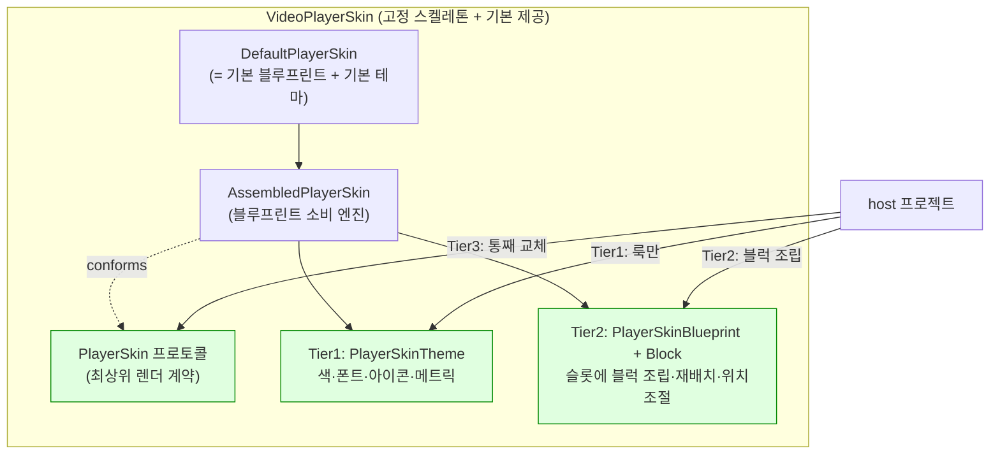

# VideoPlayerSkin 커스터마이즈 아키텍처 (POP 기반)

**작성일**: 2026-06-01
**작성자**: 모바일팀_정준영
**대상 패키지**: `videoplayer-ios-ms` / `VideoPlayerSkin` 타깃
**상태**: Implemented (2026-06-01) — Theme/Blueprint/Block/PlayerSkin/DefaultPlayerSkin 구현 완료, 빌드 통과
**관련**: smartlearning-ios-ms `specs/064-player-shell-extraction/spec.md`

---

## 이 문서를 읽는 법 (주니어 가이드)

이 문서는 **현재 고정 구현된 `VideoPlayerSkin`(재생기 컨트롤 UI)을, 다른 프로젝트가
"기본 제공"을 그대로 쓰거나 커스텀으로 갈아끼울 수 있게** POP(Protocol-Oriented
Programming)로 개선하는 설계다. 순서대로 읽자.

1. **§1 목적 / 현 문제** — 왜 바꾸나
2. **§2 핵심 아이디어 — 3-Tier 커스터마이즈** — 큰 그림 (그림 포함)
3. **§3 용어** — 슬롯/블럭/블루프린트/테마 (먼저 외우기)
4. **§4 목표 폴더 구조** — 무엇을 어디에
5. **§5 계약(Contract) 프로토콜** — 최상위 PlayerSkin
6. **§6 Tier1 — Theme (룩 토큰)** — 색/폰트/아이콘
7. **§7 Tier2 — Blueprint + Block (조립)** — 고정 스켈레톤 + 블럭 주입
8. **§8 host 사용 예시** — 3가지 진입
9. **§9 단계별 도입 + 리스크**

> 핵심 한 줄: **레이아웃 스켈레톤은 패키지가 고정한다. host 는 (a) 룩만 바꾸거나(Theme),
> (b) 슬롯에 블럭을 조립/재배치하거나(Blueprint), (c) 통째로 갈아끼운다(PlayerSkin).
> 기본값은 모두 현재 구현과 1:1 동일(parity).**

---

## 1. 목적 / 현 문제

`VideoPlayerSkin` 은 현재 **concrete 타입 묶음** 이라 커스터마이즈 경로가 없다.

- `PlayerSkinControlView`(public final class) — 컨트롤 UI 한 덩어리. 색/폰트/아이콘/배치 전부 하드코딩.
- host(앱 ShellVC)가 `PlayerSkinControlView()` 를 직접 인스턴스화 → 교체 불가.
- 입출력 계약은 이미 존재: 입력 `configure / render(_:) / setExtraControls / updateSkipIntervalLabel`,
  출력 `onAction`, 데이터 `PlayerSkinState / PlayerSkinAction / ExtraControl`.

→ 다른 프로젝트(미니플레이어, 별도 앱, 브랜드 테마)가 "다른 룩/배치" 를 원하면 현재는 fork 뿐.

**목표**: 레이아웃 골격은 고정(레이아웃 깨짐·반응형·lock 게이트를 패키지가 한 번에 책임),
세부는 host 가 블럭처럼 조립·미세조정·교체.

---

## 2. 핵심 아이디어 — 3-Tier 커스터마이즈

커스터마이즈 수요는 3단계로 나뉜다. 대부분은 Tier1·Tier2 에서 끝난다.



| Tier | 무엇을 바꾸나 | 비용 | 케이스 비중 |
|---|---|---|---|
| **1 Theme** | 색 / 폰트 / 아이콘 / 치수 | 낮음 | ~70% |
| **2 Blueprint** | 어떤 블럭을 어느 슬롯에 / 위치·정렬 / 블럭 교체·추가 | 중간 | ~25% |
| **3 PlayerSkin** | 컨트롤 UI 전체 재작성 | 높음 | ~5% (탈출구) |

세 Tier 모두 **기본값 = 현재 구현 1:1**. 0-config 면 지금과 똑같이 동작.

---

## 3. 용어 (먼저 외우기)

| 이름 | 무엇 |
|---|---|
| **스켈레톤(skeleton)** | 슬롯의 고정 위치 + 반응형 chrome 규칙(verticalSplit/horizontalSplit/fullScreen) + lock/가시성 게이트. **패키지 소유**. |
| **슬롯(slot)** | 이름붙은 영역. `topLeading / topCenter / topTrailing / centerControls / leftRail / rightRail / bottomBar / floatingCenterTrailing / floatingBottomTrailing`. |
| **블럭(block)** | 슬롯에 끼우는 컨트롤 단위. 생성 시 `theme` 를 1회 주입받고 `render(state)` + `onAction` 보유. play / skip / progress / rate 등 기본 블럭 제공. |
| **블루프린트(blueprint)** | 슬롯 → [블럭] 매핑 + 슬롯별 inset/정렬 + 모드별 가시성. **기본 = 현 배치**. |
| **테마(theme)** | 색/폰트/아이콘/메트릭 토큰. **기본 = 현 하드코딩 값**. |
| **`PlayerSkin`** | 최상위 렌더 계약. `AssembledPlayerSkin` 이 채택. host 는 이것으로 통째 교체 가능. |
| `PlayerSkinState/Action/ExtraControl` | (기존) 입력/출력/주입버튼 데이터. 계약 vocabulary. |

---

## 4. 목표 폴더 구조

> 아래는 **실제 구현된** 구조다(설계 초안과 달라진 부분은 각주로 표시).

```
Sources/VideoPlayerSkin/
├── Contract/                          # 공개 계약 (host 의존)
│   └── PlayerSkin.swift               # 최상위 렌더 프로토콜 (Tier3 교체점)
│                                      # ※ State/Action/ExtraControl 은 이전하지 않고 패키지 루트에 잔류(아래)
├── Theme/                             # Tier1 — 룩 토큰
│   ├── PlayerSkinTheme.swift          # 값 struct. colors/fonts/icons override + .default
│   ├── PlayerSkinColorRole.swift      # controlTint/progressFill/progressTrack/barBackground/timeText
│   ├── PlayerSkinFontRole.swift
│   └── PlayerSkinIcon.swift           # 의미 아이콘 enum. 기본 asset 매핑은 PlayerSkinTheme.default 가 소유
├── Assembly/                          # Tier2 — 조립
│   ├── PlayerSkinSlot.swift           # 9개 슬롯 (floating 은 Center/Bottom 2개로 분리)
│   ├── PlayerSkinBlock.swift          # 블럭 프로토콜 (id 없음 — §7 참고)
│   ├── PlayerSkinSlotLayout.swift     # 슬롯 미세배치 값타입
│   ├── PlayerSkinBlueprint.swift      # 배치 명세 + .default (hiddenBlocks 없음 — §7 참고)
│   └── AssembledPlayerSkin.swift      # 블루프린트 소비 엔진 (PlayerSkin 채택)
├── Blocks/                            # 기본 제공 블럭 (15개)
│   ├── PlayerSkinIconButton.swift     # 공유 아이콘 버튼 빌더 (theme.icon 해석)
│   ├── CloseButtonBlock  TitleBlock  MoreButtonBlock  LockButtonBlock  DisplayScaleBlock
│   ├── PlayButtonBlock   SkipButtonBlock
│   ├── ProgressBarBlock               # ※ 슬라이더+시간2+화면모드 복합 블럭 (TimeLabel/ScreenMode 미분리 — §6·§7)
│   ├── RateButtonBlock   RateStepBlock
│   ├── SectionRepeatBlock  SettingButtonBlock
│   └── ExtraControlsRailBlock  ExtraFloatingBlock   # host 주입 ExtraControl 렌더 (image(assetName:) 사용)
├── Default/
│   └── DefaultPlayerSkin.swift        # = AssembledPlayerSkin(.default, .default)
├── Resources/PlayerSkin.xcassets      # 기본 아이콘 19 + 색 2 (PlayerSkinTheme.default 가 .module 로드)
└── (패키지 루트, skin 과 별개 관심사 — Contract 미이전)
    PlayerSkinState.swift  PlayerSkinAction.swift  ExtraControl.swift   # 계약 vocabulary
    PlayerRenderSurfaceView.swift  PlayerCaptionView.swift  PlayerGestureHUDView.swift
    PlayerPlaybackSlider.swift  PlayerPlaybackRatePanelViewController.swift
    PlayerKeyCommandRegistry.swift  PlayerNowPlayingCenter.swift  PlayerAudioSessionConfigurator.swift
```

> **설계 초안과 달라진 점(구현 시 결정):** ① `PlayerSkinState/Action/ExtraControl` 은 `Contract/` 로
> 이전하지 않고 루트 잔류(순수 조직화 차이, 기능 영향 없음). ② `PlayerSkinMetrics`(치수 토큰) 미구현 —
> 치수 커스텀 수요 없어 보류. ③ `TimeLabelBlock`·`ScreenModeBlock` 은 별도 블럭이 아니라 `ProgressBarBlock`
> 에 통합(2D 레이아웃 강제 — §6·§7). ④ `PlayerSkinBlock.id`/`PlayerSkinBlockID`·`Blueprint.hiddenBlocks`
> 제거 — block 자기 가시성(self-hide)으로 대체(§7).

`Resources/` 를 실제로 추가할 때는 SwiftPM target 에 리소스 선언도 같이 들어가야 한다.

```swift
.target(
    name: "VideoPlayerSkin",
    dependencies: [
        "VideoPlayerCore",
        "VideoPlayerShellSupport"
    ],
    path: "Sources/VideoPlayerSkin",
    resources: [
        .process("Resources")
    ],
    linkerSettings: [
        .linkedFramework("UIKit", .when(platforms: [.iOS])),
        .linkedFramework("AVFoundation", .when(platforms: [.iOS])),
        .linkedFramework("MediaPlayer", .when(platforms: [.iOS]))
    ]
)
```

> `Bundle.module` 은 `VideoPlayerSkin` target 내부 기본 테마에서 사용한다. `PlayerSkinTheme.image(assetName:)`
> 는 패키지 번들 → host main 번들 순서로 조회하므로, host ExtraControl 아이콘도 값 테마에서 별도 protocol
> 구현 없이 사용할 수 있다.

> 현재 14파일 중 skin 컨트롤 본체(`PlayerSkinControlView`)는 **블럭들로 분해**되어 `Blocks/` +
> `Assembly/` 로 재구성된다. `PlayerRenderSurfaceView`(영상 layer)·`PlayerCaptionView`·
> `PlayerGestureHUDView`·NowPlaying·KeyCommand 등은 관심사가 달라 그대로 유지.

---

## 5. 계약 — `Contract/PlayerSkin.swift`

```swift
import UIKit

/// 재생기 컨트롤 UI 의 최상위 렌더 계약.
/// `view` 를 제공해 UIView 상속 강제는 피하고, UIView/UIViewController wrapper 구현을 모두 허용한다.
@MainActor
public protocol PlayerSkin: AnyObject {
    /// host 가 컨테이너에 add 할 실제 뷰.
    var view: UIView { get }

    /// 사용자 컨트롤 입력 출력. host 가 reactor/usecase 로 매핑.
    var onAction: ((PlayerSkinAction) -> Void)? { get set }

    func configure(title: String, maxPlaybackRate: Double)
    func render(_ state: PlayerSkinState)
    func setExtraControls(_ controls: [ExtraControl])
    func updateSkipIntervalLabel(seconds: Int)
}
```

---

## 6. Tier1 — Theme

### `Theme/PlayerSkinIcon.swift` · `PlayerSkinFontRole.swift` · `PlayerSkinColorRole.swift`

```swift
/// skin 이 요구하는 아이콘의 "의미". host 가 자유 매핑 (에셋 의존 역전).
public enum PlayerSkinIcon: Hashable, Sendable {
    case close, more, lock, unlock
    case play, pause, skipBackward, skipForward
    case screenExpand, screenShrink, displayScaleFit, displayScaleFill
    case rateUp, rateDown
    case sectionRepeatIdle, sectionRepeatActive
    case sliderThumb
}

public enum PlayerSkinFontRole: Hashable, Sendable {
    case title, time, rateLabel, skipInterval, extraControlTitle
}

public enum PlayerSkinColorRole: Hashable, Sendable {
    case controlTint, progressFill, progressTrack, barBackground, hudBackground
}
```

### `Theme/PlayerSkinTheme.swift` — 값 struct + 기본값

```swift
import UIKit

public struct PlayerSkinTheme {
    public var colors: [PlayerSkinColorRole: UIColor]
    public var fonts: [PlayerSkinFontRole: UIFont]
    public var icons: [PlayerSkinIcon: UIImage]

    public init(colors: [PlayerSkinColorRole: UIColor] = [:],
                fonts: [PlayerSkinFontRole: UIFont] = [:],
                icons: [PlayerSkinIcon: UIImage] = [:]) { ... }

    public static let `default`: PlayerSkinTheme = ...

    public func color(_ role: PlayerSkinColorRole) -> UIColor { colors[role] ?? Self.default.colors[role] ?? .white }
    public func font(_ role: PlayerSkinFontRole) -> UIFont { fonts[role] ?? Self.default.fonts[role] ?? .systemFont(ofSize: 14) }
    public func icon(_ icon: PlayerSkinIcon) -> UIImage? { icons[icon] ?? Self.default.icons[icon] }
    public func image(assetName: String) -> UIImage? {
        UIImage(named: assetName, in: .module, with: nil) ?? UIImage(named: assetName)
    }
}
```

> 기본 색·폰트·아이콘의 단일 소스는 `PlayerSkinTheme.default` 다.
> `PlayerSkinColorRole.defaultColor`, `PlayerSkinFontRole.defaultFont`, `PlayerSkinIcon.defaultAssetName`,
> `DefaultPlayerSkinTheme` 는 제거됐다. host 는 원하는 key 만 `colors/fonts/icons` 에 채우고, 나머지는
> `.default` fallback 으로 해소된다.

### `Theme/PlayerSkinMetrics.swift` — **보류(미구현)**

> 치수 토큰(바 높이/사이드 inset/아이콘 크기/중앙 간격/슬라이더 높이)을 한 곳에 모으는 설계였으나,
> 치수 커스텀 수요가 없어 구현하지 않았다. 현재 치수는 스켈레톤/블럭에 상수로 직접 존재
> (바 50, inset 20, 아이콘 44, 중앙 간격 56, 슬라이더 높이 21). 치수 커스텀 요구가 생기면 아래 형태로
> `PlayerSkinTheme.metrics` 를 추가하고 `AssembledPlayerSkin` 의 상수를 치환한다.

```swift
// 보류 — 수요 발생 시 도입
import CoreGraphics

public struct PlayerSkinMetrics: Equatable, Sendable {
    public var barHeight: CGFloat = 50
    public var sideInset: CGFloat = 20
    public var iconButtonSize: CGFloat = 44
    public var centerControlSpacing: CGFloat = 56
    public var progressSliderHeight: CGFloat = 21
    public static let `default` = PlayerSkinMetrics()
}
```

## 7. Tier2 — Blueprint + Block (조립)

### `Assembly/PlayerSkinSlot.swift`

```swift
/// 스켈레톤의 고정 영역. 위치는 패키지가 소유, 내용물은 host 가 채운다.
public enum PlayerSkinSlot: Hashable, Sendable, CaseIterable {
    case topLeading, topCenter, topTrailing     // 상단 바
    case centerControls                          // 중앙 재생 클러스터 (floating)
    case leftRail, rightRail                     // 세로 메뉴 (fullscreen/split)
    case bottomBar                               // 진행 바 영역
    case floatingCenterTrailing                  // 영상 중앙-우측 floating (배속 버튼)
    case floatingBottomTrailing                  // bottomBar 위 우측 floating (다음 강의 등)
}
```

> 설계 초안의 단일 `floatingTrailing` 은 실제 위치가 다른 두 요소(중앙-우측 배속 / 하단-우측 다음강의)를
> 담지 못해 **2개 슬롯으로 분리**했다.

### `Assembly/PlayerSkinBlock.swift`

```swift
import UIKit

/// 슬롯에 끼우는 컨트롤 단위. 상태 반영 + 액션 방출.
@MainActor
public protocol PlayerSkinBlock: AnyObject {
    var view: UIView { get }
    var onAction: ((PlayerSkinAction) -> Void)? { get set }
    /// 엔진이 assemble 때 1회 주입한다.
    var theme: PlayerSkinTheme { get set }
    /// theme 주입 직후 1회 호출. theme 의존 정적 스타일 세팅용.
    func didInjectTheme()
    /// 매 프레임 상태 반영 (블럭 자신 관련 부분만). 모드별 자기 가시성도 여기서 isHidden 토글.
    func render(_ state: PlayerSkinState)
}

public extension PlayerSkinBlock {
    func didInjectTheme() {}
}
```

> `id`/`PlayerSkinBlockID` 는 제거됐다. 초안에서 id 는 `Blueprint.hiddenBlocks`(블럭 단위 가시성 맵)
> 조회용이었으나, 가시성을 **블럭 자신이 `render` 에서 `isHidden` 으로 결정**(self-hide)하도록 바꾸면서
> id 와 hiddenBlocks 둘 다 불필요해졌다.

### `Assembly/PlayerSkinSlotLayout.swift` — 위치 세부조절

```swift
import UIKit

/// 슬롯 내부 배치 미세조정.
public struct PlayerSkinSlotLayout: Equatable, Sendable {
    public enum Axis: Sendable { case horizontal, vertical }
    public enum Align: Sendable { case leading, center, trailing, fill }

    public var axis: Axis
    public var alignment: Align
    public var spacing: CGFloat
    public var insets: UIEdgeInsets

    public init(axis: Axis = .horizontal, alignment: Align = .center,
                spacing: CGFloat = 12, insets: UIEdgeInsets = .zero) {
        self.axis = axis; self.alignment = alignment
        self.spacing = spacing; self.insets = insets
    }
}
```

### `Assembly/PlayerSkinBlueprint.swift` — 조립 명세 + 기본 배치

```swift
import UIKit

public struct PlayerSkinBlueprint {
    /// 슬롯 → 블럭 생성기 배열 (순서 = 배치 순서).
    public var blocks: [PlayerSkinSlot: [() -> PlayerSkinBlock]]
    /// 슬롯별 미세 배치.
    public var layouts: [PlayerSkinSlot: PlayerSkinSlotLayout]
    /// layoutMode 별 노출 슬롯 (반응형 chrome 규칙의 coarse gate).
    public var visibleSlots: [PlayerSkinLayoutMode: Set<PlayerSkinSlot>]

    public init(blocks: [PlayerSkinSlot: [() -> PlayerSkinBlock]],
                layouts: [PlayerSkinSlot: PlayerSkinSlotLayout] = [:],
                visibleSlots: [PlayerSkinLayoutMode: Set<PlayerSkinSlot>]) {
        self.blocks = blocks; self.layouts = layouts; self.visibleSlots = visibleSlots
    }
}

public extension PlayerSkinBlueprint {
    /// 기본 = 현 배치 1:1 (0-config 시 동일 룩).
    static var `default`: PlayerSkinBlueprint {
        PlayerSkinBlueprint(
            blocks: [
                .topLeading:             [{ CloseButtonBlock() }],
                .topCenter:              [{ TitleBlock() }],
                .topTrailing:            [{ DisplayScaleBlock() }, { LockButtonBlock() }, { MoreButtonBlock() }],
                .centerControls:         [{ SkipButtonBlock(.backward) }, { PlayButtonBlock() }, { SkipButtonBlock(.forward) }],
                .leftRail:               [{ SectionRepeatBlock() }, { ExtraControlsRailBlock() }, { SettingButtonBlock() }],
                .rightRail:              [{ RateStepBlock(.up) }, { RateStepBlock(.down) }],
                .bottomBar:              [{ ProgressBarBlock() }],   // 슬라이더+시간2+화면모드 복합 블럭
                .floatingCenterTrailing: [{ RateButtonBlock() }],
                .floatingBottomTrailing: [{ ExtraFloatingBlock() }]
            ],
            layouts: [
                .topTrailing:    .init(alignment: .center, spacing: 4),
                .centerControls: .init(alignment: .center, spacing: 56),
                .leftRail:       .init(alignment: .center, spacing: 12),
                .rightRail:      .init(alignment: .center, spacing: 12)
            ],
            visibleSlots: [
                .verticalSplit:   [.topLeading, .topTrailing, .centerControls, .bottomBar,
                                   .floatingCenterTrailing, .floatingBottomTrailing],
                .horizontalSplit: [.topLeading, .topCenter, .topTrailing, .leftRail, .centerControls,
                                   .bottomBar, .floatingCenterTrailing, .floatingBottomTrailing],
                .fullScreen:      Set(PlayerSkinSlot.allCases)
            ]
        )
    }
}
```

`visibleSlots` 는 슬롯 단위 큰 게이트만 담당한다(`AssembledPlayerSkin.applyVisibility`). 같은 슬롯 안에서
일부 버튼만 숨기는 parity 규칙은 **블럭이 자기 `render` 에서 `isHidden` 으로 처리**한다(self-hide).

- `verticalSplit`/`fullScreen`: topTrailing 슬롯은 보이지만 `DisplayScaleBlock` 이 스스로 숨는다
  (`isHidden = layoutMode == .fullScreen || .verticalSplit`). lock/more 는 남는다.
- `fullScreen`: leftRail 슬롯은 보이지만 `SettingButtonBlock`·`ExtraControlsRailBlock` 이 스스로 숨고
  `SectionRepeatBlock` 만 남는다.

> **초안의 `hiddenBlocks` 맵은 채택하지 않았다.** 가시성 규칙을 blueprint 한 곳에 모으는 대신, 각 블럭이
> 자기 `layoutMode` 의존 가시성을 소유한다(응집). 트레이드오프: 전 규칙을 한눈에 보긴 어렵지만, 블럭이
> 이미 `render(state)` 를 받으므로 추가 인프라(id/맵) 없이 자연스럽다. parity 는 시뮬레이터 QA 로 검증한다.

### `Assembly/AssembledPlayerSkin.swift` — 조립 엔진

```swift
import UIKit

/// 블루프린트를 소비해 슬롯에 블럭을 끼우는 PlayerSkin.
public final class AssembledPlayerSkin: UIView, PlayerSkin {
    public var view: UIView { self }
    public var onAction: ((PlayerSkinAction) -> Void)?

    private let blueprint: PlayerSkinBlueprint
    private let theme: PlayerSkinTheme
    private var slotContainers: [PlayerSkinSlot: UIStackView] = [:]
    private var blocks: [PlayerSkinBlock] = []
    private var latestState = PlayerSkinState.initial

    public init(blueprint: PlayerSkinBlueprint = .default,
                theme: PlayerSkinTheme = .default) {
        self.blueprint = blueprint
        self.theme = theme
        super.init(frame: .zero)
        buildSkeleton()      // 슬롯 컨테이너를 고정 위치에 배치 (패키지 레이아웃 수학)
        assembleBlocks()     // 블루프린트대로 블럭 생성·삽입·action 결선
    }

    @available(*, unavailable)
    public required init?(coder: NSCoder) { fatalError("init(coder:) has not been implemented") }

    public func configure(title: String, maxPlaybackRate: Double) { /* title / rate 블럭에 forward */ }
    public func setExtraControls(_ controls: [ExtraControl]) { /* ExtraControlsRail / Floating 블럭에 forward */ }
    public func updateSkipIntervalLabel(seconds: Int) { /* SkipButtonBlock 들에 forward */ }

    public func render(_ state: PlayerSkinState) {
        latestState = state
        applyVisibility(state)                              // 슬롯 단위 chrome/lock alpha 게이트 (한 곳)
        blocks.forEach { $0.render(state) }                 // 각 블럭 자기 갱신 + 자기 isHidden(self-hide)
    }

    private func assembleBlocks() {
        for (slot, makers) in blueprint.blocks {
            guard let container = slotContainers[slot] else { continue }
            for make in makers {
                let block = make()
                block.theme = theme
                block.didInjectTheme()
                block.onAction = { [weak self] action in self?.onAction?(action) }   // 블럭→skin fan-in
                container.addArrangedSubview(block.view)
                blocks.append(block)
            }
        }
    }

    // buildSkeleton(): 슬롯 컨테이너(UIStackView) 들을 고정 위치 제약으로 배치.
    // applyVisibility(_:): layoutMode(visibleSlots) + controlsVisible + lock 에 따라 슬롯 alpha 게이트.
    //   top 슬롯은 controlsVisible, 나머지는 controlsVisible && !lock. 같은 슬롯 안의 부분 숨김은
    //   각 블럭이 render 에서 isHidden 으로 처리(self-hide).
}
```

### 기본 블럭 예시 — `Blocks/PlayButtonBlock.swift`

```swift
import UIKit

public final class PlayButtonBlock: UIView, PlayerSkinBlock {
    public var view: UIView { self }
    public var onAction: ((PlayerSkinAction) -> Void)?
    public var theme: PlayerSkinTheme = .default

    private let button = UIButton(type: .system)

    public override init(frame: CGRect) {
        super.init(frame: frame)
        addSubview(button)
        button.addTarget(self, action: #selector(tapped), for: .touchUpInside)
        // pin button to edges …
    }
    @available(*, unavailable)
    public required init?(coder: NSCoder) { fatalError("init(coder:) has not been implemented") }

    public func render(_ state: PlayerSkinState) {
        button.setImage(theme.icon(state.isPlaying ? .pause : .play), for: .normal)
        button.tintColor = theme.color(.controlTint)
        button.isEnabled = !state.isLocked
    }

    @objc private func tapped() { onAction?(.togglePlayPause) }
}
```

---

## 8. host 사용 예시

```swift
import VideoPlayerSkin

// (A) 기본 — 현 배치/룩 그대로
let skin: PlayerSkin = DefaultPlayerSkin()

// (B-Tier1) 룩만 — 브랜드 색/아이콘
let brandTheme = PlayerSkinTheme(
    colors: [.progressFill: .systemPurple],
    icons: UIImage(named: "myPlay").map { [.play: $0] } ?? [:]
)
let skinThemed = AssembledPlayerSkin(theme: brandTheme)

// (B-Tier2) 조립 — 배속 버튼을 우레일로 이동 + 중앙-우측 floating 비우기
var bp = PlayerSkinBlueprint.default
bp.blocks[.floatingCenterTrailing] = []                              // 기존 rate 버튼 제거
bp.blocks[.rightRail, default: []].append({ RateButtonBlock() })     // rate 를 우레일로
let skinReassembled = AssembledPlayerSkin(blueprint: bp)

// (B-Tier2) 블럭 교체 — bottomBar 통째 교체 (파형 진행바 + 시간 + 화면모드 포함)
// ※ bottomBar 는 단일 복합 블럭(ProgressBarBlock)이라 "진행바만" 교체는 불가.
//    슬라이더/시간/화면모드를 모두 직접 그리는 복합 블럭으로 통째 갈아끼운다(§6·§7 trade-off).
final class WaveformBottomBarBlock: UIView, PlayerSkinBlock {
    var view: UIView { self }
    var onAction: ((PlayerSkinAction) -> Void)?
    var theme: PlayerSkinTheme = .default
    func render(_ state: PlayerSkinState) { /* 파형 슬라이더 + 시간 + 화면모드 */ }
}
var bp2 = PlayerSkinBlueprint.default
bp2.blocks[.bottomBar] = [{ WaveformBottomBarBlock() }]
let skinWaveform = AssembledPlayerSkin(blueprint: bp2, theme: brandTheme)

// (C-Tier3) 통째 교체 — 완전 커스텀 뷰
final class NeonSkin: UIView, PlayerSkin {
    var view: UIView { self }
    var onAction: ((PlayerSkinAction) -> Void)?
    func configure(title: String, maxPlaybackRate: Double) {}
    func render(_ state: PlayerSkinState) {}
    func setExtraControls(_ controls: [ExtraControl]) {}
    func updateSkipIntervalLabel(seconds: Int) {}
}
let skinCustom: PlayerSkin = NeonSkin()
```

### host 결선 (앱 ShellVC) — `any PlayerSkin` 주입 (DIP)

```swift
// 구: private let playerSkinControlView = PlayerSkinControlView()   // concrete
// 신: 주입
private let skin: PlayerSkin
init(skin: PlayerSkin = DefaultPlayerSkin(), /* ... */) {
    self.skin = skin
}
// 사용처:
//   view.addSubview(skin.view)
//   skin.onAction = { [weak self] action in self?.handle(action) }
//   skin.render(playerSkinState)
```

---

## 9. 단계별 도입 + 리스크

### 도입 순서 (각 단계 빌드/동작 불변)
1. **Contract** — `PlayerSkin` 프로토콜 신설. 현 `PlayerSkinControlView` 에 `var view: UIView { self }` 만 추가해 우선 conform (행위 불변).
2. **Theme** — 색/폰트/아이콘을 `PlayerSkinTheme` 값 struct 로 추출, 현 값 = `PlayerSkinTheme.default`. skin 이 theme 에서 읽도록 치환.
3. **에셋 역전** — `UIImage(named:)`(host Bundle.main) → `theme.icon(_:)`(기본 `.module` 번들). 이 단계에서 `Package.swift` 의 `resources: [.process("Resources")]` 와 실제 `Resources/*.imageset` 이동을 같이 처리한다.
4. **Blocks 분해** — `PlayerSkinControlView` 의 각 컨트롤을 `PlayerSkinBlock` 으로 분해.
5. **Assembly** — `PlayerSkinBlueprint.default` + `AssembledPlayerSkin`. `DefaultPlayerSkin` = 얇은 wrapper.
6. **host 결선** — 앱 ShellVC 가 `any PlayerSkin` 주입받게.

### Parity 체크리스트

기본 `DefaultPlayerSkin` 은 아래 동작과 식별자를 현재 `PlayerSkinControlView` 와 1:1 로 유지해야 한다.

| 영역 | 유지할 계약 |
|---|---|
| 재생/탐색 | play/pause, ±skip, seek preview/end 액션과 `updateSkipIntervalLabel(seconds:)` 반영 |
| 배속 | center rate button 의 `.ratePanelRequested`, 우측 rail 의 `.rateStepUp`/`.rateStepDown` |
| 화면 | `verticalSplit`/`horizontalSplit`/`fullScreen` 별 title, displayScale, leftRail, rightRail, center 정렬 |
| 잠금 | locked 상태에서 close/lock 외 컨트롤 alpha/enable gate |
| ExtraControl | `leftMenu`/`floating` placement, `hiddenExtraControlIDs`, `.extraControlTapped(id:)` |
| 접근성 | 기존 `lecturePlayer.skin.*` accessibilityIdentifier 와 주요 accessibilityLabel |

block 분해 후에도 UI 테스트와 VoiceOver 품질을 깨지 않도록, 기본 block 은 기존 identifier 를 그대로
승계한다. 예: `lecturePlayer.skin.playPauseButton`, `lecturePlayer.skin.progressSlider`,
`lecturePlayer.skin.extra.<id>`.

### 리스크 / 안티-과설계
| 리스크 | 완화 |
|---|---|
| 조립 기계장치(슬롯/블럭/블루프린트) 복잡도 | **기본 블루프린트 = 현 배치 1:1** → 0-config parity. 조립은 opt-in. |
| 블럭 분해 중 레이아웃/parity 회귀 | 단계 4~5 를 점진 분해 + 단계별 시뮬레이터 QA. 스켈레톤과 block visibility policy 가 레이아웃/가시성 규칙을 흡수. |
| 서브컴포넌트 과분할 | 수요 없는 슬롯/블럭은 만들지 않음. Tier1(테마)로 충분한 케이스 다수. |
| 픽셀-정밀 위치 요구 | `PlayerSkinSlotLayout`(inset/정렬/간격) 우선. 부족 시 슬롯별 constraint 클로저 확장(후속). |
| 에셋 누락/번들 오류 | 기본 아이콘은 `VideoPlayerSkin` resource bundle 로 이동하고 `Bundle.module` 로만 조회. host 테마는 자기 bundle 에서 조회하거나 기본 테마로 fallback. |

### 비-목표 (Non-Goals)
- 재생 엔진 / `PlayerSkinState`·`PlayerSkinAction` 데이터 계약 변경.
- `PlayerRenderSurfaceView`(영상 layer)·NowPlaying·KeyCommand 재설계 (관심사 별개, 유지).
- 강의 orchestration(앱 reactor/ShellVC) 이동 — 그대로 앱 잔류.

---

## 10. 요약

- **고정 스켈레톤 + 3-Tier 커스터마이즈**: Theme(룩) / Blueprint·Block(조립) / PlayerSkin(전체).
- 패키지가 레이아웃·반응형·lock 을 한 곳에서 책임 → host 는 안전하게 블럭만 조립.
- 모든 기본값 = 현 구현 1:1 → parity 보장, 점진 채택.
- 조립 원칙: 작은 프로토콜(Block/PlayerSkin) + 값 테마(Theme) + 주입(DIP) + 기본 제공 구현.

---

## 11. 구현 완료 (2026-06-01)

| 설계 | 구현 파일 | 상태 |
|---|---|---|
| Tier3 PlayerSkin | `Contract/PlayerSkin.swift` | ✅ |
| Tier1 Theme | `Theme/PlayerSkinTheme·ColorRole·FontRole·Icon.swift` | ✅ 값 struct (`DefaultPlayerSkinTheme` 제거, Metrics 보류) |
| Tier2 조립 | `Assembly/PlayerSkinSlot·Block·SlotLayout·Blueprint·AssembledPlayerSkin.swift` | ✅ (id/hiddenBlocks 미채택) |
| 기본 블럭 15종 | `Blocks/*.swift` (+ `PlayerSkinIconButton`) | ✅ |
| 기본 진입점 | `Default/DefaultPlayerSkin.swift` | ✅ |
| 기본 에셋 번들 | `Resources/PlayerSkin.xcassets` (아이콘19 + 색2, theme.image module→main fallback) | ✅ |
| 자막 하단정렬 + 토글 | `PlayerCaptionView` (UIStackView + setVisible) | ✅ |

> **설계 초안 대비 구현 편차(2026-06-01 갱신):**
> - **Theme**: `PlayerSkinTheme` 는 protocol 이 아니라 값 struct. 기본 색·폰트·아이콘은
>   `PlayerSkinTheme.default` 리터럴 한 곳으로 이동.
> - **icon**: `PlayerSkinIcon` enum + `theme.icon(_:)` 채택. built-in asset 문자열은
>   `PlayerSkinTheme.default.icons` 에만 존재. host ExtraControl 동적 asset 은 `image(assetName:)` 별도 경로.
> - **Metrics**: 미구현(치수 커스텀 수요 없어 보류).
> - **Block.theme 주입**: `render(state, theme)` 에서 `block.theme = theme` + `didInjectTheme()` + `render(state)` 로 전환.
> - **Block.id / Blueprint.hiddenBlocks**: 미채택 → 블럭 self-hide(`render` 내 `isHidden`)로 대체.
> - **슬롯**: `floatingTrailing` → `floatingCenterTrailing` + `floatingBottomTrailing` (2개).
> - **bottomBar**: `TimeLabel`·`ScreenMode` 미분리 → `ProgressBarBlock` 단일 복합 블럭(2D 레이아웃 강제).
>   진행바 단독 교체 불가(통째 교체만 가능).
> - **Contract 이전**: `State/Action/ExtraControl` 은 패키지 루트 잔류(조직화 차이).
> - **dead 코드**: 레거시 `PlayerSkinControlView.swift` 삭제 완료.

- 빌드: SmartPlayer (Debug) BUILD SUCCEEDED. 패키지 Rx/앱심볼 의존 0.
- 앱 결선: `LecturePlayerShellViewController.skin = DefaultPlayerSkin()`.
- 남은 것: 실 강의 재생 시각 QA(자막 하단 표시·AI자막 토글 즉시 반영).

### 주입 패턴 (host = 앱이 모든 룩 값 직접 정의)

host 앱은 `PlayerSkinTheme(colors:fonts:icons:)` 값을 skinFactory 로 주입.
체인: Coordinator -> ContainerScene.Component(skinFactory) -> ContainerBuilder -> ShellScene.Component -> ShellVC(skin:).
앱 `LecturePlayerSkinTheme.default` 가 color/font override 값을 명시. composition root 한 곳에서 결정(DIP).
