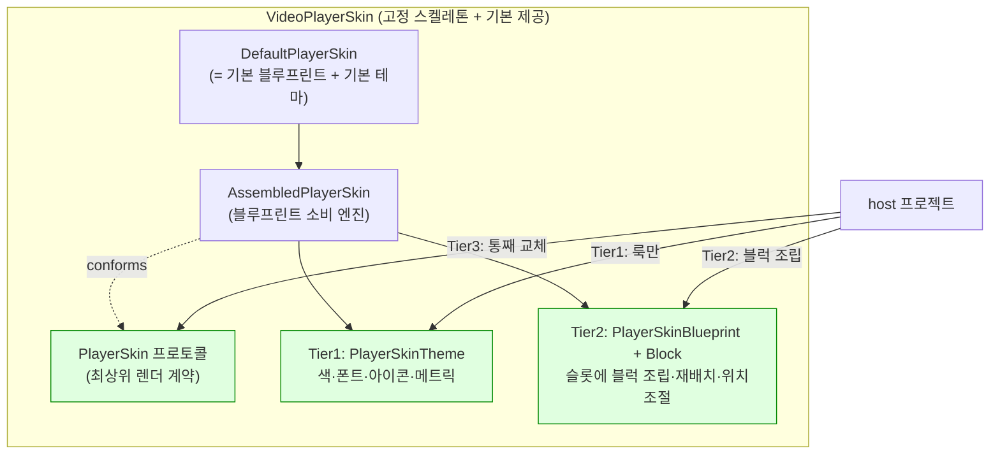

# VideoPlayerSkin 커스터마이즈 아키텍처 (POP 기반)

**작성일**: 2026-06-01
**작성자**: 모바일팀_정준영
**대상 패키지**: `videoplayer-ios-ms` / `VideoPlayerSkin` 타깃
**상태**: Design — Proposal
**관련**: smartlearning-ios-ms `specs/064-player-shell-extraction/spec.md`

---

## 이 문서를 읽는 법 (주니어 가이드)

이 문서는 **현재 고정 구현된 `VideoPlayerSkin`(재생기 컨트롤 UI)을, 다른 프로젝트가
"기본 제공"을 그대로 쓰거나 커스텀으로 갈아끼울 수 있게** POP(Protocol-Oriented
Programming)로 개선하는 설계다. 순서대로 읽자.

1. **§1 목적 / 현 문제** — 왜 바꾸나
2. **§2 핵심 아이디어 — 3-Tier 커스터마이즈** — 큰 그림 (그림 포함)
3. **§3 용어** — 슬롯/블럭/블루프린트/테마 (먼저 외우기)
4. **§4 목표 폴더 구조** — 무엇을 어디에
5. **§5 계약(Contract) 프로토콜** — 최상위 PlayerSkin
6. **§6 Tier1 — Theme (룩 토큰)** — 색/폰트/아이콘
7. **§7 Tier2 — Blueprint + Block (조립)** — 고정 스켈레톤 + 블럭 주입
8. **§8 host 사용 예시** — 3가지 진입
9. **§9 단계별 도입 + 리스크**

> 핵심 한 줄: **레이아웃 스켈레톤은 패키지가 고정한다. host 는 (a) 룩만 바꾸거나(Theme),
> (b) 슬롯에 블럭을 조립/재배치하거나(Blueprint), (c) 통째로 갈아끼운다(PlayerSkin).
> 기본값은 모두 현재 구현과 1:1 동일(parity).**

---

## 1. 목적 / 현 문제

`VideoPlayerSkin` 은 현재 **concrete 타입 묶음** 이라 커스터마이즈 경로가 없다.

- `PlayerSkinControlView`(public final class) — 컨트롤 UI 한 덩어리. 색/폰트/아이콘/배치 전부 하드코딩.
- host(앱 ShellVC)가 `PlayerSkinControlView()` 를 직접 인스턴스화 → 교체 불가.
- 입출력 계약은 이미 존재: 입력 `configure / render(_:) / setExtraControls / updateSkipIntervalLabel`,
  출력 `onAction`, 데이터 `PlayerSkinState / PlayerSkinAction / ExtraControl`.

→ 다른 프로젝트(미니플레이어, 별도 앱, 브랜드 테마)가 "다른 룩/배치" 를 원하면 현재는 fork 뿐.

**목표**: 레이아웃 골격은 고정(레이아웃 깨짐·반응형·lock 게이트를 패키지가 한 번에 책임),
세부는 host 가 블럭처럼 조립·미세조정·교체.

---

## 2. 핵심 아이디어 — 3-Tier 커스터마이즈

커스터마이즈 수요는 3단계로 나뉜다. 대부분은 Tier1·Tier2 에서 끝난다.



| Tier | 무엇을 바꾸나 | 비용 | 케이스 비중 |
|---|---|---|---|
| **1 Theme** | 색 / 폰트 / 아이콘 / 치수 | 낮음 | ~70% |
| **2 Blueprint** | 어떤 블럭을 어느 슬롯에 / 위치·정렬 / 블럭 교체·추가 | 중간 | ~25% |
| **3 PlayerSkin** | 컨트롤 UI 전체 재작성 | 높음 | ~5% (탈출구) |

세 Tier 모두 **기본값 = 현재 구현 1:1**. 0-config 면 지금과 똑같이 동작.

---

## 3. 용어 (먼저 외우기)

| 이름 | 무엇 |
|---|---|
| **스켈레톤(skeleton)** | 슬롯의 고정 위치 + 반응형 chrome 규칙(verticalSplit/horizontalSplit/fullScreen) + lock/가시성 게이트. **패키지 소유**. |
| **슬롯(slot)** | 이름붙은 영역. `topLeading / topCenter / topTrailing / centerControls / leftRail / rightRail / bottomBar / floatingTrailing`. |
| **블럭(block)** | 슬롯에 끼우는 컨트롤 단위. `render(state, theme)` + `onAction` 보유. play / skip / progress / rate 등 기본 블럭 제공. |
| **블루프린트(blueprint)** | 슬롯 → [블럭] 매핑 + 슬롯별 inset/정렬 + 모드별 가시성. **기본 = 현 배치**. |
| **테마(theme)** | 색/폰트/아이콘/메트릭 토큰. **기본 = 현 하드코딩 값**. |
| **`PlayerSkin`** | 최상위 렌더 계약. `AssembledPlayerSkin` 이 채택. host 는 이것으로 통째 교체 가능. |
| `PlayerSkinState/Action/ExtraControl` | (기존) 입력/출력/주입버튼 데이터. 계약 vocabulary. |

---

## 4. 목표 폴더 구조

```
Sources/VideoPlayerSkin/
├── Contract/                          # 공개 계약 (host 의존)
│   ├── PlayerSkin.swift               # 최상위 렌더 프로토콜 (Tier3 교체점)
│   ├── PlayerSkinState.swift          # 입력 데이터 (이동)
│   ├── PlayerSkinAction.swift         # 출력 액션 (이동)
│   └── ExtraControl.swift             # host 주입 버튼 (이동)
├── Theme/                             # Tier1 — 룩 토큰
│   ├── PlayerSkinTheme.swift          # 프로토콜 + 기본 extension (ISP)
│   ├── PlayerSkinColorRole.swift
│   ├── PlayerSkinFontRole.swift
│   ├── PlayerSkinIcon.swift
│   ├── PlayerSkinMetrics.swift
│   └── DefaultPlayerSkinTheme.swift
├── Assembly/                          # Tier2 — 조립
│   ├── PlayerSkinSlot.swift
│   ├── PlayerSkinBlock.swift          # 블럭 프로토콜
│   ├── PlayerSkinSlotLayout.swift     # 슬롯 미세배치 값타입
│   ├── PlayerSkinBlueprint.swift      # 배치 명세 + .default
│   └── AssembledPlayerSkin.swift      # 블루프린트 소비 엔진 (PlayerSkin 채택)
├── Blocks/                            # 기본 제공 블럭
│   ├── CloseButtonBlock.swift  TitleBlock.swift  MoreButtonBlock.swift  LockButtonBlock.swift
│   ├── PlayButtonBlock.swift   SkipButtonBlock.swift
│   ├── ProgressBarBlock.swift  TimeLabelBlock.swift  ScreenModeBlock.swift
│   ├── RateButtonBlock.swift   RateStepBlock.swift   DisplayScaleBlock.swift
│   ├── SectionRepeatBlock.swift  SettingButtonBlock.swift
│   └── ExtraControlsRailBlock.swift   ExtraFloatingBlock.swift   # host 주입 ExtraControl 렌더
├── Default/
│   └── DefaultPlayerSkin.swift        # = AssembledPlayerSkin(.default, DefaultPlayerSkinTheme())
├── Surface/PlayerRenderSurfaceView.swift   # 영상 layer host (skin 과 별개)
├── KeyCommand/PlayerKeyCommandRegistry.swift
├── NowPlaying/PlayerNowPlayingCenter.swift  PlayerAudioSessionConfigurator.swift
└── Resources/                         # 기본 아이콘 (DefaultPlayerSkinTheme 가 .module 에서 로드)
    └── *.imageset
```

`Resources/` 를 실제로 추가할 때는 SwiftPM target 에 리소스 선언도 같이 들어가야 한다.

```swift
.target(
    name: "VideoPlayerSkin",
    dependencies: [
        "VideoPlayerCore",
        "VideoPlayerShellSupport"
    ],
    path: "Sources/VideoPlayerSkin",
    resources: [
        .process("Resources")
    ],
    linkerSettings: [
        .linkedFramework("UIKit", .when(platforms: [.iOS])),
        .linkedFramework("AVFoundation", .when(platforms: [.iOS])),
        .linkedFramework("MediaPlayer", .when(platforms: [.iOS]))
    ]
)
```

> `Bundle.module` 은 `VideoPlayerSkin` target 내부 기본 테마에서만 사용한다. host 앱의 커스텀
> 테마는 자기 번들(`Bundle.main`, `Bundle(for:)` 등)에서 에셋을 찾거나, 기본 아이콘은
> `DefaultPlayerSkinTheme` 로 위임한다.

> 현재 14파일 중 skin 컨트롤 본체(`PlayerSkinControlView`)는 **블럭들로 분해**되어 `Blocks/` +
> `Assembly/` 로 재구성된다. `PlayerRenderSurfaceView`(영상 layer)·`PlayerCaptionView`·
> `PlayerGestureHUDView`·NowPlaying·KeyCommand 등은 관심사가 달라 그대로 유지.

---

## 5. 계약 — `Contract/PlayerSkin.swift`

```swift
import UIKit

/// 재생기 컨트롤 UI 의 최상위 렌더 계약.
/// `view` 를 제공해 UIView 상속 강제는 피하고, UIView/UIViewController wrapper 구현을 모두 허용한다.
@MainActor
public protocol PlayerSkin: AnyObject {
    /// host 가 컨테이너에 add 할 실제 뷰.
    var view: UIView { get }

    /// 사용자 컨트롤 입력 출력. host 가 reactor/usecase 로 매핑.
    var onAction: ((PlayerSkinAction) -> Void)? { get set }

    func configure(title: String, maxPlaybackRate: Double)
    func render(_ state: PlayerSkinState)
    func setExtraControls(_ controls: [ExtraControl])
    func updateSkipIntervalLabel(seconds: Int)
}
```

---

## 6. Tier1 — Theme

### `Theme/PlayerSkinIcon.swift` · `PlayerSkinFontRole.swift` · `PlayerSkinColorRole.swift`

```swift
/// skin 이 요구하는 아이콘의 "의미". host 가 자유 매핑 (에셋 의존 역전).
public enum PlayerSkinIcon: Hashable, Sendable {
    case close, more, lock, unlock
    case play, pause, skipBackward, skipForward
    case screenExpand, screenShrink, displayScaleFit, displayScaleFill
    case rateUp, rateDown
    case sectionRepeatIdle, sectionRepeatActive
    case sliderThumb
}

public enum PlayerSkinFontRole: Hashable, Sendable {
    case title, time, rateLabel, skipInterval, extraControlTitle
}

public enum PlayerSkinColorRole: Hashable, Sendable {
    case controlTint, progressFill, progressTrack, barBackground, hudBackground
}
```

### `Theme/PlayerSkinTheme.swift` — 프로토콜 + ISP 기본값

```swift
import UIKit

@MainActor
public protocol PlayerSkinTheme {
    func color(_ role: PlayerSkinColorRole) -> UIColor
    func font(_ role: PlayerSkinFontRole) -> UIFont
    func icon(_ icon: PlayerSkinIcon) -> UIImage?
    var metrics: PlayerSkinMetrics { get }
}

/// ISP — 필요한 것만 구현. 나머지는 기본 제공.
public extension PlayerSkinTheme {
    var metrics: PlayerSkinMetrics { .default }
    func color(_ role: PlayerSkinColorRole) -> UIColor { role.defaultColor }
    func font(_ role: PlayerSkinFontRole) -> UIFont { role.defaultFont }
    func icon(_ icon: PlayerSkinIcon) -> UIImage? {
        UIImage(named: icon.defaultAssetName, in: .module, with: nil)   // 기본 번들 아이콘
    }
}
```

기본 role 매핑도 public extension 으로 같이 제공한다. 문서 예시와 host 코드가
`role.defaultColor` / `icon.defaultAssetName` 에 의존하므로, 이 매핑이 실제 API 표면에
없으면 예시가 컴파일되지 않는다.

```swift
public extension PlayerSkinIcon {
    var defaultAssetName: String {
        switch self {
        case .close: "PlayerCloseNormal"
        case .more: "PlayerMoreNormal"
        case .lock: "PlayerLockNormal"
        case .unlock: "PlayerUnlockNormal"
        case .play: "PlayerPlayNormal"
        case .pause: "PlayerPauseNormal"
        case .skipBackward: "PlayerBackwardNormal"
        case .skipForward: "PlayerForwardNormal"
        case .screenExpand: "PlayerScreenPortraitNormal"
        case .screenShrink: "PlayerScreenLandscapeNormal"
        case .displayScaleFit: "PlayerScreenScalingAspectFitNormal"
        case .displayScaleFill: "PlayerScreenScalingAspectFillNormal"
        case .rateUp: "PlayerRatePlusButton"
        case .rateDown: "PlayerRateMinusButton"
        case .sectionRepeatIdle: "PlayerRepeatNormal"
        case .sectionRepeatActive: "PlayerRepeatSelected"
        case .sliderThumb: "PlayerPlaybackSliderCircleNormal"
        }
    }
}

public extension PlayerSkinColorRole {
    var defaultColor: UIColor {
        switch self {
        case .controlTint: .white
        case .progressFill: UIColor(named: "primarySkyBlue", in: .module, compatibleWith: nil) ?? .systemBlue
        case .progressTrack: UIColor(named: "Line/grey-03", in: .module, compatibleWith: nil) ?? UIColor.white.withAlphaComponent(0.35)
        case .barBackground: UIColor.black.withAlphaComponent(0.52)
        case .hudBackground: UIColor.black.withAlphaComponent(0.55)
        }
    }
}

public extension PlayerSkinFontRole {
    var defaultFont: UIFont {
        switch self {
        case .title: .systemFont(ofSize: 16, weight: .regular)
        case .time: .monospacedDigitSystemFont(ofSize: 11, weight: .regular)
        case .rateLabel, .extraControlTitle: .systemFont(ofSize: 13, weight: .semibold)
        case .skipInterval: .systemFont(ofSize: 12, weight: .semibold)
        }
    }
}
```

### `Theme/PlayerSkinMetrics.swift`

```swift
import CoreGraphics

public struct PlayerSkinMetrics: Equatable, Sendable {
    public var barHeight: CGFloat
    public var sideInset: CGFloat
    public var iconButtonSize: CGFloat
    public var centerControlSpacing: CGFloat
    public var progressSliderHeight: CGFloat

    public init(
        barHeight: CGFloat = 50,
        sideInset: CGFloat = 20,
        iconButtonSize: CGFloat = 44,
        centerControlSpacing: CGFloat = 56,
        progressSliderHeight: CGFloat = 21
    ) {
        self.barHeight = barHeight
        self.sideInset = sideInset
        self.iconButtonSize = iconButtonSize
        self.centerControlSpacing = centerControlSpacing
        self.progressSliderHeight = progressSliderHeight
    }

    public static let `default` = PlayerSkinMetrics()
}
```

### `Theme/DefaultPlayerSkinTheme.swift` — 현 하드코딩 값 = 기본 테마

```swift
import UIKit

/// 현재 PlayerSkinControlView 의 하드코딩 룩 = 기본 테마.
/// extension 기본값을 그대로 사용 → 빈 구현으로 기존 동작 유지.
public struct DefaultPlayerSkinTheme: PlayerSkinTheme {
    public init() {}
}
```

---

## 7. Tier2 — Blueprint + Block (조립)

### `Assembly/PlayerSkinSlot.swift`

```swift
/// 스켈레톤의 고정 영역. 위치는 패키지가 소유, 내용물은 host 가 채운다.
public enum PlayerSkinSlot: Hashable, Sendable, CaseIterable {
    case topLeading, topCenter, topTrailing     // 상단 바
    case centerControls                          // 중앙 재생 클러스터 (floating)
    case leftRail, rightRail                     // 세로 메뉴 (fullscreen/split)
    case bottomBar                               // 진행 바 영역
    case floatingTrailing                        // 우하단 floating (배속/다음강의)
}
```

### `Assembly/PlayerSkinBlock.swift`

```swift
import UIKit

/// 슬롯에 끼우는 컨트롤 단위. 상태 반영 + 액션 방출.
@MainActor
public protocol PlayerSkinBlock: AnyObject {
    var id: PlayerSkinBlockID { get }
    var view: UIView { get }
    var onAction: ((PlayerSkinAction) -> Void)? { get set }
    /// 매 프레임 상태 반영 (블럭 자신 관련 부분만).
    func render(_ state: PlayerSkinState, theme: PlayerSkinTheme)
}
```

### `Assembly/PlayerSkinSlotLayout.swift` — 위치 세부조절

```swift
import UIKit

/// 슬롯 내부 배치 미세조정.
public struct PlayerSkinSlotLayout: Equatable, Sendable {
    public enum Axis: Sendable { case horizontal, vertical }
    public enum Align: Sendable { case leading, center, trailing, fill }

    public var axis: Axis
    public var alignment: Align
    public var spacing: CGFloat
    public var insets: UIEdgeInsets

    public init(axis: Axis = .horizontal, alignment: Align = .center,
                spacing: CGFloat = 12, insets: UIEdgeInsets = .zero) {
        self.axis = axis; self.alignment = alignment
        self.spacing = spacing; self.insets = insets
    }
}
```

### `Assembly/PlayerSkinBlueprint.swift` — 조립 명세 + 기본 배치

```swift
import UIKit

public enum PlayerSkinBlockID: Hashable, Sendable {
    case close, title, displayScale, lock, more
    case play, skipBackward, skipForward
    case progress, currentTime, duration, screenMode
    case rateButton, rateStepUp, rateStepDown
    case sectionRepeat, setting
    case extraControlsRail, extraFloating
}

public struct PlayerSkinBlueprint {
    /// 슬롯 → 블럭 생성기 배열 (순서 = 배치 순서).
    public var blocks: [PlayerSkinSlot: [() -> PlayerSkinBlock]]
    /// 슬롯별 미세 배치.
    public var layouts: [PlayerSkinSlot: PlayerSkinSlotLayout]
    /// layoutMode 별 노출 슬롯 (반응형 chrome 규칙의 coarse gate).
    public var visibleSlots: [PlayerSkinLayoutMode: Set<PlayerSkinSlot>]
    /// 같은 슬롯 안에서 layoutMode 별로 숨겨야 하는 블럭.
    /// 예: fullScreen 의 leftRail 은 슬롯은 보이지만 sectionRepeat 만 남고 setting/extra 는 숨는다.
    public var hiddenBlocks: [PlayerSkinLayoutMode: Set<PlayerSkinBlockID>]

    public init(blocks: [PlayerSkinSlot: [() -> PlayerSkinBlock]],
                layouts: [PlayerSkinSlot: PlayerSkinSlotLayout] = [:],
                visibleSlots: [PlayerSkinLayoutMode: Set<PlayerSkinSlot>],
                hiddenBlocks: [PlayerSkinLayoutMode: Set<PlayerSkinBlockID>] = [:]) {
        self.blocks = blocks
        self.layouts = layouts
        self.visibleSlots = visibleSlots
        self.hiddenBlocks = hiddenBlocks
    }
}

public extension PlayerSkinBlueprint {
    /// 기본 = 현 DefaultPlayerSkin 배치 1:1 (0-config 시 동일 룩).
    static var `default`: PlayerSkinBlueprint {
        PlayerSkinBlueprint(
            blocks: [
                .topLeading:      [{ CloseButtonBlock() }],
                .topCenter:       [{ TitleBlock() }],
                .topTrailing:     [{ DisplayScaleBlock() }, { LockButtonBlock() }, { MoreButtonBlock() }],
                .centerControls:  [{ SkipButtonBlock(.backward) }, { PlayButtonBlock() }, { SkipButtonBlock(.forward) }],
                .leftRail:        [{ SectionRepeatBlock() }, { ExtraControlsRailBlock() }, { SettingButtonBlock() }],
                .rightRail:       [{ RateStepBlock(.up) }, { RateStepBlock(.down) }],
                .bottomBar:       [{ TimeLabelBlock(.current) }, { ProgressBarBlock() }, { TimeLabelBlock(.duration) }, { ScreenModeBlock() }],
                .floatingTrailing:[{ RateButtonBlock() }, { ExtraFloatingBlock() }]
            ],
            layouts: [
                .leftRail:        .init(axis: .vertical, alignment: .center, spacing: 12,
                                        insets: .init(top: 0, left: 20, bottom: 0, right: 0)),
                .centerControls:  .init(axis: .horizontal, alignment: .center, spacing: 56)
            ],
            visibleSlots: [
                .verticalSplit:   [.topLeading, .topTrailing, .centerControls, .bottomBar, .floatingTrailing],
                .horizontalSplit: [.topLeading, .topCenter, .topTrailing, .leftRail, .centerControls, .bottomBar, .floatingTrailing],
                .fullScreen:      Set(PlayerSkinSlot.allCases)
            ],
            hiddenBlocks: [
                .verticalSplit: [.displayScale],
                .fullScreen: [.displayScale, .extraControlsRail, .setting]
            ]
        )
    }
}
```

`visibleSlots` 는 슬롯 단위 큰 게이트만 담당한다. 현재 `PlayerSkinControlView` parity 에는
같은 슬롯 안의 일부 버튼만 숨기는 규칙이 있다.

- `verticalSplit`: topTrailing 슬롯은 보이지만 `displayScale` 은 숨고 lock/more 는 남는다.
- `fullScreen`: leftRail 슬롯은 보이지만 `sectionRepeat` 만 남고 `extraControlsRail`/`setting` 은 숨는다.
- `fullScreen`: topTrailing 슬롯은 보이지만 `displayScale` 은 숨고 lock/more 는 남는다.

따라서 구현 시 `visibleSlots` 만으로 parity 를 보장하지 말고, `hiddenBlocks` 같은 block 단위
visibility policy 를 함께 적용해야 한다.

### `Assembly/AssembledPlayerSkin.swift` — 조립 엔진

```swift
import UIKit

/// 블루프린트를 소비해 슬롯에 블럭을 끼우는 PlayerSkin.
public final class AssembledPlayerSkin: UIView, PlayerSkin {
    public var view: UIView { self }
    public var onAction: ((PlayerSkinAction) -> Void)?

    private let blueprint: PlayerSkinBlueprint
    private let theme: PlayerSkinTheme
    private var slotContainers: [PlayerSkinSlot: UIStackView] = [:]
    private var blocks: [PlayerSkinBlock] = []
    private var latestState = PlayerSkinState.initial

    public init(blueprint: PlayerSkinBlueprint = .default,
                theme: PlayerSkinTheme = DefaultPlayerSkinTheme()) {
        self.blueprint = blueprint
        self.theme = theme
        super.init(frame: .zero)
        buildSkeleton()      // 슬롯 컨테이너를 고정 위치에 배치 (패키지 레이아웃 수학)
        assembleBlocks()     // 블루프린트대로 블럭 생성·삽입·action 결선
    }

    @available(*, unavailable)
    public required init?(coder: NSCoder) { fatalError("init(coder:) has not been implemented") }

    public func configure(title: String, maxPlaybackRate: Double) { /* title / rate 블럭에 forward */ }
    public func setExtraControls(_ controls: [ExtraControl]) { /* ExtraControlsRail / Floating 블럭에 forward */ }
    public func updateSkipIntervalLabel(seconds: Int) { /* SkipButtonBlock 들에 forward */ }

    public func render(_ state: PlayerSkinState) {
        latestState = state
        applyVisibleSlots(for: state.layoutMode, locked: state.isLocked)   // chrome 게이트 (한 곳)
        applyHiddenBlocks(for: state.layoutMode)                            // 같은 슬롯 안의 부분 숨김
        blocks.forEach { $0.render(state, theme: theme) }                  // 각 블럭 자기 갱신
    }

    private func assembleBlocks() {
        for (slot, makers) in blueprint.blocks {
            guard let container = slotContainers[slot] else { continue }
            for make in makers {
                let block = make()
                block.onAction = { [weak self] action in self?.onAction?(action) }   // 블럭→skin fan-in
                container.addArrangedSubview(block.view)
                blocks.append(block)
            }
        }
    }

    // buildSkeleton(): 슬롯 컨테이너(UIStackView) 들을 고정 위치 제약으로 배치.
    // applyVisibleSlots(for:locked:): layoutMode + lock 에 따라 슬롯 alpha/hidden 게이트.
    // applyHiddenBlocks(for:): blueprint.hiddenBlocks 기반으로 block.view.isHidden 토글.
    //   → 반응형·lock 규칙을 여기 한 곳에 집중. 블럭은 자기 상태 렌더만 책임.
}
```

### 기본 블럭 예시 — `Blocks/PlayButtonBlock.swift`

```swift
import UIKit

public final class PlayButtonBlock: UIView, PlayerSkinBlock {
    public let id: PlayerSkinBlockID = .play
    public var view: UIView { self }
    public var onAction: ((PlayerSkinAction) -> Void)?

    private let button = UIButton(type: .system)

    public override init(frame: CGRect) {
        super.init(frame: frame)
        addSubview(button)
        button.addTarget(self, action: #selector(tapped), for: .touchUpInside)
        // pin button to edges …
    }
    @available(*, unavailable)
    public required init?(coder: NSCoder) { fatalError("init(coder:) has not been implemented") }

    public func render(_ state: PlayerSkinState, theme: PlayerSkinTheme) {
        button.setImage(theme.icon(state.isPlaying ? .pause : .play), for: .normal)
        button.tintColor = theme.color(.controlTint)
        button.isEnabled = !state.isLocked
    }

    @objc private func tapped() { onAction?(.togglePlayPause) }
}
```

---

## 8. host 사용 예시

```swift
import VideoPlayerSkin

// (A) 기본 — 현 배치/룩 그대로
let skin: PlayerSkin = DefaultPlayerSkin()

// (B-Tier1) 룩만 — 브랜드 색/아이콘
struct BrandTheme: PlayerSkinTheme {
    private let base = DefaultPlayerSkinTheme()

    func color(_ role: PlayerSkinColorRole) -> UIColor {
        role == .progressFill ? .systemPurple : role.defaultColor
    }

    func icon(_ icon: PlayerSkinIcon) -> UIImage? {
        if icon == .play {
            return UIImage(named: "myPlay") ?? base.icon(icon)
        }
        return base.icon(icon)
    }
}
let skinThemed = AssembledPlayerSkin(theme: BrandTheme())

// (B-Tier2) 조립 — 배속 버튼을 우레일로 이동 + bottomBar inset 조정
var bp = PlayerSkinBlueprint.default
bp.blocks[.floatingTrailing] = [{ ExtraFloatingBlock() }]            // rate 제거
bp.blocks[.rightRail, default: []].append({ RateButtonBlock() })     // rate 를 우레일로
bp.layouts[.bottomBar] = .init(insets: .init(top: 8, left: 24, bottom: 4, right: 24))
let skinReassembled = AssembledPlayerSkin(blueprint: bp)

// (B-Tier2) 블럭 교체 — 커스텀 파형 진행바
final class WaveformProgressBlock: UIView, PlayerSkinBlock {
    let id: PlayerSkinBlockID = .progress
    var view: UIView { self }
    var onAction: ((PlayerSkinAction) -> Void)?
    func render(_ state: PlayerSkinState, theme: PlayerSkinTheme) { /* 파형 진행바 */ }
}
var bp2 = PlayerSkinBlueprint.default
bp2.blocks[.bottomBar] = [{ TimeLabelBlock(.current) }, { WaveformProgressBlock() }, { TimeLabelBlock(.duration) }]
let skinWaveform = AssembledPlayerSkin(blueprint: bp2, theme: BrandTheme())

// (C-Tier3) 통째 교체 — 완전 커스텀 뷰
final class NeonSkin: UIView, PlayerSkin {
    var view: UIView { self }
    var onAction: ((PlayerSkinAction) -> Void)?
    func configure(title: String, maxPlaybackRate: Double) {}
    func render(_ state: PlayerSkinState) {}
    func setExtraControls(_ controls: [ExtraControl]) {}
    func updateSkipIntervalLabel(seconds: Int) {}
}
let skinCustom: PlayerSkin = NeonSkin()
```

### host 결선 (앱 ShellVC) — `any PlayerSkin` 주입 (DIP)

```swift
// 구: private let playerSkinControlView = PlayerSkinControlView()   // concrete
// 신: 주입
private let skin: PlayerSkin
init(skin: PlayerSkin = DefaultPlayerSkin(), /* ... */) {
    self.skin = skin
}
// 사용처:
//   view.addSubview(skin.view)
//   skin.onAction = { [weak self] action in self?.handle(action) }
//   skin.render(playerSkinState)
```

---

## 9. 단계별 도입 + 리스크

### 도입 순서 (각 단계 빌드/동작 불변)
1. **Contract** — `PlayerSkin` 프로토콜 신설. 현 `PlayerSkinControlView` 에 `var view: UIView { self }` 만 추가해 우선 conform (행위 불변).
2. **Theme** — 색/폰트/아이콘/메트릭을 `PlayerSkinTheme` 토큰으로 추출, 현 값 = `DefaultPlayerSkinTheme`. skin 이 theme 에서 읽도록 치환.
3. **에셋 역전** — `UIImage(named:)`(host Bundle.main) → `theme.icon(_:)`(기본 `.module` 번들). 이 단계에서 `Package.swift` 의 `resources: [.process("Resources")]` 와 실제 `Resources/*.imageset` 이동을 같이 처리한다.
4. **Blocks 분해** — `PlayerSkinControlView` 의 각 컨트롤을 `PlayerSkinBlock` 으로 분해.
5. **Assembly** — `PlayerSkinBlueprint.default` + `AssembledPlayerSkin`. `DefaultPlayerSkin` = 얇은 wrapper.
6. **host 결선** — 앱 ShellVC 가 `any PlayerSkin` 주입받게.

### Parity 체크리스트

기본 `DefaultPlayerSkin` 은 아래 동작과 식별자를 현재 `PlayerSkinControlView` 와 1:1 로 유지해야 한다.

| 영역 | 유지할 계약 |
|---|---|
| 재생/탐색 | play/pause, ±skip, seek preview/end 액션과 `updateSkipIntervalLabel(seconds:)` 반영 |
| 배속 | center rate button 의 `.ratePanelRequested`, 우측 rail 의 `.rateStepUp`/`.rateStepDown` |
| 화면 | `verticalSplit`/`horizontalSplit`/`fullScreen` 별 title, displayScale, leftRail, rightRail, center 정렬 |
| 잠금 | locked 상태에서 close/lock 외 컨트롤 alpha/enable gate |
| ExtraControl | `leftMenu`/`floating` placement, `hiddenExtraControlIDs`, `.extraControlTapped(id:)` |
| 접근성 | 기존 `lecturePlayer.skin.*` accessibilityIdentifier 와 주요 accessibilityLabel |

block 분해 후에도 UI 테스트와 VoiceOver 품질을 깨지 않도록, 기본 block 은 기존 identifier 를 그대로
승계한다. 예: `lecturePlayer.skin.playPauseButton`, `lecturePlayer.skin.progressSlider`,
`lecturePlayer.skin.extra.<id>`.

### 리스크 / 안티-과설계
| 리스크 | 완화 |
|---|---|
| 조립 기계장치(슬롯/블럭/블루프린트) 복잡도 | **기본 블루프린트 = 현 배치 1:1** → 0-config parity. 조립은 opt-in. |
| 블럭 분해 중 레이아웃/parity 회귀 | 단계 4~5 를 점진 분해 + 단계별 시뮬레이터 QA. 스켈레톤과 block visibility policy 가 레이아웃/가시성 규칙을 흡수. |
| 서브컴포넌트 과분할 | 수요 없는 슬롯/블럭은 만들지 않음. Tier1(테마)로 충분한 케이스 다수. |
| 픽셀-정밀 위치 요구 | `PlayerSkinSlotLayout`(inset/정렬/간격) 우선. 부족 시 슬롯별 constraint 클로저 확장(후속). |
| 에셋 누락/번들 오류 | 기본 아이콘은 `VideoPlayerSkin` resource bundle 로 이동하고 `Bundle.module` 로만 조회. host 테마는 자기 bundle 에서 조회하거나 기본 테마로 fallback. |

### 비-목표 (Non-Goals)
- 재생 엔진 / `PlayerSkinState`·`PlayerSkinAction` 데이터 계약 변경.
- `PlayerRenderSurfaceView`(영상 layer)·NowPlaying·KeyCommand 재설계 (관심사 별개, 유지).
- 강의 orchestration(앱 reactor/ShellVC) 이동 — 그대로 앱 잔류.

---

## 10. 요약

- **고정 스켈레톤 + 3-Tier 커스터마이즈**: Theme(룩) / Blueprint·Block(조립) / PlayerSkin(전체).
- 패키지가 레이아웃·반응형·lock 을 한 곳에서 책임 → host 는 안전하게 블럭만 조립.
- 모든 기본값 = 현 구현 1:1 → parity 보장, 점진 채택.
- POP 원칙: 작은 프로토콜(Block/Theme) + 기본 extension(ISP) + 주입(DIP) + 기본 제공 conformance.
