# videoplayer-ios-ms 발표 시각 자료 가이드

작성자: JunyoungJung  
작성일: 2026-06-11  
연결 원고: `docs/presentation/player-module-review-ios-content.md`

## 목적

이 문서는 `player-module-review-ios.html`을 개편할 때 사용할 시각 자료 원본이다. 발표 화면에는 모든 코드를 길게 넣지 않고, 아래 자료 중 슬라이드 이해에 필요한 요소만 선택해 넣는다.

자료 원칙:

- 배경 설명은 Mermaid 흐름도와 블로그 썸네일을 함께 사용한다.
- 설계 설명은 SVG/diagram으로 한눈에 보이게 만든다.
- 구현 설명은 Swift 예시 코드와 pseudo code를 나란히 둔다.
- 결정 요청은 표보다 의사결정 흐름이 보이게 만든다.

## 슬라이드별 자료 배치표

| 슬라이드 | 권장 자료 | 목적 |
| --- | --- | --- |
| 01 | Mermaid 서비스별 중복 구조 | 팀에 실제로 발생 중인 문제를 먼저 납득시킴 |
| 02 | SVG 중복 비용 맵 | 기능/버그/UX/SDK 대응 반복 비용을 보여줌 |
| 03 | Mermaid 공통 모듈 재사용 구조 | 여러 서비스가 같은 core/skin을 재사용하는 목표 |
| 04 | Mermaid wrapper vs module | 단순 SDK wrapper가 부족한 이유 |
| 05 | Mermaid SDK 구매와 의존 격리 | SDK는 사되 앱 구조는 SDK에 묶지 않는 이유 |
| 06 | Mermaid engine contract와 adapter | SDK 교체 가능성을 만드는 경계 |
| 07 | Mermaid POP 주입 구조 | Host 커스텀과 확장 가능성을 설명 |
| 08 | Mermaid command/state flow | 단방향 흐름 |
| 09 | Mermaid SPM product dependency graph | vendor 격리 |
| 10 | Swift reducer signature, pseudo code | 상태 소유권 |
| 11 | Mermaid capability gate, pseudo code | 기능 사전 게이트 |
| 12 | before/after Mermaid | 문제 해결 매핑 |
| 13 | Mermaid verification pyramid | 자동 검증과 실기기 QA 분리 |
| 14 | Swift Native quickstart | host 사용 코드 |
| 15 | Swift Kollus quickstart | 조립 지점만 다른 구조 |
| 16 | SVG Skin slot layout | UI 조립 구조 |
| 17 | Mermaid demo proof map | 데모가 증명하는 설계 원칙 |
| 18 | Mermaid QA matrix | 남은 한계와 검증 방식 |
| 19 | pseudo code decision rules | 회의 결정 항목 |
| 20 | Mermaid rollout plan | 파일럿 전개 |

## 01. 서비스별 플레이어 중복 구조

추천 위치: v2 01번.

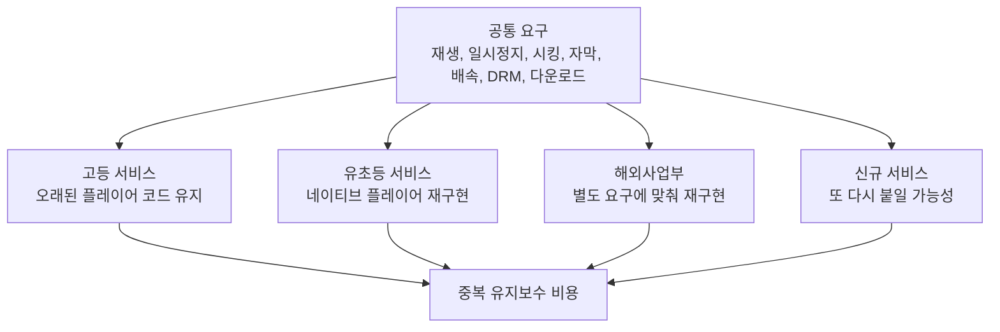

화면 문구:

> 같은 플레이어 문제를 서비스마다 다시 풀고 있습니다.

## 02. 서비스별 중복 비용 맵

추천 위치: v2 02번.

<svg width="960" height="360" viewBox="0 0 960 360" xmlns="http://www.w3.org/2000/svg" role="img" aria-label="서비스별 플레이어 중복 비용">
  <rect width="960" height="360" fill="#fafafa"/>
  <text x="48" y="48" font-family="Arial" font-size="26" font-weight="700" fill="#171717">서비스별로 반복되는 플레이어 비용</text>
  <g font-family="Arial">
    <rect x="60" y="88" width="180" height="210" rx="12" fill="#fff" stroke="#e5e5e5"/>
    <text x="90" y="128" font-size="20" font-weight="700" fill="#171717">고등</text>
    <text x="90" y="166" font-size="15" fill="#4d4d4d">오래된 코드</text>
    <text x="90" y="194" font-size="15" fill="#4d4d4d">기존 UX 기준</text>
    <text x="90" y="222" font-size="15" fill="#4d4d4d">DRM 실기기 QA</text>

    <rect x="280" y="88" width="180" height="210" rx="12" fill="#fff" stroke="#e5e5e5"/>
    <text x="310" y="128" font-size="20" font-weight="700" fill="#171717">유초등</text>
    <text x="310" y="166" font-size="15" fill="#4d4d4d">네이티브 재구현</text>
    <text x="310" y="194" font-size="15" fill="#4d4d4d">다른 UI 요구</text>
    <text x="310" y="222" font-size="15" fill="#4d4d4d">같은 재생 정책</text>

    <rect x="500" y="88" width="180" height="210" rx="12" fill="#fff" stroke="#e5e5e5"/>
    <text x="530" y="128" font-size="20" font-weight="700" fill="#171717">해외사업부</text>
    <text x="530" y="166" font-size="15" fill="#4d4d4d">별도 정책</text>
    <text x="530" y="194" font-size="15" fill="#4d4d4d">현지 UX</text>
    <text x="530" y="222" font-size="15" fill="#4d4d4d">SDK 대응 반복</text>

    <rect x="720" y="88" width="180" height="210" rx="12" fill="#171717"/>
    <text x="750" y="128" font-size="20" font-weight="700" fill="#fff">공통 모듈</text>
    <text x="750" y="166" font-size="15" fill="#d4d4d4">한 번 구현</text>
    <text x="750" y="194" font-size="15" fill="#d4d4d4">여러 서비스 재사용</text>
    <text x="750" y="222" font-size="15" fill="#d4d4d4">서비스별 주입</text>
  </g>
</svg>

## 03. 공통 모듈 재사용 구조

추천 위치: v2 03번.

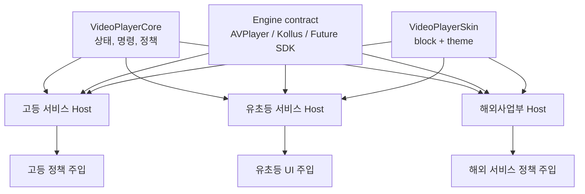

## 04. wrapper vs module

추천 위치: v2 04번.

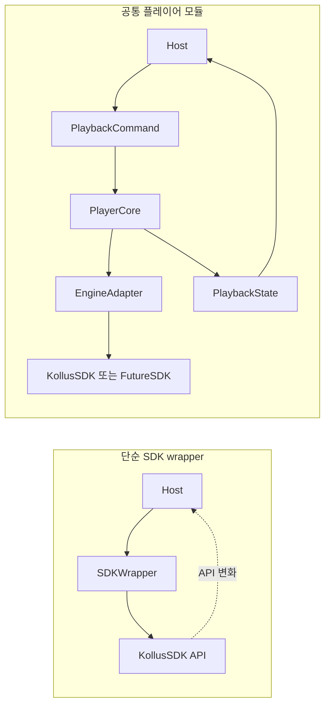

화면 문구:

> wrapper는 SDK 모양을 감추고, module은 우리 도메인 계약을 만듭니다.

## 05. SDK 구매와 의존 격리

추천 위치: v2 05번.

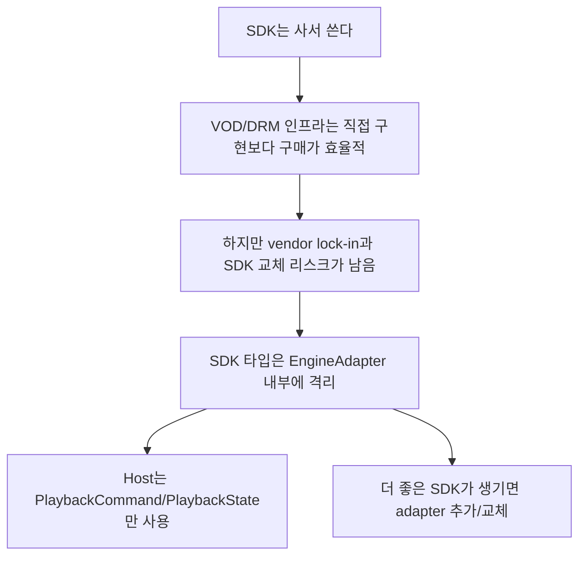

## 06. engine contract와 adapter

추천 위치: v2 06번.

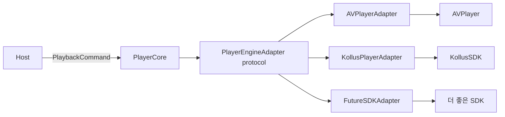

Pseudo code:

```text
protocol PlayerEngineAdapter:
    prepare(source)
    play()
    pause()
    seek(to)
    stop(reason)
    outputs -> AsyncStream<PlayerEngineOutput>

Host depends on PlayerCore.
PlayerCore depends on PlayerEngineAdapter.
Only adapter depends on concrete SDK.
```

## 07. POP 주입 구조

추천 위치: v2 07번.

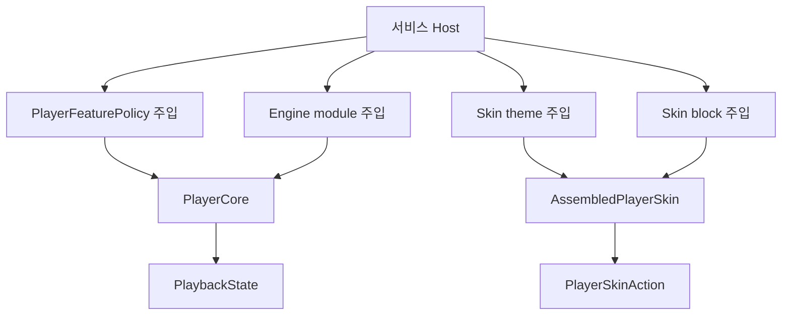

Swift 예시:

```swift
let policy = PlayerFeaturePolicy(
    allowsBackgroundPlayback: true,
    maxPlaybackRate: 2.0,
    allowsAutoplay: true,
    skipInterval: 10
)

let blueprint = PlayerSkinBlueprint(
    blocks: [
        .topCenter: [{ TitleBlock() }],
        .topTrailing: [{ TopMenuExtraControlsBlock() }],
        .bottomBar: [{ ProgressBarBlock() }],
        .floatingBottomTrailing: [{ ExtraFloatingBlock() }]
    ],
    visibleSlots: [
        .fullScreen: [.topCenter, .topTrailing, .bottomBar, .floatingBottomTrailing]
    ]
)

let configuration = PlayerModuleConfiguration(initialPolicy: policy)
let module = await moduleFactory.makeModule(configuration: configuration)
let skin = AssembledPlayerSkin(blueprint: blueprint, theme: serviceTheme)
```

## 01b. 블로그 기반 배경 strip

추천 위치: 타이틀 슬라이드 하단 또는 발표 도입 후 연결 슬라이드.

```markdown
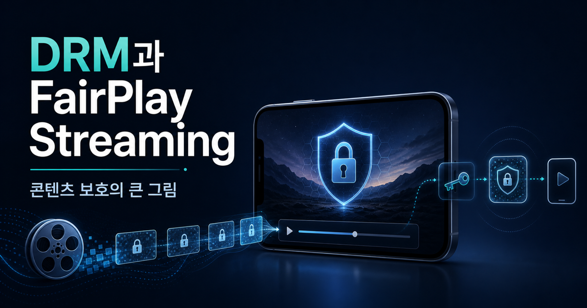


```

화면 문구:

> 이 발표는 5편의 배경 정리 위에서, 최종 설계 승인만 요청하는 자리입니다.

## 03. 강의 재생은 URL 하나가 아니다

### Mermaid: 평문 URL과 보호 재생의 차이

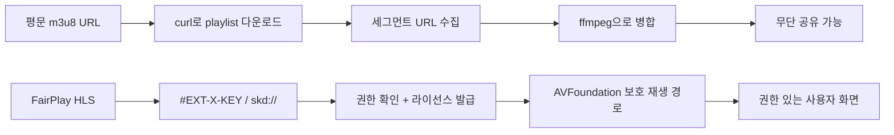

### Inline SVG: URL 재생 vs 보호 재생

<svg width="960" height="300" viewBox="0 0 960 300" xmlns="http://www.w3.org/2000/svg" role="img" aria-label="URL 재생과 보호 재생 비교">
  <rect width="960" height="300" fill="#fafafa"/>
  <rect x="40" y="50" width="400" height="200" rx="12" fill="#fff" stroke="#e5e5e5"/>
  <rect x="520" y="50" width="400" height="200" rx="12" fill="#fff" stroke="#e5e5e5"/>
  <text x="70" y="90" font-family="Arial" font-size="22" font-weight="700" fill="#171717">단순 URL 재생</text>
  <text x="550" y="90" font-family="Arial" font-size="22" font-weight="700" fill="#171717">교육 서비스 재생</text>
  <text x="70" y="135" font-family="Arial" font-size="17" fill="#4d4d4d">URL → AVPlayer → 화면</text>
  <text x="70" y="170" font-family="Arial" font-size="17" fill="#d12">권한, 만료, 키 보호가 밖에 있음</text>
  <text x="550" y="130" font-family="Arial" font-size="17" fill="#4d4d4d">수강 권한 → DRM → SDK → AVFoundation</text>
  <text x="550" y="165" font-family="Arial" font-size="17" fill="#0070f3">콘텐츠 키는 앱 코드 밖에서 처리</text>
  <text x="550" y="200" font-family="Arial" font-size="17" fill="#0070f3">오프라인 만료는 재생 전에 검증</text>
  <path d="M450 150H510" stroke="#171717" stroke-width="2"/>
  <path d="M510 150l-12-8v16z" fill="#171717"/>
</svg>

## 04. HLS DRM은 SPC/CKC 흐름을 가진다

### Mermaid: SPC/CKC sequence

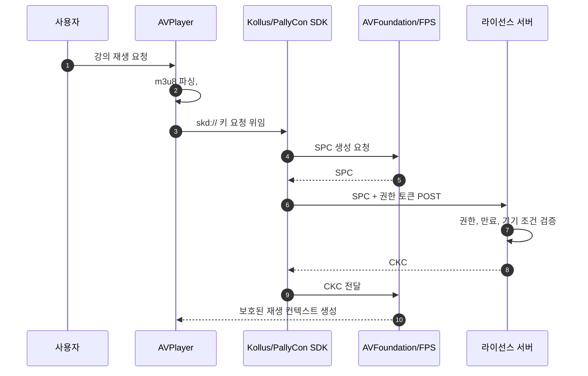

### Pseudo code: 앱이 해야 하는 일

```text
onEncryptedHLSKeyRequest(request):
    contentID = extractContentID(request.skdURL)
    spc = avFoundation.makeSPC(contentID, appCertificate)
    ckc = licenseServer.requestCKC(spc, userPlaybackToken)
    avFoundation.processCKC(ckc)

    # 앱은 content key를 읽지 않는다.
    # 앱은 키 교환 실패를 도메인 에러로 번역한다.
```

### Swift 예시: 직접 구현한다면 이런 흐름

```swift
func handleKeyRequest(_ request: AVContentKeyRequest) {
    guard let contentID = extractContentID(from: request.identifier) else {
        request.processContentKeyResponseError(PlayerError.invalidContentID)
        return
    }

    request.makeStreamingContentKeyRequestData(
        forApp: appCertificate,
        contentIdentifier: contentID,
        options: nil
    ) { spcData, error in
        guard let spcData else {
            request.processContentKeyResponseError(error ?? PlayerError.spcCreationFailed)
            return
        }

        licenseClient.requestCKC(spcData: spcData) { result in
            switch result {
            case .success(let ckcData):
                let response = AVContentKeyResponse(
                    fairPlayStreamingKeyResponseData: ckcData
                )
                request.processContentKeyResponse(response)
            case .failure(let error):
                request.processContentKeyResponseError(error)
            }
        }
    }
}
```

## 05. Kollus와 PallyCon은 Build-vs-Buy 결과다

### Mermaid: 수직 위임 구조

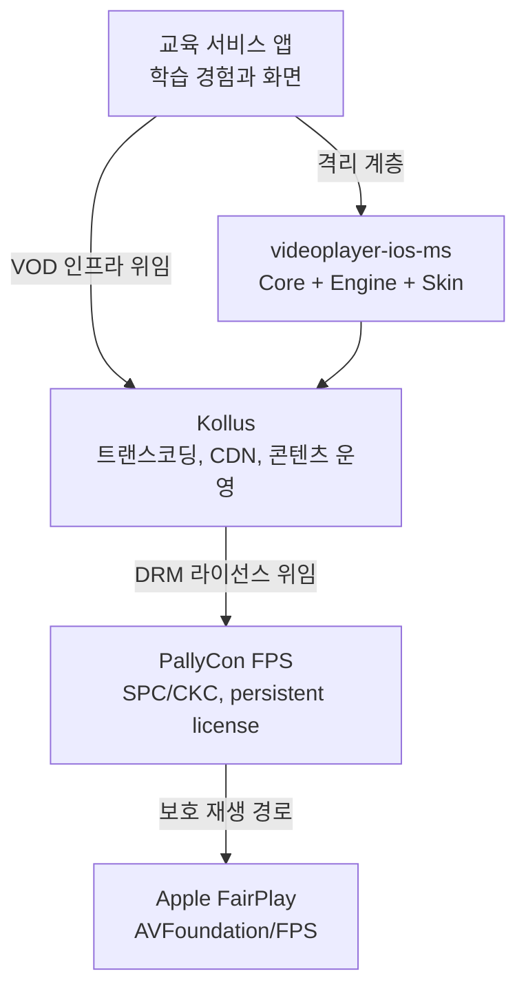

### Inline SVG: 우리가 짓는 것과 사는 것

<svg width="960" height="280" viewBox="0 0 960 280" xmlns="http://www.w3.org/2000/svg" role="img" aria-label="Build vs Buy 범위">
  <rect width="960" height="280" fill="#fafafa"/>
  <text x="48" y="44" font-family="Arial" font-size="24" font-weight="700" fill="#171717">Build vs Buy 경계</text>
  <rect x="50" y="80" width="250" height="130" rx="10" fill="#171717"/>
  <text x="82" y="122" font-family="Arial" font-size="20" font-weight="700" fill="#fff">우리가 짓는 것</text>
  <text x="82" y="158" font-family="Arial" font-size="16" fill="#d4d4d4">도메인 상태</text>
  <text x="82" y="184" font-family="Arial" font-size="16" fill="#d4d4d4">화면 조립</text>
  <text x="82" y="210" font-family="Arial" font-size="16" fill="#d4d4d4">vendor 격리</text>
  <rect x="350" y="80" width="250" height="130" rx="10" fill="#0070f3"/>
  <text x="382" y="122" font-family="Arial" font-size="20" font-weight="700" fill="#fff">Kollus가 파는 것</text>
  <text x="382" y="158" font-family="Arial" font-size="16" fill="#eaf4ff">VOD 플랫폼</text>
  <text x="382" y="184" font-family="Arial" font-size="16" fill="#eaf4ff">CDN / 운영 / 분석</text>
  <text x="382" y="210" font-family="Arial" font-size="16" fill="#eaf4ff">DRM 패키징</text>
  <rect x="650" y="80" width="250" height="130" rx="10" fill="#7928ca"/>
  <text x="682" y="122" font-family="Arial" font-size="20" font-weight="700" fill="#fff">PallyCon이 파는 것</text>
  <text x="682" y="158" font-family="Arial" font-size="16" fill="#f3e8ff">라이선스 서버</text>
  <text x="682" y="184" font-family="Arial" font-size="16" fill="#f3e8ff">SPC/CKC 처리</text>
  <text x="682" y="210" font-family="Arial" font-size="16" fill="#f3e8ff">persistent license</text>
</svg>

## 06. 문제는 vendor가 아니라 vendor 침투다

### Mermaid: 기존 ViewController 책임 폭발

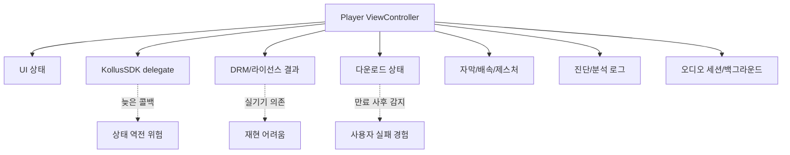

### Pseudo code: 문제가 되던 형태

```text
viewController.onSDKCallback(event):
    updateSDKState(event)
    updateUIState(event)
    updateDownloadState(event)
    updateAnalytics(event)

    if event == bufferingEnded and previousStatus == finished:
        status = playing  # 늦은 콜백이 terminal 상태를 되살릴 수 있음
```

## 07. 설계 원칙 다섯 가지

### Inline SVG: 원칙 카드

<svg width="960" height="360" viewBox="0 0 960 360" xmlns="http://www.w3.org/2000/svg" role="img" aria-label="플레이어 모듈 설계 원칙 다섯 가지">
  <rect width="960" height="360" fill="#fafafa"/>
  <text x="48" y="52" font-family="Arial" font-size="28" font-weight="700" fill="#171717">vendor는 쓰되, 앱 코드는 vendor를 몰라야 합니다</text>
  <g font-family="Arial">
    <rect x="50" y="100" width="160" height="160" rx="12" fill="#fff" stroke="#e5e5e5"/>
    <text x="76" y="145" font-size="18" font-weight="700" fill="#171717">Engine</text>
    <text x="76" y="174" font-size="15" fill="#4d4d4d">교체 가능성</text>
    <text x="76" y="205" font-size="13" fill="#858585">AVPlayer / Kollus</text>
    <text x="76" y="226" font-size="13" fill="#858585">same contract</text>

    <rect x="230" y="100" width="160" height="160" rx="12" fill="#fff" stroke="#e5e5e5"/>
    <text x="256" y="145" font-size="18" font-weight="700" fill="#171717">Flow</text>
    <text x="256" y="174" font-size="15" fill="#4d4d4d">단방향 상태</text>
    <text x="256" y="205" font-size="13" fill="#858585">command in</text>
    <text x="256" y="226" font-size="13" fill="#858585">state out</text>

    <rect x="410" y="100" width="160" height="160" rx="12" fill="#fff" stroke="#e5e5e5"/>
    <text x="436" y="145" font-size="18" font-weight="700" fill="#171717">Capability</text>
    <text x="436" y="174" font-size="15" fill="#4d4d4d">사전 게이트</text>
    <text x="436" y="205" font-size="13" fill="#858585">지원 기능만</text>
    <text x="436" y="226" font-size="13" fill="#858585">UI 노출</text>

    <rect x="590" y="100" width="160" height="160" rx="12" fill="#fff" stroke="#e5e5e5"/>
    <text x="616" y="145" font-size="18" font-weight="700" fill="#171717">Isolation</text>
    <text x="616" y="174" font-size="15" fill="#4d4d4d">vendor 격리</text>
    <text x="616" y="205" font-size="13" fill="#858585">Kollus/PallyCon</text>
    <text x="616" y="226" font-size="13" fill="#858585">one product</text>

    <rect x="770" y="100" width="140" height="160" rx="12" fill="#171717"/>
    <text x="792" y="145" font-size="18" font-weight="700" fill="#fff">Actor</text>
    <text x="792" y="174" font-size="15" fill="#d4d4d4">동시성 격리</text>
    <text x="792" y="205" font-size="13" fill="#a1a1a1">serialized</text>
    <text x="792" y="226" font-size="13" fill="#a1a1a1">state change</text>
  </g>
</svg>

## 08. 명령과 상태는 한 방향으로 흐른다

### Mermaid: runtime command/state flow

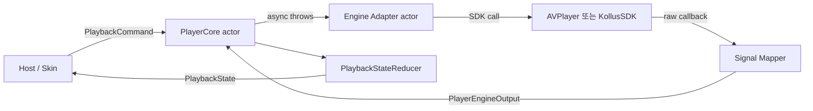

### Pseudo code: command 처리

```text
execute(command):
    negotiatedPolicy = policy ∩ engine.capabilities

    try await engine.execute(command)

    for output in engine.outputs:
        input = signalMapper.map(output)
        state = reducer.reduce(input, state)
        publish(state)
```

## 09. product 경계가 vendor 경계다

### Mermaid: SPM product dependency graph

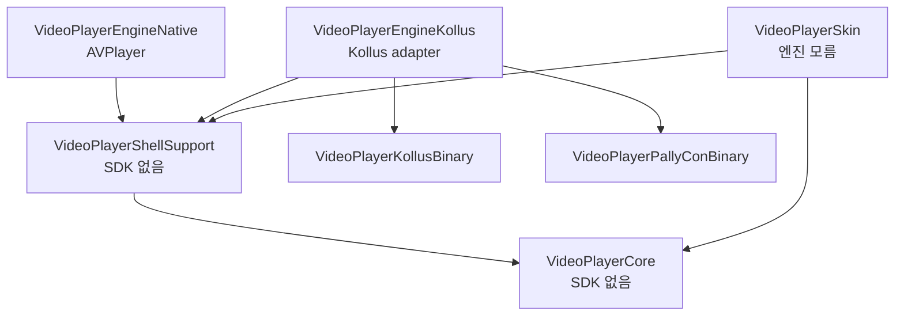

### Pseudo code: product 선택 효과

```text
if app imports VideoPlayerCore + VideoPlayerEngineNative:
    link AVFoundation path only
    skip Kollus/PallyCon binaries

if app imports VideoPlayerEngineKollus:
    link KollusSDK
    link PallyConFPSSDK as Kollus dependency
```

## 10. 상태 전이는 SDK 밖에서 검증한다

### Swift: reducer 표면

```swift
public enum PlaybackStateInput: Sendable {
    case prepared(snapshot: PlaybackSnapshot)
    case playStarted
    case pauseStarted
    case bufferingChanged(Bool)
    case positionChanged(time: TimeInterval, duration: TimeInterval)
    case seeking(time: TimeInterval)
    case stopped(reason: PlayerStopReason)
    case failed(PlayerError)
}

public func reduce(
    _ input: PlaybackStateInput,
    from state: PlaybackState
) -> (next: PlaybackState, events: [PlayerEvent])
```

### Pseudo code: terminal 상태 보호

```text
reduce(input, state):
    if state.status is terminal:
        if input is bufferingChanged or positionChanged:
            return state  # 늦은 SDK 신호가 finished/failed를 되살리지 못함

    next = transition(state, input)
    events = deriveEvents(state, next)
    return (next, events)
```

### Mermaid: SDK callback에서 state까지

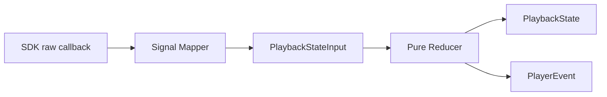

## 11. capability로 기능을 사전 게이트한다

### Mermaid: capability gate

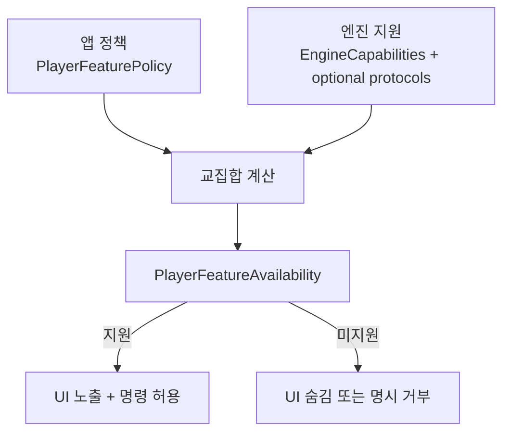

### Pseudo code: 기능 가용성 판단

```text
availability(feature):
    if appPolicy.disables(feature):
        return disabledByPolicy

    if engineCapabilities.missing(feature):
        return unavailable(reason: missingEngineCapability)

    if engine does not conform to requiredProtocol(feature):
        return unavailable(reason: unsupportedCommand)

    return available
```

### Swift 예시: 명령 거부 표면

```swift
guard engineAvailability.supports(.playbackRate) else {
    throw PlayerError.engineError(
        code: "unsupported_playback_rate",
        message: "현재 엔진은 배속 변경을 지원하지 않습니다."
    )
}

try await rateEngine.setPlaybackRate(rate)
```

## 12. 기존 문제는 이렇게 줄었다

### Mermaid: before/after

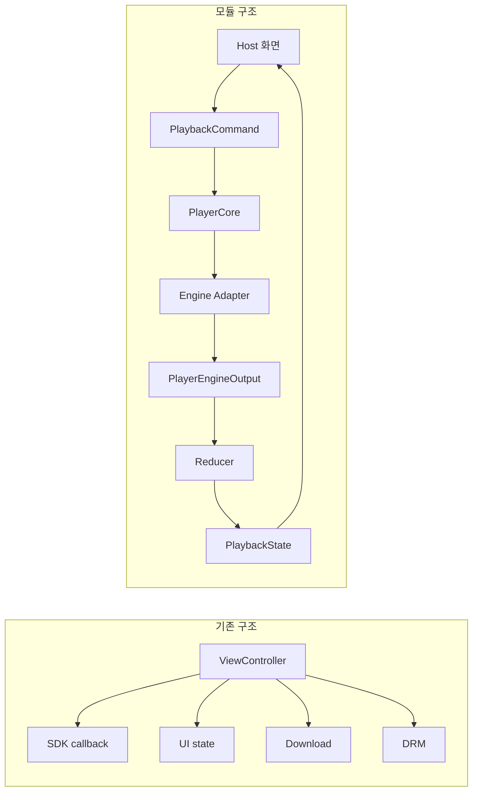

## 13. 현재 검증 상태

### Mermaid: verification pyramid

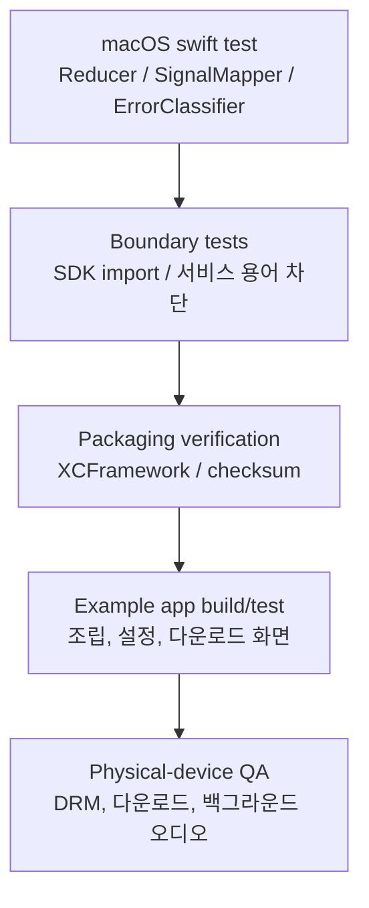

### Pseudo code: 발표 전 숫자 갱신 절차

```text
refreshPresentationMetrics():
    swiftTestResult = run("swift test")
    sourceFileCount = count("Sources/**/*.swift")
    productCount = parsePackageProducts("Package.swift")
    exampleStatus = runExampleBuildIfNeeded()

    updateSlide13(swiftTestResult, sourceFileCount, productCount, exampleStatus)
```

## 14. AVPlayer 사용 예

### Swift: Native engine 조립

```swift
let module = await PlayerModuleWiring.makeModule(
    engine: AVPlayerAdapter(),
    engineCapabilities: AVPlayerAdapter.capabilities
)

let stateTask = Task {
    for await state in module.core.stateStream {
        render(state)
    }
}

try await module.core.start(
    source: .url(videoURL),
    policy: .default
)
try await module.core.execute(command: .play)
```

### Pseudo code: host 관점

```text
host:
    create native module
    subscribe state stream
    send start/play commands
    render returned state

host does not:
    parse HLS
    inspect AVPlayer internals
    own playback state transitions
```

## 15. Kollus 사용 예

### Swift: Kollus engine 조립

```swift
let environment = KollusEnvironment(
    applicationKey: applicationKey,
    applicationBundleID: bundleID,
    applicationExpireDate: expireDate,
    storagePath: storagePath,
    drm: drmConfiguration
)
try environment.validate()

let factory = KollusPlayerModuleFactory(environment: environment)
let module = await factory.makeModule()

try await module.core.start(
    source: .mediaKey(mediaContentKey),
    policy: .default
)
try await module.core.execute(command: .play)
```

### Mermaid: 같은 Core, 다른 engine

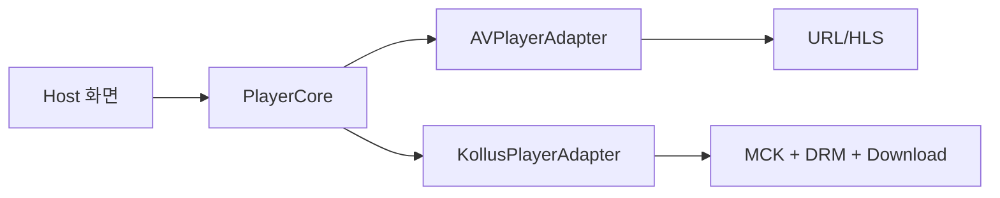

## 16. Skin은 엔진을 모른다

### Inline SVG: Skin slot layout

<svg width="960" height="460" viewBox="0 0 960 460" xmlns="http://www.w3.org/2000/svg" role="img" aria-label="PlayerSkin 슬롯 구조">
  <rect width="960" height="460" fill="#fafafa"/>
  <rect x="130" y="50" width="700" height="360" rx="16" fill="#111" stroke="#333"/>
  <rect x="170" y="82" width="620" height="48" rx="8" fill="#222"/>
  <text x="190" y="113" font-family="Arial" font-size="18" fill="#fff">top slot: title / live / close</text>
  <rect x="170" y="155" width="620" height="135" rx="8" fill="#1d1d1d"/>
  <text x="380" y="228" font-family="Arial" font-size="22" fill="#fff">center overlay slot</text>
  <rect x="170" y="315" width="620" height="24" rx="6" fill="#0070f3"/>
  <text x="190" y="333" font-family="Arial" font-size="13" fill="#fff">progress slot</text>
  <rect x="170" y="355" width="620" height="40" rx="8" fill="#222"/>
  <text x="190" y="381" font-family="Arial" font-size="18" fill="#fff">bottom controls slot</text>
  <text x="130" y="435" font-family="Arial" font-size="16" fill="#4d4d4d">Skin은 PlayerSkinAction / PlayerSkinState만 알고, engine 타입은 모릅니다.</text>
</svg>

### Swift: blueprint 조립

```swift
let blueprint = PlayerSkinBlueprint(
    blocks: [
        .topCenter: [{ TitleBlock() }],
        .centerControls: [{ CenterPlaybackControlsBlock() }],
        .bottomBar: [{ ProgressBarBlock() }],
        .floatingBottomTrailing: [{ ExtraFloatingBlock() }]
    ],
    visibleSlots: [
        .fullScreen: [.topCenter, .centerControls, .bottomBar, .floatingBottomTrailing]
    ]
)

let skin = AssembledPlayerSkin(
    blueprint: blueprint,
    theme: serviceTheme
)
```

## 17. 라이브 데모

### Mermaid: 데모가 증명하는 것

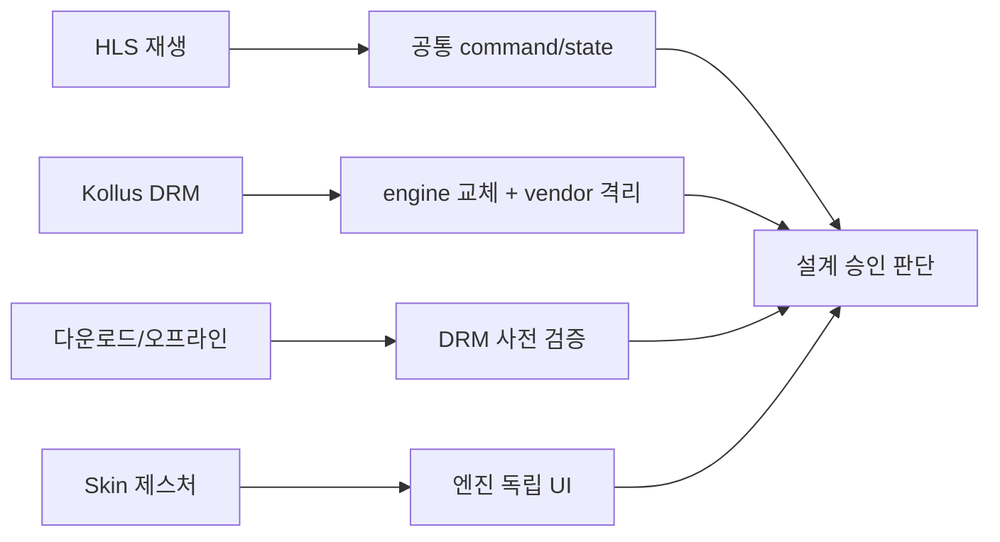

### Pseudo code: 데모 진행 루틴

```text
runDemo():
    showHLSPlayback()
    inspectStateStream()

    switchEngineToKollus()
    showDRMPlaybackOnDevice()

    showDownloadProgress()
    enableOfflineCondition()
    showPrePlaybackLicenseValidation()

    showSkinGestures()
```

## 18. 품질 가드와 남은 한계

### Mermaid: 자동화와 실기기 검증 분리

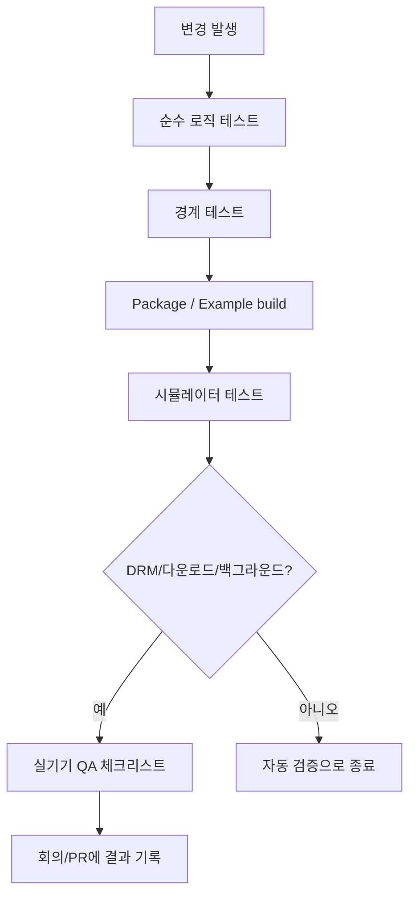

## 19. 결정 요청

### Pseudo code: 회의 결정 규칙

```text
if team approves architecture:
    lock module boundary as team standard
else:
    capture blocking concern
    revise boundary before pilot

for each policyDecision:
    accept recommended default
    or assign owner and deadline for alternative

if pilot scope approved:
    enable feature flag path in one host screen
    define rollback condition before implementation
```

### Mermaid: 결정 항목 관계

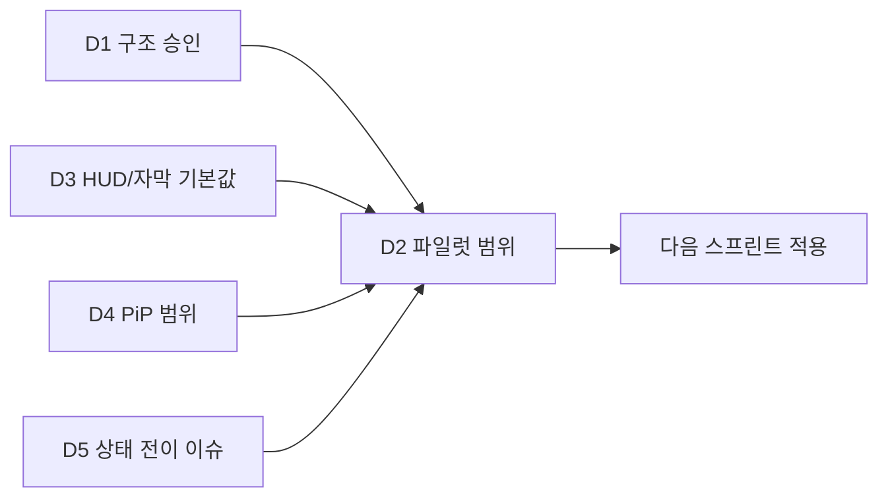

## 20. 파일럿 제안과 마무리

### Mermaid: 되돌릴 수 있는 적용 계획

```mermaid
gantt
    title 파일럿 적용 계획
    dateFormat  YYYY-MM-DD
    axisFormat  %m/%d
    section 준비
    구조 승인과 정책 확정       :done, 2026-06-12, 1d
    metric/API 재검증            :2026-06-13, 2d
    section 파일럿
    host 1개 화면 feature flag 적용 :2026-06-15, 3d
    실기기 QA                     :2026-06-18, 2d
    section 리뷰
    결과 리뷰와 확대 여부 결정     :2026-06-20, 1d
```

### Pseudo code: rollback 조건

```text
pilotRollbackCondition:
    if DRM playback fails on target device:
        disable feature flag
    if download/offline validation regresses:
        disable feature flag
    if state stream diverges from existing UX:
        keep old player path and file issue
```
