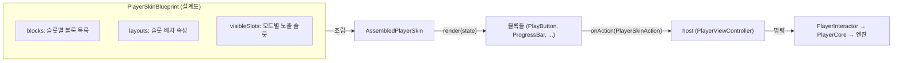
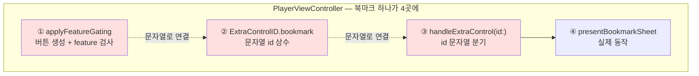
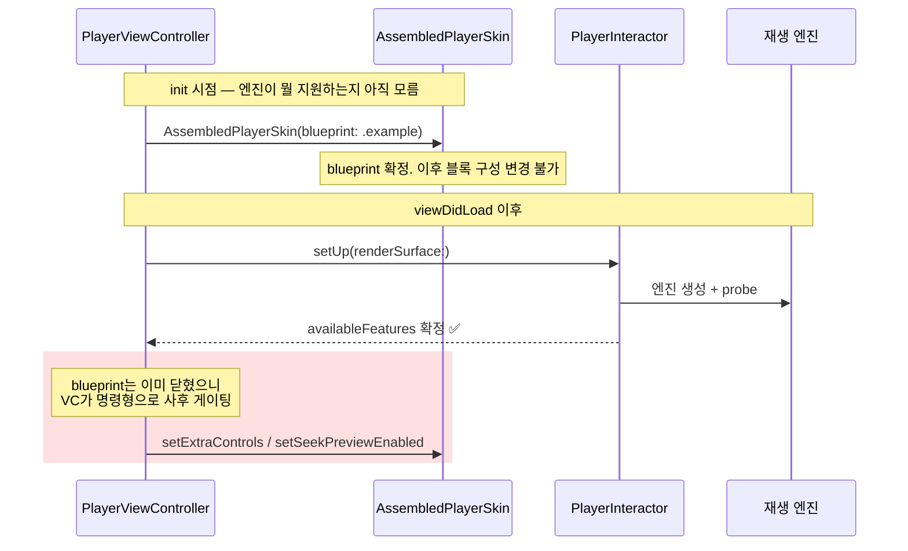
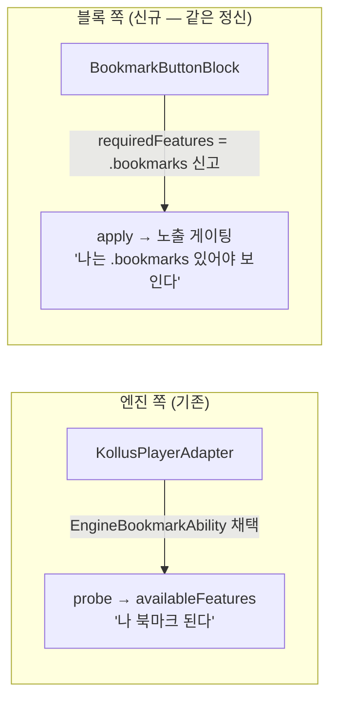
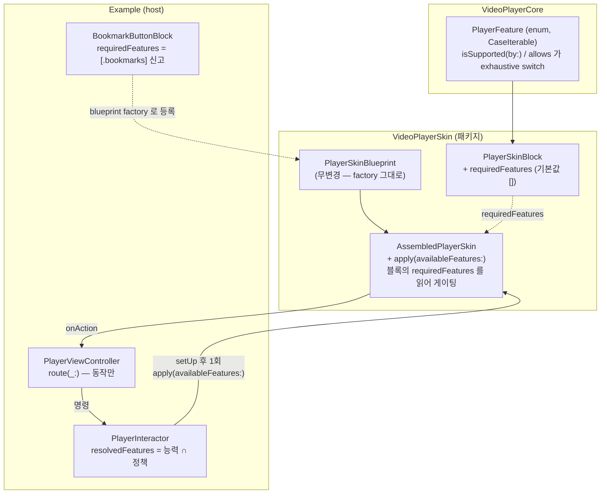
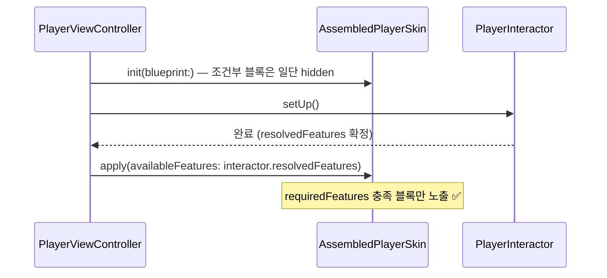
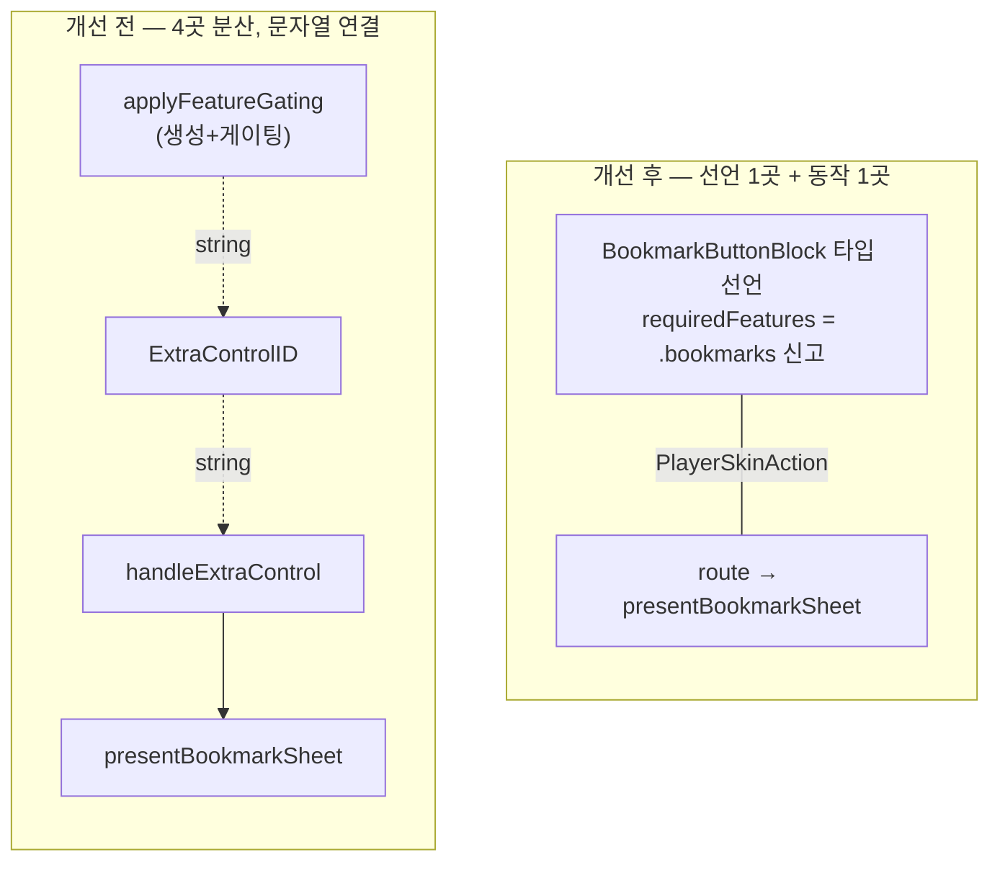

# Skin Feature Gating 구조 개선안

> 작성: JunyoungJung, 2026-06-11
>
> "엔진이 지원하는 기능에 따라 플레이어 버튼을 보여주거나 숨기는 코드"가
> 왜 지금 `PlayerViewController`에 흩어져 있는지, 그리고 어떻게 정리할 수 있는지를
> 처음 보는 사람도 따라올 수 있게 순서대로 설명한다.

---

## 1. 먼저, 지금 구조부터 이해하자

이 패키지의 플레이어 UI는 **블록(block) 조립식**이다.
버튼 하나하나가 `PlayerSkinBlock`이고, 어떤 블록을 어느 슬롯(slot)에 끼울지는
`PlayerSkinBlueprint`라는 설계도가 결정한다.



여기서 중요한 설계 원칙 두 가지:

1. **블록은 멍청하다(dumb).** 블록은 상태(`PlayerSkinState`)를 받아 그리고,
   사용자가 누르면 액션(`PlayerSkinAction`)을 방출할 뿐이다.
   "북마크 시트를 띄운다" 같은 실제 동작은 host(`PlayerViewController`)의
   `route(_:)` 한 곳에서 처리한다.
2. **Blueprint는 선언이다.** "무엇을 / 어디에 / 어느 화면 모드에" 보여줄지를
   코드 한 곳에 모아 선언한다. 스킨 구성이 궁금하면 blueprint만 보면 된다.

여기까지는 깔끔하다. 문제는 다음 등장인물부터다.

### PlayerFeatureAvailability — 엔진마다 되는 기능이 다르다

이 모듈은 재생 엔진을 갈아끼울 수 있다(AVPlayer / Kollus).
그런데 엔진마다 지원 기능이 다르다. 예를 들어 북마크는 Kollus 엔진만 지원한다.

그래서 `PlayerFeatureAvailability`라는 OptionSet이 있다.
엔진이 어떤 `Engine*Ability` 프로토콜을 채택했는지 조사(probe)해서
"이 엔진은 실제로 뭘 할 수 있는가"를 집합으로 만든다.

```swift
// Sources/VideoPlayerCore/Domain/PlayerFeatureAvailability.swift
static func probe(_ engine: any PlayerPlaybackEngine) -> PlayerFeatureAvailability {
    var features: PlayerFeatureAvailability = []
    if engine is any EngineBookmarkAbility { features.insert(.bookmarks) }
    if engine is any EngineSeekPreviewAbility { features.insert(.seekPreview) }
    // ...
    return features
}
```

UI는 이 값을 보고 "엔진이 지원 안 하는 기능의 버튼은 아예 숨긴다".
런타임에 명령이 실패하길 기다리는 대신 진입점을 사전에 막는 전략이다. 좋은 전략이다.

문제는 **이 값을 누가, 언제, 어떻게 UI에 반영하느냐**다.

---

## 2. 지금 무엇이 이상한가

현재 `PlayerViewController`에는 이런 코드가 있다.

```swift
// Example/Sources/Player/PlayerViewController.swift
private func applyFeatureGating(_ features: PlayerFeatureAvailability) {
    var extraControls: [ExtraControl] = []
    if features.contains(.bookmarks) {
        extraControls.append(
            ExtraControl(id: ExtraControlID.bookmark, iconName: "bookmark",
                         title: "북마크", placement: .topMenu)
        )
    }
    let seekPreviewEnabled = features.contains(.seekPreview)
        && interactor.featurePolicy.allowsSeekPreview
    if seekPreviewEnabled {
        skin.seekPreviewImageProvider = { [weak self] time in
            await self?.interactor.seekPreviewImage(at: time)
        }
    }
    skin.setSeekPreviewEnabled(seekPreviewEnabled)
    skin.setExtraControls(extraControls)
}
```

"blueprint로 블록을 선언적으로 조립한다"고 해놓고,
정작 북마크 버튼은 ViewController가 명령형으로 만들어 끼운다.
직감적으로 이상하다고 느꼈다면 정확하다. 원인은 세 가지다.

### 문제 1 — 버튼 주입 통로가 2개다

같은 목적("스킨에 버튼을 넣는다")에 메커니즘이 두 벌 존재한다.

| | Blueprint 슬롯 | ExtraControl 채널 |
|---|---|---|
| 주입 시점 | 조립 시점 (init) | 런타임 (`setExtraControls`) |
| 식별 방식 | 타입 (블록 클래스) | 문자열 id |
| 액션 | 고유 `PlayerSkinAction` case | `.extraControlTapped(id:)` 공용 case |
| 선언 위치 | blueprint 한 곳 | VC 여기저기 |

북마크는 ExtraControl 채널을 타기 때문에, **한 기능이 4곳에 분산**된다.



새 feature 버튼을 추가하려면 4곳을 고쳐야 하고,
연결 고리가 문자열이라 하나를 빼먹어도 **컴파일러가 잡아주지 못한다**.

### 문제 2 — 시점 불일치 (근본 원인)

왜 blueprint에 못 넣었을까? **시점이 어긋나기 때문이다.**



blueprint는 init 시점에 닫히는데, `availableFeatures`는 `setUp()` 후에야 확정된다.
blueprint가 "어느 feature일 때 노출"을 표현할 방법이 없으니
VC가 뒤늦게 명령형 코드로 메꾸는 것이다.

생각해보면 blueprint는 이미 "어느 **layout 모드**일 때 노출"(`visibleSlots`)은
선언으로 표현한다. "어느 **feature**일 때 노출"도 똑같은 차원의 정보인데,
이 한 조각만 blueprint 밖에 있다.

### 문제 3 — 결정 로직이 view 레이어에 있다

```swift
let seekPreviewEnabled = features.contains(.seekPreview)
    && interactor.featurePolicy.allowsSeekPreview
```

시크 프리뷰 노출은 두 값의 교집합이다:

- `availableFeatures` — 엔진이 **할 수 있는가** (능력)
- `featurePolicy` — 앱이 **허용하는가** (정책)

이 교집합 계산을 VC가 직접 한다. 둘 다 Interactor가 들고 있는 값인데,
조합 책임만 view에 새어 나왔다. 화면이 늘어나면 같은 계산이 복붙된다.

### 문제 4 — 새 feature 추가가 "절차적 기억"에 의존한다

`PlayerFeatureAvailability`가 OptionSet이라서, 새 feature를 추가하는 개발자는
이걸 전부 **기억**해야 한다:

1. bit 번호를 기존과 안 겹치게 수동 채번 (`1 << 12`)
2. `probe()`의 if 체인에 검사 한 줄 추가
3. 정책 게이팅이 필요하면 교집합 계산 위치를 찾아 수동 반영

하나라도 깜빡하면? **컴파일은 통과하고, 기능이 조용히 사라진다.**
probe에 검사를 빼먹으면 엔진이 ability를 채택해도 버튼이 안 뜨고,
아무 에러도 없다. 체크리스트가 사람 머리에만 존재하는 구조 —
유지보수 인지 부담의 진짜 근원이 여기다.

---

## 3. 개선안 — 한 문장 요약

> **feature 식별자를 OptionSet에서 enum으로 바꿔 "갱신 지점 안내"를 컴파일러에 맡기고,
> "어느 feature일 때 노출"은 블록 자신이 `requiredFeatures`로 신고하고
> (`PlayerSkinBlock` 계약의 일부, 기본값 `[]`),
> 능력∩정책 계산은 Interactor로 옮긴다.
> VC에는 동작(route)만 남긴다.**

핵심 아이디어는 엔진 쪽과 **대칭**이다.



엔진이 `EngineBookmarkAbility`를 채택하는 것만으로 능력을 신고하듯(§1의 probe),
블록은 `requiredFeatures` 프로퍼티를 선언하는 것만으로 필요 feature를 신고한다.
"신고만 하면 협상은 시스템이 한다"는 정신이 계약의 양 끝에서 반복되니
새로 배울 개념이 없다.

엔진은 기능마다 **메서드 묶음**이 있어 프로토콜을 분리하지만(`Engine*Ability`),
블록의 노출 조건은 **데이터 한 개** — 별도 marker 프로토콜 대신
`PlayerSkinBlock` 계약에 기본값 `[]`로 넣는 게 Swift 관용구상 맞다.
기본 구현이 있으니 기존 블록 19종은 무수정.

이 방식이면 **blueprint API는 한 글자도 안 바뀐다** — 조건이 등록 지점이 아니라
블록 타입 자체에 붙기 때문이다. 북마크 버튼이 `.bookmarks`를 필요로 하는 건
어느 슬롯에 놓이든 변하지 않는 블록 고유 속성이다. 배치 정보가 아니라 타입 정보 —
그러니 조건이 블록 파일에 있는 게 맞는 자리다.

블록이 동작을 직접 연결하지 못하는 것 자체는 고치지 않는다.
그건 의도된 설계다 — 블록은 액션만 방출하고 host `route(_:)`가 단일 명령 통로를
유지해야 스킨이 재사용 가능하다. 고칠 것은 동작이 아니라 **노출 조건의 선언 위치**다.

### 개선 후 전체 그림



책임이 이렇게 나뉜다:

| 질문 | 담당 | 어디 |
|---|---|---|
| 어떤 버튼이 존재하나? | Blueprint | 선언 (`blocks`) |
| 어디에 놓이나? | Blueprint | 선언 (slot) |
| 어느 화면 모드에 보이나? | Blueprint | 선언 (`visibleSlots`) |
| **어느 feature일 때 보이나?** | **블록 타입** | **`requiredFeatures` 신고 ← 신규** |
| 엔진 능력 ∩ 앱 정책 계산 | Interactor | `resolvedFeatures` ← 신규 |
| 버튼 누르면 뭘 하나? | ViewController | `route(_:)` (기존 유지) |
| **새 feature 추가 시 갱신 지점 안내** | **컴파일러** | **exhaustive switch ← 신규** |

---

## 4. 단계별 설계

### 4-1. `PlayerFeature` enum — 기반 타입 교체 (패키지, Core)

§2 문제 4의 해법. OptionSet을 enum + `Set`으로 바꾸면 "사람이 기억하던
체크리스트"가 컴파일 에러로 바뀐다.

```swift
// Sources/VideoPlayerCore/Domain/PlayerFeature.swift  (PlayerFeatureAvailability.swift 대체)

/// 엔진이 제공할 수 있는 부가 기능의 식별자.
/// 새 기능 추가 시 case 만 추가하면 — isSupported(by:) / PlayerFeaturePolicy.allows(_:) 의
/// exhaustive switch 가 컴파일 에러로 갱신 지점을 전부 안내한다.
public enum PlayerFeature: CaseIterable, Sendable, Hashable {
    case playbackRate, subtitles, externalSubtitles
    case bookmarks, titledBookmarks
    case zoom, scroll
    case adaptiveStreaming, pictureInPicture
    case displayScaling, displayLock, seekPreview
}

public extension PlayerFeature {
    /// 엔진의 ability 채택 여부 — default 없는 switch 라 case 누락이 컴파일 에러.
    func isSupported(by engine: any PlayerPlaybackEngine) -> Bool {
        switch self {
        case .playbackRate:      return engine is any EnginePlaybackRateAbility
        case .subtitles:         return engine is any EngineSubtitleAbility
        case .externalSubtitles: return engine is any EngineExternalSubtitleAbility
        case .bookmarks:         return engine is any EngineBookmarkAbility
        case .titledBookmarks:   return engine is any EngineTitledBookmarkAbility
        case .scroll:            return engine is any EngineScrollAbility
        case .adaptiveStreaming: return engine is any EngineAdaptiveStreamingAbility
        case .pictureInPicture:  return engine is any EnginePiPAbility
        case .displayScaling:    return engine is any EngineDisplayScalingAbility
        case .displayLock:       return engine is any EngineDisplayLockAbility
        case .zoom:
            #if canImport(UIKit)
            return engine is any EngineZoomAbility
            #else
            return false
            #endif
        case .seekPreview:
            #if canImport(UIKit)
            return engine is any EngineSeekPreviewAbility
            #else
            return false
            #endif
        }
    }

    /// 기존 probe() 대체 — 전체 case 순회라 누락 자체가 불가능.
    static func available(for engine: any PlayerPlaybackEngine) -> Set<PlayerFeature> {
        Set(allCases.filter { $0.isSupported(by: engine) })
    }
}
```

정책 게이팅도 같은 패턴 — `default` 금지가 규칙:

```swift
// Sources/VideoPlayerCore/Domain/PlayerFeaturePolicy.swift 에 추가

public extension PlayerFeaturePolicy {
    /// 새 feature 추가 시 "정책 판단을 했는가"도 컴파일러가 묻는다.
    func allows(_ feature: PlayerFeature) -> Bool {
        switch feature {
        case .seekPreview:
            return allowsSeekPreview
        case .playbackRate, .subtitles, .externalSubtitles, .bookmarks,
             .titledBookmarks, .zoom, .scroll, .adaptiveStreaming,
             .pictureInPicture, .displayScaling, .displayLock:
            return true   // 정책 제한 없는 기능 — 명시적 나열이라 누락 불가
        }
    }
}
```

이 교체로 사라지는 것:

| OptionSet 시절 | enum 이후 |
|---|---|
| bit 수동 채번 (`1 << 12`) | case 추가만 |
| `probe()` if 체인 + 깜빡 위험 | exhaustive switch — 컴파일 에러가 안내 |
| `.all` 수동 유지 | `allCases` 공짜 |
| probe 누락 감지용 canary 테스트 | 불필요 — 컴파일러가 대신함 |

`Set<PlayerFeature>`는 `contains`/`insert`/`isSuperset(of:)`가 OptionSet과
동명 API라 기존 호출부 대부분 타입명 교체만으로 이행된다.
사용처는 Core/ShellSupport/Example 9파일 + 테스트.
네이밍 규약대로 deprecated 별칭 없이 클린 교체.

### 4-2. `PlayerSkinBlock.requiredFeatures` — 블록이 필요 feature를 신고 (패키지)

기존 계약에 프로퍼티 하나 + 기본값이 변경의 전부다. `VideoPlayerSkin`은 이미
`VideoPlayerCore`에 의존하므로 `PlayerFeature`를 그대로 쓴다.

```swift
// Sources/VideoPlayerSkin/Assembly/PlayerSkinBlock.swift  (변경 후)

import UIKit
import VideoPlayerCore

/// 슬롯에 끼우는 컨트롤 단위. 상태 반영 + 액션 방출.
@MainActor
public protocol PlayerSkinBlock: AnyObject {
    var view: UIView { get }
    var onAction: ((PlayerSkinAction) -> Void)? { get set }
    /// 이 블록 노출에 필요한 feature 집합. 전부 충족해야 노출된다.
    /// 기본값 [] = 조건 없음 — apply(availableFeatures:) 게이팅 대상에서 제외.
    ///
    /// 계약:
    /// - 조립 후 값이 변하지 않아야 한다 (`let` 구현 권장) —
    ///   apply 는 호출 시점 값으로 게이팅하므로 런타임에 변하면 조용히 어긋난다.
    /// - 빈 집합이 아닌 값을 신고한 블록은 view.isHidden 을 직접 제어하지 않는다 —
    ///   소유권이 skin(apply)에 있다. 자체 가시성 연출이 필요하면 alpha 나 내부 subview 로.
    var requiredFeatures: Set<PlayerFeature> { get }
    func render(_ state: PlayerSkinState, theme: PlayerSkinTheme)
}

public extension PlayerSkinBlock {
    /// 대부분의 블록은 feature 무관 — 조건 있는 블록만 override 한다.
    var requiredFeatures: Set<PlayerFeature> { [] }
}
```

doc comment의 "계약" 두 줄은 장식이 아니다 — 구현체를 바꿔 끼워도 호출자
(skin)가 기대한 행위가 유지되게 하는 치환 조건(LSP)이다.

| | `requiredFeatures == []` (기본) | 신고한 블록 |
|---|---|---|
| `view.isHidden` 주인 | 블록 자신 (예: `LiveBadgeBlock`이 render에서 제어) | **skin** (`apply`) |
| 값 변경 | — | 금지 — 조립 후 불변 (`let`) |

이 표가 갈리는 지점을 doc comment로 못 박지 않으면, 조건 블록이 `render`에서
`isHidden`을 만지는 순간 `apply`와 경합한다 — 같은 protocol 구현체인데
행위 계약이 암묵적으로 갈리는 건 치환 사고의 단골 원인이다.

기본 구현이 있으니 **기존 블록 19종은 무수정** — 소스 호환.
**`PlayerSkinBlueprint`도 무변경.** `blocks: [PlayerSkinSlot: [PlayerSkinBlockFactory]]`
그대로다. 조건은 등록 지점이 아니라 블록 타입에 붙는다.

왜 blueprint 메타데이터도, 별도 marker 프로토콜도 아닌 계약 통합인가:

| | entry 메타데이터 | 분리 프로토콜 | **계약 통합 (채택)** |
|---|---|---|---|
| 조건 위치 | 등록 지점 (blueprint) | 블록 타입 | 블록 타입 |
| 등록 시 누락 | 가능 — 조건 안 넘기면 그대로 노출 | 불가능 | 불가능 |
| blueprint public API | `blocks` 타입 변경 (breaking) | 무변경 | 무변경 |
| 읽기 방식 | entry 조회 | `as?` 캐스팅 | **직접 읽기** |
| 빈 집합 엣지 케이스 | — | 채택+`[]` 신고 시 이상 동작 | **없음 — `[]` = 조건 없음** |

북마크 버튼이 `.bookmarks`를 요구하는 건 배치와 무관한 타입 고유 속성 —
blueprint를 백 번 다시 짜도 변하지 않는다. 조건의 주인은 블록이다.
그리고 조건이 데이터 한 개뿐이니 marker 프로토콜을 따로 둘 이유도 없다 —
엔진 `Engine*Ability`가 프로토콜 분리인 건 기능마다 메서드 묶음이 있어서다.

### 4-3. `apply(availableFeatures:)` — 시점 불일치 해소 (패키지)

"blueprint는 init에 닫히는데 feature는 setUp 후 확정" 문제는
스킨에 **사후 적용 통로** 하나를 열어 해결한다.

수정 지점은 두 곳. 먼저 `assembleBlocks()` — 조립 시 조건 있는 블록의
초기 상태를 hidden으로 둔다. 기존 루프에 두 줄 추가가 전부다.

```swift
// Sources/VideoPlayerSkin/Assembly/AssembledPlayerSkin.swift

private func assembleBlocks() {
    for slot in PlayerSkinSlot.allCases {
        guard let container = slotContainers[slot],
              let makers = blueprint.blocks[slot] else { continue }
        for make in makers {
            let block = make()
            block.onAction = { [weak self] action in
                self?.interceptForSeekPreview(action)
                self?.onAction?(action)
            }
            container.addArrangedSubview(block.view)
            blocks.append(block)
            // apply(availableFeatures:) 호출 전까지는 숨김 —
            // 엔진 확정 전에 미지원 버튼이 잠깐 보였다 사라지는 깜빡임을 막는다.
            if block.requiredFeatures.isEmpty == false {
                block.view.isHidden = true
            }
        }
    }
    // ProgressBarBlock 의 onScrubTick 연결은 기존 그대로
}
```

다음으로 public 적용 메서드. 캐스팅도 별도 수집 배열도 없이
`block.requiredFeatures`를 직접 읽으면 된다.
시킹 프리뷰는 블록이 아니라 skin 내장 `seekPreviewPresenter`이므로
같은 통로에서 함께 게이팅한다 — host가 `setSeekPreviewEnabled`를
따로 부를 필요가 없어진다.

```swift
/// setUp 완료 후 host 가 1회 호출 — requiredFeatures 미충족 블록을 숨긴다.
/// UIStackView 는 hidden 인 arrangedSubview 를 배치에서 제외하므로 빈자리 없이 당겨진다.
public func apply(availableFeatures: Set<PlayerFeature>) {
    // 조건 없는 블록(기본값 [])은 건드리지 않는다 — LiveBadgeBlock 처럼
    // 자기 view 의 isHidden 을 render 에서 직접 제어하는 블록과 충돌하기 때문.
    for block in blocks where block.requiredFeatures.isEmpty == false {
        block.view.isHidden = availableFeatures.isSuperset(of: block.requiredFeatures) == false
    }
    // 시킹 프리뷰는 블록이 아닌 내장 presenter — 같은 feature 통로로 함께 게이팅.
    setSeekPreviewEnabled(availableFeatures.contains(.seekPreview))
    forceRender(latestState)
}
```



### 4-4. `resolvedFeatures` — 능력∩정책을 Interactor로 (Example)

Interactor는 이미 두 값을 모두 들고 있다. §4-1의 `allows(_:)` 덕에
교집합이 feature별 분기 없는 일반식이 된다.

```swift
// Example/Sources/Player/PlayerInteractor.swift

final class PlayerInteractor {
    let featurePolicy: PlayerFeaturePolicy                      // init 에서 확정 (기존)
    private(set) var availableFeatures: Set<PlayerFeature> = [] // setUp 에서 확정

    /// 엔진 가용성 ∩ 앱 정책 — UI 노출 결정은 이 값 하나만 본다.
    /// 정책으로 꺼진 기능은 엔진이 지원해도 노출 대상에서 제거된다.
    var resolvedFeatures: Set<PlayerFeature> {
        availableFeatures.filter { featurePolicy.allows($0) }
    }

    func setUp(renderSurface: PlayerRenderSurfaceView) async throws {
        // ... 모듈 생성 (기존) ...
        availableFeatures = module.availableFeatures   // 이 시점에 확정
        // ...
    }
}
```

VC는 더 이상 `&&` 계산을 하지 않는다. 값 하나 받아 전달만 한다.
새 정책 게이팅이 생겨도 이 식은 안 바뀐다 — `PlayerFeaturePolicy.allows(_:)`의
exhaustive switch가 컴파일 에러로 판단을 강제하고, 여기는 일반식이라 무수정.

### 4-5. 북마크 → 커스텀 블록 (Example)

이미 Example에 선례가 있다 — `LiveBadgeBlock`. 같은 패턴으로 만든다.
주의: 패키지 내부 블록들이 쓰는 `PlayerSkinIconButtonFactory`는 internal이라
Example에서 못 쓴다 — `LiveBadgeBlock`처럼 일반 UIKit 컴포넌트로 만든다.

```swift
//
//  BookmarkButtonBlock.swift
//  VideoPlayerExample
//
//  북마크 버튼 — requiredFeatures 신고로 .bookmarks 지원 엔진에서만
//  노출된다. 동작은 host route(_:) 가 처리.
//

import UIKit
import VideoPlayerCore
import VideoPlayerSkin

@MainActor
final class BookmarkButtonBlock: PlayerSkinBlock {
    /// route(_:) 분기용 식별자 — 문자열 상수가 블록과 한 몸이라 분산되지 않는다.
    static let actionID = "bookmark"

    /// 기본값 [] override — 노출 조건이 blueprint 등록부와 무관하게 타입에 붙어 다닌다.
    let requiredFeatures: Set<PlayerFeature> = [.bookmarks]

    private let button = UIButton(type: .system)

    var view: UIView { button }
    var onAction: ((PlayerSkinAction) -> Void)?

    init() {
        button.setImage(UIImage(systemName: "bookmark"), for: .normal)
        button.tintColor = .white
        button.accessibilityLabel = "북마크"
        NSLayoutConstraint.activate([
            button.widthAnchor.constraint(equalToConstant: 44),
            button.heightAnchor.constraint(equalToConstant: 44)
        ])
        button.addAction(UIAction { [weak self] _ in
            self?.onAction?(.extraControlTapped(id: Self.actionID))
        }, for: .touchUpInside)
    }

    func render(_ state: PlayerSkinState, theme: PlayerSkinTheme) {
        // topTrailing 슬롯은 잠금 중에도 보이는 슬롯 — 버튼만 비활성 처리.
        button.isEnabled = state.isLocked == false
    }
}
```

blueprint 선언은 기존 문법 그대로 — factory 클로저 한 줄 추가가 전부:

```swift
//
//  PlayerSkinBlueprint+Example.swift  (변경 후 전체)
//

import VideoPlayerSkin

extension PlayerSkinBlueprint {
    @MainActor
    static var example: PlayerSkinBlueprint {
        var blueprint = PlayerSkinBlueprint.default
        // 라이브 배지 — topCenter 슬롯(제목 옆)에 추가.
        blueprint.blocks[.topCenter, default: []].append { LiveBadgeBlock() }
        // 북마크 — 노출 조건은 블록 타입이 requiredFeatures 로 신고.
        blueprint.blocks[.topTrailing, default: []].insert({ BookmarkButtonBlock() }, at: 0)
        return blueprint
    }
}
```

VC 변화를 전후로 비교하면:

```swift
// ── 개선 전 (현재 PlayerViewController) ──────────────────────────

// viewDidLoad 의 setUp 체인
try await self.interactor.setUp(renderSurface: self.renderSurfaceView)
self.applyFeatureGating(self.interactor.availableFeatures)   // 명령형 게이팅
try await self.interactor.start()

// + applyFeatureGating(_:) 18줄        ← 삭제 대상
// + private enum ExtraControlID        ← 삭제 대상
// + handleExtraControl 의 문자열 분기   ← BookmarkButtonBlock.actionID 로 대체
```

```swift
// ── 개선 후 ──────────────────────────────────────────────────────

// viewDidLoad 의 setUp 체인
try await self.interactor.setUp(renderSurface: self.renderSurfaceView)
// 게이팅은 선언(blueprint)이 알고, 여기선 확정된 feature 를 전달만 한다.
self.skin.apply(availableFeatures: self.interactor.resolvedFeatures)
try await self.interactor.start()
```

`seekPreviewImageProvider` 연결은 조건 없이 viewDidLoad에서 해도 된다:

```swift
// 노출 여부는 skin 이 apply(availableFeatures:) 로 결정 —
// provider 연결 자체는 무조건 해도 안전하다 (interactor 가 정책 가드 보유).
skin.seekPreviewImageProvider = { [weak self] time in
    await self?.interactor.seekPreviewImage(at: time)
}
```

이중 안전망: `interactor.seekPreviewImage(at:)`는 내부에서
`featurePolicy.allowsSeekPreview` 가드를 이미 갖고 있고,
skin의 presenter는 feature 미충족이면 비활성 — provider가 연결돼 있어도 호출되지 않는다.

동작 연결은 기존 `route(_:)` 그대로, 식별자만 블록 상수로:

```swift
case .extraControlTapped(let id):
    handleExtraControl(id)

// ...

private func handleExtraControl(_ id: String) {
    guard id == BookmarkButtonBlock.actionID else { return }
    presentBookmarkSheet()
}
```

### 4-6. 게이팅 단위 테스트

블록 자리에 probe를 끼워 apply 전/후 가시성을 검증한다.
Swift Testing 사용, iOS 전용이므로 `#if canImport(UIKit)` 가드 필수 (CLAUDE.md 규칙).

```swift
// Tests/VideoPlayerModuleTests/Skin/PlayerSkinFeatureGatingTests.swift

#if canImport(UIKit)
import Testing
import UIKit
import VideoPlayerCore
@testable import VideoPlayerSkin

/// 조건 신고 probe — requiredFeatures 를 주입받아 override 한다.
@MainActor
private final class GatedProbeBlock: PlayerSkinBlock {
    let view = UIView()
    var onAction: ((PlayerSkinAction) -> Void)?
    let requiredFeatures: Set<PlayerFeature>

    init(requiredFeatures: Set<PlayerFeature>) {
        self.requiredFeatures = requiredFeatures
    }

    func render(_ state: PlayerSkinState, theme: PlayerSkinTheme) {}
}

/// 기본값 [] probe — override 안 함. 게이팅 대상이 아니어야 한다.
@MainActor
private final class PlainProbeBlock: PlayerSkinBlock {
    let view = UIView()
    var onAction: ((PlayerSkinAction) -> Void)?
    func render(_ state: PlayerSkinState, theme: PlayerSkinTheme) {}
}

@MainActor
struct PlayerSkinFeatureGatingTests {
    private func makeSkin(appending block: PlayerSkinBlock) -> AssembledPlayerSkin {
        var blueprint = PlayerSkinBlueprint.default
        blueprint.blocks[.topTrailing, default: []].append { block }
        return AssembledPlayerSkin(blueprint: blueprint)
    }

    @Test("조건 블록은 apply 호출 전까지 숨김 — 깜빡임 방지")
    func gatedBlockHiddenBeforeApply() {
        let probe = GatedProbeBlock(requiredFeatures: [.bookmarks])
        _ = makeSkin(appending: probe)
        #expect(probe.view.isHidden)
    }

    @Test("feature 충족 시 노출, 재호출로 미충족되면 다시 숨김")
    func applyTogglesVisibility() {
        let probe = GatedProbeBlock(requiredFeatures: [.bookmarks])
        let skin = makeSkin(appending: probe)

        skin.apply(availableFeatures: [.bookmarks, .playbackRate])
        #expect(probe.view.isHidden == false)

        skin.apply(availableFeatures: [.playbackRate])
        #expect(probe.view.isHidden)
    }

    @Test("복수 feature 조건은 전부 충족해야 노출")
    func multipleRequiredFeaturesNeedAll() {
        let probe = GatedProbeBlock(requiredFeatures: [.bookmarks, .titledBookmarks])
        let skin = makeSkin(appending: probe)

        skin.apply(availableFeatures: [.bookmarks])          // 부분 충족
        #expect(probe.view.isHidden)

        skin.apply(availableFeatures: [.bookmarks, .titledBookmarks])
        #expect(probe.view.isHidden == false)
    }

    @Test("기본값 [] 블록은 조립 직후부터 항상 노출 — apply 가 isHidden 을 만지지 않는다")
    func plainBlockUnaffected() {
        let probe = PlainProbeBlock()
        let skin = makeSkin(appending: probe)
        #expect(probe.view.isHidden == false)

        skin.apply(availableFeatures: [])
        #expect(probe.view.isHidden == false)
    }
}
#endif
```

마지막 테스트가 지키는 불변식이 중요하다: 조건 없는 블록의 `isHidden`은
apply가 절대 건드리지 않는다 — `LiveBadgeBlock`처럼 자기 view의 `isHidden`을
`render`에서 직접 제어하는 블록과 충돌하지 않기 위한 가드다 (§4-3의 `where` 절).

### 개선 전후 비교



---

## 5. ExtraControl 채널은 없애나?

**아니다. 역할을 재정의한다.**

- **Blueprint 블록** — 컴파일 타임에 아는 feature 기반 버튼 (북마크, 시크 프리뷰 등).
  타입으로 선언, feature 조건 포함.
- **ExtraControl 채널** — 컴파일 타임에 모르는 **동적 버튼**.
  예: LMS가 내려주는 "다음 강의" / "인덱스" 버튼처럼 런타임 데이터로 결정되는 것.

지금은 두 통로가 같은 일에 겹쳐 쓰여 혼란인데,
경계를 이렇게 그으면 각자 존재 이유가 분명해진다. `PlayerSkin.setExtraControls`
doc comment에 이 경계를 명시한다.

---

## 6. 검토했지만 채택하지 않은 대안

설계 과정에서 두 가지 대안을 검토했다. 왜 안 골랐는지가 채택안의 근거이기도
하니 기록해 둔다.

### 대안 A — blueprint 등록에 메타데이터 묶기 (`PlayerSkinBlockEntry`)

factory와 `requiredFeatures`를 묶은 entry 타입으로 `blueprint.blocks`의
원소 타입을 바꾸는 안. 1차 설계였다.

```swift
// 채택 안 함
blueprint.blocks[.topTrailing, default: []].insert(
    PlayerSkinBlockEntry(requiredFeatures: .bookmarks) { BookmarkButtonBlock() },
    at: 0
)
```

기각 이유:

- **조건의 주인이 틀렸다.** 북마크 버튼이 `.bookmarks`를 요구하는 건 어느 슬롯에
  놓여도 변하지 않는 타입 고유 속성. 등록 지점(배치 정보)에 조건을 두면,
  같은 블록을 다른 화면에서 등록할 때 조건을 **또** 넘겨야 하고 빼먹을 수 있다.
  타입 신고는 타입에 붙어 다녀서 누락 자체가 불가능.
- **blueprint public API가 깨진다.** `blocks` 타입 변경은 breaking change —
  호환 init으로 완화해도 entry 개념이 모든 사용자에게 노출된다.
  채택안은 blueprint 무변경.
- 같은 블록을 조건 달리해 재사용하는 유연성이 entry의 장점인데, 실제 수요 없음.

### 대안 B — 분리 marker 프로토콜 (`PlayerSkinFeatureRequiring`)

조건 있는 블록만 별도 프로토콜을 채택하게 하는 안. 2차 설계였다 —
엔진 `Engine*Ability` probe와의 대칭이 매력이었다.

```swift
// 채택 안 함
@MainActor
public protocol PlayerSkinFeatureRequiring {
    var requiredFeatures: Set<PlayerFeature> { get }
}

// 사용처: as? 캐스팅으로 probe
guard let requiring = block as? PlayerSkinFeatureRequiring else { continue }
```

기각 이유 — `PlayerSkinBlock` 계약에 기본값 `[]`로 통합하는 게 모든 면에서 단순:

- **캐스팅 제거.** `as?` probe 대신 `block.requiredFeatures` 직접 읽기.
- **엣지 케이스 소멸.** 분리안은 "채택했는데 `[]` 신고"라는 이상 상태가 가능
  (조립 직후 숨김 → apply 후 무조건 노출). 통합안은 `[]` = 조건 없음으로
  의미가 자연스럽게 맞아떨어진다.
- **대칭 논거의 한계.** 엔진이 프로토콜을 분리하는 건 기능마다 **메서드 묶음**이
  있어서다. 블록의 노출 조건은 데이터 한 개 — marker 프로토콜은 과하다.
  기본 구현 있는 프로퍼티가 Swift 관용구상 맞는 도구.
- 소스 호환은 동일 (기본 구현 덕에 기존 블록 19종 무수정).

### 대안 C — `actionID`도 `PlayerSkinBlock` 계약에 통합

`requiredFeatures`를 통합하는 김에 `actionID`(`.extraControlTapped` 분기 식별자)도
계약에 올리는 안.

기각 이유:

1. **ISP 위반.** 기본 블록 19종은 `.togglePlayPause` 같은 **타입 있는 액션**을
   방출한다. `actionID`는 `.extraControlTapped(id:)` 범용 채널을 쓰는 소수
   커스텀 블록에만 의미 있다 — 전체 계약에 올리면 19종이 의미 없는 값을 떠안는다.
2. **기본값 함정.** `requiredFeatures`의 기본 `[]`는 "조건 없음"이라는 안전한
   의미지만, `actionID`의 기본 `""`는 위험값이다 — 커스텀 블록 둘이 override를
   깜빡하면 `""`로 충돌하고, 컴파일러가 못 잡은 채 런타임에 같은 분기로 빨려 든다.
3. **방향 역행.** 타입 액션이 1급 채널, 문자열 채널은 탈출구다. `actionID`를
   핵심 계약에 올리면 문자열 라우팅을 주 메커니즘으로 승격하는 셈 —
   §2 문제 1(문자열 분산)을 줄이려다 문자열을 제도화한다.

커스텀 액션 블록이 늘어나면 그때 opt-in 분리 프로토콜
(`protocol PlayerSkinActionIdentifying { static var actionID: String { get } }`)로
충분하다. 지금은 `BookmarkButtonBlock` 하나 — 블록 개별 `static let`이 맞다.

### 대안 D — 블록에 이벤트 송수신 객체 주입 (event bus)

블록에 양방향 이벤트 채널(버스)을 주입해 feature 변화를 구독하고
명령도 직접 보내게 하는 안.

기각 이유:

1. **블록은 이미 양방향 채널을 갖고 있다** — 수신은 `render(state:theme:)`,
   송신은 `onAction`. 상태↓ 액션↑ 단방향 흐름이 이 스킨 설계의 핵심 불변식.
2. **dumb block 불변식 붕괴.** 버스를 쥔 블록은 미니 컨트롤러가 된다 —
   로직이 블록 19+개에 숨을 자리가 생긴다. 지금은 `route(_:)` switch 한 곳만
   보면 모든 동작이 보이는데, 그 단일 가시점이 사라진다.
3. **`render(state)` 재발명.** 블록은 init에 생기고 feature는 setUp 후 확정 —
   버스로 feature를 전달하려면 늦은 구독자를 위한 replay/현재값 시맨틱이 필요하다.
   그걸 만들다 보면 결국 "최신 상태를 모두에게 다시 그려주는 것" = `render(state)`다.
4. **테스트 비용.** 지금 블록 테스트는 "state 넣고 view 검증, 탭하고 action 검증"
   으로 끝. 버스 도입 시 mock 버스 + 비동기 검증이 추가된다.

블록에 정말 외부 의존이 필요하면 기존 탈출구 두 개로 충분하다:

```swift
// (a) factory 클로저 캡처 — blueprint 가 이미 DI 컨테이너 역할을 한다
blueprint.blocks[.topTrailing, default: []].insert({
    BookmarkButtonBlock(onTap: { [weak interactor] in /* ... */ })
}, at: 0)

// (b) 좁은 단일 목적 provider 주입 — seekPreviewImageProvider 가 선례
skin.seekPreviewImageProvider = { time in await interactor.seekPreviewImage(at: time) }
```

(a)는 factory가 클로저라 공짜로 된다. (b)는 비동기 데이터 pull이 필요한
특수 케이스용 — 범용 버스가 아니라 명시적 주입이라 흐름이 추적 가능하다.

### 대안 E — OptionSet 유지 + canary 계약 테스트

`PlayerFeatureAvailability`(OptionSet)를 유지하고, probe 누락만 테스트로
감지하는 안. 모든 ability를 채택한 시험용 엔진(`AllAbilitiesEngine`)에
`probe()` 결과가 수동 유지하는 `.all`과 같은지 검사한다.

기각 이유 — 침묵 실패를 "런타임 폭발"로 바꿀 뿐, 절차적 기억 자체는 그대로:

- canary 엔진·`.all` 갱신도 결국 사람이 기억할 항목 — 깜빡할 곳이 둘 더 늘어남
- bit 수동 채번, 정책 교집합 수동 반영(§2 문제 4)은 전혀 해결 안 됨
- enum + exhaustive switch는 같은 문제를 **컴파일 타임**에, 추가 유지 비용
  0으로 해결 — canary 테스트라는 인프라 자체가 불필요해짐

테스트로 막을 수 있는 건 테스트로, 타입으로 막을 수 있는 건 타입으로 —
타입이 이기면 타입을 쓴다.

---

## 7. 작업 범위 요약

| 파일 | 변경 |
|---|---|
| `Sources/VideoPlayerCore/Domain/PlayerFeature.swift` | 신규 — enum + `isSupported(by:)` + `available(for:)`. `PlayerFeatureAvailability.swift` 삭제 |
| `Sources/VideoPlayerCore/Domain/PlayerFeaturePolicy.swift` | `allows(_:)` exhaustive switch 추가 |
| Core/ShellSupport/Example 사용처 9파일 + 테스트 | `PlayerFeatureAvailability` → `Set<PlayerFeature>` 타입 교체 (동명 API라 호출부 거의 무수정, deprecated 별칭 없음) |
| `Sources/VideoPlayerSkin/Assembly/PlayerSkinBlock.swift` | `requiredFeatures: Set<PlayerFeature>` 요구사항 + 기본 구현 `[]` 추가 |
| `Sources/VideoPlayerSkin/Assembly/PlayerSkinBlueprint.swift` | **무변경** |
| `Sources/VideoPlayerSkin/Assembly/AssembledPlayerSkin.swift` | 조건 블록 초기 hidden(2줄), `apply(availableFeatures:)` 추가 (seekPreview 게이팅 포함) |
| `Example/Sources/Player/Blocks/BookmarkButtonBlock.swift` | 신규 — `requiredFeatures` override + `actionID` 상수 보유 |
| `Example/Sources/Player/PlayerSkinBlueprint+Example.swift` | 북마크 factory 한 줄 추가 |
| `Example/Sources/Player/PlayerInteractor.swift` | `resolvedFeatures` — `allows(_:)` 기반 일반식 |
| `Example/Sources/Player/PlayerViewController.swift` | `applyFeatureGating`·`ExtraControlID` 삭제, `skin.apply` 한 줄로 대체, `handleExtraControl`은 `BookmarkButtonBlock.actionID` 참조 |
| `Tests/VideoPlayerModuleTests/Skin/PlayerSkinFeatureGatingTests.swift` | 신규 — 게이팅 단위 테스트 (`#if canImport(UIKit)` 가드) |
| `docs/HANDOVER/03-domain-types.md`, `08-skin.md` | feature 타입·skin 조립 절차 갱신 |

### 무엇이 좋아지나

1. **조건이 타입과 한 몸** — 블록 파일만 보면 그 블록의 노출 조건이 보이고,
   등록 지점에서 조건을 빼먹는 실수가 원천 차단된다. "신고만 하면 협상은
   시스템이 한다"는 정신이 엔진 쪽 probe와 같아 학습 비용도 없다.
2. **컴파일 타임 안전** — 문자열 id 분산 대신 타입 기반 블록. 누락 시 컴파일러가 잡는다.
3. **모든 host 혜택** — feature 게이팅은 Example 전용 문제가 아니다.
   엔진 교체 가능한 구조라면 어떤 host든 똑같이 겪는다. 패키지가 풀어주는 게 맞다.
4. **VC 다이어트** — view 레이어에서 결정 로직 제거. 라우팅과 화면 표시만 남는다.
5. **blueprint API 무변경** — 패키지 사용자에게 breaking change 없음.
6. **컴파일러가 체크리스트** — 새 feature 추가 = enum case 추가 후 컴파일 에러
   따라가기. `isSupported(by:)`·`allows(_:)`의 exhaustive switch가 갱신 지점을
   전부 안내한다. bit 채번·probe 깜빡·정책 누락이라는 절차적 기억이 소멸하고,
   ability 정의·엔진 채택·UI 블록이라는 본질 작업만 남는다.

### 트레이드오프

- blueprint만 봐서는 노출 조건이 안 보인다 — 조건은 블록 파일에 있다.
  블록 타입 이름이 단서이고, 필요하면 한 번 점프. "배치는 blueprint,
  조건은 타입"이라는 역할 분리의 대가.
- 타입당 조건이 고정된다 — 같은 블록을 화면마다 다른 조건으로 쓸 수 없다.
  현재 수요 없음. 생기면 그 블록만 init 주입으로 풀면 된다 (테스트의
  `GatedProbeBlock`이 그 패턴).
- 블록 가시성이 "layout 모드 × feature" 2차원이 된다 — `apply` 호출 전 초기 상태를
  hidden으로 두는 규칙을 지켜야 깜빡임이 없다 (스킨 내부에서 보장).
- 기반 타입 교체는 일괄 마이그레이션 — 사용처 9파일 + 테스트를 한 PR에서 바꾼다
  (deprecated 별칭 금지 규약). 동명 API(`contains`/`isSuperset`) 덕에 대부분 타입명 교체.
- exhaustive switch는 의도된 마찰 — case 추가마다 `isSupported(by:)`·`allows(_:)`
  두 곳 수정을 컴파일러가 강제한다. 귀찮음이 아니라 그게 기능이다.
